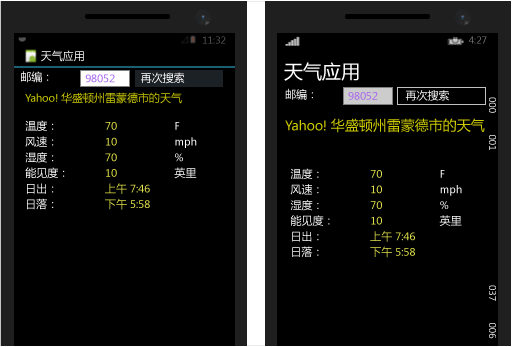
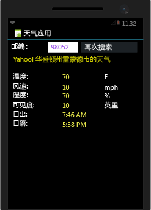
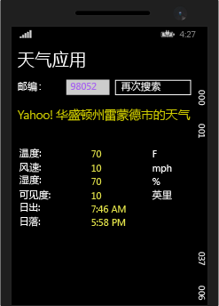

# <a name="build-apps-with-native-ui-using-xamarin-in-visual-studio"></a>在 Visual Studio 中使用 Xamarin 生成具有本机 UI 的应用
完成[设置和安装](../cross-platform/setup-and-install.md)以及[验证 Xamarin 环境](../cross-platform/verify-your-xamarin-environment.md)中的步骤后，此演示将介绍如何使用本机 UI 层生成基本 Xamarin 应用（如下所示）。 在本机 UI 中，共享代码驻留在可移植类库 (PCL) 中，并且单个平台项目都包含 UI 定义。  
  
   
  
 你将执行以下操作来生成它：  
  
-   [设置解决方案](#solution)  
  
-   [编写共享的数据服务代码](#dataservice)  
  
-   [适用于 Android 的设计 UI](#Android)  
  
-   [适用于 Windows Phone 的设计 UI](#Windows)  
  
-   [后续步骤](#next)  
  
> [!TIP]
>  可在 [GitHub 上的 mobile-samples 存储库](https://github.com/xamarin/mobile-samples/tree/master/Weather)中找到此项目的完整源代码。
>
>   如果你遇到任何困难或错误，请将问题发布在 [forums.xamarin.com](http://forums.xamarin.com)。 通过更新至 Xamarin 所需的最新 SDK，可解决大多数问题，每个平台的 [Xamarin 发行说明](https://developer.xamarin.com/releases/)中对这些 SDK 进行了描述。    
  
> [!NOTE]
>  Xamarin 的开发人员文档还通过下列“快速入门”和“深入了解”部分提供了一些演练。 在所有这些页面上，请选择页面右上角的“Visual Studio”以查看特定于 Visual Studio 的演练。  
>   
>  -   具有本机 UI 的 Xamarin 应用程序：  
>   
>      -   [Hello，Android](https://developer.xamarin.com/guides/android/getting_started/hello,android/) （具有单个屏幕的简单应用）  
>     -   [Hello，Android 多屏显示](https://developer.xamarin.com/guides/android/getting_started/hello,android_multiscreen/) （可在屏幕之间导航的应用）  
>     -   [Android 片段演练](http://developer.xamarin.com/guides/android/platform_features/fragments/fragments_walkthrough/) （用于主屏幕/详细信息屏幕等）  
>     -   [了解 iOS](https://developer.xamarin.com/guides/ios/getting_started/hello,_iOS/)  
>     -   [了解 iOS 多屏显示](https://developer.xamarin.com/guides/ios/getting_started/hello,_iOS_multiscreen/)  
> -   具有 Xamarin.Forms（共享 UI）的 Xamarin 应用  
>   
>      -   [了解 Xamarin.Forms](https://developer.xamarin.com/guides/cross-platform/xamarin-forms/getting-started/hello-xamarin-forms/quickstart/)  
>     -   [了解 Xamarin.Forms 多屏显示](https://developer.xamarin.com/guides/cross-platform/xamarin-forms/getting-started/hello-xamarin-forms-multiscreen/)  
  
##  <a name="a-namesolutiona-set-up-your-solution"></a><a name="solution"></a>设置解决方案  
 这些步骤使用本机 UI 创建 Xamarin 解决方案，该方案包含共享代码的 PCL 和两个添加的 NuGet 包。  
  
1.  在 Visual Studio 中，创建新的“空白应用(本机可移植)”解决方案，并将其命名为 **WeatherApp**。 通过在搜索字段中输入“本机可移植”可以非常方便地找到此模板。  
  
     如果不存在，则可能需要安装 Xamarin 或启用 Visual Studio 2015 功能，请参阅[设置和安装](../cross-platform/setup-and-install.md)。  
  
2.  单击“确定”以创建解决方案后，将会得到多个单独项目：  
  
    -   **Weatherapp（可移植）**：PCL，你将在其中编写跨平台共享的代码，包括与 Xamarin.Forms 结合使用的常见业务逻辑和 UI 代码。  
  
    -   **WeatherApp.Droid**：包含本机 Android 代码的项目。 这将设置为默认启动项目。  
  
    -   **WeatherApp.iOS**：包含本机 iOS 代码的项目。  
  
    -   **WeatherApp.WinPhone (Windows Phone 8.1)**：包含本机 Windows Phone 代码的项目。  
  
     在每个本机项目中，你有权访问相应平台的本机设计器，并且可以实现特定于平台的屏幕。  
  
3.  将 **Newtonsoft.Json** 和 NuGet 包添加到 PCL 项目中，其将用于处理从天气数据服务中检索的信息：  
  
    -   在“解决方案资源管理器”中，右键单击“解决方案‘WeatherApp’”，然后选择“管理解决方案 NuGet 包...”。  
  
         在 NuGet 窗口中，选择“浏览”选项卡，然后搜索“Newtonsoft”。  
  
    -   选择 **Newtonsoft.Json**。  
  
    -   在右侧窗口中，选中“WeatherApp”项目（这是唯一需要安装包的项目）。  
  
    -   确保“版本”  字段设置为“最新稳定”  版本。  
  
    -   单击“安装”。  
  
    -     
  
4.  重复步骤 3 查找和安装 **Microsoft.Net.Http** 包。  
  
5.  生成解决方案并验证没有生成错误。  
  
##  <a name="a-namedataservicea-write-shared-data-service-code"></a><a name="dataservice"></a>编写共享的数据服务代码  
 **WeatherApp（可移植）** 项目是将在其中编写可移植类库 (PCL) 的代码的项目，该代码在所有平台之间共享。 PCL 自动包含在 iOS、Android 和 Windows Phone 项目生成的应用包中。  
  
 然后，以下步骤会将代码添加到 PCL，以访问和存储天气服务的数据：  
  
1.  若要运行此示例，必须先在 [http://openweathermap.org/appid](http://openweathermap.org/appid)注册一个免费 API 密钥。  
  
2.  右键单击“WeatherApp”项目，然后选择“添加”>“类…”。 在“添加新项”  对话框中，将文件命名为 **Weather.cs**。 将使用此类来存储天气数据服务的数据。  
  
3.  将 **Weather.cs** 的全部内容替换为以下内容：  
  
    ```c#  
    namespace WeatherApp  
    {  
        public class Weather  
        {  
            public string Title { get; set; }  
            public string Temperature { get; set; }  
            public string Wind { get; set; }  
            public string Humidity { get; set; }  
            public string Visibility { get; set; }  
            public string Sunrise { get; set; }  
            public string Sunset { get; set; }  
  
            public Weather()  
            {  
                //Because labels bind to these values, set them to an empty string to  
                //ensure that the label appears on all platforms by default.  
                this.Title = " ";  
                this.Temperature = " ";  
                this.Wind = " ";  
                this.Humidity = " ";  
                this.Visibility = " ";  
                this.Sunrise = " ";  
                this.Sunset = " ";  
            }  
        }  
    }  
    ```  
  
4.  将另一个类添加到名为 **DataService.cs** 的 PCL 项目中，该类用于在该项目中处理天气数据服务的 JSON 数据。  
  
5.  将 **DataService.cs** 的全部内容替换为以下代码：  
  
    ```c#  
    using System.Threading.Tasks;  
    using Newtonsoft.Json;  
    using System.Net.Http;  
  
    namespace WeatherApp  
    {  
        public class DataService  
        {  
            public static async Task<dynamic> getDataFromService(string queryString)  
            {  
                HttpClient client = new HttpClient();  
                var response = await client.GetAsync(queryString);  
  
                dynamic data = null;  
                if (response != null)  
                {  
                    string json = response.Content.ReadAsStringAsync().Result;  
                    data = JsonConvert.DeserializeObject(json);  
                }  
  
                return data;  
            }  
        }  
    }  
    ```  
  
6.  将第三个类添加到名为 **核心** 的 PCL，你将在此 PCL 中放置共享业务逻辑，例如通过使用邮编形成查询字符串、调用天气数据服务以及填充 **天气** 类的实例的逻辑。  
  
7.  将 **Core.cs** 的内容替换为以下内容：  
  
    ```c#  
    using System;  
    using System.Threading.Tasks;  
  
    namespace WeatherApp  
    {  
        public class Core  
        {  
            public static async Task<Weather> GetWeather(string zipCode)  
            {  
                //Sign up for a free API key at http://openweathermap.org/appid  
                string key = "YOUR KEY HERE";  
                string queryString = "http://api.openweathermap.org/data/2.5/weather?zip="  
                    + zipCode + ",us&appid=" + key + "&units=imperial";  

                //Make sure developers running this sample replaced the API key
                if (key == "YOUR API KEY HERE")
                {
                    throw new ArgumentException("You must obtain an API key from openweathermap.org/appid and save it in the 'key' variable.");
                }
  
                dynamic results = await DataService.getDataFromService(queryString).ConfigureAwait(false);  
  
                if (results["weather"] != null)  
                {  
                    Weather weather = new Weather();  
                    weather.Title = (string)results["name"];                  
                    weather.Temperature = (string)results["main"]["temp"] + " F";  
                    weather.Wind = (string)results["wind"]["speed"] + " mph";                  
                    weather.Humidity = (string)results["main"]["humidity"] + " %";  
                    weather.Visibility = (string)results["weather"][0]["main"];  
  
                    DateTime time = new System.DateTime(1970, 1, 1, 0, 0, 0, 0);  
                    DateTime sunrise = time.AddSeconds((double)results["sys"]["sunrise"]);  
                    DateTime sunset = time.AddSeconds((double)results["sys"]["sunset"]);  
                    weather.Sunrise = sunrise.ToString() + " UTC";  
                    weather.Sunset = sunset.ToString() + " UTC";  
                    return weather;  
                }  
                else  
                {  
                    return null;  
                }  
            }  
        }  
    }  
    ```  
  
8.  将代码中的“在此处输入密钥”替换为步骤 1 中获取的 API 密钥（仍需要使用引号）。  
  
9. 删除 PCL 中的 MyClass.cs，因为无需使用。  
  
10. 生成 **weatherapp** PCL 项目，以确保代码正确无误。  
  
##  <a name="a-nameandroida-design-ui-for-android"></a><a name="Android"></a>适用于 Android 的设计 UI  
 现在，我们将设计用户界面，将其连接到你的共享代码，然后运行此应用。  
  
### <a name="design-the-look-and-feel-of-your-app"></a>设计应用的外观和感觉  
  
1.  在“解决方案资源管理器”中，展开“WeatherApp.Droid”>“资源”>“布局”文件夹，然后打开“Main.axml”。 此操作后将在可视化设计器中打开此文件。 （如果出现与 Java 相关的错误，请参阅此[博客文章](http://forums.xamarin.com/discussion/32365/connection-to-the-layout-renderer-failed-in-xs-5-7-and-xamarinvs-3-9)。）  
  
    > [!TIP]
    >  项目中有许多其他文件。 对它们的探讨不在本主题范围内，但如果你要深入了解 Android 项目的结构，请参阅 xamarin.com 上“了解 Android”主题的[第 2 部分：深入了解](http://developer.xamarin.com/guides/android/getting_started/hello,android/hello,android_deepdive/)。  
  
2.  选择并删除设计器中出现的默认按钮。  
  
3.  通过“视图”>“其他窗口”>“工具箱”，打开此工具箱。  
  
4.  从 **“工具箱”**，将 **“RelativeLayout”** 控件拖动到设计器。 可将此控件用作其他控件的父容器。  
  
    > [!TIP]
    >  如果布局显示不正确，请保存文件，然后通过在“设计”和“源”选项卡之间进行切换来刷新。  
  
5.  在“属性”窗口中，将“background”属性（在“样式”组中）设置为 `#545454`。  
  
6.  从 **“工具箱”**，将 **“TextView”** 控件拖动到 **“RelativeLayout”** 控件上。  
  
7.  在“属性”窗口中，设置这些属性（注意：它有助于使用“属性”窗口工具栏中的排序按钮对列表进行按字母顺序排序）：  
  
    |属性|值|  
    |--------------|-----------|  
    |**text**|**根据“邮政编码”进行搜索**|  
    |**id**|`@+id/ZipCodeSearchLabel`|  
    |**layout_marginLeft**|`10dp`|  
    |**textColor**|`@android:color/white`|  
    |**textStyle**|`bold`|  
  
    > [!TIP]
    >  注意：许多属性不包含你可以选择的值的下拉列表。  可能难以猜测给定属性适用于什么样的字符串值。 有关建议，请尝试在 [R.attr](http://developer.android.com/reference/android/R.attr.html) 类页中搜索属性的名称。  
    >   
    >  此外，快速 Web 搜索通常指向 [http://stackoverflow.com/](http://stackoverflow.com/) 上的页面，在这里其他人使用相同的属性。  
  
     对于引用，如果切换到“源”视图，则应看到此元素的以下代码：  
  
    ```xml  
    <TextView  
        android:text="Search by Zip Code"  
        android:layout_width="wrap_content"  
        android:layout_height="wrap_content"  
        android:id="@+id/ZipCodeSearchLabel"  
        android:layout_centerVertical="true"  
        android:layout_marginLeft="10dp"  
        android:textColor="@android:color/white"  
        android:textStyle="bold" />  
  
    ```  
  
8.  在“工具箱”中，将“TextView”控件拖动到“RelativeLayout”控件上，然后将其放置在 ZipCodeSearchLabel 控件下。 可通过将新控件拖动到现有空间的相应边缘上来完成此操作；在某种程度上这有助于缩放设计器。  
  
9. 在 **“属性”** 窗口中，设置以下属性：  
  
    |属性|值|  
    |--------------|-----------|  
    |**text**|**邮政编码**|  
    |**id**|`@+id/ZipCodeLabel`|  
    |**layout_marginLeft**|`10dp`|  
    |**layout_marginTop**|`5dp`|  
  
     “源”视图中的代码应如下所示：  
  
    ```xml  
    <TextView  
        android:text="Zip Code"  
        android:layout_width="wrap_content"  
        android:layout_height="wrap_content"  
        android:layout_below="@id/ZipCodeSearchLabel"  
        android:id="@+id/ZipCodeLabel"  
        android:layout_marginTop="5dp"  
        android:layout_marginLeft="10dp" />  
    ```  
  
10. 在“工具箱”中，将“数字”控件拖动到“RelativeLayout”上，然后将其放置在“邮政编码”标签下。 然后设置以下属性：  
  
    |属性|值|  
    |--------------|-----------|  
    |**id**|`@+id/zipCodeEntry`|  
    |**layout_marginLeft**|`10dp`|  
    |**layout_marginBottom**|`10dp`|  
    |**width**|`165dp`|  
  
     同样，代码如下所示：  
  
    ```xml  
    <EditText  
        android:inputType="number"  
        android:layout_width="wrap_content"  
        android:layout_height="wrap_content"  
        android:layout_below="@id/ZipCodeLabel"  
        android:id="@+id/zipCodeEntry"  
        android:layout_marginLeft="10dp"  
        android:layout_marginBottom="10dp"  
        android:width="165dp" />  
    ```  
  
11. 在“工具箱”中，将“按钮”拖动到“RelativeLayout”控件上，然后将其放置在 zipCodeEntry 控件的右侧。 然后设置这些属性：  
  
    |属性|值|  
    |--------------|-----------|  
    |**id**|`@+id/weatherBtn`|  
    |**text**|**获取天气信息**|  
    |**layout_marginLeft**|`20dp`|  
    |**layout_alignBottom**|`@id/zipCodeEntry`|  
    |**width**|`165dp`|  
  
    ```xml  
    <Button    android:text="Get Weather"  
        android:layout_width="wrap_content"  
        android:layout_height="wrap_content"  
        android:layout_toRightOf="@id/zipCodeEntry"  
        android:id="@+id/weatherBtn"  
        android:layout_marginLeft="20dp"  
        android:layout_alignBottom="@id/zipCodeEntry"  
        android:width="165dp" />  
    ```  
  
12. 你通过使用 Android 设计器，已经具备生成基本 UI 的充足经验。 也可通过将标记直接添加到页面的 .asxml 文件来生成 UI。 若要以这种方式生成其余的 UI，请在设计器中切换到“源”视图，然后将以下标记粘贴到 `</RelativeLayout>` 标记下（是的，在标记下...这些元素不包含在 ReleativeLayout 中）。  
  
    ```xml  
    <TextView  
            android:text="Location"  
            android:textAppearance="?android:attr/textAppearanceSmall"  
            android:layout_width="match_parent"  
            android:layout_height="wrap_content"  
            android:id="@+id/locationLabel"  
            android:layout_marginLeft="10dp"  
            android:layout_marginTop="10dp" />  
        <TextView  
            android:textAppearance="?android:attr/textAppearanceMedium"  
            android:layout_width="match_parent"  
            android:layout_height="wrap_content"  
            android:id="@+id/locationText"  
            android:layout_marginLeft="20dp"  
            android:layout_marginBottom="10dp" />  
        <TextView  
            android:text="Temperature"  
            android:textAppearance="?android:attr/textAppearanceSmall"  
            android:layout_width="match_parent"  
            android:layout_height="wrap_content"  
            android:id="@+id/tempLabel"  
            android:layout_marginLeft="10dp" />  
        <TextView  
            android:textAppearance="?android:attr/textAppearanceMedium"  
            android:layout_width="match_parent"  
            android:layout_height="wrap_content"  
            android:id="@+id/tempText"  
            android:layout_marginBottom="10dp"  
            android:layout_marginLeft="20dp" />  
        <TextView  
            android:text="Wind Speed"  
            android:textAppearance="?android:attr/textAppearanceSmall"  
            android:layout_width="match_parent"  
            android:layout_height="wrap_content"  
            android:id="@+id/windLabel"  
            android:layout_marginLeft="10dp" />  
        <TextView  
            android:textAppearance="?android:attr/textAppearanceMedium"  
            android:layout_width="match_parent"  
            android:layout_height="wrap_content"  
            android:id="@+id/windText"  
            android:layout_marginBottom="10dp"  
            android:layout_marginLeft="20dp" />  
        <TextView  
            android:text="Humidity"  
            android:textAppearance="?android:attr/textAppearanceSmall"  
            android:layout_width="match_parent"  
            android:layout_height="wrap_content"  
            android:id="@+id/humidtyLabel"  
            android:layout_marginLeft="10dp" />  
        <TextView  
            android:textAppearance="?android:attr/textAppearanceMedium"  
            android:layout_width="match_parent"  
            android:layout_height="wrap_content"  
            android:id="@+id/humidityText"  
            android:layout_marginBottom="10dp"  
            android:layout_marginLeft="20dp" />  
        <TextView  
            android:text="Visibility"  
            android:textAppearance="?android:attr/textAppearanceSmall"  
            android:layout_width="match_parent"  
            android:layout_height="wrap_content"  
            android:id="@+id/visibilityLabel"  
            android:layout_marginLeft="10dp" />  
        <TextView  
            android:textAppearance="?android:attr/textAppearanceMedium"  
            android:layout_width="match_parent"  
            android:layout_height="wrap_content"  
            android:id="@+id/visibilityText"  
            android:layout_marginBottom="10dp"  
            android:layout_marginLeft="20dp" />  
        <TextView  
            android:text="Time of Sunrise"  
            android:textAppearance="?android:attr/textAppearanceSmall"  
            android:layout_width="match_parent"  
            android:layout_height="wrap_content"  
            android:id="@+id/sunriseLabel"  
            android:layout_marginLeft="10dp" />  
        <TextView  
            android:textAppearance="?android:attr/textAppearanceMedium"  
            android:layout_width="match_parent"  
            android:layout_height="wrap_content"  
            android:id="@+id/sunriseText"  
            android:layout_marginBottom="10dp"  
            android:layout_marginLeft="20dp" />  
        <TextView  
            android:text="Time of Sunset"  
            android:textAppearance="?android:attr/textAppearanceSmall"  
            android:layout_width="match_parent"  
            android:layout_height="wrap_content"  
            android:id="@+id/sunsetLabel"  
            android:layout_marginLeft="10dp" />  
        <TextView  
            android:textAppearance="?android:attr/textAppearanceMedium"  
            android:layout_width="match_parent"  
            android:layout_height="wrap_content"  
            android:id="@+id/sunsetText"  
            android:layout_marginBottom="10dp"  
            android:layout_marginLeft="20dp" />  
  
    ```  
  
13. 保存该文件，然后切换到“设计”视图。 你的 UI 应如下显示：  
  
       
  
14. 打开“MainActivity.cs”，然后在 OnCreate 方法中删除行，这些行指先前已删除的默认按钮。 完成后，代码应如下所示：  
  
    ```  
    protected override void OnCreate (Bundle bundle)  
    {  
        base.OnCreate (bundle);  
  
        // Set our view from the "main" layout resource  
        SetContentView (Resource.Layout.Main);  
    }  
    ```  
  
15. 生成 Android 项目以检查工作。 注意，生成会将控件 ID 添加到“Resource.Designer.cs”文件，以便你可在代码中根据名称引用控件。  
  
### <a name="consume-your-shared-code"></a>使用你的共享代码  
  
1.  在代码编辑器中打开“WeatherApp”项目的“MainActivity.cs”文件，然后将其内容替换为下面的代码。 此代码调用你在共享代码中定义的 `GetWeather` 方法。 在应用的 UI 中，将显示从此方法中检索的数据。  
  
    ```c#  
    using System;  
    using Android.App;  
    using Android.Widget;  
    using Android.OS;  
  
    namespace WeatherApp.Droid  
    {  
        [Activity(Label = "Sample Weather App", MainLauncher = true, Icon = "@drawable/icon")]  
        public class MainActivity : Activity  
        {  
            protected override void OnCreate(Bundle bundle)  
            {  
                base.OnCreate(bundle);  
  
                SetContentView(Resource.Layout.Main);  
  
                Button button = FindViewById<Button>(Resource.Id.weatherBtn);  
  
                button.Click += Button_Click;  
            }  
  
            private async void Button_Click(object sender, EventArgs e)  
            {  
                EditText zipCodeEntry = FindViewById<EditText>(Resource.Id.zipCodeEntry);  
  
                if (!String.IsNullOrEmpty(zipCodeEntry.Text))  
                {  
                    Weather weather = await Core.GetWeather(zipCodeEntry.Text);  
                    FindViewById<TextView>(Resource.Id.locationText).Text = weather.Title;  
                    FindViewById<TextView>(Resource.Id.tempText).Text = weather.Temperature;  
                    FindViewById<TextView>(Resource.Id.windText).Text = weather.Wind;  
                    FindViewById<TextView>(Resource.Id.visibilityText).Text = weather.Visibility;  
                    FindViewById<TextView>(Resource.Id.humidityText).Text = weather.Humidity;  
                    FindViewById<TextView>(Resource.Id.sunriseText).Text = weather.Sunrise;  
                    FindViewById<TextView>(Resource.Id.sunsetText).Text = weather.Sunset;  
                }  
            }  
        }  
    }  
    ```  
  
### <a name="run-the-app-and-see-how-it-looks"></a>运行此应用，查看其外观  
  
1.  在“解决方案资源管理器”中，请确保将“WeatherApp.Droid”项目设为启动项目。  
  
2.  选择合适的设备或仿真器目标，然后按 F5 键启动该应用。  
  
3.  在设备上或在仿真器中，将有效的美国邮政编码键入编辑框（例如：60601），然后按“获取天气信息”。 然后，控件中将显示此区域的天气数据。  
  
       
  
> [!TIP]
>  可在 [GitHub 上的 mobile-samples 存储库](https://github.com/xamarin/mobile-samples/tree/master/Weather)中找到此项目的完整源代码。  
  
##  <a name="a-namewindowsa-design-ui-for-windows-phone"></a><a name="Windows"></a>适用于 Windows Phone 的设计 UI  
 现在，我们将设计适用于 Windows Phone 的用户界面，将其连接到你的共享代码，然后运行此应用。  
  
### <a name="design-the-look-and-feel-of-your-app"></a>设计应用的外观和感觉  
 在 Xamarin 应用中设计本机 Windows Phone UI 的进程不同于任何其他本机 Windows Phone 应用。 出于此原因，我们将不再详细介绍如何使用设计器。 有关信息，请参阅[使用 XAML 设计器创建 UI](../designers/creating-a-ui-by-using-xaml-designer-in-visual-studio.md)。  
  
 相反，只需打开 MainPage.xaml，并将所有 XAML 代码替换为以下代码：  
  
```xaml  
<Page  
    x:Class="WeatherApp.WinPhone.MainPage"  
    xmlns="http://schemas.microsoft.com/winfx/2006/xaml/presentation"  
    xmlns:x="http://schemas.microsoft.com/winfx/2006/xaml"  
    xmlns:local="using:WeatherApp.WinPhone"  
    xmlns:d="http://schemas.microsoft.com/expression/blend/2008"  
    xmlns:mc="http://schemas.openxmlformats.org/markup-compatibility/2006"  
    mc:Ignorable="d"  
    Background="{ThemeResource ApplicationPageBackgroundThemeBrush}">  
  
    <Grid>  
        <StackPanel HorizontalAlignment="Left" Height="40" Margin="10,0,0,0" VerticalAlignment="Top" Width="400">  
            <TextBlock x:Name="pageTitle" Text="Weather App" FontSize="30" />  
        </StackPanel>  
        <StackPanel HorizontalAlignment="Left" Height="120" Margin="10,40,0,0" VerticalAlignment="Top" Width="400" Background="#FF545454">  
  
            <TextBlock x:Name="zipCodeSearchLabel" TextWrapping="Wrap" Text="Search by Zip Code" FontSize="18" FontWeight="Bold" HorizontalAlignment="Left" Margin="10,10,0,0"/>  
            <TextBlock x:Name="zipCodeLabel" TextWrapping="Wrap" Text="Zip Code" Margin="10,5,0,0" FontSize="14" Foreground="#FFA8A8A8"/>  
            <StackPanel Orientation="Horizontal">  
                <TextBox x:Name="zipCodeEntry" Margin="10,10,0,0" Text="" VerticalAlignment="Top" InputScope="Number" Width="165" />  
                <Button x:Name="weatherBtn" Content="Get Weather" Width="165" Margin="20,0,0,0" Height="60" Click="GetWeatherButton_Click"/>  
            </StackPanel>  
        </StackPanel>  
        <StackPanel Margin="10,175,0,0">  
            <TextBlock x:Name="locationLabel" HorizontalAlignment="Left" FontSize="14" Foreground="#FFA8A8A8" TextWrapping="Wrap" Text="Location" VerticalAlignment="Top"/>  
            <TextBlock x:Name="locationText" Margin="10,0,0,10" HorizontalAlignment="Left" FontSize="18" TextWrapping="Wrap" VerticalAlignment="Top"/>  
            <TextBlock x:Name="tempLabel" HorizontalAlignment="Left" FontSize="14" Foreground="#FFA8A8A8" TextWrapping="Wrap" Text="Temperature" VerticalAlignment="Top"/>  
            <TextBlock x:Name="tempText" Margin="10,0,0,10" HorizontalAlignment="Left" FontSize="18" TextWrapping="Wrap" VerticalAlignment="Top"/>  
            <TextBlock x:Name="windLabel" HorizontalAlignment="Left" FontSize="14" Foreground="#FFA8A8A8" TextWrapping="Wrap" Text="Wind Speed" VerticalAlignment="Top"/>  
            <TextBlock x:Name="windText" Margin="10,0,0,10" HorizontalAlignment="Left" FontSize="18" TextWrapping="Wrap" VerticalAlignment="Top"/>  
            <TextBlock x:Name="humidityLabel" HorizontalAlignment="Left" FontSize="14" Foreground="#FFA8A8A8" TextWrapping="Wrap" Text="Humidity" VerticalAlignment="Top"/>  
            <TextBlock x:Name="humidityText" Margin="10,0,0,10" HorizontalAlignment="Left" FontSize="18" TextWrapping="Wrap" VerticalAlignment="Top"/>  
            <TextBlock x:Name="visibilityLabel" HorizontalAlignment="Left" FontSize="14" Foreground="#FFA8A8A8" TextWrapping="Wrap" Text="Temperature" VerticalAlignment="Top"/>  
            <TextBlock x:Name="visibilityText" Margin="10,0,0,10" HorizontalAlignment="Left" FontSize="18" TextWrapping="Wrap" VerticalAlignment="Top"/>  
            <TextBlock x:Name="sunriseLabel" HorizontalAlignment="Left" FontSize="14" Foreground="#FFA8A8A8" TextWrapping="Wrap" Text="Time of Sunriweatherse" VerticalAlignment="Top"/>  
            <TextBlock x:Name="sunriseText" Margin="10,0,0,10" HorizontalAlignment="Left" FontSize="18" TextWrapping="Wrap" VerticalAlignment="Top"/>  
            <TextBlock x:Name="sunsetLabel" HorizontalAlignment="Left" FontSize="14" Foreground="#FFA8A8A8" TextWrapping="Wrap" Text="Time of Sunset" VerticalAlignment="Top"/>  
            <TextBlock x:Name="sunsetText" Margin="10,0,0,10" HorizontalAlignment="Left" FontSize="18" TextWrapping="Wrap" VerticalAlignment="Top"/>  
        </StackPanel>  
    </Grid>  
</Page>  
```  
  
 在设计视图中，你的 UI 应如下显示：  
  
   
  
### <a name="consume-your-shared-code"></a>使用你的共享代码  
  
1.  在设计器中，选择 **“获取天气信息”** 按钮。  
  
2.  在“属性”窗口中，选择“事件处理程序”按钮（）。  
  
     在 **“属性”** 窗口的顶部显示此图标。  
  
3.  在“单击”  事件旁，键入 **GetWeatherButton_Click**，然后按 Enter 键。  
  
     这会生成名为 `GetWeatherButton_Click`的事件处理程序。 打开代码编辑器，并将你的光标置于事件处理程序代码块内部。  注意：如果在按 Enter 时编辑器未打开，只需双击事件名称即可。  
  
4.  将该事件处理程序替换为以下代码。  
  
    ```c#  
    private async void GetWeatherButton_Click(object sender, RoutedEventArgs e)  
    {  
        if (!String.IsNullOrEmpty(zipCodeEntry.Text))  
        {  
            Weather weather = await Core.GetWeather(zipCodeEntry.Text);  
            locationText.Text = weather.Title;  
            tempText.Text = weather.Temperature;  
            windText.Text = weather.Wind;  
            visibilityText.Text = weather.Visibility;  
            humidityText.Text = weather.Humidity;  
            sunriseText.Text = weather.Sunrise;  
            sunsetText.Text = weather.Sunset;  
  
            weatherBtn.Content = "Search Again";  
        }  
    }  
    ```  
  
     此代码调用你在共享代码中定义的 `GetWeather` 方法。 这是你在 Android 应用中调用的同一个方法。 此代码还显示从你应用的 UI 控件中的方法检索的数据。  
  
5.  在打开的 MainPage.xaml.cs 中，删除“OnNavigatedTo”方法内的所有代码。 此代码仅在我们替换 MainPage.xaml 的内容时用于处理已删除的默认按钮。  
  
### <a name="run-the-app-and-see-how-it-looks"></a>运行此应用，查看其外观  
  
1.  在“解决方案资源管理器”中，将“WeatherApp.WinPhone”项目设置为启动项目。  
  
2.  按 F5 键，启动此应用。  
  
3.  在 Windows Phone 仿真器中，将有效的美国邮政编码键入编辑框（例如：60601），然后按“获取天气信息”。 然后，控件中将显示此区域的天气数据。  
  
       
  
> [!TIP]
>  可在 [GitHub 上的 mobile-samples 存储库](https://github.com/xamarin/mobile-samples/tree/master/Weather)中找到此项目的完整源代码。  
  
##  <a name="a-namenexta-next-steps"></a><a name="next"></a>后续步骤  
 **将适用于 iOS 的 UI 添加到解决方案**  
  
 通过添加适用于 iOS 的本机 UI 来扩展此示例。 为此，连接到本地网络上安装了 Xcode 和 Xamarin 的 Mac。 连接后，可直接在 Visual Studio 中使用 iOS 设计器。 有关已完成的应用，请参阅 [GitHub 上的 mobile-samples 存储库](https://github.com/xamarin/mobile-samples/tree/master/Weather)。  
  
 另请参阅 [Hello, iOS](http://developer.xamarin.com/guides/ios/getting_started/hello,_iOS/hello,iOS_quickstart/)（了解 iOS）(xamarin.com) 演练。 请注意，在此页上，请选择 xamarin.com 页右上角的“Visual Studio”，以便显示正确的一组指令。  
  
 **在共享项目中添加特定于平台的代码**  
  
 PCL 中的共享代码是特定于平台的，因为 PCL 只编译了一次，并且包括在每个特定于平台的应用包中。 若要编写使用条件编译的共享代码来分离特定于平台的代码，可使用共享项目。 有关详细信息，请参阅[代码共享选项](http://developer.xamarin.com/guides/cross-platform/application_fundamentals/building_cross_platform_applications/sharing_code_options/) (xamarin.com)。  
  
## <a name="see-also"></a>另请参阅  
 [Xamarin 开发人员站点](http://developer.xamarin.com/)   
 [Windows 开发人员中心](https://dev.windows.com/en-us)   
 [Swift 与 C# 快速参考海报](http://aka.ms/scposter)


<!--HONumber=Feb17_HO4-->


