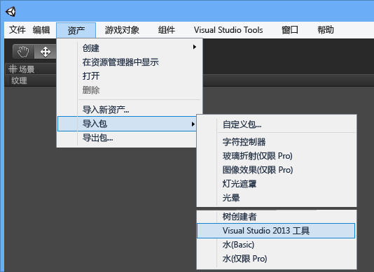
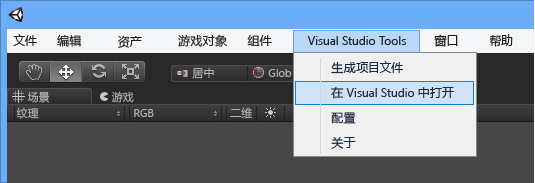

# Visual Studio Tools for Unity 入门
在本部分中，你将了解如何安装 Visual Studio Tools for Unity，以及如何配置你的 Unity 项目以使用 Visual Studio。  

> [!IMPORTANT]
>  Unity 5.2 增加了对 Visual Studio Tools for Unity 2.1 的内置支持，从而简化了项目设置。 若要利用这一支持，你需要在 Windows 上使用 Unity version 5.2.0 或更高版本以及 Visual Studio Tools for Unity 2.1 或更高版本。  

## 系统必备  
 若要使用 Visual Studio Tools for Unity，你需要：  

-   支持扩展的 **Visual Studio** 版本，例如，Visual Studio Community、Professional、Premium 或 Enterprise. 你可以免费下载 Visual Studio Community。  

     [下载 Visual Studio Community](http://www.visualstudio.com/downloads/download-visual-studio-vs)  

-   **Unity** 4.0.0 版或更高版本； **Unity** 5.2.0 版或更高版本，以利用对 Visual Studio Tools for Unity 2.1 或更高版本的内置支持。  

     [下载 Unity](https://unity3d.com/get-unity/download)  

## 安装 Visual Studio Tools for Unity  
 从 Visual Studio 库下载并安装 Visual Studio Tools for Unity。 你需要安装所用 Visual Studio 版本的正确软件包。 请确保安装 Visual Studio Tools for Unity 2.1 或更高版本，以利用在 Unity 5.2 或更高版本中对 VSTU 的内置支持。  

-   对于 Visual Studio 2015 Community、Visual Studio 2015 Professional 或 Visual Studio 2015 Enterprise：  

     [下载 Visual Studio 2015 Tools for Unity](https://visualstudiogallery.msdn.microsoft.com/8d26236e-4a64-4d64-8486-7df95156aba9)  

-   对于 Visual Studio 2013 Community、Visual Studio 2013 Professional 或 Visual Studio 2013 Premium：  

     [下载 Visual Studio 2013 Tools for Unity](https://visualstudiogallery.msdn.microsoft.com/20b80b8c-659b-45ef-96c1-437828fe7cf2)  

-   对于 Visual Studio 2012 Professional 或 Visual Studio 2012 Premium：  

     [下载 Visual Studio 2012 Tools for Unity](https://visualstudiogallery.msdn.microsoft.com/7ab11d2a-f413-4ed6-b3de-ff1d05157714)  

-   对于 Visual Studio 2010 Professional 或 Visual Studio 2010 Premium：  

     [下载 Visual Studio 2010 Tools for Unity](https://visualstudiogallery.msdn.microsoft.com/6e536faa-ce73-494a-a746-6a14753015f1)  

> [!NOTE]
>  Visual Studio 的 Express 版本不支持扩展件（如 Visual Studio Tools for Unity）。 Visual Studio Community 是 Visual Studio 的免费版本，它支持 Visual Studio Tools for Unity 和其他扩展。 对于大多数用户来说，选择 Visual Studio Community 比选择 Express 更好。  

> [!NOTE]
>  对于 Visual Studio 2017，VSTU 3 支持从安装程序中选择 Unity 工作负载。  

## 使用 Visual Studio Tools for Unity 的第一个 Unity 项目  
 现在，一切准备就绪，你可以着手将 Visual Studio 用于第一个 Unity 项目了。 你的 Unity 项目的设置会因所安装的 Unity 和 Visual Studio Tools for Unity 的版本而异。 请按照下列步骤获取已安装的 Unity 和 Visual Studio Tools for Unity 的版本。  

### Unity 5.2 和更高版本（需要 VSTU 2.1 或更高版本）  
 从 Unity 5.2 开始，不再需要将 Visual Studio Tools unitypackage 导入到你的项目。 如果你的项目导入此 unitypackage，Unity 5.2 将忽略它，并直接从其安装位置加载 Visual Studio Tools for Unity。  

#### 1 - 创建一个 Unity 项目  
 如果你已经有使用 Unity 的经验，可以创建一个新的项目或加载一个自己的项目。 如果你正在加载一个导入了 Visual Studio Tools unitypackage 以在 Unity 早期版本中使用 Visual Studio Tools for Unity 的项目，我们建议你通过删除 UnityVS 目录来删除它。  

 但如果你对 Unity 不熟悉，可从简单的基本教程开始。 访问“Unity 学习”页，找到可用以入门的相关示例项目教程和可以学习的课程，进而用 Unity 创建你自己的游戏。 “Unity 学习”页提供了针对好几种不同游戏的教程，内容通俗易懂。  

 [教程 -“Unity 学习”页](http://unity3d.com/learn/tutorials/modules)  

#### 2 - 配置 Unity 编辑器以使用 Visual Studio Tools for Unity  
 若要启用你的项目以使用 Visual Studio Tools for Unity，只需将 Visual Studio 设置为其外部脚本编辑器。 在 Unity 编辑器中的主菜单上，选择“编辑，首选项” ；然后，在“Unity 首选项”  对话框中，选择“外部工具” 。 接下来，将“外部脚本编辑器”  属性设置为你想要使用的 Visual Studio 的版本（必须为此版本的 Visual Studio 安装 Visual Studio Tools for Unity），并确保已设置“编辑器连接”  属性。  

 若要确保现在已启用对 Visual Studio Tools for Unity 的内置支持，请参阅“关于 Unity”  对话框。 In the Unity editor, on the main menu, choose  。如果已安装并正确配置 Visual Studio Tools for Unity，你将看到“关于 Unity”  对话框。  

 最后，请确保已通过“生成设置”  页设置了生成目标并且已启用“脚本调试”  。  

   

#### 3 - 从 Unity 编辑器启动 Visual Studio  
 从 Unity 5.2 开始，若要启动 Visual Studio 或配置 Visual Studio Tools for Unity，不再需要“Visual Studio Tools”  扩展菜单。 相反，一旦将 Visual Studio 设置为你的外部脚本编辑器，只需从 Unity 编辑器中选择脚本文件，你的代码便会在 Visual Studio 中打开。  

### Unity 的早期版本（5.2 版之前）  
 在 Unity 5.2 之前的版本中，没有对 Visual Studio Tools for Unity 的内置支持。 相反，每个项目必须导入 Visual Studio Tools unitypackage，并配置其他项目设置以便使用 Visual Studio Tools for Unity。  

#### 1 - 创建一个 Unity 项目  
 如果你已经有使用 Unity 的经验，可以创建一个新的项目或加载一个自己的项目。 如果要开始一个新项目，请在创建该项目时导入 Visual Studio Tools unitypackage。  

 但如果你对 Unity 不熟悉，可从简单的基本教程开始。 访问“Unity 学习”页，找到可用以入门的相关示例项目教程和可以学习的课程，进而用 Unity 创建你自己的游戏。 “Unity 学习”页提供了针对好几种不同游戏的教程，内容通俗易懂。  

 [教程 -“Unity 学习”页](http://unity3d.com/learn/tutorials/modules)  

#### 2 - 配置 Unity 编辑器以使用 Visual Studio Tools for Unity  
 如果你是从现有的 Unity 项目开始或未在创建项目时导入 Visual Studio Tools Unity unitypackage，则需立即导入 unitypackage。 在 Unity 编辑器中的主菜单上，选择“资产、导入包、Visual Studio 2015 Tools”  （应能看到适用于已安装的 Visual Studio 版本的一个选项）。  

   

 最后，请确保已通过“生成设置”  页设置了生成目标并且已启用“脚本调试”  。  

   

#### 3 - 从 Unity 编辑器启动 Visual Studio  
 最后一步是从 Unity 启动 Visual Studio。 这将为你的项目创建一个 Visual Studio 解决方案，然后将在 Visual Studio 中打开。  

 在 Unity 编辑器的主菜单上，选择“Visual Studio 工具，在 Visual Studio 中打开” 。  

   

## 后续步骤  
 若要了解如何在 Visual Studio 中使用和调试 Unity 项目，请参阅[使用 Visual Studio Tools for Unity](../cross-platform/using-visual-studio-tools-for-unity.md)。  

## 另请参阅  
 [Unity 主页](http://unity3d.com)

