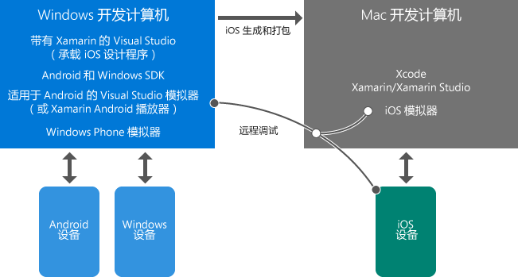

# 了解关于使用 Xamarin 进行移动开发的信息
本主题可将引导你概览有助于了解如何使用 Xamarin 开发跨平台移动应用的资料。 如果尚未安装 Visual Studio 和 Xamarin，请先启动[设置和安装](../cross-platform/setup-and-install.md)过程，然后在安装程序运行期间返回此处浏览这些资源。  
  
> [!NOTE]
>  除另有说明的情况外，我们建议最初仅浏览直接链接至此的页面而不浏览子页面。 如果完成此列表后安装过程仍在运行，请随意返回浏览其他主题。  
>   
>  还可随意查看标记为“基础知识”的主题，并在稍后返回到“深入了解”主题。  
  
## 基础知识：Xamarin 简介  
 *10-20 分钟*  
  
1.  [通过 Xamarin 在 Visual Studio 中构建移动应用](https://www.visualstudio.com/explore/xamarin-vs) (visualstudio.com) 极其概括地介绍了 Xamarin 的主要特征。  
  
2.  与 Xamarin 推广人员 James Montemagno 一起[使用 C# 和 Visual Studio 生成跨平台移动应用](https://channel9.msdn.com/Events/Visual-Studio/Visual-Studio-2015-Final-Release-Event/Building-cross-platform-mobile-apps-using-C-and-Visual-Studio-2015) （第 9 频道，15 分 16 秒）。 前三分钟是 Xamarin 概述，接着是代码演示。  
  
## 基础知识：Visual Studio 和 Xamarin 环境概述  
 *5-15 分钟*  
  
-   将使用具备 Visual Studio 和 Xamarin 的 Windows 计算机完成大部分工作。 将在此计算机上直接构建 Windows 和 Android 应用，然后在设备或仿真程序上运行和调试这些应用。 你还将通过 Mac 远程生成、运行和调试 iOS 应用。 Windows 计算机上的 Visual Studio 还可连接到 iOS 情节提要设计器和 iOS 模拟器。  
  
-   安装了 Xcode 和 Xamarin 的 Mac 将做为 iOS 应用的生成/签名主机和运行时环境。 不再使用 Windows 计算机上的 Visual Studio，而是转由此 Mac 构建 iOS；通过 Visual Studio 调试 iOS 应用时，它将在 Mac 的 iOS 模拟器上运行，或者在连接到该 Mac 的受限设备上直接运行。 在本例中，你将与 Mac 上或其周边的应用程序进行交互，并在 Visual Studio 中进行调试体验。  
  
 下面阐明了这些关系，你还可以在 [适用于 Visual Studio 的 Xamarin.iOS 简介](http://developer.xamarin.com/guides/ios/getting_started/installation/windows/introduction_to_xamarin_ios_for_visual_studio/) (xamarin.com) 上阅读有关生成 iOS 应用的更多信息。  
  
   
  
## 基础知识：如何构造项目  
 *10-30 分钟*  
  
1.  [共享代码选项](http://developer.xamarin.com/guides/cross-platform/application_fundamentals/building_cross_platform_applications/sharing_code_options/) (Xamarin com)。 我们建议使用可移植类库选项，因为它能够为仅使用受所有目标平台支持的 .NET API 提供最佳的支持。 大多数业务逻辑代码将驻留在 PCL 中，包括对数据库的访问、对 REST API 的调用和对可移植的 Xamarin 组件的调用（请参阅本主题末尾的 [Deeper Dive: Xamarin Components](#components) ）。 使用 Xamarin.Forms 编写的常见 UI 代码也可以驻留在 PCL 中。  
  
2.  （选读） [案例研究：Tasky](http://developer.xamarin.com/guides/cross-platform/application_fundamentals/building_cross_platform_applications/case_study-tasky/) (xamarin.com) 介绍了设计和构造功能齐全的应用的一些最佳做法，例如对分隔数据、数据访问和业务层的共享代码使用 PCL 构造项目。  
  
## 基础知识：本机与 Xamarin.Forms UI 层  
 *10-40 分钟*  
  
 Xamarin 提供了两种方法来生成卓越的本机应用：Xamarin 本机与 Xamarin.Forms。  
  
 通过 Xamarin 本机，你可以为每个目标平台（iOS、 Android 和 Windows）编写单独的 UI 代码。  使用此方法可以直接访问特定于平台的 API，从而实现每个平台的自定义 UI 体验。  你还具有对每个平台的本机设计器和控件的完全访问权限，此权限有助于构建相应 UI。  
  
 Xamarin.Forms 提供了一组通用 API，让你能够在一个可移植类库中为所有平台编写共享 UI 层。  Xamarin.Forms 将向每个目标平台呈现本机控件，以提供本机观感。  通过 Xamarin.Forms，不是使用设计器而是使用 C# 和 XAML 生成 UI。  
  
 你无需预先决定使用哪种方法；可以使用 Xamarin 本机与 Xamarin.Forms 的组合来实现应用：  
  
-   使用 Xamarin.Forms 生成可跨平台提供相同 UI 和功能（例如登录、联系人窗体和搜索结果）的通用屏幕。  
  
-   使用 Xamarin.Forms 中的各种自定义功能在每个平台上的基础上调整 UI。 其中包括既可通过代码又可通过 XAML 使用的 OnPlatform API，用于创建自定义视图、扩展现有呈现器以及创建自定义呈现器。  
  
-   如有必要，使用 Xamarin 本机构建屏幕，构建的屏幕使用每个平台唯一的 UI 特性（例如使用本机相机捕获与图像操作的屏幕）。  
  
 我们建议始终从 Xamarin.Forms 解决方案开始设置跨平台共享的 UI 代码，并使用自定义功能进行特定于平台的调整。 如果需要完全特定于平台的屏幕，你可以使用 Xamarin 本机单独添加它们。  
  
 了解更多信息：  
  
1.  [Xamarin.Forms](http://developer.xamarin.com/guides/cross-platform/xamarin-forms/) (xamarin.com) 提供了 Xamarin.Forms 与本机 UI 层（即 Xamarin.iOS 和 Xamarin.Android）的简要概述以及各自的利弊。  
  
2.  James Montemagno 的视频 [Xamarin.Forms：使用 C# 和 XAML 创建本机 iOS、Android 和 Windows 应用](https://channel9.msdn.com/events/Visual-Studio/Connect-event-2015/704)（第 9 频道，13 分 3 秒），也可在此了解概述并可继续观看演示。  
  
3.  （选读） [Xamarin.Forms 简介](http://developer.xamarin.com/guides/cross-platform/xamarin-forms/getting-started/introduction-to-xamarin-forms/) (xamarin.com)  
  
4.  （选读）在 [设备类](http://developer.xamarin.com/guides/xamarin-forms/platform-features/device/) 文档 (xamarin.com) 中查看使用 OnPlatform 进行自定义的示例  
  
5.  （选读）由 MSDN 杂志的 Jason Smith 撰写的 [跨平台 - 通过 Xamarin.Forms 跨移动平台共享 UI 代码](https://msdn.microsoft.com/magazine/dn904669.aspx)，其中概括了 Xamarin.Forms 中的各个自定义选项。详情请参见 [自定义每个平台上的控件](http://developer.xamarin.com/guides/xamarin-forms/custom-renderer/) (xamarin.com) 。  
  
## 深入了解：使用模拟器进行调试  
 *10-15 分钟*  
  
 若要在不使用物理设备的情况下调试跨平台应用程序，则需要使用以下工具：  
  
1.  **Android 模拟器。** 根据你使用的 Windows 版本，我们建议使用 Microsoft 的 Visual Studio Android 模拟器或 Xamarin 播放器，它们均能提供优越的性能并支持各种设备功能：  
  
    -   **Windows 8 + 计算机：** 我们强烈建议使用随 Visual Studio 一起安装的 Microsoft [Visual Studio Android 模拟器](https://www.visualstudio.com/en-us/features/msft-android-emulator-vs.aspx)。  [Visual Studio Android 模拟器](https://channel9.msdn.com/events/Visual-Studio/Connect-event-2015/711) 视频（第 9 频道，5 分 55 秒）提供了相关概述与演示。  
  
    -   **Windows 7 或更低版本/在 Mac OS X 上运行的 Windows**：请使用 [Xamarin Android 播放器](http://developer.xamarin.com/guides/android/getting_started/installation/android-player) (xamarin.com)。  
  
2.  **Apple 的 iOS 模拟器。** 有关详细信息，请参阅 [iOS 模拟器入门](https://developer.apple.com/library/prerelease/content/documentation/IDEs/Conceptual/iOS_Simulator_Guide/GettingStartedwithiOSSimulator/GettingStartedwithiOSSimulator.html#//apple_ref/doc/uid/TP40012848-CH5-SW1) (apple.com)。  
  
3.  **Microsoft 的 Windows Phone 仿真程序。** 有关详细信息，请参阅[适用于 Windows Phone 8 的 Windows Phone 仿真程序](https://msdn.microsoft.com/library/dn632391.aspx)。  
  
##  深入了解：Xamarin 组件  
 *10 分钟*  
  
 Xamarin 应用可通过 Xamarin 组件使用许多扩展功能。 你可以在 [http://components.xamarin.com/](http://components.xamarin.com/)上下载完整目录，其中包括其他 UI 控件、身份验证和 Microsoft Azure 等各种云服务以及其他更多部分。

<!--HONumber=Feb17_HO4-->

