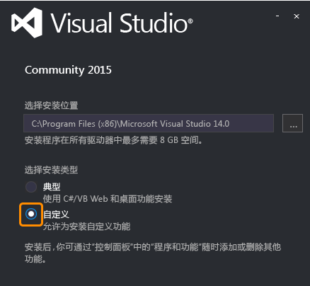
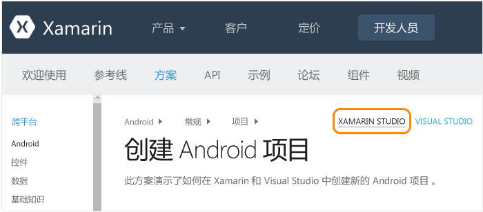
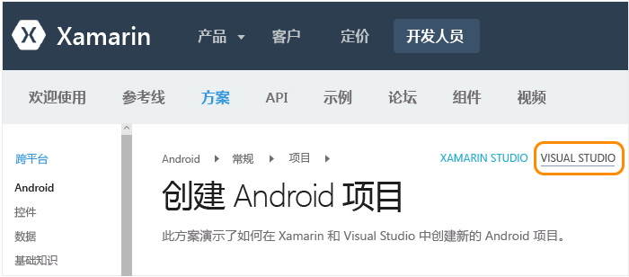

# Mac 用户的设置、安装和验证
本主题针对主要在 Mac 上工作并选择在 Mac 上的 Windows 虚拟机内使用 Visual Studio 的开发人员。 如果你是主要使用 Windows 计算机的开发人员且需要设置辅助 Mac 来面向 iOS，请参阅[设置和安装](../cross-platform/setup-and-install.md)主题。

 若要在 Mac 上使用 Xamarin，你将需要以下项目：

-   Xamarin 帐户。 转到 [https://www.xamarin.com/](https://www.xamarin.com/)，单击页面右上方的“登录”，然后单击页面上显示的“创建新账户”。 为 Xamarin 帐户选择电子邮件地址和密码。

-   已安装 Xcode 7 和 Xamarin 4 的、采用 OSX Yosemite (10.10) 或更高操作系统版本的 Mac。

-   以下配置之一：

    -   **要在 Mac 上直接运行 Xamarin Studio：** Xamarin Studio 是 Xamarin 的开发环境，它支持使用 C# 生成 Android、iOS 和 Windows 应用。  若要快速了解 Xamarin Studio，请参阅 [Xamarin Studio 概述](https://xamarin.com/studio) (xamarin.com)。

    -   **如果已在 Mac 上配置 Parallels 或 VMWare：** 在 Parallels 或 VMWare 中使用 Visual Studio 2015 和 Xamarin 4 运行 Windows。  使用此配置，Xamarin 是与 Visual Studio 一起安装的扩展，它让你可以将 Visual Basic 用作使用 C# 生成 Android、iOS 和 WinPhone 应用的开发环境。  请注意，作为 Visual Studio Developer Essentials 计划的一部分，你可以获取 3 个月的免费 Parallels 订阅。 请参阅 [Microsoft Visual Studio Dev Essentials 将包括 Parallels Desktop Pro 和 Parallels Access](http://blog.parallels.com/blog/2015/11/18/visual-studio-dev-essentials/) （Parallels 博客）。

 本主题提供针对这些要求的说明。  在安装进程运行期间，可查看[了解如何使用 Xamarin 进行移动开发](../cross-platform/learn-about-mobile-development-with-xamarin.md)主题，阅读和观看必要的背景材料。

 **本主题内容：**

-   [Mac 设置（Apple ID、Xcode 和 Xamarin）](#mac)

-   [Parallels 中的 Windows 设置（Visual Studio 和 Xamarin）](#windows)

-   [验证环境](#verify)

##  Mac 设置（Apple ID、Xcode 和 Xamarin）

1.  如果你尚无 Apple ID，请在 [我的 Apple ID](https://appleid.apple.com/) 处创建免费 Apple ID。 这是安装和登录 Xcode 所必需的。

2.  从 [https://developer.apple.com/xcode/](https://developer.apple.com/xcode/) 下载并安装 Xcode。

3.  按照 [安装和配置 Xamarin.iOS](http://developer.xamarin.com/guides/ios/getting_started/installation/mac/) (xamarin.com) 上的说明下载和安装 Xamarin。

4.  在 Windows 和 Mac 计算机上安装好 Xamarin 后，请按照[使用 XMA 连接到 Mac](http://developer.xamarin.com/guides/ios/getting_started/installation/windows/#Connecting_to_the_Mac_Using_XMA) (xamarin.com) 上的说明操作，以便可通过 Windows 计算机上的 Visual Studio 针对 iOS 和 Mac 进行开发。

##  Parallels 中的 Windows 设置（Visual Studio 和 Xamarin）

1.  使用在 Parallels/VMWare 内配置的 Windows 桌面， [下载并启动 Visual Studio 2015 任何版本（Community、Professional 或 Enterprise）的安装程序](https://www.visualstudio.com/en-us/downloads/download-visual-studio-vs.aspx) 。 Visual Studio 2015 Community 是免费版本；Professional 和Enterprise 可免费试用 30 天。

2.  在安装程序中，选择“自定义”  安装：

     

3.  选中/清除以下框：

    1.  选中“跨平台移动开发”>“C#/.NET (Xamarin)”。 这也将自动选择“常用工具和软件开发工具包”下的各种 Android 工具。

         

    2.  清除“跨平台移动开发”>“适用于 Android 的 Microsoft Visual Studio 模拟器”。

4.  单击“安装”按钮，让程序运行。 这同样需要一些时间才能完成，在此期间可继续查看本主题并浏览[了解如何使用 Xamarin 进行移动开发](../cross-platform/learn-about-mobile-development-with-xamarin.md)。

5.  安装完成后，请启动 Visual Studio 并在系统提示时使用你的 Microsoft 帐户进行登录（此帐户即用于 Windows 的帐户）。 然后通过“工具”>“选项”>“Xamarin”或者“工具”>“选项”>“Xamarin”>“其他”中的“立即检查”链接检查 Xamarin 更新：

     

    > [!NOTE]
    >  请确保将 Xamarin 更新到版本 4.0.3.214 或更高版本，避免早期 Xamarin 许可证的问题。  如果尝试检查更新但看到有关 Microsoft 生成工具的错误，请参阅 [Xamarin 论坛](http://forums.xamarin.com/discussion/69015/xamarin-update-on-vs-2013-says-i-need-the-build-tools-for-vs-2015)上的相关信息。

6.  在 Windows 和 Mac 计算机上安装好 Xamarin 后，请按照 [使用 XMA 连接到 Mac](http://developer.xamarin.com/guides/ios/getting_started/installation/windows/#Connecting_to_the_Mac_Using_XMA) (xamarin.com) 上的说明操作，以便可通过 Visual Studio 针对 iOS 进行开发。

##  验证环境
 安装程序完成安装后，请花几分钟时间验证体验 Xamarin 开发所需的一切就绪。

### Xamarin Studio
 首先，确保导航到所提供链接时在右上角选择了“Xamarin Studio”  从而看到 Xamarin 文档的一个正确版本：

 

 **Outlook Web Access (OWA)**

1.  按照 [创建 Android 项目](http://developer.xamarin.com/recipes/android/general/projects/create_an_android_project/) (Xamarin.com) 上的说明验证创建 Android 项目。

2.  通过[“Android Player > 与 Xamarin Studio 集成”文档](https://developer.xamarin.com/guides/android/getting_started/installation/android-player/#Integration_with_Xamarin_Studio) (xamarin.com) 验证 Android Player 中的调试。

 **iOS**

1.  按照 [创建 iOS 项目](http://developer.xamarin.com/recipes/ios/general/projects/create_an_ios_project/) (Xamarin.com) 上的说明验证创建 iOS 项目。

2.  通过 [模拟器文档中的调试](https://developer.xamarin.com/guides/ios/deployment,_testing,_and_metrics/debugging_in_xamarin_ios/#Debugging_on_the_Simulator) (xamarin.com) 验证 iOS 模拟器中的调试。

### Visual Studio
 首先，确保导航到所提供链接时在右上角选择了“Visual Studio”  从而看到 Xamarin 文档的一个正确版本：

 

 还可通过“工具”>”Xamarin帐户...”登录你的 Xamarin 帐户。

 **Outlook Web Access (OWA)**

1.  按照 [创建 Android 项目](http://developer.xamarin.com/recipes/android/general/projects/create_an_android_project/) (Xamarin.com) 上的说明验证创建 Android 项目。

2.  验证 Android 设计器：在“解决方案资源管理器”的 Android 项目中，打开“资源”>“布局”>“Main.axml”文件。

    -   如果你收到错误称“已安装的 Android SDK 版本太旧”，请单击该消息中的“打开 Android SDK”  并选择可用的最新 SDK 版本。 请注意，必须以管理员身份运行 Visual Studio 才能更新 SDK。

3.  验证你可以从 Visual Studio 连接到 Mac 上安装的仿真程序。  此操作的结果是，你将在 Visual Studio 中的可选择用于调试的仿真程序列表中看到 Xamarin Player。  要实现这一目的，请按照 [将 Visual Studio 连接到 Xamarin Android Player](http://developer.xamarin.com/guides/android/deployment,_testing,_and_metrics/android-player-with-visual-studio-in-vm/) (xamarin.com) 上的说明进行操作。

 **iOS**

1.  确保你的 Mac 在网络上可用且已与 Visual Studio 配，如 [使用 XMA 连接到 Mac](http://developer.xamarin.com/guides/ios/getting_started/installation/windows/#Connecting_to_the_Mac_Using_XMA) (xamarin.com) 上所述。

2.  按照 [创建 iOS 项目](http://developer.xamarin.com/recipes/ios/general/projects/create_an_ios_project/) (Xamarin.com) 上的说明验证创建 iOS 项目。

3.  验证情节提要设计器：在“解决方案资源管理器”中的 iOS 项目中，打开“MainStoryboard.storyboard”  文件。 在这里，Visual Studio 托管着在 Mac 上远程运行的设计器。

4.  验证生成和调试：

    1.  右击“解决方案资源管理器”中的 iOS 项目，并选择“设为启动项目” 。

    2.  从 Visual Studio 的生成下拉菜单中选择“iPhoneSimulator”  目标，如下所示。 如果未列出任何模拟器，请在 Mac 上启动 Xcode，选择“Xcode”->“参数设置”，然后单击“下载”。 在“组件”  下，应显示了可以下载的仿真程序版本。 在 Xamarin 的 [调试](https://developer.xamarin.com/guides/ios/deployment,_testing,_and_metrics/debugging_in_xamarin_ios/#Debugging_on_the_Simulator) 页 (xamarin.com) 上可以找到关于调试的其他说明。

         

    3.  如下所示，从 Visual Studio 的调试下拉菜单中选择 iPhone 目标，并按 F5 启动调试器。 这将在 Mac 上启动仿真程序，在 Visual Studio 中进行调试时，你将在该仿真程序中与应用进行交互。

         

<!--HONumber=Feb17_HO4-->

