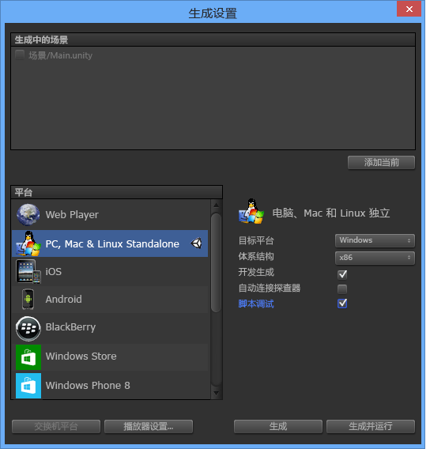

# 使用 Visual Studio Tools for Unity
在本部分中，你将了解如何使用 Visual Studio Tools for Unity 的集成和工作效率功能，以及如何使用 Visual Studio 调试器进行 Unity 开发。  
  
## Unity 集成和工作效率  
 Visual Studio Tools for Unity 和 Unity 编辑器集成，有助于提高工作效率。 这些提高工作效率的功能将自动执行常见的脚本编写任务，并将信息从 Unity 引入 Visual Studio，使你无需切换到 Unity 编辑器便可查找信息。  
  
### Unity 文档访问  
 可以从 Visual Studio 快速访问 Unity 脚本文档。 如果 Visual Studio Tools for Unity 未在本地找到 API 文档，它将尝试联机查找。  
  
##### 访问 Unity 文档  
  
-   在 Visual Studio 中，将需要了解的 Unity API 突出显示或将光标置于其上，然后按 **Ctrl+Alt+M、Ctrl+H**  
  
### Unity MonoBehavior 脚本向导  
 在 Unity 中，大多数脚本都是通过从 MonoBehavior 类派生并替代它的一些方法而实现的。 MonoBehavior 向导可用于快速创建要重载的 MonoBehavior 方法的空定义。 使用此向导，可以指定要从可用方法列表中重载的一个或多个方法，选择将它们插入到代码中的位置，并决定是否要包括有关如何使用这些方法的注释。  
  
   
  
##### 通过使用 MonoBehavior 向导创建 MonoBehavior 方法的空定义  
  
1.  在 Visual Studio 中，将光标放置在你可能要插入方法的位置，然后按 **Ctrl+Shift+M** 启动 MonoBehavior 向导。 或者，如果要在已实现的方法后插入新方法，则可在稍后指定此操作；只需按 **Ctrl+Shift+M** 即可。  
  
2.  选择要重载的方法。 在“创建脚本方法”窗口中的“选择要创建的方法”下，标记每个要重载的方法的名称旁的复选框。  
  
3.  确保“Framework 版本”下拉列表中显示的版本与你正在使用的版本匹配。 如果不匹配，将下拉列表中的值更改为要使用的版本。  
  
4.  选择将插入方法的位置。 默认情况下，将在光标位置处插入这些方法；如果要在其他位置插入，可以选择在类中已实现的任何方法后进行插入。 若要选择其中一个位置，需将“插入点”下拉列表中的值更改为所需位置。  
  
5.  如果需要向导为所选方法生成注释，则标记“生成方法注释”复选框。 这些注释是为了帮助你了解方法的调用时间以及其常规责任。  
  
6.  选择“确定”按钮退出向导，并将方法插入代码中。  
  
 当你还在学习 Unity API 时，或者当你需要重载不熟悉的方法时，MonoBehavior 向导尤其有用。 对 Unity API 更加熟练时，你可能更愿意使用快速 MonoBehavior 向导来快速创建你已熟悉的方法。  
  
#### 快速 MonoBehavior 脚本向导  
 已经熟悉 Unity API 后，便可以使用快速 MonoBehavior 向导更快地实现重载的方法。 使用此向导，可以仅指定在光标位置插入的不带方法注释的一种方法。  
  
   
  
###### 通过使用快速 MonoBehavior 向导创建 MonoBehavior 方法的空定义  
  
1.  在 Visual Studio 中，将光标放置在要插入方法的位置，然后按 **Ctrl+Shift+Q** 启动快速 MonoBehavior 向导。 与另一种 MonoBehavior 向导不同，使用此向导时，必须有意地放置光标，因为将始终在此位置插入新方法。  
  
2.  确保“创建脚本方法”窗口右上角显示的 Framework 版本与你正在使用的版本匹配。 如果不匹配，将下拉列表中的值更改为要使用的版本。  
  
3.  查找要重载的方法。 在“创建脚本方法”窗口中，开始在文本框中键入方法的名称。 将出现与输入的名称相匹配的方法的列表。  
  
4.  选择要重载的方法。 所需方法显示在列表中时，使用鼠标或箭头键选择它，然后按 **Enter**。 如果这是列表中的唯一方法，可直接按 **Enter**。 将该方法插入你的代码中。  
  
### Unity 项目资源管理器  
 Unity 项目资源管理器可用于导航 Visual Studio 内部的 Unity 项目。  
  
   
  
##### 查看 Unity 项目资源管理器  
  
-   在 Visual Studio 的主菜单上选择“视图”，然后选择“Unity 项目资源管理器”。 键盘：**Alt+Shift+E**  
  
       
  
 Unity 项目资源管理器将使用与 Unity 编辑器相同的方法显示所有 Unity 项目文件和目录 — 这与使用解决方案资源管理器导航 unity 脚本不同：后者仅包含脚本文件，将其显示为项目，并且由 Visual Studio Tools for Unity 生成的解决方案将对其进行组织。 尤其是在大型项目中，使用 Unity 项目资源管理器通常可以更轻松地定位需修改的脚本；还可以轻松地在 Visual studio 中修改其他种类的文件（例如，基于文本的配置文件），而无需将它们添加到 Visual Studio 解决方案中的一个项目中。  
  
### Unity 错误列表  
 连接到 Unity 实例时，可以从 Visual Studio 内部的 Unity 控制台查看消息。 这包括 Unity 中的错误和警告。 消息将显示在 Visual Studio 的“错误列表”窗口中；Unity 中的错误消息将显示在“错误”选项卡上，警告消息将显示在“警告”选项卡，而其他消息（比如通过使用 Debug.Log Unity API 发送的消息）将显示在“消息”选项卡上。  
  
 为了查看消息，对于Unity 项目而言，必须[调试 Unity 播放器中的项目](#debugging-your-project-in-a-unity-player)以支持脚本调试并导入适用于你的 Visual Studio 版本的 Visual Studio Tools for Unity 包，并且 Visual Studio 必须[连接到 Unity](#connecting-visual-studio-to-unity)。  
  
 如果不想在 Visual Studio 的“错误列表”窗口中看到 Unity 中的错误、警告和消息，则可在“配置”菜单中禁用它们。  
  
### 键盘快捷键  
 通过使用键盘快捷方式，可以快速访问 Unity Tools for Visual Studio 功能。 以下是可用快捷方式的摘要。  
  
|命令|快捷键|快捷方式命令名|  
|-------------|--------------|---------------------------|  
|打开 Monobehavior 向导|**Ctrl+Shift+M**|**EditorContextMenus.CodeWindow.ImplementMonoBehaviours**|  
|打开快速 Monobehavior 向导|**Ctrl+Shift+Q**|**EditorContextMenus.CodeWindow.QuickMonoBehaviours**|  
|打开 Unity 项目资源管理器|**Alt+Shift+E**|**View.UnityProjectExplorer**|  
|访问 Unity 文档|**Ctrl+Alt+M、 Ctrl+H**|**Help.UnityAPIReference**|  
|附加到 Unity 调试器（播放器或编辑器）|***无默认值***|**Debug.AttachUnityDebugger**|  
  
 如果不喜欢默认值，可以更改快捷键组合。 有关如何更改它的信息，请参阅[在 Visual Studio 中标识并自定义键盘快捷方式](https://msdn.microsoft.com/en-us/library/5zwses53.aspx)。  
  
## Unity 调试  
 Visual Studio Tools for Unity 让你可以使用 Visual Studio 功能强大的调试器同时调试 Unity 项目的编辑器和游戏脚本。  
  
###  将 Visual Studio 连接到 Unity  
 Visual Studio Tools for Unity 通过 UDP 连接与 Unity 通信。 这表示你可以使用完全相同的方式连接到本地运行或在网络上任意位置运行的 Unity 实例。 可以使用“选择 Unity 实例”对话框连接到可在网络上看到的任何 Unity 实例。  
  
##### 打开“选择 Unity 实例”对话框  
  
-   在 Visual Studio 的主菜单上选择“调试”，然后选择“附加 Unity 调试器”。  
  
       
  
-   或者，在 Visual Studio 的状态栏中，选择 Visual Studio 右下角的插入图标。  
  
       
  
> [!TIP]
>  如果插入图标显示选中标记，则已连接到 Unity 实例。  
  
 “选择 Unity 实例”对话框将显示有关每个可以连接的 Unity 实例的信息。  
  
   
  
 **项目**  
 在此 Unity 实例中运行的 Unity 项目的名称。  
  
 **计算机**  
 运行此 Unity 实例的计算机或设备的名称。  
  
 **类型**  
如果此 Unity 实例作为 Unity 编辑器的一部分运行，则为“编辑器”；如果此 Unity 实例是独立播放器，则为“播放器”  **** 。  
  
 **端口**  
 此 Unity 实例正在通过其进行通信的 UDP 套接字的端口号。  
  
> [!IMPORTANT]
>  由于 Visual Studio Tools for Unity 和 Unity 实例正在通过 UDP 网络套接字进行通信，因而你的防火墙可能会对其进行询问。 如果发生这种情况，则必须授权连接，以便 VSTU 和 Unity 可以进行通信。  
  
###  调试 Unity 播放器中的项目  
 未运行 Unity 编辑器时，可以直接将 Visual Studio Tools for Unity 连接到在独立播放器上运行的 Unity 应用，或调试特定于平台的问题。  
  
##### 在 Unity 播放器中启用脚本调试  
  
-   请确保在已启用脚本调试的状态下创建开发内部版本。 在 Unity 项目的版本设置中，标记“开发内部版本”和“脚本调试”复选框。  
  
   
  
 此外，若要调试在 **Unity Web Player** 中运行的 Unity 应用，还需要将其配置为使用“开发版本通道”。  
  
##### 在 Unity Web Player 中配置“开发版本通道”  
  
-   在 Unity Web Player 的上下文菜单上，选择“版本通道”并确保“开发”选项处于启用状态。  
  
    > [!IMPORTANT]
    >  在 Unity 4.2 及更高版本中，“版本通道”上下文菜单项仅当打开上下文菜单并按下 **Alt** 键时，才在 Web Player 上下文菜单上可用。 如果 Web Player 正在 Mac OS X 上运行，则按“选项”键。  
  
 最后，请确保连接到要调试的 Unity 实例。 有关如何执行该操作的信息，请参阅[将 Visual Studio 连接到 Unity](#connecting-visual-studio-to-unity) 部分。  
  
### 在 Unity 项目中调试 DLL  
 许多 Unity 开发人员将代码组件编写为外部 Dll，以便可轻松地与其他项目共享开发的功能。 Visual Studio Tools for Unity 可以轻松无缝地调试这些 DLL 中的代码以及 Unity 项目中的其他代码。  
  
> [!NOTE]
>  Visual Studio Tools for Unity 此时仅支持托管 DLL。 它不支持调试本机代码 DLL，如使用 C++ 编写的代码。  
  
 请注意，此处所述的方案假定你具有源代码（即你正在开发或重用自己的第一方代码）或具有第三方库的源代码，并计划在 Unity 项目中将其作为 DLL 进行部署。 此方案未描述不具备源代码时的 DLL 调试。  
  
##### 调试 Unity 项目中使用的托管 DLL 项目  
  
1.  将现有的 DLL 项目添加到由 Visual Studio Tools for Unity 生成的 Visual Studio 解决方案中。 不太常见的情况是：你可能会启动一个新的托管 DLL 项目，以便在 Unity 项目中包含代码组件；如果是这种情况，则可将新的托管 DLL 项目添加到 Visual Studio 解决方案。 有关向解决方案添加新项目或现有项目的详细信息，请参阅[如何：向解决方案添加项目](https://msdn.microsoft.com/en-us/library/vstudio/ff460187.aspx)。  
  
       
  
     在任一情况下，Visual Studio Tools for Unity 均将维护项目引用，即使不得不再次重新生成项目和解决方案文件，所以你只需要执行一次这些步骤。  
  
2.  引用 DLL 项目中正确的 Unity 框架配置文件。 在 Visual Studio 的 DLL 项目属性中，将“目标框架”属性设置为正在使用的 Unity 框架版本。 这是与你的项目作为目标的 API 兼容性相匹配的 Unity 基类库，如 Unity 完整、微型或 Web 基类库。 这可以防止你的 DLL 调用存在于其他框架或兼容性级别中而不存在于你正在使用的 Unity 框架版本中的框架方法。  
  
       
  
3.  将 DLL 复制到 Unity 项目的资产文件夹。 在 Unity 中，资产是与 Unity 应用一起打包和部署的文件，所以可以在运行时加载它们。 由于 DLL 于运行时链接，因而必须将 DLL 作为资产部署。 若要部署为资产，Unity 编辑器需要将 DLL 放置在 Unity 项目的“资产”文件夹中。 可以采用两种方法执行此操作：  
  
    -   修改 DLL 项目的生成设置，以包含将输出 DLL 和 PDB 文件从输出文件夹复制到 Unity 项目“资产”文件夹的生成后任务。  
  
    -   修改 DLL 项目的生成设置，以将其输出文件夹设置为 Unity 项目的“资产”文件夹。 DLL 和 PDB 文件都将放置在“资产”文件夹中。  
  
     需要调试 PDB 文件（因为它们包含 DLL 的调试符号），并将 DLL 代码映射到其源代码形式。 Visual Studio Tools for Unity 将使用来自 DLL 和 PDB 的信息来创建一个 DLL.MDB 文件，此文件是 Unity 脚本引擎所使用的调试符号格式。  
  
4.  调试代码。 现在可以同时调试 DLL 源代码以及 Unity 项目的源代码，并使用所有熟悉的调试功能，如断点和单步调试代码。
