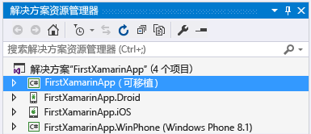
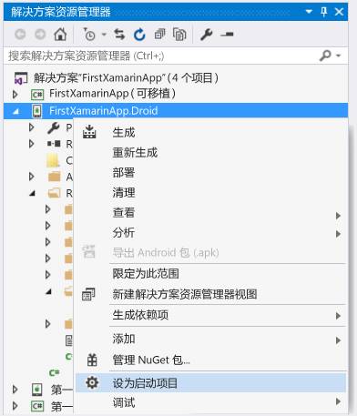
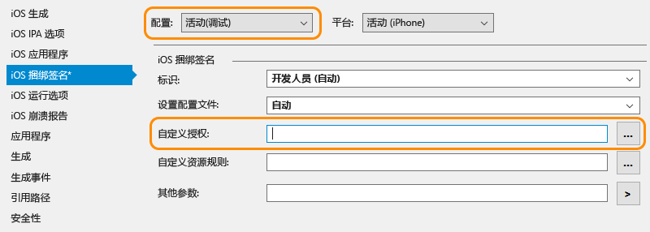

# 验证 Xamarin 环境
安装程序完成安装后（详见[设置和安装](../cross-platform/setup-and-install.md)），请花几分钟时间验证 Xamarin 开发的体验准备事项是否均已就绪。  
  
 完成这些验证后，就可执行下面的一个或两个演练：  
  
-   [学习在 Visual Studio 中使用 Xamarin.Forms 生成应用的基础知识](../cross-platform/learn-app-building-basics-with-xamarin-forms-in-visual-studio.md)  
  
-   [在 Visual Studio 中使用 Xamarin 生成具有本机 UI 的应用](../cross-platform/build-apps-with-native-ui-using-xamarin-in-visual-studio.md)  
  
## 所有平台  
 首先，选择“工具”>“选项”，展开“Xamarin”>“其他”，然后单击“立即检查”链接查看更新。 需要使用 Xamarin 4.0.3.214 或更高版本，避免先前许可问题。  
  
 在 Visual Studio 中使用“文件”>“新建项目”创建新的 Xamarin 解决方案，再在对话框中展开“模板”>“其他语言”>“Visual C#”>“跨平台”，选择“空白应用(本机可移植)”，最后单击“确定”。 这将创建一个具有共享可移植类库项目和适用于 Android、iOS 和 Windows 的单独项目的解决方案：  
  
   
  
> [!NOTE]
>  如果模板不存在，请参阅[是否缺少 Xamarin 项目模板？请尝试本页底部的 ](#missing)。  
  
## Android  
  
1. 通过转到“工具”>“Android”>“Android SDK 管理器”并安装最新版本的 Android SDK 工具、Android SDK 平台工具和 Android SDK 生成工具组件，检查是否已安装最新的 Android SDK 工具。 请注意，无需始终安装最新的 Android API 级别；所需的 API 取决于要面向的平台级别。 通常，安装 Xamarin 时会随附安装其所需的平台级别。  

2.  验证 Android 设计器：在“解决方案资源管理器”的 Android 项目中，打开“资源”>“布局”>“Main.axml”文件。 （如果未直接显示此文件，请尝试在解决方案资源管理器中搜索；它只存在于 Android 项目中，iOS 项目中没有。）  
  
    - 如果你收到错误称“已安装的 Android SDK 版本太旧”，请单击该消息中的“打开 Android SDK”，并选择和安装上述步骤 1 中可用的最新 SDK 版本工具。 
  
3.  在模拟器（或设备）中验证生成和调试：  
  
    -   右击“解决方案资源管理器”中的 Android 项目，并选择“设为启动项目” 。  
  
           
  
    -   根据目标 Android 版本选择合适的模拟器；如果将 Android 开发设备附加到计算机，则其还会与模拟器一并在此处列出：  
  
        -   Windows 8+：在如下所示的 Visual Studio 调试下拉菜单中选择“VS 仿真程序” 目标，然后按 F5，启动调试器。 有关详细信息，请参阅 [Introducing Visual Studio's Emulator for Android](http://blogs.msdn.com/b/visualstudioalm/archive/2014/11/12/introducing-visual-studio-s-emulator-for-android.aspx)（介绍适用于 Android 的 Visual Studio 仿真程序）（Visual Studio ALM 博客）。 如果你在使用该仿真程序时遇到问题，请参阅 [Troubleshooting the Visual Studio Emulator for Android](../cross-platform/troubleshooting-the-visual-studio-emulator-for-android.md)。 还可选择“工具”>“适用于 Android 的 Visual Studio 模拟器”，创建适合模拟器的新设备配置文件。  
  
               
  
             注意：如果未显示“工具”>“适用于 Android 的 Visual Studio 模拟器...”菜单选项，则可能没有安装模拟器。 转到“控制面板”>“程序和功能”，选择“Microsoft Visual Studio”，然后单击“更改”重新运行安装程序。 在安装程序中单击“修改”，勾选“跨平台移动开发”>“适用于 Android 的Microsoft Visual Studio 模拟器”框，然后单击“更新”。  
  
        -   对于 Windows 7 和更低操作系统版本：在下拉列表中改为选择“适用于 Android 的 Xamarin Player”并按 F5 运行。 有关 Xamarin 播放器、其设备管理器和故障排除技巧的详细信息，请参阅 [Xamarin Android 播放器](http://developer.xamarin.com/guides/android/getting_started/installation/android-player/) (xamarin.com)。  
  
> [!NOTE]
>  在 Visual Studio 中，你可能会看到工具栏中有一个 Android 模拟器管理器 (AVD) 按钮（如下所示），该按钮可打开专用于配置 Google Android 模拟器的设备管理器。  它对 Visual Studio Android 模拟器或 Xamarin 播放器均无影响，这二者均通过其自己的设备管理器来配置配置文件。  有关详细信息，请参阅 [Introducing Visual Studio's Emulator for Android](http://blogs.msdn.com/b/visualstudioalm/archive/2014/11/12/introducing-visual-studio-s-emulator-for-android.aspx)（介绍适用于 Android 的 Visual Studio 仿真程序）（Visual Studio ALM 博客）和 [Xamarin Android 播放器](http://developer.xamarin.com/guides/android/getting_started/installation/android-player/) (xamarin.com)。  
>   
  
## Windows Phone  
  
1.  验证 Windows Phone 设计器：在“解决方案资源管理器”中的 Windows Phone 项目中，打开“MainPage.xaml”  文件。  
  
2.  在模拟器中（或在设备上）验证生成和调试（注意：需要通过 Visual Studio 安装程序安装 Windows Phone 模拟器才能进行此步骤，或使用受限设备）：  
  
    -   右击“解决方案资源管理器”中的 Windows Phone 项目，并选择“设为启动项目” 。  
  
    -   如下所示，在 Visual Studio 调试下拉菜单中，选择“模拟程序 8.1”目标或附加设备，并按 F5 启动调试器。  
  
           
  
    -   如果在使用模拟器时遇到问题，请参阅 [Windows Phone 8 模拟器疑难解答](https://msdn.microsoft.com/library/windows/apps/jj681694.aspx)。  
  
## iOS  
  
1.  确保你的 Mac 在网络上可用且已与 Visual Studio 配对，如 [连接到 Mac](http://developer.xamarin.com/guides/ios/getting_started/installation/windows/xamarin-mac-agent/) (xamarin.com) 上所述。  
  
2.  验证情节提要设计器：在“解决方案资源管理器”中的 iOS 项目中，打开“Main.storyboard”  文件。 Visual Studio 在此处托管着在 Mac 上远程运行的设计器。  
  
3.  验证生成和调试：  
  
    1.  右击“解决方案资源管理器”中的 iOS 项目，并选择“设为启动项目” 。  
  
    2.  如下所示，从 Visual Studio 的生成下拉菜单中选择“iPhoneSimulator”目标；如果使用受限设备，请选择“iPhone”目标。 如果未列出任何模拟器，请在 Mac 上启动 Xcode，选择“Xcode”->“参数设置”，然后单击“下载”。 在“组件”  下，应显示了可以下载的仿真程序版本。 在 Xamarin 的[调试](https://developer.xamarin.com/guides/ios/deployment,_testing,_and_metrics/debugging_in_xamarin_ios/#Debugging_on_the_Simulator)页 (xamarin.com) 上可以找到关于调试的其他说明。  
  
           
  
    3.  如下所示，从 Visual Studio 的调试下拉菜单中选择 iPhone 目标，并按 F5 启动调试器。 此时将在 Mac 上启动仿真程序，在 Visual Studio 中进行调试时，将在该仿真程序中与应用进行交互。 如果你的物理 iPhone 或 iPad 连接到 Mac，则它将显示在此处，并且你可以改选它。 如果没看到列出了任何设备或模拟器，可通过查看上述第 1 步中链接的主题，或转到“工具”  >**iOS** >  
  
           
  
    4.  如果在连接到 Mac 时遇到问题，请参阅 [连接疑难解答](http://developer.xamarin.com/guides/ios/getting_started/installation/windows/xamarin-mac-agent/xma-troubleshooting/) (xamarin.com)。  
  
    5.  如果看到错误显示“安装的配置文件与安装的 iOS 签名密钥不匹配”，请执行以下操作：  
  
        -   检查是否按 [将帐户添加到 Xcode](https://developer.apple.com/library/content/documentation/IDEs/Conceptual/AppStoreDistributionTutorial/AddingYourAccounttoXcode/AddingYourAccounttoXcode.html#//apple_ref/doc/uid/TP40013839-CH40-SW1) (apple.com) 中所述在 Mac 上的 Xcode 中添加了 Apple ID 帐户。  添加帐户后，请重启 Visual Studio 和 Xcode。  
  
               
  
        -   在 iOS 捆绑签名选项卡的 iOS 项目属性中，验证活动调试配置的“自定义”授权字段是否为空。  注意：如果遇到以上错误消息，则应仅尝试删除此设置。  
  
##   是否缺少 Xamarin 项目模板？ 尝试此操作  
 如果从 Xamarin 网站直接安装 Xamarin，且并行安装了 Visual Studio 2013 和 Visual Studio 2015，则可能缺少模板。 但这很容易解决：只需启用 Xamarin 安装程序中的“Xamarin for Visual Studio 2015”功能即可。  
  
1.  在控制面板中，打开“程序和功能” ，选择“Xamarin”  项，然后单击“更改” 。  
  
2.  在出现的 Xamarin 安装向导中，依次单击“下一步”  和“更改” 。  
  
3.  在要安装的可选功能列表中，展开“Xamarin for Visual Studio 2015” ，选择“将安装在本地驱动器上” ，然后单击“下一步”  以继续添加功能。
