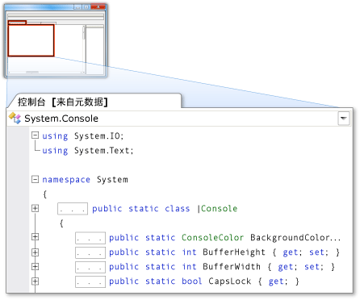

# 作为源代码的元数据
作为源代码的元数据使你可以查看在只读缓冲区中显示为 C# 源代码的元数据。 这可以查看类型和成员（不包含实现）的声明。 对于源代码在项目或解决方案中不可用的类型或成员，可以通过运行“转到定义”  命令以源代码形式查看元数据。  
  
> [!NOTE]
>  尝试对标记为内部的类型或成员运行“转到定义”  命令时，集成开发环境 (IDE) 不会将其元数据显示为源代码，无论引用程序集是否友好均是如此。  
  
 你可以在“代码编辑器”或“代码定义”  窗口中以源代码形式查看元数据。  
  
## 在“代码编辑器”中以源代码形式查看元数据  
 对源代码不可用的项运行“转到定义”  命令时，“代码编辑器”中将显示一个选项卡式文档，该文档包含该项的元数据（以源代码形式显示）的视图。 该文档的选项卡上将显示类型的名称，并且后跟“[from metadata]” 。  
  
 例如，如果对 **运行“转到定义”**<xref:System.Console>命令，则 <xref:System.Console> 的元数据将在“代码编辑器”中显示为 C# 源代码，该源代码与其声明相似，但不包含实现。  
  
   
  
## 在“代码定义”窗口中以源代码形式查看元数据  
 当“代码定义”  窗口处于活动状态或者可见时，IDE 将自动对“代码编辑器”中光标下的项以及“类视图”  或“对象浏览器”  中选定的项执行“转到定义” 命令。 如果该项没有源代码，则 IDE 将在“代码定义”  窗口中以源代码形式显示该项的元数据。  
  
 例如，如果将光标放在“代码编辑器”中的 <xref:System.Console> 一词的内部，则 <xref:System.Console> 的元数据将以源代码形式显示在“代码定义”  窗口中。 该源代码与 <xref:System.Console> 声明类似，但不包含实现。  
  
 若要查看“代码定义”  窗口中显示的项的声明，请右键单击该项并单击“转到定义” 。