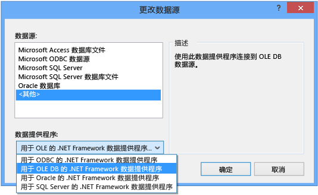
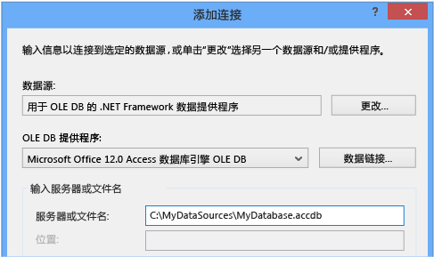
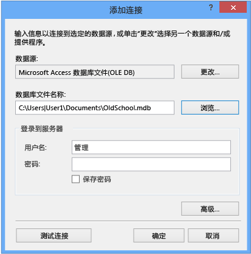

# 演练：连接到 Access 数据库中的数据（Windows 窗体）
可以通过使用 Visual Studio 连接到 Access 数据库（.mdf 文件或 .accdb 文件）。  在定义此连接后，数据会显示在**“数据源”**窗口中。  可从该位置将表或视图拖动到窗体上。  若要了解 Visual Studio 中的项目系统如何管理这些本地数据库文件，请参见[如何：管理项目中的本地数据文件](../data-tools/how-to-manage-local-data-files-in-your-project.md)。  
  
## 系统必备  
 若要使用这些过程，你需要 Windows 窗体应用程序项目和 Access 数据库（.accdb 文件）或 Access 2000\-2003 数据库（.mdb 文件）。  按照与你的文件类型对应的过程操作。  
  
## 为 .accdb 文件创建数据集  
 通过使用以下过程，可连接到使用 Access 2013、Office 365、Access 2010 或 Access 2007 创建的数据库。  
  
#### 创建数据集  
  
1.  打开要将数据连接到的 Windows 窗体应用程序。  
  
2.  在**“视图”**菜单中，选择**“其他窗口”**\>**“数据源”**。  
  
       
  
3.  在**“数据源”**窗口中，单击**“添加新数据源”**。  
  
       
  
4.  在**“选择数据源类型”**页上，选择**“数据库”**，然后单击**“下一步”**。  
  
5.  在**“选择数据库模型”**页上，选择**“数据集”**，然后选择**“下一步”**。  
  
6.  在**“选择您的数据连接”**页面上选择**“新建连接”**以配置一个新的数据连接。  
  
7.  将**“数据源”**更改为**“OLE DB 的 .NET Framework 数据提供程序”**。  
  
       
  
    > [!IMPORTANT]
    >  **“Microsoft Access 数据库文件\(OLE DB\)”**的数据源似乎是正确的选择，你只能为 .mdb 数据库文件使用该数据源。  
  
8.  在**“OLE DB 提供程序”**中，选择**“Microsoft Office 12.0 Access 数据库引擎 OLE DB 提供程序”**。  
  
       
  
9. 在**“服务器或文件名”**中，指定要连接到的 .accdb 文件的路径和名称，然后选择**“确定”**。  
  
    > [!NOTE]
    >  如果数据库文件具有用户名和密码，则先指定它们，然后再选择**“确定”**。  
  
10. 在**“选择你的数据连接”**页上，选择**“下一步”**。  
  
11. 在**“将连接字符串保存到应用程序配置文件”**页上，选择**“下一步”**。  
  
12. 在**“选择数据库对象”**页面上展开**“表”**节点。  
  
13. 在数据集中选择所需的表或视图，然后选择**“完成”**。  
  
     数据集将添加到项目中，并且**“数据源”**窗口中将显示表和视图。  
  
## 为 .mdb 文件创建数据集  
 通过运行**“数据源配置向导”**创建数据集。  
  
#### 创建数据集  
  
1.  打开要将数据连接到的 Windows 窗体应用程序。  
  
2.  在**“视图”**菜单中，选择**“其他窗口”**\>**“数据源”**。  
  
       
  
3.  在**“数据源”**窗口中，单击**“添加新数据源”**。  
  
       
  
4.  在**“选择数据源类型”**页上，选择**“数据库”**，然后单击**“下一步”**。  
  
5.  在**“选择数据库模型”**页上，选择**“数据集”**，然后选择**“下一步”**。  
  
6.  在**“选择您的数据连接”**页面上选择**“新建连接”**以配置一个新的数据连接。  
  
7.  如果**“数据源”**不是**“Microsoft Access 数据库文件\(OLE DB\)”**，请选择**“更改”**以打开**“更改数据源”**对话框，并选择**“Microsoft Access 数据库文件”**，然后选择**“确定”**。  
  
8.  在**“数据库文件名”**中，指定要连接到的 .mdb 文件的路径和名称，然后选择**“确定”**。  
  
       
  
9. 在**“选择你的数据连接”**页上，选择**“下一步”**。  
  
10. 在**“将连接字符串保存到应用程序配置文件”**页上，选择**“下一步”**。  
  
11. 在**“选择数据库对象”**页面上展开**“表”**节点。  
  
12. 在数据集中选择所需的表或视图，然后选择**“完成”**。  
  
     数据集将添加到项目中，并且**“数据源”**窗口中将显示表和视图。  
  
## 安全性  
 存储敏感信息（如密码）会影响应用程序的安全性。  若要控制对数据库的访问，一种较为安全的方法是使用 Windows 身份验证（也称为集成安全性）。  有关更多信息，请参见[保护连接信息](../Topic/Protecting%20Connection%20Information.md)。  
  
## 后续步骤  
 刚刚创建的数据集此时出现在**“数据源”**窗口中。  现在你可以执行以下任何任务  
  
-   在**“数据源”**窗口中选择项，并将这些项拖动到窗体上（请参见[在 Visual Studio 中将 Windows 窗体控件绑定到数据](../data-tools/bind-windows-forms-controls-to-data-in-visual-studio.md)）。  
  
-   在[数据集设计器](../data-tools/creating-and-editing-typed-datasets.md)中打开数据源，以便添加或编辑组成数据集的对象。  
  
-   向该数据集中数据表的 <xref:System.Data.DataTable.ColumnChanging> 或 <xref:System.Data.DataTable.RowChanging> 事件添加验证逻辑（请参见[验证数据集中的数据](../data-tools/validate-data-in-datasets.md)）。  
  
## 请参阅  
 [连接到 Visual Studio 中的数据](../data-tools/connecting-to-data-in-visual-studio.md)   
 [准备应用程序以接收数据](../Topic/Preparing%20Your%20Application%20to%20Receive%20Data.md)   
 [将数据获取到应用程序](../data-tools/fetching-data-into-your-application.md)   
 [在 Visual Studio 中将控件绑定到数据](../data-tools/bind-controls-to-data-in-visual-studio.md)   
 [在应用程序中编辑数据](../data-tools/editing-data-in-your-application.md)   
 [验证数据](../Topic/Validating%20Data.md)   
 [保存数据](../data-tools/saving-data.md)   
 [数据演练](../Topic/Data%20Walkthroughs.md)