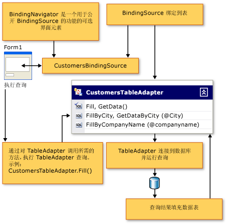

# 连接到 Windows 窗体应用程序中的数据
[!INCLUDE[vsprvs](../code-quality/includes/vsprvs_md.md)] 提供了一些工具，用于将应用程序连接到来自许多不同来源（如数据库、Web 服务及对象）的数据。  如果正在使用 [!INCLUDE[vsprvs](../code-quality/includes/vsprvs_md.md)] 中的数据设计工具，则通常不必为窗体或组件显式创建连接对象。  连接对象通常作为完成一个数据向导或将数据对象拖动到窗体的结果来创建。  若要将应用程序连接到数据库、Web 服务或对象中的数据，请通过从[“数据源”窗口](../Topic/Data%20Sources%20Window.md)中选择**“添加新数据源”**来运行[数据源配置向导](../data-tools/media/data-source-configuration-wizard.png)。  
  
 下面的关系图显示通过执行 TableAdapter 查询连接到数据以获取数据并在 Windows 应用程序中的窗体上显示数据时的标准操作流。  
  
   
  
 在某些情况下，你可能会发现不借助于任何数据设计工具来创建连接对象很方便。  有关以编程方式创建连接的信息，请参阅[连接到数据源](../Topic/Connecting%20to%20a%20Data%20Source%20in%20ADO.NET.md)。  
  
> [!NOTE]
>  有关将 Web 应用程序连接到数据的信息，请参阅[ASP.NET Data Access Content Map](http://msdn.microsoft.com/zh-cn/f9219396-a0fa-481f-894d-e3d9c67d64f2)。  
  
## 将 Windows 窗体应用程序连接到数据的演练  
 以下演练提供了与在 Windows 窗体应用程序中连接到数据相关的过程：  
  
-   [演练：连接到数据库中的数据（Windows 窗体）](../Topic/Walkthrough:%20Connecting%20to%20Data%20in%20a%20Database%20\(Windows%20Forms\).md)  
  
-   [演练：连接到本地数据库文件中的数据（Windows 窗体）](../Topic/Walkthrough:%20Connecting%20to%20Data%20in%20a%20Local%20Database%20File%20\(Windows%20Forms\).md)  
  
-   [演练：连接到 Web 服务中的数据（Windows 窗体）](../Topic/Walkthrough:%20Connecting%20to%20Data%20in%20a%20Web%20Service%20\(Windows%20Forms\).md)  
  
-   [演练：连接到对象中的数据（Windows 窗体）](../Topic/Walkthrough:%20Connecting%20to%20Data%20in%20Objects%20\(Windows%20Forms\).md)  
  
-   [演练：连接到 Access 数据库中的数据（Windows 窗体）](../data-tools/connect-to-data-in-an-access-database-windows-forms.md)  
  
## 创建连接  
 在 [!INCLUDE[vsprvs](../code-quality/includes/vsprvs_md.md)] 中，使用**“添加\/修改连接”**对话框配置连接。  当在一个数据向导或[服务器资源管理器\/数据库资源管理器](../Topic/Server%20Explorer.md)中编辑或创建连接时，或在**“属性”**窗口中编辑连接属性时，将显示**“添加连接”**对话框。  
  
 执行以下操作之一时将自动配置数据连接。  
  
|操作|描述|  
|--------|--------|  
|运行 [数据源配置向导](../data-tools/media/data-source-configuration-wizard.png)。|当在**“数据源配置向导”**中选择数据库路径时，将配置连接。  有关详细信息，请参阅[如何：连接到数据库中的数据](../data-tools/how-to-connect-to-data-in-a-database.md)。|  
|运行 [TableAdapter 配置向导](../Topic/TableAdapter%20Configuration%20Wizard.md)。|在**“TableAdapter 配置向导”**中创建连接。  有关详细信息，请参阅[如何：创建 TableAdapter](../data-tools/create-and-configure-tableadapters.md)。|  
|运行 [TableAdapter 查询配置向导](../data-tools/editing-tableadapters.md)。|在**“TableAdapter 查询配置向导”**中创建连接。  有关详细信息，请参阅[如何：创建 TableAdapter 查询](../data-tools/how-to-create-tableadapter-queries.md)。|  
|将项从 [“数据源”窗口](../Topic/Data%20Sources%20Window.md) 拖动到窗体或 [Component Designer](../Topic/Component%20Designer.md) 中。|将项从**“数据源”**窗口拖到**“Windows 窗体设计器”**或**“组件设计器”**上时，将创建连接对象。  有关详细信息，请参阅[在 Visual Studio 中将控件绑定到数据](../data-tools/bind-controls-to-data-in-visual-studio.md)。|  
|向[服务器资源管理器\/数据库资源管理器](../Topic/Server%20Explorer.md)中添加新数据连接。|“服务器资源管理器\/数据库资源管理器”中的数据连接显示在数据向导中的可用连接列表中|  
  
## 连接字符串  
 连接字符串可存储于编译的应用程序或应用程序配置文件中。  有关详细信息，请参阅[如何：保存和编辑连接字符串](../Topic/How%20to:%20Save%20and%20Edit%20Connection%20Strings.md)。  
  
## 连接信息和安全性  
 由于打开连接涉及获得对重要资源（数据库）的访问，因此配置和使用连接经常涉及安全性问题。  
  
 如何保护应用程序及其对数据源访问的安全取决于系统的结构。  例如，在基于 Web 的应用程序中，用户通常获得对 Internet 信息服务的匿名访问，因此不提供安全凭据。  在此情况下，应用程序将维护自己的登录信息并使用它（而不是任何特定用户信息）来打开连接和访问数据库。  
  
> [!IMPORTANT]
>  存储连接字符串的详细信息（如密码）可能会影响应用程序的安全性。  若要控制对数据库的访问，一种较为安全的方法是使用 Windows 集成安全性。  有关详细信息，请参阅[保护连接信息](../Topic/Protecting%20Connection%20Information.md)。  
  
 在 Intranet 或多层应用程序中，可以利用 Windows、IIS 和 SQL Server 提供的集成安全性选项。  在该模型中，用户在本地网络的身份验证凭据也用于访问数据库资源，并且在连接字符串中不使用任何显式用户名或密码。  通常，通过组在数据库服务器计算机上建立权限，因此你不必为可能访问数据库的每个用户建立单个权限。  在该模型中，你根本不必存储连接的登录信息，并且不需要任何额外步骤来保护连接字符串信息。  
  
 有关安全性的详细信息，请参阅以下主题：  
  
-   [保证 ADO.NET 应用程序的安全](../Topic/Securing%20ADO.NET%20Applications.md)  
  
-   [Windows 窗体中更加安全的文件和数据访问](../Topic/More%20Secure%20File%20and%20Data%20Access%20in%20Windows%20Forms.md)  
  
## “服务器资源管理器\/数据库资源管理器”中的设计时连接  
 **“服务器资源管理器\/数据库资源管理器”**为你提供一种创建到数据源的设计时连接的方式。  它允许你浏览可用的数据源；显示有关它们包含的表、列和其他元素的信息；以及编辑和创建数据库元素。  
  
 你的应用程序不直接使用**“服务器资源管理器\/数据库资源管理器”**中的可用连接。  [!INCLUDE[vsprvs](../code-quality/includes/vsprvs_md.md)] 在设计时使用这些连接来处理数据库。  有关详细信息，请参阅[Visual Database Tools](http://msdn.microsoft.com/zh-cn/6b145922-2f00-47db-befc-bf351b4809a1)。  
  
 例如，你可以在设计时使用**“服务器资源管理器\/数据库资源管理器”**创建到数据库的连接。  稍后在设计窗体时，可以浏览数据库，从表中选择列，并将它们拖动到[数据集设计器](../data-tools/creating-and-editing-typed-datasets.md)上。  这将在你的数据集中创建 [TableAdapter](../data-tools/tableadapter-overview.md)。  还将创建一个新的连接对象，该对象是新创建的 TableAdapter 的一部分。  
  
 有关设计时连接的信息独立于特定的项目或解决方案存储在本地计算机上。  因此，在应用程序中工作时建立了设计时连接以后，只要该连接指向的服务器可用，每当你在 [!INCLUDE[vsprvs](../code-quality/includes/vsprvs_md.md)] 中工作时它都将出现在**“服务器资源管理器\/数据库资源管理器”**中。  有关详细信息，请参阅[How to: Connect to a Database from Server Explorer](http://msdn.microsoft.com/zh-cn/7c1c3067-0d77-471b-872b-639f9f50db74)。  
  
 [!INCLUDE[SQLObjectExplorer](../data-tools/includes/sqlobjectexplorer_md.md)]  
  
## 请参阅  
 [连接到 Visual Studio 中的数据](../data-tools/connecting-to-data-in-visual-studio.md)   
 [如何：连接到数据库中的数据](../data-tools/how-to-connect-to-data-in-a-database.md)   
 [演练：连接到数据库中的数据（Windows 窗体）](../Topic/Walkthrough:%20Connecting%20to%20Data%20in%20a%20Database%20\(Windows%20Forms\).md)   
 [ASP.NET Data Access Content Map](http://msdn.microsoft.com/zh-cn/f9219396-a0fa-481f-894d-e3d9c67d64f2)   
 [准备应用程序以接收数据](../Topic/Preparing%20Your%20Application%20to%20Receive%20Data.md)   
 [将数据获取到应用程序](../data-tools/fetching-data-into-your-application.md)   
 [在 Visual Studio 中将控件绑定到数据](../data-tools/bind-controls-to-data-in-visual-studio.md)   
 [在应用程序中编辑数据](../data-tools/editing-data-in-your-application.md)   
 [验证数据](../Topic/Validating%20Data.md)   
 [保存数据](../data-tools/saving-data.md)