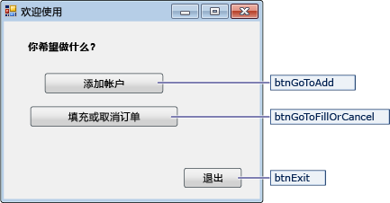
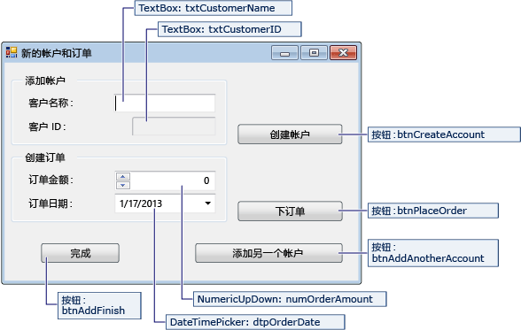
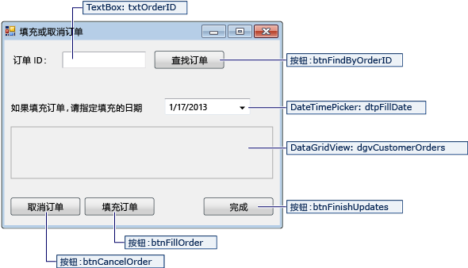

# <a name="create-a-simple-data-application-by-using-adonet"></a>使用 ADO.NET 创建简单的数据应用程序
在创建操作数据库中的数据的应用程序时，你可以执行基本任务，如定义连接字符串、 插入数据和运行存储的过程。 按照本主题，你可以了解如何通过使用 Visual C# 或 Visual Basic 和 ADO.NET 从一个简单的 Windows 窗体"forms over data"应用程序中的数据库与交互。  所有.NET 数据技术 — 包括数据集，LINQ to SQL，以及实体框架 — 最终执行非常类似于本文中所示的步骤。  
  
 这篇文章演示一种简单的方法来获取数据从数据库中非常快的方式。 如果你的应用程序需要修改非普通方法中的数据并更新数据库，则应考虑使用 Entity Framework 和使用数据绑定自动同步到基础数据中的更改的用户界面控件。  
  
> [!IMPORTANT]
>  若要使代码保持简单，它不包括生产就绪的异常处理。  
  
 **主题内容**  
  
-   [设置示例数据库](../data-tools/create-a-simple-data-application-by-using-adonet.md#BKMK_setupthesampledatabase)  
  
-   [创建窗体并添加控件](../data-tools/create-a-simple-data-application-by-using-adonet.md#BKMK_createtheformsandaddcontrols)  
  
-   [存储连接字符串](../data-tools/create-a-simple-data-application-by-using-adonet.md#BKMK_storetheconnectionstring)   
  
-   [编写窗体的代码](../data-tools/create-a-simple-data-application-by-using-adonet.md#BKMK_writethecodefortheforms)  
  
-   [测试应用程序](../data-tools/create-a-simple-data-application-by-using-adonet.md#BKMK_testyourapplication)  
  
## <a name="prerequisites"></a>先决条件  
 要创建应用程序，你将需要：  
  
-   Visual Studio Community Edition。  
  
-   SQL Server Express LocalDB。 如果你没有 SQL Server Express LocalDB，你可以从中进行安装[SQL Server 版本的下载页](https://www.microsoft.com/en-us/server-cloud/Products/sql-server-editions/sql-server-express.aspx)。  

本主题假定你熟悉 Visual Studio IDE 的基本功能并可以创建 Windows 窗体应用程序，将添加到项目中，将按钮和窗体上，其他控件的窗体设置属性的控件和简单事件进行编码。 如果你不熟悉这些任务，我们建议你完成[Getting Started with Visual C# 和 Visual Basic](../ide/getting-started-with-visual-csharp-and-visual-basic.md)之前在开始本演练的主题。  
  
##  <a name="BKMK_setupthesampledatabase"></a>设置示例数据库  
通过执行以下步骤创建示例数据库：  

1. 在 Visual Studio 中，打开**服务器资源管理器**窗口。  

2. 右键单击**数据连接**，然后选择 * * 创建新的 SQL Server 数据库..."。  

3. 在**服务器名称**文本框中，输入**(localdb) \mssqllocaldb**。  

4. 在**新的数据库名称**文本框中，输入**销售**，然后选择**确定**。  

     空**销售**创建数据库并将其添加到服务器资源管理器中的数据连接节点。  

5. 右键单击**销售**数据连接，然后选择**新查询**。  

     查询编辑器窗口将打开。  

6. 复制[销售 TRANSACT-SQL 脚本](https://github.com/MicrosoftDocs/visualstudio-docs/raw/master/docs/data-tools/samples/sales.sql)到剪贴板。  

7. 将 T-SQL 脚本粘贴到查询编辑器中，，然后选择**执行**按钮。  

     短时间内之后, 执行完查询和创建数据库对象。 数据库包含两个表： 客户和订单。 这些表最初不包含数据，但你可以运行的应用程序将创建时添加数据。 数据库还包含四个简单的存储的过程。   
  
##  <a name="BKMK_createtheformsandaddcontrols"></a>创建窗体并添加控件  
  
1.  为 Windows 窗体应用程序，创建一个项目，然后将其命名 SimpleDataApp。  
  
     Visual Studio 将创建项目以及若干个文件，其中包括名为 Form1 的空 Windows 窗体。  
  
2.  将两个 Windows 窗体添加到你的项目，以便它具有三个窗体，然后给予它们下列名称：  
  
    -   导航  
  
    -   NewCustomer  
  
    -   FillOrCancel  
  
3.  对于每个窗体，添加文本框、按钮和其他控件，如下图所示。 对于每个控件，设置表中描述的属性。  
  
    > [!NOTE]
    >  分组框和标签控件可提高清晰度，但不在代码中使用。  
  
 **Navigation 窗体**  
  
   
  
|Navigation 窗体的控件|属性|  
|--------------------------------------|----------------|  
|Button|Name = btnGoToAdd|  
|Button|Name = btnGoToFillOrCancel|  
|Button|Name = btnExit|  
  
 **NewCustomer 窗体**  
  
   
  
|NewCustomer 窗体的控件|属性|  
|---------------------------------------|----------------|  
|文本框|Name = txtCustomerName|  
|文本框|Name = txtCustomerID<br /><br /> Readonly = True|  
|Button|Name = btnCreateAccount|  
|NumericUpdown|DecimalPlaces = 0<br /><br /> Maximum = 5000<br /><br /> Name = numOrderAmount|  
|DateTimePicker|Format = Short<br /><br /> Name = dtpOrderDate|  
|Button|Name = btnPlaceOrder|  
|Button|Name = btnAddAnotherAccount|  
|Button|Name = btnAddFinish|  
  
 **FillOrCancel 窗体**  
  
   
  
|FillOrCancel 窗体的控件|属性|  
|----------------------------------------|----------------|  
|文本框|Name = txtOrderID|  
|Button|Name = btnFindByOrderID|  
|DateTimePicker|Format = Short<br /><br /> Name = dtpFillDate|  
|DataGridView|Name = dgvCustomerOrders<br /><br /> Readonly = True<br /><br /> RowHeadersVisible = False|  
|Button|Name = btnCancelOrder|  
|Button|Name = btnFillOrder|  
|Button|Name = btnFinishUpdates|  
  
##  <a name="BKMK_storetheconnectionstring"></a>存储连接字符串  
 当应用程序尝试打开数据库的连接时，应用程序必须能够访问连接字符串。 若要避免在每个窗体上手动输入该字符串，将字符串存储在 App.config 文件在项目中，并创建从你的应用程序中任何窗体调用方法时返回字符串的方法。  
  
 你可以通过右键单击在上找到的连接字符串**销售**中的数据连接**服务器资源管理器**并选择**属性**。 找到**ConnectionString**属性，则使用 Ctrl + A，Ctrl + C 以选择并将字符串复制到剪贴板。 
  
1.  如果你正在使用 C# 中，在**解决方案资源管理器**，展开**属性**节点，在该项目，然后再打开**Settings.settings**文件。  
    如果使用 Visual Basic 中，则在**解决方案资源管理器**，单击**显示所有文件**，展开**我的项目**节点，然后打开**Settings.settings**文件。
  
2.  在**名称**列中，输入`connString`。  
  
3.  在**类型**列表中，选择**（连接字符串）**。  
  
4.  在**作用域**列表中，选择**应用程序**。    

5.  在**值**列中，输入 （无需任何外部引号），连接字符串，然后保存所做的更改。  
  
> [!NOTE]
>  在实际应用中，你应连接字符串，安全地存储中所述[连接字符串和配置文件](/dotnet/framework/data/adonet/connection-strings-and-configuration-files)。     
  
##  <a name="BKMK_writethecodefortheforms"></a>编写窗体的代码  
 本部分包含每个窗体的用途的简要的概述。 它还提供单击窗体上的按钮时定义的基本逻辑的代码。  
  
### <a name="navigation-form"></a>Navigation 窗体  

运行应用程序时，Navigation 窗体将打开。 **添加帐户**按钮可以打开 NewCustomer 窗体。 **填写或取消订单**按钮可以打开 FillOrCancel 窗体。 **退出**按钮可以关闭应用程序。  
  
#### <a name="make-the-navigation-form-the-startup-form"></a>使 Navigation 窗体成为启动窗体  
 如果你正在使用 C# 中，在**解决方案资源管理器**，打开 Program.cs，然后将更改`Application.Run`至此的行：`Application.Run(new Navigation());`  
  
 如果使用 Visual Basic 中，则在**解决方案资源管理器**，打开**属性**窗口中，选择**应用程序**选项卡上，然后选择**SimpleDataApp.Navigation**中**启动窗体**列表。  
  
#### <a name="create-auto-generated-event-handlers"></a>创建自动生成的事件处理程序  
 双击要创建空的事件处理程序方法的导航窗体上的三个按钮。 双击按钮还将添加自动生成的代码在设计器代码文件中，单击按钮以引发一个事件。  
  
#### <a name="add-code-for-the-navigation-form-logic"></a>添加导航窗体逻辑的代码   
 在 Navigation 窗体的代码页，完成三个按钮的方法体 click 事件处理程序中的以下代码所示。  
  
[!code-csharp[Navigation#1](../data-tools/codesnippet/CSharp/SimpleDataApp/Navigation.cs#1)]  
[!code-vb[Navigation#1](../data-tools/codesnippet/VisualBasic/SimpleDataApp/Navigation.vb#1)]   
  
### <a name="newcustomer-form"></a>NewCustomer 窗体  
 当你输入客户名称，然后选择**创建帐户**按钮，NewCustomer 窗体会创建一个客户帐户，和 SQL Server 将返回一个 IDENTITY 值作为新的客户 id。 然后，你可以将新帐户的顺序放置的指定数量和订单日期并选择**下订单**按钮。  
  
#### <a name="create-auto-generated-event-handlers"></a>创建自动生成的事件处理程序  
 创建一个空的 Click 事件处理程序通过在每个四个按钮上双击 NewCustomer 窗体上的每个按钮。 双击按钮还将添加自动生成的代码在设计器代码文件中，单击按钮以引发一个事件。  
  
#### <a name="add-code-for-the-newcustomer-form-logic"></a>为 NewCustomer 窗体逻辑添加代码  
若要完成的 NewCustomer 窗体逻辑，请按照下列步骤。  

1. 使```System.Data.SqlClient```纳入范围的命名空间，以便不具有完全限定其成员的名称。  

     ```csharp  
     using System.Data.SqlClient  
     ```  
     ```vb  
     Imports System.Data.SqlClient  
     ```  

2. 将某些变量和帮助器方法添加到类，如下面的代码中所示。  

     [!code-csharp[NewCustomer#1](../data-tools/codesnippet/CSharp/SimpleDataApp/NewCustomer.cs#1)]  
     [!code-vb[NewCustomer#1](../data-tools/codesnippet/VisualBasic/SimpleDataApp/NewCustomer.vb#1)]  

3. 完成四个按钮的方法体 click 事件处理程序，如下面的代码中所示。  

     [!code-csharp[NewCustomer#2](../data-tools/codesnippet/CSharp/SimpleDataApp/NewCustomer.cs#2)]  
     [!code-vb[NewCustomer#2](../data-tools/codesnippet/VisualBasic/SimpleDataApp/NewCustomer.vb#2)]  

### <a name="fillorcancel-form"></a>FillOrCancel 窗体  
 FillOrCancel 窗体运行查询时要返回订单输入订单 ID，然后单击**查找订单**按钮。 返回的行在只读数据网格中显示。 你可以将订单标记为已取消 (X) 如果你选择**取消订单**按钮，也可以将订单标记为填写 (F) 如果你选择**填写订单**按钮。 如果你选择**查找订单**按钮再次，此时将显示更新的行。  
#### <a name="create-auto-generated-event-handlers"></a>创建自动生成的事件处理程序  
 创建空通过双击按钮单击事件处理程序 FillOrCancel 窗体上的四个按钮。 双击按钮还将添加自动生成的代码在设计器代码文件中，单击按钮以引发一个事件。  
  
#### <a name="add-code-for-the-fillorcancel-form-logic"></a>为 FillOrCancel 窗体逻辑添加代码  
若要完成的 FillOrCancel 窗体逻辑，请按照下列步骤。  

1. 将以下两个命名空间引入作用域中，以便无需完全符合其成员的名称。  

     ```csharp  
     using System.Data.SqlClient;  
     using System.Text.RegularExpressions;  
     ```  
     ```vb  
     Imports System.Data.SqlClient  
     Imports System.Text.RegularExpressions  
     ```  

2. 将变量和帮助程序方法添加到类，如下面的代码中所示。  

     [!code-csharp[FillOrCancel#1](../data-tools/codesnippet/CSharp/SimpleDataApp/FillOrCancel.cs#1)]  
     [!code-vb[FillOrCancel#1](../data-tools/codesnippet/VisualBasic/SimpleDataApp/FillOrCancel.vb#1)]  

3. 完成四个按钮的方法体 click 事件处理程序，如下面的代码中所示。  

     [!code-csharp[FillOrCancel#2](../data-tools/codesnippet/CSharp/SimpleDataApp/FillOrCancel.cs#2)]  
     [!code-vb[FillOrCancel#2](../data-tools/codesnippet/VisualBasic/SimpleDataApp/FillOrCancel.vb#2)]  

##  <a name="BKMK_testyourapplication"></a>测试应用程序  
选择**F5**键以生成并测试你的应用程序后代码每个 Click 事件处理程序，然后检查完中完成编码。

## <a name="see-also"></a>请参阅
[适用于 NET 的 Visual Studio Data Tools](../data-tools/visual-studio-data-tools-for-dotnet.md)
