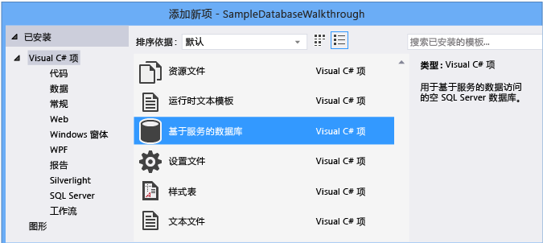
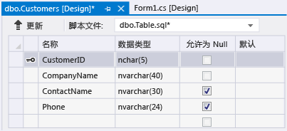
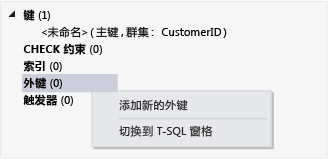

# 演练：在 Visual Studio 中创建本地数据库文件
可以通过使用 Visual Studio 在[本地数据概述](../data-tools/local-data-overview.md)所描述的 SQL Server Express LocalDB 中创建并更新本地数据库来探索基本任务，例如添加表和定义列。  在完成本演练后，以本地数据库为起点进行其他演练，你会发现更高级的功能。  
  
 有关如何使用 SQL Server Management Studio 或 Transact\-SQL 创建数据库的信息，请参见[Create a Database](http://msdn.microsoft.com/zh-cn/4c4beea2-6cbc-4352-9db6-49ea8130bb64)。  
  
 在本演练中，你将探索以下任务：  
  
-   [创建一个项目及本地数据库文件](../data-tools/create-a-sql-database-by-using-a-designer.md#BKMK_CreateNewSQLDB)。  
  
-   [创建表、列、主键和外键](../data-tools/create-a-sql-database-by-using-a-designer.md#BKMK_CreateNewTbls)。  
  
-   [将数据填入表中](../data-tools/create-a-sql-database-by-using-a-designer.md#BKMK_Populating)。  
  
## 系统必备  
 若要完成本演练，请安装 [!INCLUDE[vs_dev12_expwin](../data-tools/includes/vs_dev12_expwin_md.md)]、Visual Studio Professional 2013、Visual Studio Premium 2013 或 Visual Studio Ultimate 2013。  这些 Visual Studio 版本包括 SQL Server Data Tools。  
  
##  <a name="BKMK_CreateNewSQLDB"></a> 创建一个项目及本地数据库文件  
  
#### 创建项目和数据库文件  
  
1.  创建名为 `SampleDatabaseWalkthrough` 的 Windows 窗体项目。  
  
     请参见[创建解决方案和项目](../ide/creating-solutions-and-projects.md)。  
  
2.  在菜单栏上，依次选择**“项目”**、**“添加新项”**。  
  
     此时将显示**“添加新项”**对话框，你可以添加适用于 Windows 窗体项目的项。  
  
3.  在项模板列表中，向下滚动直至显示**“基于服务的数据库”**，然后选择此项。  
  
       
  
4.  将数据库命名为“SampleDatabase”，然后选择**“添加”**按钮。  
  
5.  如果“数据源”窗口未打开，可通过选择 Shift\-Alt\-D 键或在菜单栏上选择**“视图”**、**“其他窗口”**、**“数据源”**将其打开。  
  
6.  在“数据源”窗口中，选择**“添加新数据源”**链接。  
  
7.  在**“数据源配置向导”**中，选择**“下一步”**按钮四次以接受默认设置，然后选择**“完成”**按钮。  
  
 通过打开数据库的属性窗口，可查看其连接字串符和主 .mdf 文件的位置。  
  
-   在 Visual Studio Express 中，如果该窗口尚未打开，请选择**“视图”**、**“其他窗口”**、**“数据库资源管理器”**。  通过展开**“数据连接”**节点，打开 SampleDatabase.mdf 的快捷菜单，然后选择**“属性”**来打开属性窗口。  
  
-   在其他版本的 Visual Studio 中，如果该窗口尚未打开，请选择**“视图”**、**“服务器资源管理器”**。  通过展开**“数据连接”**节点，打开 SampleDatabase.mdf 的快捷菜单，然后选择**“属性”**来打开属性窗口。  
  
##  <a name="BKMK_CreateNewTbls"></a> 创建表、列、主键和外键  
 在本节中，你将创建几个表，每个表中有一个主键和几行示例数据。  在下一个演练中，你将了解该信息如何显示在应用程序中。  你还将创建外键以指定一个表中的记录如何对应于另一个表中的记录。  
  
#### 创建 Customers 表  
  
1.  在**“服务器资源管理器”**或**“数据库资源管理器”**中，依次展开**“数据连接”**节点和**“SampleDatabase.mdf”**节点。  
  
     如果你的 Visual Studio 版本的资源管理器未打开，请在菜单上选择**“视图”**、**“服务器资源管理器”**，或选择**“视图”**、**“其他窗口”**、**“数据库资源管理器”**。  
  
2.  打开**“表”**的快捷菜单，然后选择**“添加新表”**。  
  
     **“表设计器”**将打开并显示一个网格，其中有一个默认行，表示所创建表中的一列。  通过向网格中添加行，即可在表中添加列。  
  
3.  在网格中，为下列各个条目添加行：  
  
    |列名称|数据类型|允许空|  
    |---------|----------|---------|  
    |`CustomerID`|`nchar(5)`|False（清除）|  
    |`CompanyName`|`nvarchar(40)`|False（清除）|  
    |`ContactName`|`nvarchar (30)`|True（已选定）|  
    |`Phone`|`nvarchar (24)`|True（已选定）|  
  
4.  打开 `CustomerID` 行的快捷菜单，然后选择**“设置主键”**。  
  
5.  打开默认行的快捷菜单，然后选择**“删除”**。  
  
6.  通过更新脚本窗格的第一行来命名 Customers 表，与以下示例相匹配：  
  
    ```  
    CREATE TABLE [dbo].[Customers]  
    ```  
  
7.  在“表设计器”的左上角，选择**“更新”**按钮，如下图所示。  
  
       
  
8.  在**“预览数据库更新”**对话框中，选择**“更新数据库”**按钮。  
  
     你所做的更改将保存到本地数据库文件中。  
  
#### 创建 Orders 表  
  
1.  添加另一个表，然后在下表中为每个条目添加行：  
  
    |列名称|数据类型|允许空|  
    |---------|----------|---------|  
    |`OrderID`|`int`|False（清除）|  
    |`CustomerID`|`nchar(5)`|False（清除）|  
    |`OrderDate`|`datetime`|True（已选定）|  
    |`OrderQuantity`|`int`|True（已选定）|  
  
2.  将**“OrderID”**设置为主键，然后删除默认行。  
  
3.  通过更新脚本窗格的第一行来命名 Orders 表，与以下示例相匹配：  
  
    ```  
    CREATE TABLE [dbo].[Orders]  
    ```  
  
4.  在“表设计器”的左上角，选择**“更新”**按钮。  
  
5.  在**“预览数据库更新”**对话框中，选择**“更新数据库”**按钮。  
  
     你所做的更改将保存到本地数据库文件中。  
  
#### 创建外键  
  
1.  在网格右侧的上下文窗格中，打开**“外键”**的快捷菜单，然后选择**“添加新外键”**，如下图所示。  
  
       
  
2.  在显示的文本框中，将**“ToTable”**替换为 `Customers`。  
  
3.  在脚本窗格中，更新最后一行以与以下示例相匹配：  
  
    ```  
    CONSTRAINT [FK_Orders_Customers] FOREIGN KEY ([CustomerID]) REFERENCES [Customers]([CustomerID])  
    ```  
  
4.  在“表设计器”的左上角，选择**“更新”**按钮。  
  
5.  在**“预览数据库更新”**对话框中，选择**“更新数据库”**按钮。  
  
     你所做的更改将保存到本地数据库文件中。  
  
##  <a name="BKMK_Populating"></a> 将数据填入表中  
  
#### 将数据填入表中  
  
1.  在**“服务器资源管理器”**或**“数据库资源管理器”**中，展开示例数据库的节点。  
  
2.  打开“表”节点的快捷菜单，选择**“刷新”**，然后展开“表”节点。  
  
3.  打开 Customers 表的快捷菜单，然后选择**“显示表数据”**。  
  
4.  为至少三个客户添加所需数据。  
  
     你可以指定任意五个字符作为客户 ID，但至少选择一个能记住的以便稍后在此过程中使用。  
  
5.  打开 Orders 表的快捷菜单，然后选择**“显示表数据”**。  
  
6.  为至少三个订单添加数据。  
  
    > [!IMPORTANT]
    >  请确保所有订单 ID 和订单数量是整数，并且每个客户 ID 与 Customers 表中的 CustomerID 列中指定的值相匹配。  
  
7.  在菜单栏上，依次选择**“文件”**、**“全部保存”**。  
  
8.  在菜单栏上，依次选择**“文件”**、**“关闭解决方案”**。  
  
    > [!NOTE]
    >  最好备份刚创建的数据库文件，你可以复制并粘贴到其他位置，或以不同名称另存一份。  
  
## 后续步骤  
 现在你拥有了包含示例数据的本地数据库文件，除演示数据库任务的其他演练外，还可完成[演练：连接到本地数据库文件中的数据（Windows 窗体）](../Topic/Walkthrough:%20Connecting%20to%20Data%20in%20a%20Local%20Database%20File%20\(Windows%20Forms\).md)。  
  
## 请参阅  
 [如何：管理项目中的本地数据文件](../data-tools/how-to-manage-local-data-files-in-your-project.md)   
 [本地数据概述](../data-tools/local-data-overview.md)   
 [在 Visual Studio 中将 Windows 窗体控件绑定到数据](../data-tools/bind-windows-forms-controls-to-data-in-visual-studio.md)   
 [Visual Studio 的数据应用程序概述](../data-tools/overview-of-data-applications-in-visual-studio.md)   
 [连接到 Visual Studio 中的数据](../data-tools/connecting-to-data-in-visual-studio.md)   
 [准备应用程序以接收数据](../Topic/Preparing%20Your%20Application%20to%20Receive%20Data.md)   
 [将数据获取到应用程序](../data-tools/fetching-data-into-your-application.md)   
 [在 Visual Studio 中将控件绑定到数据](../data-tools/bind-controls-to-data-in-visual-studio.md)   
 [在应用程序中编辑数据](../data-tools/editing-data-in-your-application.md)   
 [验证数据](../Topic/Validating%20Data.md)   
 [保存数据](../data-tools/saving-data.md)