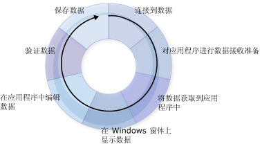

# 创建数据应用程序
Visual Studio 提供许多设计时工具，可帮助你创建访问数据的应用程序。  本文概述了创建数据处理应用程序所涉及的基本过程。  此处的信息有意略过了许多细节，其设计目的是提供一个一般信息来源和起点，读者可借此访问与创建数据应用程序有关的很多其他帮助页。  
  
 在 [!INCLUDE[vsprvs](../code-quality/includes/vsprvs_md.md)] 中开发数据访问应用程序时的要求不尽相同。  在某些情况下，可能只是想在窗体上显示数据。  而在另一些情况下，则可能需要设计出一种方法，以与其他应用程序或过程共享信息。  
  
 无论对数据做何处理，你都应该清楚一些基本概念。  你可能从不需要了解数据处理的某些细节（例如，你可能从不需要以编程方式创建数据库），但是了解基本数据概念以及 [!INCLUDE[vsprvs](../code-quality/includes/vsprvs_md.md)] 中提供的数据工具（向导和设计器）将非常有用。  
  
 一个典型的数据应用程序会使用下图中所示的大部分过程：  
  
   
数据循环  
  
 在你创建应用程序时，请考虑要完成什么样的任务。  使用以下各节来帮助查找你可使用的 [!INCLUDE[vsprvs](../code-quality/includes/vsprvs_md.md)] 工具和对象。  
  
> [!NOTE]
>  [!INCLUDE[vsprvs](../code-quality/includes/vsprvs_md.md)] 提供向导来简化上图中显示的若干过程。  例如，运行**“数据源配置向导”**可为应用程序提供连接数据所需的足够信息，创建接收数据的类型化数据集，以及将数据引入应用程序。  
  
 若要快速查看 [!INCLUDE[vsprvs](../code-quality/includes/vsprvs_md.md)] 如何帮助你开发数据应用程序，请参见[演练：创建简单的数据应用程序](../Topic/Walkthrough:%20Creating%20a%20Simple%20Data%20Application.md)。  
  
## 连接到数据  
 为了将数据引入应用程序（并将更改发回数据源），需要建立某种双向通信机制。  这种双向通信通常由数据模型中的对象进行处理。  
  
 例如，`TableAdapter` 将使用数据集的应用程序连接到数据库，<xref:System.Data.Objects.ObjectContext> 将 Entity Framework 中的实体连接到数据库。  [!INCLUDE[vsprvs](../code-quality/includes/vsprvs_md.md)] 提供了多种工具来帮助创建应用程序可使用的连接。  有关将应用程序连接到数据的更多信息，请参见 [连接到 Visual Studio 中的数据](../data-tools/connecting-to-data-in-visual-studio.md)。  
  
 若要了解如何使用数据集将应用程序连接到数据库中的数据，请参见[演练：连接到数据库中的数据（Windows 窗体）](../Topic/Walkthrough:%20Connecting%20to%20Data%20in%20a%20Database%20\(Windows%20Forms\).md)。  
  
## 准备应用程序以接收数据  
 如果应用程序使用断开连接的数据模型，则在使用数据时需要临时将数据存储在应用程序中。  Visual Studio 提供的工具可帮助你创建应用程序用于临时存储数据的对象：数据集、实体和 [!INCLUDE[vbtecdlinq](../data-tools/includes/vbtecdlinq_md.md)] 对象。  
  
> [!NOTE]
>  使用断开连接的数据模型的应用程序通常执行以下过程：连接到数据库、运行将数据引入应用程序的查询、断开与数据库的连接、脱机操作数据，然后重新连接并更新数据库。  
  
 有关在应用程序中创建类型化数据集的更多信息，请参见 [准备应用程序以接收数据](../Topic/Preparing%20Your%20Application%20to%20Receive%20Data.md)。  有关在 n 层应用程序中使用数据集的附加信息，请参见[如何：将数据集和 TableAdapter 分离到不同的项目中](../data-tools/separate-datasets-and-tableadapters-into-different-projects.md)。  
  
 若要了解如何创建数据集，请完成 [演练：使用数据集设计器创建数据集](../data-tools/walkthrough-creating-a-dataset-with-the-dataset-designer.md) 中的过程。  
  
 若要了解如何创建 [!INCLUDE[vbtecdlinq](../data-tools/includes/vbtecdlinq_md.md)] 对象，请完成[演练：创建 LINQ to SQL 类（O\/R 设计器）](../Topic/Walkthrough:%20Creating%20LINQ%20to%20SQL%20Classes%20\(O-R%20Designer\).md)中的过程。  
  
## 将数据获取到你的应用程序  
 无论应用程序是否使用断开连接的数据模型，你都需要将数据取入应用程序。  通过对数据库执行查询或存储过程可将数据引入应用程序。  将数据存储到数据集的应用程序使用 `TableAdapter` 执行查询和存储过程，而将数据存储到实体的应用程序使用 [LINQ to Entities](../Topic/LINQ%20to%20Entities.md) 或通过将实体直接连接到存储过程执行查询。  有关创建和编辑使用 TableAdapter 的查询的更多信息，请参见[如何：创建 TableAdapter 查询](../data-tools/how-to-create-tableadapter-queries.md)和[如何：编辑 TableAdapter 查询](../data-tools/how-to-edit-tableadapter-queries.md)。  
  
 有关将数据加载到数据集以及执行查询和存储过程的更多信息，请参见[将数据获取到应用程序](../data-tools/fetching-data-into-your-application.md)。  
  
 若要了解如何将数据加载到数据集中，请完成 [演练：在 Windows 窗体上显示数据](../data-tools/walkthrough-displaying-data-on-a-windows-form.md) 中的过程，并检查窗体加载事件处理程序中的代码。  
  
 若要了解如何将数据加载到 [!INCLUDE[vbtecdlinq](../data-tools/includes/vbtecdlinq_md.md)] 对象中，请完成[演练：创建 LINQ to SQL 类（O\/R 设计器）](../Topic/Walkthrough:%20Creating%20LINQ%20to%20SQL%20Classes%20\(O-R%20Designer\).md)中的过程。  
  
 若要了解如何创建和执行 SQL 查询，请参见 [如何：创建和执行返回行的 SQL 语句](../Topic/How%20to:%20Create%20and%20Execute%20an%20SQL%20Statement%20that%20Returns%20Rows.md)。  
  
 若要了解如何执行存储过程，请参见[如何：执行返回行的存储过程](../Topic/How%20to:%20Execute%20a%20Stored%20Procedure%20that%20Returns%20Rows.md)。  
  
## 在窗体上显示数据  
 将数据引入应用程序后，你通常将数据显示在窗体上以供用户查看或修改。  [!INCLUDE[vsprvs](../code-quality/includes/vsprvs_md.md)] 提供了[“数据源”窗口](../Topic/Data%20Sources%20Window.md)，你可在其中将项拖到窗体上，以自动创建显示数据的数据绑定控件。  有关数据绑定和向用户显示数据的更多信息，请参见 [在 Visual Studio 中将控件绑定到数据](../data-tools/bind-controls-to-data-in-visual-studio.md)。  
  
 若要了解如何向用户显示数据，请完成以下演练中的过程（特别注意从**“数据源”**窗口拖动项的过程）：  
  
-   [演练：在 Windows 窗体上显示数据](../data-tools/walkthrough-displaying-data-on-a-windows-form.md).  
  
-   [演练：将 WPF 控件绑定到 WCF 数据服务](../data-tools/bind-wpf-controls-to-a-wcf-data-service.md)  
  
-   [演练：将 Silverlight 控件绑定到 WCF 数据服务](../Topic/Walkthrough:%20Binding%20Silverlight%20Controls%20to%20a%20WCF%20Data%20Service.md)  
  
## 在应用程序中编辑数据  
 向用户显示数据后，用户可能会通过添加新记录、编辑和删除记录等操作修改数据，然后将数据发回数据库。  
  
 有关数据在加载到数据集后的处理的更多信息，请参见 [在应用程序中编辑数据](../data-tools/editing-data-in-your-application.md)。  
  
## 验证数据  
 更改数据时，你一般希望先检验一下所做的更改，然后决定是否允许在数据集中接受更改后的值，以及是否将更改后的值写入数据库。  检验这些新值是否符合应用程序要求的过程称为“验证”。  可以在应用程序中添加逻辑以便在值发生变化时检查这些值。  Visual Studio 提供的工具可帮助你添加代码，以用于在列和行发生变化时验证数据。  有关更多信息，请参见[验证数据](../Topic/Validating%20Data.md)。  
  
 若要了解如何在应用程序中添加数据验证功能，请参见 [演练：向数据集添加验证](../Topic/Walkthrough:%20Adding%20Validation%20to%20a%20Dataset.md)。  
  
 若要了解如何对分离到一个 n 层应用程序的数据集添加验证，请参见[如何：向 N 层数据集添加验证](../data-tools/add-validation-to-an-n-tier-dataset.md)。  
  
## 保存数据  
 在应用程序中做出并验证更改后，通常要将所做更改发回数据库。  将数据存储到数据集的应用程序通常使用 TableAdapterManager 保存数据。  有关更多信息，请参见 [TableAdapterManager 概述](../Topic/TableAdapterManager%20Overview.md)。  实体框架应用程序使用 <xref:System.Data.Objects.ObjectContext.SaveChanges%2A> 方法保存数据。  
  
 有关将更新后的数据发回数据库的更多信息，请参见 [保存数据](../data-tools/saving-data.md)。  
  
 若要了解如何将更新的数据从数据集发送到数据库，请完成[演练：保存相关数据表中的数据（分层更新）](../Topic/Walkthrough:%20Saving%20Data%20from%20Related%20Data%20Tables%20\(Hierarchical%20Update\).md)中的过程。  
  
## 相关主题  
 [Visual Studio 的数据应用程序概述](../data-tools/overview-of-data-applications-in-visual-studio.md)  
 提供相关主题的链接，这些主题介绍如何创建处理数据的应用程序。  
  
 [连接到 Visual Studio 中的数据](../data-tools/connecting-to-data-in-visual-studio.md)  
 提供相关主题的链接，这些主题介绍如何使用 [!INCLUDE[vsprvs](../code-quality/includes/vsprvs_md.md)] 将应用程序连接到数据并为应用程序创建数据源。  
  
 [准备应用程序以接收数据](../Topic/Preparing%20Your%20Application%20to%20Receive%20Data.md)  
 提供相关主题的链接，这些主题介绍如何在应用程序中使用数据模型（包括数据集和实体数据模型）。  
  
 [将数据获取到应用程序](../data-tools/fetching-data-into-your-application.md)  
 提供相关主题的链接，这些主题介绍如何将数据加载到应用程序中。  
  
 [在 Visual Studio 中将控件绑定到数据](../data-tools/bind-controls-to-data-in-visual-studio.md)  
 提供相关主题的链接，这些主题介绍如何将 Windows 窗体控件、WPF 控件和 Silverlight 控件绑定到数据源。  
  
 [在应用程序中编辑数据](../data-tools/editing-data-in-your-application.md)  
 提供相关主题的链接，这些主题介绍如何在应用程序中更改数据。  
  
 [验证数据](../Topic/Validating%20Data.md)  
 提供相关主题的链接，这些主题介绍如何向数据更改中添加验证。  
  
 [保存数据](../data-tools/saving-data.md)  
 提供相关主题的链接，这些主题介绍如何将已更新的数据从应用程序发送到数据库，或如何将数据保存为诸如 XML 等其他格式。  
  
 [Visual Studio 中用于处理数据源的工具](../Topic/Tools%20for%20Working%20with%20Data%20Sources%20in%20Visual%20Studio.md)  
 提供相关主题的链接，这些主题介绍可用于在 Visual Studio 中处理数据的工具，例如**“数据源”**窗口和 ADO.NET 实体数据模型设计器。