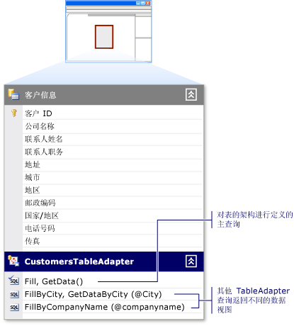

# 如何：编辑 TableAdapter 查询
可使用**“数据集设计器”**中的 [TableAdapter 查询配置向导](../data-tools/editing-tableadapters.md) 编辑 TableAdapter 查询。  当 TableAdapter 查询不再适合应用程序的需要时，应修改该查询。  （或者，您可以创建 TableAdapter 的附加查询。  有关添加新查询的更多信息，请参见 [如何：创建 TableAdapter 查询](../data-tools/how-to-create-tableadapter-queries.md)。）  
  
> [!NOTE]
>  如果打开的是 [TableAdapter 配置向导](../Topic/TableAdapter%20Configuration%20Wizard.md)，而不是**“TableAdapter 查询配置向导”**，您必须选择此 TableAdapter 的主 `Fill` 查询，而不能选择 TableAdapter 的某个附加查询。  有关编辑 TableAdapter 的主 `Fill` 查询的信息，请参见 [如何：编辑 TableAdapter](../Topic/How%20to:%20Edit%20TableAdapters.md)。  
  
   
  
### 编辑 TableAdapter 查询  
  
1.  在**“数据集设计器”**中打开该数据集。  有关更多信息，请参见[如何：在数据集设计器中打开数据集](../Topic/How%20to:%20Open%20a%20Dataset%20in%20the%20Dataset%20Designer.md)。  
  
2.  选择要编辑的 TableAdapter 查询。  
  
3.  右击此 TableAdapter 查询并选择**“配置”**。  
  
     将打开**“TableAdapter 查询配置向导”**，可用于对查询及该查询的存储过程进行修改。  
  
4.  根据需要进行更改并完成**“TableAdapter 查询配置向导”**。  有关更多信息，请参见 [TableAdapter 查询配置向导](../data-tools/editing-tableadapters.md)。  
  
## 请参阅  
 [TableAdapter](../Topic/TableAdapters.md)   
 [连接到 Visual Studio 中的数据](../data-tools/connecting-to-data-in-visual-studio.md)   
 [准备应用程序以接收数据](../Topic/Preparing%20Your%20Application%20to%20Receive%20Data.md)   
 [将数据获取到应用程序](../data-tools/fetching-data-into-your-application.md)   
 [在 Visual Studio 中将控件绑定到数据](../data-tools/bind-controls-to-data-in-visual-studio.md)   
 [在应用程序中编辑数据](../data-tools/editing-data-in-your-application.md)   
 [验证数据](../Topic/Validating%20Data.md)   
 [保存数据](../data-tools/saving-data.md)   
 [数据演练](../Topic/Data%20Walkthroughs.md)