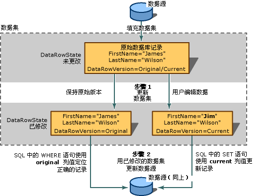

# 将数据保存在数据集中
保存数据就是将应用程序中的已更改数据保存回原始数据存储区（通常是关系数据库，如 SQL Server）的过程。  
  
 因为数据集是有效的数据缓存（数据在内存中的副本），所以将信息写入初始数据源的进程与在数据集中修改数据的进程是分开的。  通过调用 TableAdapter 的一个 `Update` 方法，或调用 TableAdapter 的一个 DBDirect 方法，可以将数据集中的已更新数据发送回数据库。  
  
 有关将数据集中的更改发送回数据集的更多信息，请参见[如何：使用 TableAdapter 更新数据](../data-tools/update-data-by-using-a-tableadapter.md)和[如何：将数据集更改保存到数据库中](../Topic/How%20to:%20Save%20Dataset%20Changes%20to%20a%20Database.md)。  
  
 Visual Studio 提供了一个 `TableAdapterManager` 组件，该组件可帮助您保存相关表中的数据。  此组件可确保按照数据库中定义的外键约束来以正确的顺序执行保存。  有关详细信息，请参阅[分层更新概述](../Topic/Hierarchical%20Update%20Overview.md)。  
  
 有关修改数据集中的数据的信息，请参见 [在应用程序中编辑数据](../data-tools/editing-data-in-your-application.md)。  
  
## 两步更新  
 通过数据集更新数据源是一个包含两个步骤的过程。  第一步是使用新信息（新记录、已更改的记录或已删除的记录）更新数据集。  如果您的应用程序只与数据集有关（例如在更新数据集后，将其发送给另一个应用程序，由它对数据集执行进一步处理），那么您就完成了更新。  
  
> [!NOTE]
>  在 Windows 窗体中，数据绑定结构负责将更改从数据绑定控件发送到数据集，您不必用自己的代码显式更新数据集。  有关详细信息，请参阅[Windows 窗体数据绑定](../Topic/Windows%20Forms%20Data%20Binding.md)。  
  
 如果您正在更新数据源（如数据库），第二步则是将更改从数据集发送到初始数据源。  也就是说，更新数据集的过程不会同时将更改直接写入基础数据源，所以您必须显式执行第二步。  为了完成这一步骤，您通常会调用曾用来填充数据集的同一个 TableAdapter（或数据适配器）的 Update 方法（虽然您也可以使用不同的适配器，例如为了将数据从一个数据源移动到另一个数据源或更新多个数据源）。  
  
   
两步更新过程和 DataRowVersion 在成功更新中的作用  
  
 在结构上，数据集使数据可以作为多组集合来使用。  数据集包含表的集合。  表包含行的集合。  表公开为 <xref:System.Data.DataSet> 对象的集合，记录在 <xref:System.Data.DataTable> 对象的 <xref:System.Data.DataTable.Rows%2A> 集合中可用。  您可以通过使用基集合方法操作这些集合来对数据集中的数据进行更改，但是如果您要更新基础数据源，则必须使用专用于数据集修改的方法。  
  
 例如，要从数据表中移除一个记录，可以调用该表的 <xref:System.Data.DataTable.Rows%2A> 集合的 [RemoveAt 方法](https://msdn.microsoft.com/en-us/library/system.data.datarowcollection.removeat.aspx)，它会从数据集中实际删除该记录。  如果您只是将数据集用作数据的结构化存储区，而不考虑将更改信息传送到另一个应用程序，那么以这种方式操作集合就是一种可以接受的数据集更新方式。  
  
 但是，如果您要将更改发送到数据源或另一个应用程序，则需要维护有关每次更新的更改信息（即元数据）。  随后，在将更改发送到数据源或应用程序时，该过程将使用它所需的信息来查找和更新适当的记录。  例如，如果删除数据集中的一个记录，则必须在数据集中维护有关该删除记录的信息。  这样，当调用 TableAdapter 的 `DeleteCommand` 时，就会有足够的历史信息来查找数据源中的初始记录，从而可将其删除。  有关更多信息，请参见下面的“维护有关更改的信息”。  
  
## 合并数据集  
 您可以通过合并来更新数据集的内容，合并就是将称作“源”的数据集的内容复制到调用数据集（称作“目标”数据集）中。  当合并数据集时，源数据集中的新记录将添加到目标数据集中。  另外，源数据集中额外的列也会添加到目标数据集中。  当您具有一个本地数据集然后又从另一个应用程序或组件（如 XML Web services）获得另外一个数据集时，合并数据集就会特别有用。  在需要集成来自多个数据集中的数据时，它也十分有用。  
  
 合并数据集时，还可以传递一个可选的布尔型参数 \(`preserveChanges`\)，它指示 <xref:System.Data.DataSet.Merge%2A> 方法是否在目标数据集中保留现有的修改。  由于数据集维护记录的多个版本，所以务必要记住所合并的是记录的多个版本。  下表阐释了将要合并的两个数据集中的一个记录：  
  
|DataRowVersion|目标数据集|源数据集|  
|--------------------|-----------|----------|  
|Original|James Wilson|James C.  Wilson|  
|当前|Jim Wilson|James C.  Wilson|  
  
 在 `preserveChanges=false targetDataset.Merge(sourceDataset)` 的情况下，对上表调用 <xref:System.Data.DataSet.Merge%2A> 方法将产生以下结果：  
  
|DataRowVersion|目标数据集|源数据集|  
|--------------------|-----------|----------|  
|Original|James C.  Wilson|James C.  Wilson|  
|当前|James C.  Wilson|James C.  Wilson|  
  
 在 `preserveChanges = true targetDataset.Merge(sourceDataset, true)` 的情况下调用 <xref:System.Data.DataSet.Merge%2A> 方法将产生以下结果：  
  
|DataRowVersion|目标数据集|源数据集|  
|--------------------|-----------|----------|  
|Original|James C.  Wilson|James C.  Wilson|  
|当前|Jim Wilson|James C.  Wilson|  
  
> [!CAUTION]
>  在 `preserveChanges = true` 的情况下，如果对目标数据集中的记录调用 <xref:System.Data.DataSet.RejectChanges%2A> 方法，它将还原为源数据集中的初始数据。  这意味着如果您要用目标数据集更新初始数据源，则可能无法找到要更新的初始行。  但是，通过用数据源中已更新的记录填充另一个数据集，然后执行防止并发冲突的合并，可以防止出现并发冲突。（当另一个用户在数据集被填充后修改数据源中的记录时，会发生并发冲突。）  
  
## 更新约束  
 要对现有的数据行进行更改，可以在个别列中添加或更新数据。  如果数据集包含约束（例如外键或不可为 null 的约束），那么当您更新记录时（在更新完一列之后，但在开始更新下一列之前），记录可能会暂时处于错误状态。  
  
 为了避免这种早产的约束冲突，可以暂时挂起更新约束。  这可达到两个目的：  
  
-   防止在更新完一列后，开始更新另一列之前引发错误。  
  
-   暂停引发某些更新事件（常用于冲突的事件）。  
  
 完成更新后，可以重新启用约束检查，约束检查还重新启用更新事件并引发它们。  
  
> [!NOTE]
>  在 Windows 窗体中，内置在数据网格中的数据绑定结构会暂停约束检查，直到焦点移出行外为止，因此您不必显式调用 <xref:System.Data.DataRow.BeginEdit%2A>、<xref:System.Data.DataRow.EndEdit%2A> 或 <xref:System.Data.DataRow.CancelEdit%2A> 方法。  
  
 当对数据集调用 <xref:System.Data.DataSet.Merge%2A> 方法时，将自动禁用约束。  当合并完成后，如果数据集上有任何无法启用的约束，则引发 <xref:System.Data.ConstraintException>。  在这种情况下，<xref:System.Data.DataSet.EnforceConstraints%2A> 属性将设置为 `false`，并且在将 <xref:System.Data.DataSet.EnforceConstraints%2A> 属性重新设置为 `true` 之前，必须解决所有约束冲突。  
  
 完成更新后，可以重新启用约束检查，约束检查还重新启用更新事件并引发它们。  
  
 有关暂停事件的更多信息，请参见[如何：在填充数据集时关闭约束](../data-tools/turn-off-constraints-while-filling-a-dataset.md)。  
  
## 数据集更新错误  
 当更新数据集中的记录时，可能出现错误。  例如，您可能在无意中将数据类型错误、太长或具有某些其他完整性问题的数据写入一个列中。  此外，您可能拥有应用程序特定的验证检查，它们可在更新事件的任何阶段引发自定义的错误。  有关详细信息，请参阅[验证数据集中的数据](../data-tools/validate-data-in-datasets.md)。  
  
## 维护有关更改的信息  
 有关数据集中更改的信息可以通过以下两种方式来进行维护：通过对行进行标记，指示该行是否已更改 \(<xref:System.Data.DataRow.RowState%2A>\)；以及通过保留记录的多个副本 \(<xref:System.Data.DataRowVersion>\)。  利用这些更改信息，进程可以确定数据集中有哪些更改，并且可以将适当的更新发送到数据源。  
  
### RowState 属性  
 <xref:System.Data.DataRow> 对象的 <xref:System.Data.DataRow.RowState%2A> 属性是一个值，它提供有关特定数据行状态的信息。  
  
 下表详细说明 <xref:System.Data.DataRowState> 枚举的可能值：  
  
|DataRowState 值|描述|  
|--------------------|--------|  
|<xref:System.Data.DataRowState>|该行已作为一项添加到 <xref:System.Data.DataRowCollection>。（处于这种状态的行不具有相应的初始版本，因为在最近一次调用 <xref:System.Data.DataRow.AcceptChanges%2A> 方法时它尚不存在）。|  
|<xref:System.Data.DataRowState>|已使用 <xref:System.Data.DataRow> 对象的 <xref:System.Data.DataRow.Delete%2A> 删除了该行。|  
|<xref:System.Data.DataRowState>|已创建该行，但它不是任何 <xref:System.Data.DataRowCollection> 的一部分。  在 <xref:System.Data.DataRow> 对象刚创建之后但在添加到集合之前，或者如果该对象已从集合中移除，它将处于这种状态。|  
|<xref:System.Data.DataRowState>|该行中的列值已通过某种方式更改。|  
|<xref:System.Data.DataRowState>|自上一次调用 <xref:System.Data.DataRow.AcceptChanges%2A> 之后，该行未更改。|  
  
### DataRowVersion 枚举  
 数据集维护记录的多个版本。  <xref:System.Data.DataRow> 对象的 <xref:System.Data.DataRowVersion> 枚举是一个值，它可用于返回 <xref:System.Data.DataRow> 对象的特定版本。  
  
 下表详细说明 <xref:System.Data.DataRowVersion> 枚举的可能值：  
  
|DataRowVersion 值|描述|  
|----------------------|--------|  
|<xref:System.Data.DataRowVersion>|记录的当前版本包含自上次调用 <xref:System.Data.DataRow.AcceptChanges%2A> 后对记录执行的所有修改。  如果该行已被删除，则没有当前版本。|  
|<xref:System.Data.DataRowVersion>|记录的默认值，如数据集架构或数据源所定义的一样。|  
|<xref:System.Data.DataRowVersion>|记录的初始版本是在数据集中最后一次提交更改时记录的副本。  实际上，它通常是从数据源中读取的记录版本。|  
|<xref:System.Data.DataRowVersion>|更新过程当中（即在调用 <xref:System.Data.DataRow.BeginEdit%2A> 方法和调用 <xref:System.Data.DataRow.EndEdit%2A> 方法之间）临时可用的记录的建议版本。  通常在事件（例如 <xref:System.Data.DataTable.RowChanging>）处理程序中访问记录的建议版本。  调用 <xref:System.Data.DataRow.CancelEdit%2A> 方法将撤消更改并删除数据行的建议版本。|  
  
 当更新信息传送到数据源时，初始版本和当前版本十分有用。  通常，当更新被发送到数据源时，数据库的新信息处于记录的当前版本中。  来自初始版本的信息用于查找要更新的记录。  例如，在更改了记录主键的情况下，为了将该更改更新到数据源，必须通过某种方式在数据源中查找适当的记录。  如果不存在初始版本，则很可能会将该记录追加到数据源，这不仅会导致一项额外的多余记录，而且还会导致一条不准确并且已过期的记录。  这两个版本也用于并发控制；您可以将初始版本与数据源中的记录进行比较，以确定该记录自加载到数据集之后是否经过更改。  
  
 当您需要在将更改实际提交到数据集之前执行验证时，可以使用建议版本。  
  
 即使记录已更改，也不总会有该行的初始版本或当前版本。  当您将新行插入表中时，没有初始版本，只有当前版本。  同样，如果通过调用表的 `Delete` 方法删除一行，则只有初始版本，没有当前版本。  
  
 您可以通过查询数据行的 <xref:System.Data.DataRow.HasVersion%2A> 方法，来测试记录的某个特定版本是否存在。  当请求列的值时，通过将 <xref:System.Data.DataRowVersion> 枚举值作为可选参数进行传递，可以访问记录的任何一个版本。  
  
## 获取已更改的记录  
 通常，不会对数据集中的每个记录进行更新。  例如，用户可能正在处理一个显示很多记录的 Windows 窗体 <xref:System.Windows.Forms.DataGridView> 控件。  但是，用户可能只更新了几个记录，删除了一个记录，并插入了一个新记录。  数据集和数据表提供了一种只返回已修改行的方法 \(`GetChanges`\)。  
  
 可以使用数据表的 `GetChanges` 方法 \(<xref:System.Data.DataTable.GetChanges%2A>\) 或数据集本身的该方法 \(<xref:System.Data.DataSet.GetChanges%2A>\) 来创建已更改记录的子集。  如果对数据表调用该方法，它将返回只包含已更改记录的数据表副本。  同样，如果对数据集调用该方法，将获得一个新的数据集，其中只包含已更改的记录。  `GetChanges` 本身将返回所有已更改的记录。  然而，通过将所需的 <xref:System.Data.DataRowState> 作为参数传递给 `GetChanges` 方法，则可以指定所需的更改记录子集：新添加的记录、标记为删除的记录、分离的记录或已修改的记录。  
  
 当需要将记录发送给另一个组件进行处理时，获取已更改记录的子集非常有用。  通过只获取该组件所需的记录而不是发送整个数据集，可以降低与其他组件通信的系统开销。  有关详细信息，请参阅[如何：检索已更改的行](../Topic/How%20to:%20Retrieve%20Changed%20Rows.md)。  
  
## 提交数据集中的更改  
 当在数据集中做出更改时，即设置了所更改行的 <xref:System.Data.DataRow.RowState%2A> 属性。  此时将建立并维护记录的初始版本和当前版本，并通过 <xref:System.Data.DataRowView.RowVersion%2A> 属性供您使用。  要将适当的更新发送给数据源，需要使用存储在这些属性中表示更改的元数据。  
  
 如果更改反映了数据源的当前状态，则不再需要维护该信息。  通常，数据集及其数据源在以下两个时间是同步的：  
  
-   刚刚将信息加载到数据集之后，例如从数据源读取数据时。  
  
-   将更改从数据集发送到数据源之后（但不是在这之前，因为您可能丢失将更改发送到数据库所需的更改信息）。  
  
 通过调用 <xref:System.Data.DataSet.AcceptChanges%2A> 方法，可以将挂起的更改提交到数据集。  通常，在以下时间将在应用程序中调用 <xref:System.Data.DataSet.AcceptChanges%2A>。  
  
-   在加载数据集之后。  如果通过调用 TableAdapter 的 `Fill` 方法来加载数据集，该适配器将自动为您提交更改。  但是，如果通过将另一个数据集合并到其中来加载数据集，则必须手动提交更改。  
  
    > [!NOTE]
    >  通过将适配器的 `AcceptChangesDuringFill` 属性设置为 `false`，可以防止在调用 `Fill` 方法时适配器自动提交更改。  如果它设置为 `false`，则在填充过程中插入的每行的 <xref:System.Data.DataRow.RowState%2A> 都将设置为 <xref:System.Data.DataRowState>。  
  
-   在将数据集更改发送到另一个进程（例如 XML Web service）之后。  
  
    > [!CAUTION]
    >  以这种方法提交更改会清除所有更改信息。  在执行应用程序确信已知在数据集中作出何种更改的任何操作之前，请不要提交更改。  
  
 该方法完成以下操作：  
  
-   将记录的 <xref:System.Data.DataRowVersion> 版本写入其 <xref:System.Data.DataRowVersion> 版本，以覆盖初始版本。  
  
-   移除所有 <xref:System.Data.DataRow.RowState%2A> 属性设置为 <xref:System.Data.DataRowState> 的行。  
  
-   将某一记录的 <xref:System.Data.DataRow.RowState%2A> 属性设置为 <xref:System.Data.DataRowState>。  
  
 <xref:System.Data.DataSet.AcceptChanges%2A> 方法可以在三个级别上使用。  可以对 <xref:System.Data.DataRow> 对象调用该方法，它只提交该行的更改。  还可以对 <xref:System.Data.DataTable> 对象调用该方法，以提交表中所有行的更改，或者对 <xref:System.Data.DataSet> 对象调用该方法，以提交数据集中所有表的所有记录的所有挂起的更改。  
  
 下表基于对何种对象调用该方法说明所提交的更改。  
  
|方法|结果|  
|--------|--------|  
|<xref:System.Data.DataRow.AcceptChanges%2A?displayProperty=fullName>|只提交特定行的更改|  
|<xref:System.Data.DataTable.AcceptChanges%2A?displayProperty=fullName>|提交特定表中所有行的更改|  
|<xref:System.Data.DataSet.AcceptChanges%2A?displayProperty=fullName>|提交数据集中所有表的所有行的更改|  
  
> [!NOTE]
>  如果通过调用 TableAdapter 的 `Fill` 方法加载数据集，则无需显式接受更改；默认情况下，`Fill` 方法会在填充完数据表后调用 `AcceptChanges` 方法。  
  
 相关方法 `RejectChanges` 撤消更改的影响，方法是将记录的 <xref:System.Data.DataRowVersion> 版本复制回 <xref:System.Data.DataRowVersion> 版本中，并将每个记录的 <xref:System.Data.DataRow.RowState%2A> 设置回 <xref:System.Data.DataRowState>。  
  
## 数据验证  
 为了验证应用程序中的数据符合它将传递到的进程的要求，通常需要添加验证。  这可能会涉及到检查用户在窗体中的输入是否正确，验证另一个应用程序向您的应用程序发送的数据，甚至检查在您的组件中计算的信息是否符合数据源约束和应用程序要求。  
  
 您可以通过多种方法验证数据：  
  
-   在业务层，将代码添加到应用程序中以便验证数据。  数据集是可以执行此操作的一个位置。  数据集提供了后端验证的某些优点，例如能够在更改列和行值时验证更改。  有关详细信息，请参阅[验证数据集中的数据](../data-tools/validate-data-in-datasets.md)。  
  
-   在表示层，向窗体添加验证。  有关详细信息，请参阅[Windows 窗体中的用户输入验证](../Topic/User%20Input%20Validation%20in%20Windows%20Forms.md)。  
  
-   在数据后端，将数据发送到数据源（例如数据库）并允许它接受或拒绝该数据。  如果您正在使用一个数据库，而该数据库具有复杂的功能来验证数据并提供错误信息，则这将是一种实用的方法，因为无论数据来自何处，您都可以对数据进行验证。  但是，它可能不适合应用程序特定的验证的需要。  另外，根据您的应用程序如何解决由后端引发的验证错误，让数据源验证数据可能导致大量到数据源的往返过程。  
  
    > [!IMPORTANT]
    >  在使用将 <xref:System.Data.SqlClient.SqlCommand.CommandType%2A> 属性设置为 <xref:System.Data.CommandType> 的数据命令时，将从客户端发送的信息传递到数据库前请仔细检查该信息。  恶意用户可能会尝试发送（插入）修改过的或其他 SQL 语句，以获得未经授权的访问或破坏数据库。  在将用户输入内容传输到数据库之前，应始终确认这些信息是有效的；如果可能的话，请始终使用参数化查询或存储过程，这是最佳做法。  有关详细信息，请参阅[Script Exploits Overview](../Topic/Script%20Exploits%20Overview.md)。  
  
 当在数据集中作出更改之后，可以将更改传递给数据源。  完成此操作时最常用的方法是调用 TableAdapter（或数据适配器）的 `Update` 方法。  该方法依次通过数据表中的每个记录，确定需要什么类型的更新（更新、插入或删除），然后执行适当的命令（如果有）。  
  
## 如何将更新传递给数据源  
 为了阐释如何进行更新，假设您的应用程序使用一个包含单个数据表的数据集。  该应用程序从数据库中获取两行。  在检索之后，内存中的数据表类似于下面这样：  
  
```  
(RowState)     CustomerID   Name             Status  
(Unchanged)    c200         Robert Lyon      Good  
(Unchanged)    c400         Nancy Buchanan    Pending  
```  
  
 应用程序将 Nancy Buchanan 的状态更改为“Preferred”。作为这种更改的结果，该行的 <xref:System.Data.DataRow.RowState%2A> 属性的值从 <xref:System.Data.DataRowState> 更改为 <xref:System.Data.DataRowState>。  第一行的 <xref:System.Data.DataRow.RowState%2A> 属性的值保持为 <xref:System.Data.DataRowState>。  数据表现在类似于下面这样：  
  
```  
(RowState)     CustomerID   Name             Status  
(Unchanged)    c200         Robert Lyon      Good  
(Modified)     c400         Nancy Buchanan    Preferred  
```  
  
 应用程序现在调用 `Update` 方法，将数据集传送给数据库。  该方法依次检查每一行。  对于第一行，由于它从最初取自数据库后未经过更改，所以该方法不向数据库传送任何 SQL 语句。  
  
 但是对于第二行，`Update` 方法将自动调用适当的数据命令并将其传送给数据库。  SQL 语句的具体语法取决于基础数据存储区所支持的 SQL 语言分支。  但所传送的 SQL 语句具有下列值得注意的一般特征：  
  
-   所传送的 SQL 语句是一个 UPDATE 语句。  因为 <xref:System.Data.DataRow.RowState%2A> 属性的值为 <xref:System.Data.DataRowState>，所以适配器知道应使用 UPDATE 语句。  
  
-   所传送的 SQL 语句包含一个 WHERE 子句，它指示 UPDATE 语句的目标是 `CustomerID = 'c400'` 的行。  由于 `CustomerID` 是目标表的主键，SELECT 语句的这一部分会将目标行与其他所有行区分开来。  WHERE 子句的信息是从记录 \(`DataRowVersion.Original`\) 的初始版本导出的，以备在识别行所需的值已被更改的情况下使用。  
  
-   所传送的 SQL 语句包含 SET 子句，用以设置已修改列的新值。  
  
    > [!NOTE]
    >  如果 TableAdapter 的 `UpdateCommand` 属性已设置为存储过程的名称，则适配器不会构造 SQL 语句。  而是使用传入的适当参数调用存储过程。  
  
## 传递参数  
 数据库中要更新的记录的值通常使用参数来进行传递。  当 TableAdapter 的 `Update` 方法执行 UPDATE 语句时，它需要填写参数值。  它从 `Parameters` 集合中为适当的数据命令（在本例中是 TableAdapter 中的 `UpdateCommand` 对象）获取这些值。  
  
 如果您已使用 Visual Studio 工具生成数据适配器，则 `UpdateCommand` 对象将包含一个参数集合，这些参数对应于语句中的每个参数占位符。  
  
 每个参数的 <xref:System.Data.SqlClient.SqlParameter.SourceColumn%2A?displayProperty=fullName> 属性都指向数据表中的一个列。  例如，`au_id` 和 `Original_au_id` 参数的 `SourceColumn` 属性设置为包含作者 ID 的数据表中的任意一列。  当适配器的 `Update` 方法运行时，它从所更新的记录中读取作者 ID 列，并将值填充到语句中。  
  
 在 UPDATE 语句中，您需要指定新值（将写入记录的值）和旧值（以便在数据库中查找要更新的记录）。  因此，每个值都有两个参数：一个用于 SET 子句，另一个则用于 WHERE 子句。  两个参数都从所更新的记录中读取数据，但根据参数的 [SqlParameter.SourceVersion 属性](https://msdn.microsoft.com/en-us/library/system.data.sqlclient.sqlparameter.sourceversion.aspx)，它们会获取该列值的不同版本。  SET 子句的参数获取当前版本，而 WHERE 子句的参数获取初始版本。  
  
> [!NOTE]
>  您还可以自己在代码中设置 `Parameters` 集合中的值，这通常是在数据适配器的 <xref:System.Data.DataTable.RowChanging> 事件的事件处理程序中进行的。  
  
## 更新相关表  
 如果数据集包含多个表，则必须通过分别调用每个数据适配器的 `Update` 方法来逐个更新这些表。  如果这些表具有父子关系，很可能需要以特定的顺序将更新发送到数据库。  常见的情况是已经将父记录和相关子记录添加到数据集中，例如一个新的客户记录及一个或多个相关的订单记录。  如果数据库本身强制关系完整性规则，那么当您在创建父记录之前将新的子记录发送到数据库时，数据库将引发错误。  
  
 相反，如果删除数据集中的相关记录，您通常需要以相反的顺序发送更新：先发送子表，然后发送父表。  否则，数据库很可能引发错误，因为引用完整性规则将阻止您在相关子记录仍存在的情况下删除父记录。  
  
 为相关表发送更新的一般规则遵循以下顺序：  
  
1.  子表：删除记录。  
  
2.  父表：插入、更新和删除记录。  
  
3.  子表：插入和更新记录。  
  
4.  有关详细信息，请参阅[演练：将数据保存到数据库（多个表）](../data-tools/save-data-to-a-database-multiple-tables.md)。  
  
## 并发控制  
 由于数据集与数据源是分开的，您并不持有数据源中记录上的锁。  因此，如果要更新数据库，并且如果维护并发控制对应用程序来说十分重要，则必须协调数据集中的记录和数据库中的记录。  例如，您可能发现数据库中的记录在上一次填充数据集之后已经更改。  在这种情况下，必须执行适合于应用程序的逻辑来指定如何处理数据库记录或数据集中已更改的记录。  
  
## 请参阅  
 [TableAdapter 概述](../data-tools/tableadapter-overview.md)   
 [如何：使用 TableAdapter 更新数据](../data-tools/update-data-by-using-a-tableadapter.md)   
 [Visual Studio 的数据应用程序概述](../data-tools/overview-of-data-applications-in-visual-studio.md)   
 [连接到 Visual Studio 中的数据](../data-tools/connecting-to-data-in-visual-studio.md)   
 [准备应用程序以接收数据](../Topic/Preparing%20Your%20Application%20to%20Receive%20Data.md)   
 [将数据获取到应用程序](../data-tools/fetching-data-into-your-application.md)   
 [在 Visual Studio 中将控件绑定到数据](../data-tools/bind-controls-to-data-in-visual-studio.md)   
 [在应用程序中编辑数据](../data-tools/editing-data-in-your-application.md)   
 [验证数据](../Topic/Validating%20Data.md)   
 [保存数据](../data-tools/saving-data.md)