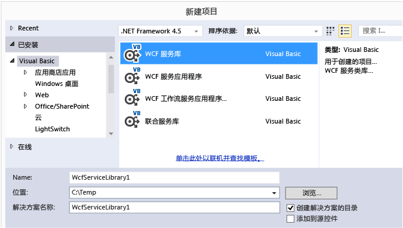
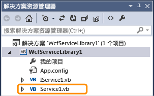
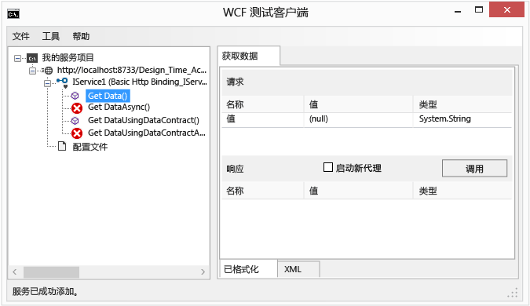
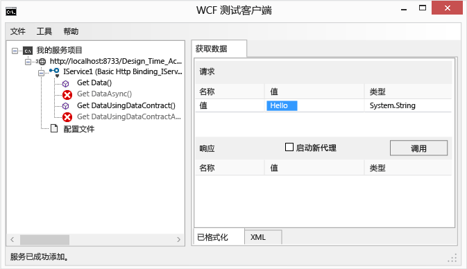
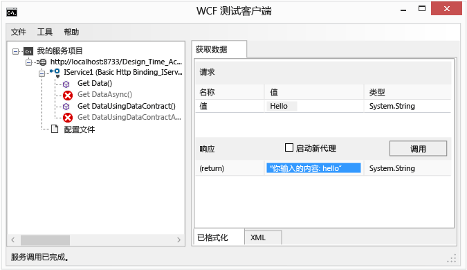
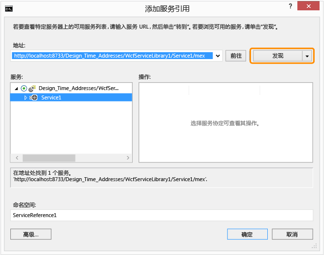
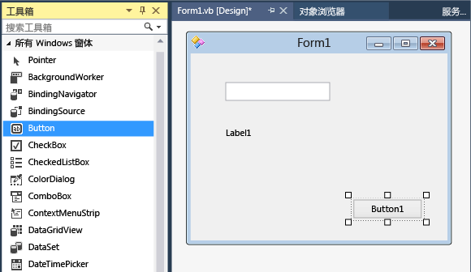

# Walkthrough: Creating and Accessing WCF Services
本演练演示如何创建一个简单[!INCLUDE[vsindigo](../data-tools/includes/vsindigo_md.md)]服务并进行测试，然后从 Windows 窗体应用程序访问它。  
  
 [!INCLUDE[note_settings_general](../data-tools/includes/note_settings_general_md.md)]  
  
## 创建服务  
  
#### 要创建 WCF 服务  
  
1.  在**“文件”**菜单上指向**“新建”**，然后单击**“项目”**。  
  
2.  在**新建项目**对话框中，展开 **Visual Basic** 或 **Visual C\#** 节点，然后单击 **WCF**，接着是 **WCF 服务库**。  单击**确定**打开项目。  
  
       
  
    > [!NOTE]
    >  这将创建可以测试和访问的工作服务。  以下两个步骤演示您可以如何修改使用不同数据类型的默认方法。  在实际应用中，您还会向服务中添加您自己的函数。  
  
3.    
  
     在解**决方案资源管理器**中、双击 IService1.vb 或 IService1.cs 并找到以下行：  
  
     [!code-cs[WCFWalkthrough#4](../data-tools/codesnippet/CSharp/walkthrough-creating-a-simple-wcf-service-in-windows-forms_1.cs)]
     [!code-vb[WCFWalkthrough#4](../data-tools/codesnippet/VisualBasic/walkthrough-creating-a-simple-wcf-service-in-windows-forms_1.vb)]  
  
     把`value`参数的类型更改为`String`：  
  
     [!code-cs[WCFWalkthrough#1](../data-tools/codesnippet/CSharp/walkthrough-creating-a-simple-wcf-service-in-windows-forms_2.cs)]
     [!code-vb[WCFWalkthrough#1](../data-tools/codesnippet/VisualBasic/walkthrough-creating-a-simple-wcf-service-in-windows-forms_2.vb)]  
  
     在上面的代码中，请注意`<OperationContract()>`或`[OperationContract]`属性。  这些属性是由服务公开的任何方法所必需的。  
  
4.    
  
     在**解决方案资源管理器**中、双击 Service1.vb 或 Service1.cs 并找到以下行：  
  
     [!code-vb[WCFWalkthrough#5](../data-tools/codesnippet/VisualBasic/walkthrough-creating-a-simple-wcf-service-in-windows-forms_3.vb)]
     [!code-cs[WCFWalkthrough#5](../data-tools/codesnippet/CSharp/walkthrough-creating-a-simple-wcf-service-in-windows-forms_3.cs)]  
  
     更改值参数类型为`String`：  
  
     [!code-cs[WCFWalkthrough#2](../data-tools/codesnippet/CSharp/walkthrough-creating-a-simple-wcf-service-in-windows-forms_4.cs)]
     [!code-vb[WCFWalkthrough#2](../data-tools/codesnippet/VisualBasic/walkthrough-creating-a-simple-wcf-service-in-windows-forms_4.vb)]  
  
## 正在测试服务  
  
#### 若要测试 WCF 服务  
  
1.  按 **F5** 运行该服务。  **WCF 测试客户端**窗体将显示，而且它将加载此服务。  
  
2.  在**WCF 测试客户端**窗体中，双击 **IService1** 下的 **GetData\(\)** 方法。  将显示 **GetData** 选项卡。  
  
       
  
3.  在**请求**框中，选择**值**字段，并键入`Hello`。  
  
       
  
4.  单击**调用**按钮。  如果显示**安全警告**对话框，请单击**确认**。  结果将显示在**响应**框中。  
  
       
  
5.  在**文件**菜单上单击**退出**关闭测试窗体。  
  
## 访问服务  
  
#### 若要引用 WCF 服务  
  
1.  在**文件**菜单上，指向**添加**，然后单击**新建项目**。  
  
2.  在**“新建项目”**对话框中，展开**“Visual Basic”**或**“Visual C\#”**节点，选择**“Windows”**，然后选择**“Windows 窗体应用程序”**。  单击**确定**打开项目。  
  
       
  
3.  右键单击 **WindowsApplication1** 并单击**添加服务引用**。  将显示**添加服务引用**对话框。  
  
4.  在**“添加服务引用”**对话框中，单击**“发现”**。  
  
       
  
     **Service1**将在**服务**窗格中显示。  
  
5.  单击**确定**添加服务引用。  
  
#### 要创建客户端应用程序。  
  
1.  在**解决方案资源管理器**中，双击 **Form1.vb** 或 **Form1.cs** 打开 Windows 窗体设计器，如果它未打开。  
  
2.  从**工具箱**把`TextBox`控件\/`Label`控件和`Button`控件拖到窗体中。  
  
       
  
3.  双击 `Button` 并将下面的代码添加到 `Click` 事件处理程序：  
  
     [!code-cs[WCFWalkthrough#3](../data-tools/codesnippet/CSharp/walkthrough-creating-a-simple-wcf-service-in-windows-forms_5.cs)]
     [!code-vb[WCFWalkthrough#3](../data-tools/codesnippet/VisualBasic/walkthrough-creating-a-simple-wcf-service-in-windows-forms_5.vb)]  
  
4.  在**解决方案资源管理器**中，右键单击**WindowsApplication1**，然后单击**设为启动项目**。  
  
5.  按 **F5** 运行该项目。  输入一些文本，然后单击按钮。  该标签将显示“输入：”和您输入的文本。  
  
       
  
## 请参阅  
 [使用 ASMX 和 WCF 服务示例](http://msdn.microsoft.com/zh-cn/788ddf2c-2ac1-416b-8789-2fbb1e29b8fe)