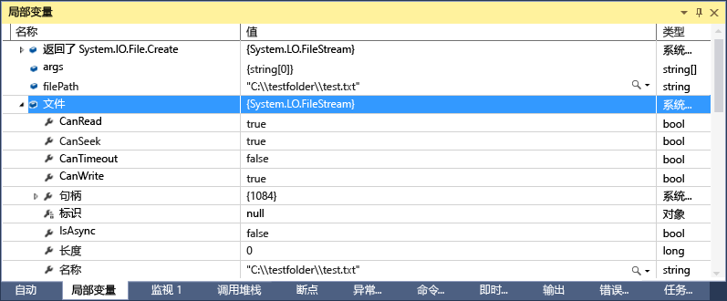
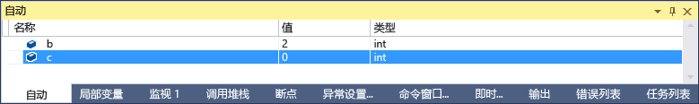
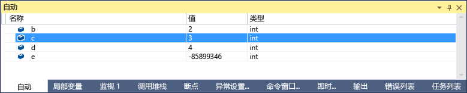
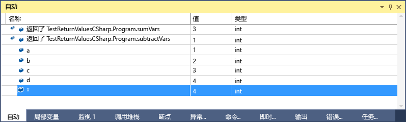

# “自动”和“局部变量”窗口
[!INCLUDE[vs2017banner](../code-quality/includes/vs2017banner.md)]

当你希望在进行调试的过程中查看变量的值时，**“自动”**窗口（在调试过程中，按 **Ctrl\+Alt\+V, A**，或者通过“调试\/窗口\/自动”）和**“局部变量”**窗口（在调试过程中，按 **Ctrl\+Alt\+V, L**，或者通过“调试\/窗口\/局部变量”）是非常有用的。 “局部变量”窗口显示在本地范围内定义的变量，它们通常为当前正在执行的函数或方法。**“自动”**窗口显示在当前行（调试器停止的位置）周围使用的变量。 具体显示哪些变量因不同的语言而异。 看到“自动”窗口中显示了哪些变量？ 下方。  
  
 若需了解基本调试的详细信息，请参阅[调试器入门](../debugger/getting-started-with-the-debugger.md)。  
  
## 查看“自动”和“局部变量”窗口中的对象  
 数组和对象在“自动”和“局部变量”窗口中显示为树控件。 单击变量名称左侧的箭头以展开显示字段和属性的视图。 以下是**“局部变量”**窗口中的 [FileStream](../Topic/FileStream%20Class.md) 对象的示例：  
  
   
  
## “自动”窗口中显示了哪些变量？  
 你可以在 C\#、Visual Basic 和 C\+\+ 代码中使用**“自动”**窗口。**“自动”**窗口不支持 JavaScript 或 F\#。  
  
 在 C\# 和 Visual Basic 中，“自动”窗口显示当前或前一行中使用的任何变量。 例如，如果声明四个变量并对它们进行如下设置：  
  
```c#  
public static void Main() { int a, b, c, d; a = 1; b = 2; c = 3; d = 4; }  
```  
  
 如果在行 `c = 3` 上设置了断点并运行调试器，当执行停止时，“自动”窗口将如下所示：  
  
   
  
 注意，`c` 的值为 0，因为行 `c = 3` 尚未执行。  
  
 在 C\+\+ 中，“自动”窗口将显示当前行（执行停止的行）前面至少三行使用的变量。 如果声明了六个变量：  
  
```cpp  
void main() { int a, b, c, d, e, f; a = 1; b = 2; c = 3; d = 4; e = 5; f = 6; }  
```  
  
 如果在行 `e = 5;` 上设置了断点并运行调试器，当执行停止时，“自动”窗口将如下所示：  
  
   
  
 请注意，此变量未初始化，因为行  `e = 5;`  上的代码尚未执行。  
  
 在某些情况下，你还可以看到函数和方法的返回值。 请参阅下面的[查看方法调用的返回值](#bkmk_returnValue)。  
  
##  <a name="bkmk_returnValue"></a> 查看方法调用的返回值  
 在 .NET 和 C\+\+ 代码中，当你单步执行或单步跳出方法调用时，可以检查返回值。 当方法调用的结果未存储在局部变量中时（例如，当方法用作另一个方法的参数或返回值时），此功能很有用。  
  
 下面的 C\# 代码将添加两个函数的返回值：  
  
```c#  
static void Main(string[] args) { int a, b, c, d; a = 1; b = 2; c = 3; d = 4; int x = sumVars(a, b) + subtractVars(c, d); } private static int sumVars(int i, int j) { return i + j; } private static int subtractVars(int i, int j) { return j - i; }  
  
```  
  
 在 int `x = sumVars(a, b) + subtractVars(c, d);`  行上设置断点。  
  
 开始调试，且当执行在第一个断点处中断时，按 **F10（跳过）**。 你应在**“自动”**窗口中看到如下内容：  
  
   
  
## 为什么在“局部变量”窗口和“自动”窗口中变量值有时是红色的？  
 你可能注意到，在“局部变量”和“自动”窗口中一个变量的值有时是红色的。 这些是自上次评估以来更改过的变量值。 此更改可能是在上一次调试会话中进行的，或者是因为在窗口中更改了该值。  
  
## 更改变量窗口中的数字格式  
 默认数字格式为十进制，但你可以将其更改为十六进制。 在“局部变量”或“自动”窗口内右键单击，然后选择“十六进制显示”。 此更改将影响所有调试器窗口。  
  
## 在变量窗口中编辑值  
 你可以编辑“自动”、“局部变量”、“监视”和“快速监视”窗口中出现的大多数变量的值。 有关“监视”和“快速监视”窗口的信息，请参阅[监视和快速监视窗口](../debugger/watch-and-quickwatch-windows.md)。 只需双击要更改并添加新值的值。  
  
 你可以输入表达式作为一个值，例如 `a + b`。 调试器接受大多数合法的语言表达式。  
  
 在本机 C\+\+ 代码中，你可能需要限定变量名的上下文。 有关详细信息，请参阅 [上下文运算符 \(C\+\+\)](../debugger/context-operator-cpp.md)。  
  
 但是，更改值时应多加小心。 可能存在的问题如下：  
  
-   计算某些表达式可以更改变量的值，或会影响程序的状态。 例如，计算 `var1 = ++var2` 会更改 `var1` 和 `var2` 的值。  
  
     会更改数据的表达式被视为具有[副作用](https://en.wikipedia.org/wiki/Side_effect_\(computer_science\))，如果你不了解这些表达式，则会产生意外的结果。 因此，在进行更改前，请确保你了解此更改的后果。  
  
-   编辑浮点值时，由于要将小数部分从十进制转换为二进制，因此所得的结果可能存在微小误差。 即使看起来无关紧要的编辑都会导致浮点变量中某些最不重要的数据位发生变化。  
  
## “调试位置”工具栏  
 你可以使用“调试位置”工具栏来选择所需的函数、线程或进程。 设置断点并开始调试。 （如果看不到此工具栏，你可以通过单击工具栏区域的空白部分启用它。 你应当看到工具栏的列表；选择“调试位置”）。 当到达断点时，执行将停止，并且你可以看到“调试位置”工具栏，即下图的最后一行：  
  
   
  
 你还可以通过双击“调用堆栈”窗口、“线程”窗口或“进程”窗口中的元素，将上下文更改为其他函数调用、线程或进程。  
  
## 请参阅  
 [调试器窗口](../debugger/debugger-windows.md)