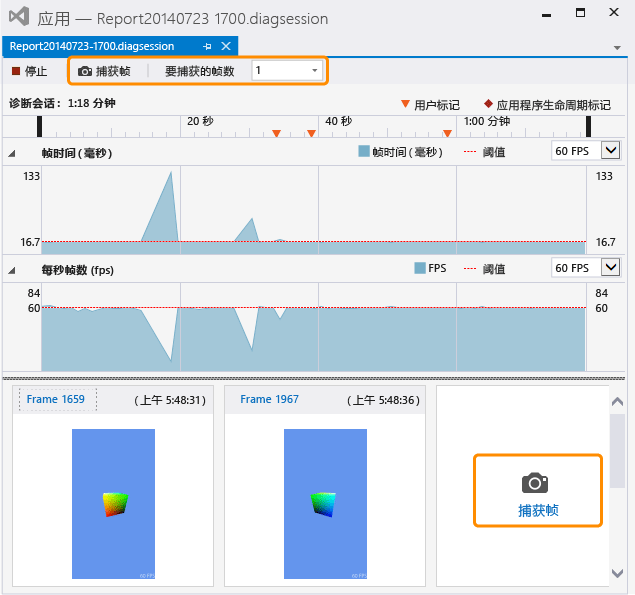

# 捕获图形信息
[!INCLUDE[vs2017banner](../code-quality/includes/vs2017banner.md)]

从 Direct3D 应用捕获图形信息，以便使用 Visual Studio 图形分析器来诊断呈现问题和性能问题。  
  
## 捕获图形信息  
 捕获图形信息的过程分为两步。  首先，在图形诊断下运行应用程序，然后指定要从中捕获详细信息的一个或多个帧。  
  
#### 在图形诊断下运行应用程序  
  
-   在菜单栏上，依次选择**“调试”**、**“图形”**、**“启动诊断”**。  （键盘：按 Alt\+F5）  
  
-   在**“图形”**工具栏上，选择**“启动诊断”**按钮。  
  
 当应用程序在图形诊断下运行时，将始终捕获某些类型的图形信息；这包括设备设置、交换链的创建、图形对象和资源的创建以及其他影响多个帧的重要事件。  同时，你可以捕获有关特定帧的详细信息；这包括绘图调用和计算着色器调度，以及支持它们的 Direct3D 对象和资源。  
  
#### 捕获帧  
  
-   在 Visual Studio 的**“图形”**工具栏上，选择**“捕获帧”**按钮。  
  
-   在键盘上，按 Print Screen。  
  
    > [!NOTE]
    >  当应用程序在**图形诊断**下运行时，Print Screen 键只能用于捕获图形信息的帧；不执行其常规功能。  这将一直有效，直到你停止捕获图形信息（通常通过停止调试或正常退出应用程序），即使另一应用程序具有焦点时也是如此。  
  
-   在 Visual Studio 捕获接口中，选择位于**诊断会话**时间线上方的**捕获帧**按钮，也可选择位于**每秒钟帧数**泳道下方和之前捕获到的帧右边的**捕获帧**按钮。  两个按钮均突出显示在下方的图像中。  
  
       
  
     当你准备检查已捕获的帧时，请单击图像缩略图上方的**“帧...”**链接启动**“Visual Studio 图形分析器”**，或通过双击该缩略图启动。  
  
 只能捕获整帧，因此当你启动捕获时，实际上将记录下一帧中的图形信息。  记录将在显示你从中启动捕获的帧后立即开始，在显示捕获的帧后结束。  应用程序在图形诊断下运行时，可以捕获你所需的多个帧。  如果未捕获任何帧，将丢弃图形日志。  
  
 捕获帧时，Visual Studio 将显示诊断会话 \(.diagsession\) 窗口。  如果关闭此窗口、停止调试或关闭应用，则无法继续将任何帧捕获到该日志。  要捕获更多图形信息，必须在图形诊断下再次运行应用以启动新的诊断会话。  
  
### 图形诊断捕获选项  
 你可以通过配置捕获来收集所有图形事件或有限子集的调用堆栈，禁用捕获 HUD，也可以启用或禁用捕获兼容模式。  
  
##### 配置图形诊断捕获选项  
  
1.  在菜单栏上，依次选择“工具”、“选项”。  这时会显示一个“选项”对话框。  
  
2.  在左侧的选项类别列表中选择“图形诊断”，然后配置所需的“图形诊断”选项。  
  
     **在捕获过程中收集调用堆栈（将使捕获速度变慢）**  
     选中该复选框以收集调用堆栈。  默认情况下，不会收集调用堆栈。  要捕获调用堆栈，请确保将**“在捕获过程中收集调用堆栈（将使捕获速度变慢）”**复选框设置为启用收集，然后设置**“用于绘制、调度、呈现和性能标记”**选项（默认值）以便仅收集最重要的调用堆栈，或设置**“用于全部”**选项以便收集所有调用堆栈。  如果稍后要停止收集调用堆栈，请清除**“在捕获过程中收集调用堆栈（将使捕获速度变慢）”**复选框。  
  
     **捕获过程中禁用游戏中的 HUD**  
     选中此框以禁用在图形诊断下运行的应用通常会显示的 HUD 覆盖。  取消选中以显示 HUD 覆盖。  
  
     **在兼容性模式下捕获**  
     选中此框以在兼容模式下捕获图形信息。  在兼容模式下捕获是默认设置。  在兼容模式下，Direct3D 不会报告 GPU 会支持基本功能级别中所定义的功能范围以外的任何其他功能。  这样可以防止使用特定于硬件的 GPU 扩展将应用捕获到这个 GPU 上，同时确保图形日志可以通过任何支持相同或更高功能级别的 GPU 进行播放。  取消选中此框可禁用兼容模式；兼容模式被禁用时所捕获的日志将不能在任何不支持与应用程序在捕获期间使用的其他功能相同的功能的 GPU 上播放。  
  
     **如果发现任何 SDK \_layers 错误则停止捕获**  
     选中此框以便在遇到错误时立即停止捕获。  
  
## 远程捕获图形信息  
 可以从本地计算机或者远程计算机或设备上运行的应用程序捕获图形信息。  [!INCLUDE[winblue_client_2](../debugger/includes/winblue_client_2_md.md)] 计算机和 [!INCLUDE[winblue_winrt_2](../debugger/includes/winblue_winrt_2_md.md)] 设备支持远程捕获。  若要从远程运行的应用程序捕获图形信息，请配置你的项目以进行远程调试，然后如之前所述，在图形诊断下运行应用程序。  应用程序在远程计算机上运行，捕获的图形信息将记录在你的开发计算机上。  
  
 配置项目以进行远程调试的方式取决于你开发的应用程序类型以及你使用的编程语言。  有关如何为 Windows 应用商店应用配置远程调试的信息，请参阅[在远程计算机上运行 Windows 应用商店应用](../debugger/run-windows-store-apps-on-a-remote-machine.md)。  有关如何为 Windows 桌面应用配置远程调试的信息，请参阅[为 Visual Studio 项目设置远程调试](../Topic/Set%20Up%20Remote%20Debugging%20for%20a%20Visual%20Studio%20Project.md)。  
  
 之后，可以使用远程计算机或设备播放图形信息，而无论信息从何处捕获。  有关详细信息，请参阅[如何：更改图形诊断播放机](../debugger/how-to-change-the-graphics-diagnostics-playback-machine.md)。  
  
## 从命令行捕获图形信息  
 可使用命令行工具从应用捕获图形信息。  DXCap.exe 这一工具可以快速捕获和播放图形信息，而不使用 Visual Studio 或编程捕获。  具体而言，你可以使用 DXCap.exe 来实现自动化，或在测试环境中使用。  有关 DXCap.exe 的详细信息，请参阅[命令行捕获工具](../debugger/command-line-capture-tool.md)  
  
## 请参阅  
 [演练：捕获图形信息](../debugger/walkthrough-capturing-graphics-information.md)