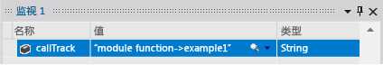
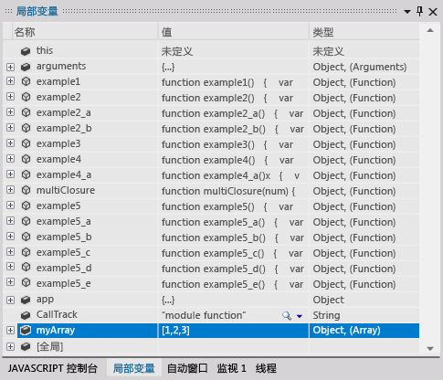
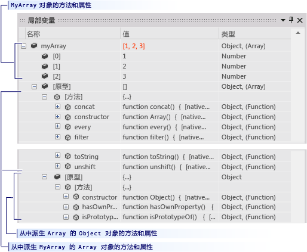
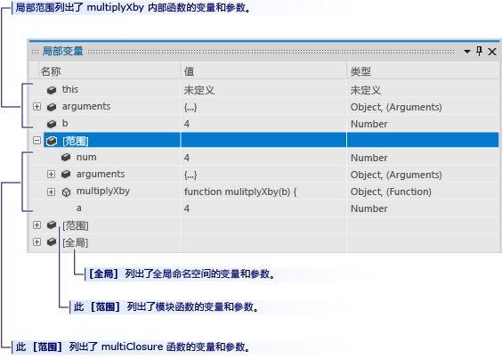

# 在 Windows 应用商店应用的 Visual Studio 调试会话中控制应用商店应用的执行 (JavaScript)
[!INCLUDE[vs2017banner](../code-quality/includes/vs2017banner.md)]

本快速入门介绍了如何在 Visual Studio 调试器中进行导航以及如何在会话中查看程序状态。  
  
 本快速入门适用于刚开始使用 Visual Studio 进行调试的开发人员以及要详细了解 Visual Studio 调试会话中的导航的开发人员。 它并不讲解调试本身的技巧。 示例代码中的函数仅用于演示本主题中所述的调试过程。 这些函数并未采用应用或函数设计的最佳实践。 事实上，你很快就会发现这些函数（以及应用本身）完全没什么太多作用。  
  
 本快速入门的各部分设计为尽可能独立，因此你可以跳过任何包含已熟悉的信息的部分。 也不需要创建示例应用。 然而，我们也确实建议这样做，以尽可能简化过程。  
  
 **调试器键盘快捷方式。**Visual Studio 调试器中的导航同时针对鼠标和键盘进行了优化。 本主题中的许多步骤都在括号备注中包含键盘加速器或快捷键。 例如，（键盘：F5）指示按 F5 键可启动或继续调试器的执行。  
  
> [!NOTE]
>  **模块模式**  
>   
>  Windows 应用商店应用通常使用 JavaScript *模块模式*来封装某个页面的数据和函数。 模块模式使用一个自执行的匿名闭包将页面功能与全局命名空间相分离。 在本主题中，我们将该函数称为 *module*  
  
## 主题内容  
 你可以学习如何：  
  
 [创建示例应用](#BKMK_Create_the_sample_app)  
  
 [设置和运行到断点、单步执行函数以及检查程序数据](#BKMK_Set_and_run_to_a_breakpoint__step_into_a_function__and_examine_program_data)  
  
 [单步执行、逐过程执行和跳出执行函数](#BKMK_Step_into__over__and_out_of_functions)  
  
 [设置条件断点、运行到光标处以及可视化变量](#BKMK_Set_a_conditional_breakpoint__run_to_the_cursor__and_visualize_a_variable)  
  
 [在“局部变量”窗口中查看变量数据](#BKMK_View_variable_data_in_the_Locals_window)  
  
-   [查看对象的变量的数据和原型链](#BKMK_View_variable_data_and_the_prototype_chain_of_an_object)  
  
-   [检查作用域链数据](#BKMK_Examine_scope_chain_data)  
  
 [使用“调用堆栈”窗口导航到代码](#BKMK_Navigate_to_code_by_using_the_Call_Stack_window)  
  
##   创建示例应用  
 调试与代码有关，因此示例应用使用 Windows 应用商店应用的框架只是为了创建一个源文件，在该文件中可以查看调试会话导航的工作方式以及如何检查程序状态。 将调用的所有代码均从 default.js 文件的 `module` 函数进行调用。 不添加任何控件，并且不处理任何事件。  
  
1.  **创建空白 JavaScript Windows 应用商店应用。**打开 Visual Studio。 在主页上，选择**“新建项目”**链接。 在“新建项目”对话框中，在“已安装”列表中选择“JavaScript”，然后选择“Windows 应用商店”。 在项目模板列表中，选择“空白应用程序”。 Visual Studio 随即创建一个新解决方案和项目，并在代码编辑器中显示 default.htm 文件。  
  
     请注意加载到页面中的脚本文件。  
  
    -   `base.js` 和 `ui.js` 文件用于创建 **Windows JavaScript 库**。 Windows JavaScript 库是一组 JavaScript 和 CSS 文件，通过这组文件，可更简便地创建使用 JavaScript 的 Windows 应用商店应用。 请将它与 HTML、CSS 和 Windows 运行时配合使用以创建应用。  
  
    -   代码在 `default.js`  文件中启动。  
  
2.  **打开 default.js 源文件。**在解决方案资源管理器中，打开“js”节点，然后选择 `default.js`。  
  
3.  **将页面内容替换为示例代码。**从 `default.js` 文件中删除所有内容。 访问以下链接：[调试器导航示例代码 \(JavaScript\)](../debugger/debugger-navigation-sample-code-javascript.md)，然后将 JavaScript 分中列出的代码复制到剪贴板上。 （在浏览器或帮助查看器中选择**“返回”**以返回此快速入门页。） 在 Visual Studio 编辑器中，将代码粘贴到当前为空的 `default.js` 中。 选择“Ctrl\+ S”以保存文件。  
  
 现在可以遵循本主题中的示例进行操作。  
  
##   设置和运行到断点、单步执行函数以及检查程序数据  
 用于启动调试会话的最常见方法是从“调试” 菜单中选择“启动调试”（键盘：F5） 应用随即启动并一直继续执行到达到断点、手动挂起执行、发生异常或应用结束。  
  
 当在调试器中挂起执行时，可以通过将鼠标悬停在变量上方，在数据提示中查看活动变量的值。  
  
 挂起应用的执行（这也称为中断到调试器中）之后，可以控制其余程序代码的执行方式。 可以逐行继续执行（从一个函数调用移动到该函数本身），也可以单步执行调用的函数。 这些过程称为逐步执行应用。 还可以继续应用的标准执行，从而运行到设置的下一个断点，或运行到放置光标的行。 可以随时停止调试会话。 调试器设计为可执行必要的清理操作并退出执行。  
  
###   示例 1  
 在此示例中，在 `default.js` 的 `module` 函数体中设置断点，因为它调用我们第一个用户语句。 随后单步执行函数，在调试器数据提示中查看变量值，然后停止调试。  
  
1.  **设置断点。**在调用 `app.start()` 后紧接执行的语句 `callTrack = "module function";` 处设置断点。 选择源代码编辑器的阴影滚动条槽中的行（键盘：将光标置于该行上并按 **F9** 键）。  
  
       
  
     该断点图标将显示在滚动条槽中。  
  
2.  **运行到断点处。**通过在**“调试”**菜单上选择**“启动调试”**（键盘：F5）来启动调试会话。  
  
     应用随即开始执行，并恰好在设置了断点的语句前挂起执行。 滚动条槽中的当前行图标标识你的位置，当前语句会突出显示。  
  
       
  
     你现在可控制应用的执行，并且可以在逐步执行程序语句时检查程序状态。  
  
3.  **单步执行函数。**在“调试”菜单上，选择“单步执行”（键盘：**F11**）。  
  
       
  
     请注意，调试器会移动到下一行，这是对 `example1` 函数的调用。 再次选择“单步执行”。 调试器会移动到 `example1` 函数的第一个代码行。 尚未执行突出显示的行，但已在调用堆栈上加载了该函数，并分配了局部变量的内存。  
  
4.  单步执行某个代码行时，调试器会执行以下操作之一：  
  
    -   如果下一个语句不是对解决方案中的函数的调用，则调试器会执行该语句，移动到下一个语句中，然后挂起执行。  
  
    -   如果语句是对解决方案中的函数的调用，则调试器会移动到调用的函数的入口点，然后挂起执行。  
  
     继续单步执行 `example1` 的语句，直到达到退出点。 调试器会突出显示函数的右大括号。  
  
5.  **在数据提示中查看变量值。**继续单步执行 `example1` 的语句，直到达到退出点。 调试器会突出显示函数的右大括号。 鼠标悬停在变量名上方时，变量的名称和值会显示在数据提示中。  
  
       
  
6.  **为 callTrack 变量添加监视。** `callTrack` 变量在本快速入门全篇中用于显示示例中调用的函数。 要更加方便地查看变量的值，请将它添加到监视窗口中。 在编辑器中选择变量名，然后从快捷菜单中选择“添加监视”。  
  
       
  
     可以在监视窗口中监视多个变量。 只要挂起执行，便会更新受监视的变量的值（如数据提示窗口中的值）。 各个调试会话中均会保存受监视的变量。  
  
7.  **停止调试。**在“调试”菜单上，选择“停止调试”（键盘：**Shift\+F5**）。 这会结束调试会话。  
  
##   单步执行、逐过程执行和跳出执行函数  
 与单步执行由父函数调用的函数相反，逐过程执行函数会执行子函数，然后在父函数继续时在调用函数中挂起执行。 当你熟悉函数的工作方式，并且确定其执行不会影响正在调查的问题时，可以逐过程执行函数。  
  
 逐过程执行不包含函数调用的代码行会如同单步执行该行一样执行该行。  
  
 跳出子函数会继续执行函数，然后在函数返回其调用函数之后挂起执行。 当你确定长函数的其余部分不重要时，可以跳出该函数。  
  
 逐过程执行和跳出执行函数都会执行函数。  
  
   
  
###   示例 2  
 在此示例中，你将单步执行、逐过程执行和跳出执行函数。  
  
1.  **在 module 函数中调用 example2 函数。**编辑 `module` 函数，并将 `var callTrack = "module function"` 之后的行替换为 `example2();`。  
  
       
  
2.  **运行到断点处。**通过在**“调试”**菜单上选择**“启动调试”**（键盘：F5）来启动调试会话。 调试器会在断点处挂起执行。  
  
3.  **逐过程执行代码行。**在**“调试”**菜单上选择**“逐过程”**（键盘：F10）。 调试器会按照与单步执行语句相同的方式来执行 `var callTrack = "module function"` 语句。  
  
4.  **单步执行 Example2 和 Example2\_A。**按 **F11** 键，以单步执行 `example2` 函数。 继续单步执行 `example2` 语句，直到达到行 `var x = example2_a();`。 再次单步执行此行以移动到 `example2_a` 的入口点。 继续单步执行 `example2_a` 的每个语句，直到返回 `example2`。  
  
       
  
5.  **逐过程执行函数。**请注意，`example2` 中的下一个行 `var y = example2_a();` 基本上与上一行相同。 可以安全地逐过程执行此行。 按 **F10** 键，以从 `example2` 的恢复移动到对 `example2_a` 第二次调用。 请注意，`callTrack` 字符串指示 `example2_a` 函数执行了两次。  
  
6.  **跳出函数。**按 **F11** 键，以单步执行 `example2_b` 函数。 请注意，`example2_b` 与 `example2_a` 没有太大不同。 若要跳出函数，请在“调试”菜单上选择“跳出”（键盘：**Shift\+F11**）。 请注意，`callTrack` 变量指示执行了 `example2_b` 并且调试器已返回到 `example2` 的恢复点。  
  
7.  **停止调试。**在“调试”菜单上，选择“停止调试”（键盘：**Shift\+F5**）。 这会结束调试会话。  
  
##   设置条件断点、运行到光标处以及可视化变量  
 条件断点指定导致调试器挂起执行的条件。 条件通过可以计算为 true 或 false 的任何代码表达式进行指定。 例如，可以使用条件断点仅在某个变量达到特定值时才检查频繁调用的函数中的程序状态。  
  
 运行到光标处如同设置一次性断点。 挂起执行时，可以在源代码中选择某行并继续执行，直到达到所选行。 可以逐步执行函数中的循环并确定该循环中的代码是否正确执行。 可以运行到置于循环执行之后的光标，而不是逐步执行循环的每次迭代。  
  
 有时，难以在数据提示或其他数据窗口的行中查看变量的值。 调试器可以在一个文本可视化工具中显示字符串、HTML 和 Xml，该工具在可滚动的窗口中提供值的格式化视图。  
  
###   示例 3  
 在此示例中，你会设置条件断点以循环的特定迭代处中断，然后运行到置于循环后的光标处。 还会在文本可视化工具中查看变量的值。  
  
1.  **在 module 函数中调用 example3 函数。**编辑 `module` 函数，并将 `var callTrack = "module function";` 之后的行替换为行 `example3();`。  
  
       
  
2.  **运行到断点处。**通过在“调试”菜单上选择“启动调试”（键盘：**F5**）来启动调试会话。 调试器会在 `module` 函数中的断点处挂起执行。  
  
3.  **单步执行 example3 函数。**在“调试”菜单上选择“单步执行”（键盘：**F11**），以移动到 `example3` 函数的入口点。 继续单步执行该函数，直到迭代了 `for` 块的一次或两次循环。 请注意，单步执行所有 1000 次迭代需要较长时间。  
  
4.  **设置条件断点。**在代码窗口的左滚动条槽中，右键单击行 `s += i.toString() + "\n";`，然后选择快捷菜单上的“条件”。  
  
     选中“条件”复选框，然后在文本框中键入 `i == 500;`。 选择**“为 true”**选项，然后选择**“确定”**。 通过断点可以检查 `for` 循环的第 500 次迭代处的值。 可以通过其白色十字来识别条件断点图标。  
  
       
  
5.  **运行到断点处。**在“调试”菜单上，选择“继续”（键盘：**F5**）。 将鼠标悬停在 `i` 上，以确认 `i` 的当前值是否为 500。 另请注意，变量 `s` 表示为单个行，比数据提示窗口长得多。  
  
6.  **对字符串变量进行可视化处理。**单击 `s` 的数据提示中的放大镜图标。  
  
     “文本可视化工具”窗口随即出现，字符串的值会显示为多行字符串。  
  
       
  
7.  **运行到光标处。**选择行 `callTrack += "->example3";`，然后选择快捷菜单上的“运行到光标处”（键盘：**Ctrl\+F10**）。 调试器会完成循环迭代，然后在该行处挂起执行。  
  
8.  **停止调试。**在“调试”菜单上，选择“停止调试”（键盘：**Shift\+F5**）。 这会结束调试会话。  
  
###   使用“运行到光标处”返回到代码并删除断点  
 单步执行 Microsoft 或第三方提供的库代码时，“运行到光标处”非常有用。 虽然逐步执行库代码可提供有用的信息，但通常需要很长时间。 此外，通常你对自己的代码更感兴趣。 此练习展示如何这样做。  
  
1.  **在 app.start 调用处设置断点。**在 `module` 函数中的行 `app.start()` 处设置断点  
  
2.  **运行到该断点并单步执行库函数。**  
  
     单步执行 `app.start()` 时，编辑器将显示 `base.js` 中的代码。 单步执行更多行。  
  
3.  **逐过程执行和跳出函数。**逐过程执行 \(**F10**\) 和跳出执行 \(**SHIFT\+F11**\) `base.js` 中的代码的过程中，你可能得出的结论说你不想检查启动函数的复杂性和冗长性。  
  
4.  **将光标放置到你的代码上，并运行到该处。**在代码编辑器中切换回 `default.js` 文件。 选择 `app.start()` 后的第一个代码行（不能运行到注释或空白行）。 从快捷菜单中选择“运行到光标处”。 调试器继续执行 app.start 函数，并在断点处挂起执行。  
  
##   在“局部变量”窗口中查看变量数据  
 “局部变量”窗口是当前正在执行的函数的作用域链中参数和变量的树视图。  
  
###   查看对象的变量的数据和原型链  
  
1.  **向 module 函数添加一个数组对象。**编辑 `module` 函数，并将 `var callTrack = "module function"` 之后的行替换为 `var myArray = new Array(1, 2, 3);`  
  
       
  
2.  **运行到断点处。**通过在“调试”菜单上选择“启动调试”（键盘：**F5**）来启动调试会话。 调试器会在断点处挂起执行。 单步执行到该行。  
  
3.  **打开“局部变量”窗口**在**“调试”**菜单上指向**“窗口”**，然后选择**“局部变量”**。 （键盘：Alt\+4）。  
  
4.  **检查 module 函数中的局部变量**。“局部变量”窗口将当前正在执行的函数（`module` 函数）的变量显示为树的顶级节点。 进入某个函数后，JavaScript 将创建所有变量，并将这些变量的值给定为 `undefined`。 在该函数中定义的函数以其文本作为值。  
  
       
  
5.  **逐步执行 callTrack 和 myArray 定义。**在“局部变量”窗口中找到的 callTrack 和 myArray 变量。 逐过程执行 \(**F10**\) 这两个定义，请注意，“值”和“类型”字段出现了更改。 “局部变量”窗口突出显示自上次中断以来已更改的变量值。  
  
6.  **检查 myArray 对象**。展开 `myArray` 变量。 将列出该数组的每个元素。“\[原型\]”节点包含 `Array` 对象的继承层次结构。 展开此节点。  
  
       
  
    -   “方法”节点列出了 `Array` 对象的所有方法。  
  
    -   “\[原型\]”节点包含从其派生 `Array` 的 `Object` 对象的原型。“\[原型\]”节点可以是递归的。 对象层次结构中的每个父对象都在其子对象的“\[原型\]”节点中进行了描述。  
  
7.  **停止调试。**在“调试”菜单上，选择“停止调试”（键盘：Shift\+F5）。 这会结束调试会话。  
  
##   检查作用域链数据  
 函数的作用域链包含所有处于活动状态且该函数可访问的变量。 全局变量是作用域链的一部分，如同定义当前正在执行的函数的函数中定义的任何对象（包括函数）也是作用域链的一部分一样。 例如，在 `module` 函数中定义的任何函数均可访问在 `default.js` 的 `module` 函数中定义的 `callTrack` 变量。 每个作用域在“局部变量”窗口中单独列出。  
  
-   当前正在执行的函数的变量在该窗口的顶部列出。  
  
-   作用域链中每个函数作用域的变量在该函数的“\[作用域\]”节点下列出。 作用域函数按其顺序（从定义当前函数的函数到链中的最外侧函数）在链中列出。  
  
-   “\[全局\]”节点列出在任何函数之外定义的全局对象。  
  
 作用域链可能会让人感到困惑，因此最好通过示例进行说明。 在下面的示例中，你可以看到 `module` 函数如何创建自己的作用域，以及如何通过创建闭包创建另一个作用域级别。  
  
###   示例 4  
  
1.  **从 module 函数中调用 example4 函数。**编辑 `module` 函数，并将 `var callTrack = "module function"` 之后的行替换为 `example4()`：  
  
       
  
2.  **运行到断点处。**通过在“调试”菜单上选择“启动调试”（键盘：**F5**）来启动调试会话。 调试器会在断点处挂起执行。  
  
3.  **打开“局部变量”窗口**如有必要，在“调试”菜单上指向“窗口”，然后选择“局部变量”。 （键盘：**Alt\+4**）。 请注意，该窗口列出 `module` 函数中的所有变量和函数，并且还包含“\[全局\]”节点。  
  
4.  **检查全局变量。**展开“\[全局\]”节点。 Windows JavaScript 库已经设置了“\[全局\]”中的对象和变量。 你可以将自己的变量添加到全局作用域。  
  
5.  **单步执行 example4 并检查其局部变量和作用域变量**。单步执行（键盘：F11）`example4` 函数。 因为在 `module` 函数中定义了 `example4`，因此 `module` 函数将成为父作用域。`example4` 可以调用 `module` 函数中的任何函数并访问其变量。 展开“局部变量”窗口中的“\[作用域\]”节点，并请注意，它包含 `module` 函数的相同对象和变量。  
  
       
  
6.  **单步执行example4\_a 并检查其局部变量和作用域变量**。继续单步执行 `example4` 和对 `example4_a` 的调用。 请注意，局部变量现在来自 `example4_a`而“\[作用域\]”节点继续保留 `module` 函数的变量。 即使 `example4` 的变量处于活动状态，`example4_a` 也无法访问这些变量，并且这些变量不再是作用域链的一部分。  
  
7.  **单步执行 multipyByA 并检查其局部变量和作用域变量**。逐步执行其余部分的 `example4_a` 并单步执行 `var x = multilpyByA(b);` 行。  
  
     已将函数变量 `multipyByA` 设置为 `multiplyClosure` 函数，该函数是一个*闭包*。`multipyClosure` 可定义并返回内部函数 `mulitplyXby` 并捕获（覆盖）其参数和变量。 在闭包中，返回的内部函数有权访问外部函数的数据，并由此创建其自己的作用域级别。  
  
     在单步执行 `var x = multilpyByA(b);` 时，移动到 `mulitplyXby` 内部函数的 `return a * b;` 行。  
  
8.  在“局部变量”窗口中，仅列出参数 `b` 作为 `multiplyXby` 中的局部变量，但添加了新的“\[作用域\]”级别。 展开此节点，可看到它包含 `multiplyClosure` 的参数、函数和变量（包括在 `multiplyXby` 的第一行中调用的 `a` 变量）。 快速选中第二个“\[作用域\]”节点可显示 module 函数变量，`multiplyXby` 在其下一行访问这些变量。  
  
       
  
9. **停止调试。**在“调试”菜单上，选择“停止调试”（键盘：**Shift\+F5**）。 这会结束调试会话。  
  
##   使用“调用堆栈”窗口导航到代码  
 调用堆栈是一种数据结构，其中包含有关应用程序的当前线程中正在执行的函数的信息。 命中断点时，“调用堆栈”窗口将显示在堆栈上处于活动状态的所有函数的列表。 当前正在执行的函数位于“调用堆栈”窗口列表的顶部。 启动线程的函数位于列表的底部。 两者之间的函数显示从启动函数到当前函数的调用路径。  
  
 除了显示当前正在执行的函数的调用路径之外，“调用堆栈”窗口还可用于在代码编辑器中导航到代码。 在处理多个文件，并且要迅速移动到某个特定函数时，这项功能非常有用。  
  
###   示例 5  
 在此示例中，你将单步执行包含五个用户定义的函数的调用路径。  
  
1.  **在 module 函数中调用 example5 函数。**编辑 `module` 函数，并将 `var callTrack = "module function";` 之后的行替换为行 `example5();`。  
  
       
  
2.  **运行到断点处。**通过在“调试”菜单上选择“启动调试”（键盘：**F5**）来启动调试会话。 调试器在 module 函数中的断点处挂起执行。  
  
3.  **打开“调用堆栈”窗口。**在“调试”菜单上，选择“窗口”，然后选择“调用堆栈”（键盘：Alt\+7）。 请注意，“调用堆栈”窗口显示两个函数：  
  
    -   “全局代码”是 `module` 函数的入口点，位于调用堆栈的底部。  
  
    -   “匿名函数”显示 `module` 函数中挂起执行的行。 它位于调用堆栈的顶部。  
  
4.  **单步执行函数以到达 example5\_d 函数。**在“调试”菜单中选择“单步执行”（键盘：**F11**），以在调用路径中执行调用，直到达到 example5\_d 函数的入口点。 请注意，函数每次调用函数时，都会保存调用函数的行号，并将被调用的函数置于堆栈的顶部。 调用函数的行号是调用函数已挂起执行的点。 黄色箭头指向当前正在执行的函数。  
  
       
  
5.  **使用“调用堆栈”窗口导航到 example5\_a 代码并设置断点。**在“调用堆栈”窗口中，选择 `example5_a` 列表项，然后选择快捷菜单上的“转到源”。 代码编辑器将其光标设置在函数的返回行处。 在此行上设置断点。 请注意，当前执行的行未发生更改。 只是移动了编辑器光标。  
  
6.  **单步执行函数，然后运行到断点。**继续单步执行 `example5_d`。 请注意，当从函数返回时，将从堆栈中清除该函数。 按 **F5** 继续执行程序。 将在上一步中创建的断点处停止。  
  
7.  **停止调试。**在“调试”菜单上，选择“停止调试”（键盘：**Shift\+F5**）。 这会结束调试会话。  
  
## 请参阅  
 [启动调试会话 \(JavaScript\)](../debugger/start-a-debugging-session-for-store-apps-in-visual-studio-javascript.md)   
 [Quickstart: Debugger navigation \(JavaScript\)](../debugger/control-execution-of-a-store-app-in-a-visual-studio-debug-session-for-windows-store-apps-javascript.md)   
 [快速入门：调试 HTML 和 CSS](../debugger/quickstart-debug-html-and-css.md)   
 [触发 Windows 应用商店的挂起、继续和后台事件](../debugger/how-to-trigger-suspend-resume-and-background-events-for-windows-store-apps-in-visual-studio.md)   
 [在 Visual Studio 中调试应用程序](../debugger/debug-store-apps-in-visual-studio.md)