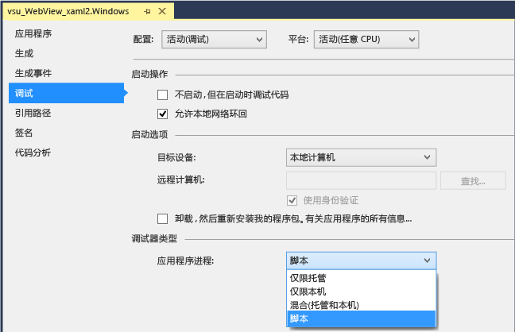
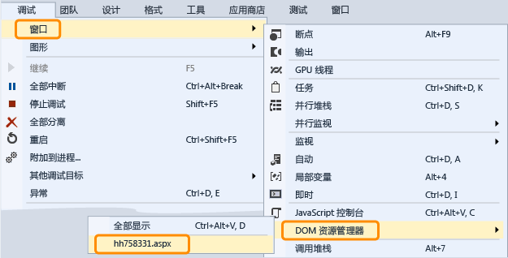

# 调试 WebView 控件
[!INCLUDE[vs2017banner](../code-quality/includes/vs2017banner.md)]

  
  
 若要检查并调试 Windows 运行时应用中的 `WebView` 控件，你可以在启动应用时配置 Visual Studio 以附加脚本调试器。  从 Visual Studio 2013 Update 2 开始，可通过两种方式来使用调试器与 `WebView` 控件交互：  
  
-   打开 `WebView` 实例的 [DOM 资源管理器](../debugger/quickstart-debug-html-and-css.md)，然后检查 DOM 元素、调查 CSS 样式问题并测试动态呈现的样式的更改。  
  
-   选择网页或作为 [JavaScript 控制台](../debugger/javascript-console-commands.md)窗口中的目标在 `WebView` 实例中显示的 `iFrame`，然后使用控制台命令与网页交互。  控制台提供对当前脚本执行上下文的访问。  
  
### 附加调试器（C\#、Visual Basic、C\+\+）  
  
1.  在 Visual Studio 中，向 Windows 运行时应用添加 `WebView` 控件。  
  
2.  在解决方案资源管理器中，通过从项目的快捷菜单中选择**“属性”**来打开项目的属性。  
  
3.  选择**“调试”**。  在**“应用程序进程”**列表中，选择**“脚本”**。  
  
       
  
4.  （可选）对于不是 Express 版本的 Visual Studio，可通过选择**“工具”**、**“选项”**、**“调试”**、**“实时”**，然后禁用脚本的 JIT 调试，来禁用实时 \(JIT\) 调试。  
  
    > [!NOTE]
    >  对于某些网页上发生的无法处理的异常，你可以通过禁用 JIT 调试来隐藏对话框。  在 Visual Studio Express 中，JIT 调试始终处于禁用状态。  
  
5.  按 F5 启动调试。  
  
### 使用 DOM 资源管理器以检查并调试 WebView 控件  
  
1.  （C\#、Visual Basic、C\+\+）向你的应用附加脚本调试器。  请参见第一部分以获取说明。  
  
2.  若没有 `WebView` 控件，请向应用添加该控件并按 F5 启动调试。  
  
3.  导航到包含 `Webview` 控件的页面。  
  
4.  通过选择**“调试”**、**“窗口”**、**“DOM 资源管理器”**来打开 `WebView` 控件的“DOM 资源管理器”窗口，然后选择要检查的 `WebView` 的 URL。  
  
       
  
     与 `WebView` 关联的 DOM 资源管理器将在 Visual Studio 中显示为新选项卡。  
  
5.  查看并修改 [使用 DOM 资源管理器调试 CSS 样式](../debugger/debug-css-styles-using-dom-explorer.md) 中介绍的实时 DOM 元素和 CSS 样式。  
  
### 使用 JavaScript 控制台窗口以检查并调试 WebView 控件  
  
1.  （C\#、Visual Basic、C\+\+）向你的应用附加脚本调试器。  请参见第一部分以获取说明。  
  
2.  若没有 `WebView` 控件，请向应用添加该控件并按 F5 启动调试。  
  
3.  通过选择**“调试”**、**“窗口”**、**“JavaScript 控制台”**，打开 `WebView` 控件的“JavaScript 控制台”窗口。  
  
     将显示“JavaScript 控制台”窗口。  
  
4.  导航到包含 `Webview` 控件的页面。  
  
5.  在控制台窗口中，选择网页或**“目标”**列表中 `WebView` 控件显示的 `iFrame`。  
  
       
  
    > [!NOTE]
    >  通过使用控制台，可以与单个 `WebView`、`iFrame` 交互，每次还可以共享协定或 Web Worker。  每个元素都需要单独的 Web 平台主机 \(WWAHost.exe\) 的实例。  一次可与一个主机交互。  
  
6.  查看并修改应用中的变量或使用控制台命令，如 [快速入门：调试 JavaScript](../debugger/quickstart-debug-javascript-using-the-console.md) 和 [JavaScript 控制台命令](../debugger/javascript-console-commands.md)中所述。  
  
## 请参阅  
 [快速入门：调试 HTML 和 CSS](../debugger/quickstart-debug-html-and-css.md)