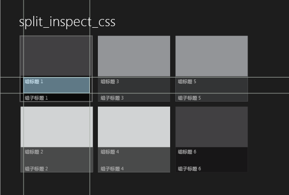
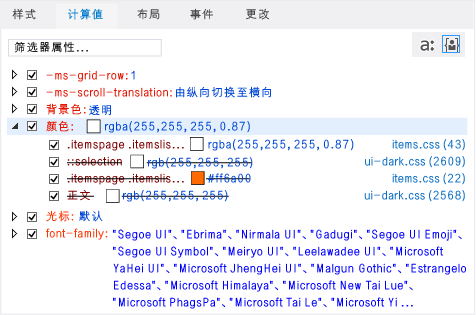

# 使用 DOM 资源管理器调试 CSS 样式
[!INCLUDE[vs2017banner](../code-quality/includes/vs2017banner.md)]

  
  
 调试 Windows 应用商店应用、Windows Phone 应用商店应用以及使用 Visual Studio Tools for Apache Cordova 创建的应用程序时，可查看和更改选定 DOM 元素及其子元素的 CSS 规则。  
  
 DOM 资源管理器的**“样式”**和**“已计算”**选项卡显示适用于所选元素的 CSS 规则。 根据 CSS 优先顺序规则，将按照其特异性的顺序显示这些规则。 选项卡中选择器或样式顶部的规则（最特定的规则）最后应用于所选元素，而选择器或样式底部的规则最先应用于所选元素。 应用规则时，这些规则将覆盖以前应用的规则。  
  
 **“样式”**、**“已计算”**和**“更改”**选项卡提供了不同的样式信息视图。  
  
-   使用**“样式”**选项卡可查看按 CSS 选择器名称（如 `html, body`）组织的规则。 你还可以使用此选项卡启用或禁用特定样式、手动编辑值或查看这些更改的即时结果。  
  
-   使用**“已计算”**选项卡可显示样式的计算值。 例如，如果将大小设置为 1em，则 Internet Explorer 计算出的值可能为 16px。 此选项卡中的样式按样式名称（如 `height`）组织。 你还可以使用此选项卡启用或禁用特定样式、手动编辑值或查看这些更改的即时结果。  
  
    > [!NOTE]
    >  在 Visual Studio 2013 Update 2 中，已将**“跟踪”**选项卡中提供的信息与**“已计算”**选项卡中提供的信息合并，并且**“跟踪”**选项卡已删除。  
  
-   使用“更改”选项卡（仅限 Windows 应用商店和 Windows Phone 应用商店应用）可标识和跟踪在调试会话期间更改的 CSS 样式。  
  
> [!TIP]
>  在**“样式”**和**“已计算”**选项卡中作出的更改并不是永久性的。 停止调试后，这些更改将丢失。 若要在不停止和重启调试器的情况下更改源代码并重新加载页面，请使用“调试”工具栏上的  按钮（“刷新 Windows 应用程序”）刷新应用程序（仅限 Windows 应用商店和 Windows Phone 应用商店应用）。 有关更多信息，请参见 [刷新应用程序 \(JavaScript\)](../debugger/refresh-an-app-javascript.md)。  
  
## 修复 CSS 规则的示例  
 此示例演示如何检查 CSS 规则和调试样式问题。 在此示例中，假设你要更改用于显示 [!INCLUDE[win8_appname_long](../debugger/includes/win8_appname_long_md.md)]“拆分应用”模板中的组标题的字体颜色。  
  
> [!NOTE]
>  此示例显示了 Windows 应用商店应用，但显示的所有 DOM 资源管理器功能同样适用于 Windows Phone 应用商店应用，除“更改”选项卡外，也适用于使用 Visual Studio Tools for Apache Cordova 创建的应用。  
  
#### 查看和更改 CSS 规则  
  
1.  在 Visual Studio 的“拆分应用”项目模板中，创建一个使用 JavaScript 和 HTML 的 [!INCLUDE[win8_appname_long](../debugger/includes/win8_appname_long_md.md)]应用。  
  
2.  在**“解决方案资源管理器”**中，打开 items.css。 （你可在 pages 文件夹中找到 items.css。）  
  
3.  将下列 CSS 代码：  
  
    ```css  
    .itemspage .itemslist .item { -ms-grid-columns: 1fr; -ms-grid-rows: 1fr 90px; display: -ms-grid; height: 250px; width: 250px; }  
    ```  
  
     替换为以下内容：  
  
    ```css  
    .itemspage .itemslist .item { -ms-grid-columns: 1fr; -ms-grid-rows: 1fr 90px; display: -ms-grid; height: 250px; width: 250px; color: #ff6a00; }  
    ```  
  
     这将添加一个样式，该样式为列表中的每个项指定颜色 \#ff6a00（橙色）。 CSS 选择器 `.itemspage .itemslist .item` 指示 items.html 中的 DIV 元素的一组类名称，这些 DIV 元素在实时 DOM 中显示为嵌套元素。`item` DIV 元素指定列表项。  
  
4.  在**“调试”**工具栏的下拉列表中选择**“模拟器”**（**“本地计算机”**是默认值）。  
  
       
  
5.  按 F5 以在调试模式下运行应用程序。  
  
     在应用程序加载完后，查看列表项的标题，如**“Group Title: 1”**。 颜色未发生更改，这表示尝试对标题应用橙色失败。 我们将使用 DOM 资源管理器中的 CSS 选项卡找出问题并进行修复。  
  
    > [!TIP]
    >  在模拟器中显示应用程序后，请将模拟器放置在 Visual Studio 窗口的旁边，以便你能够立即看到选择的结果以及对 CSS 样式所做的更改。  
  
6.  切换到 Visual Studio，然后在 DOM 资源管理器中单击**“选择元素”**（或按 Ctrl\+B）。 这将更改选择模式以使你可通过单击某项来选择该项，然后将应用程序置于前台。 单击后模式即恢复原样。 下面是**“选择元素”**按钮。  
  
    > [!TIP]
    >  也可直接在 DOM 资源管理器中选择 HTML 元素。 有关选择元素的详细信息，请参见[快速入门：调试 HTML 和 CSS](../debugger/quickstart-debug-html-and-css.md)。  
  
7.  在模拟器主页的左面板中，将鼠标悬停在列表中第一项的标题**“Group Title: 1”**上。 标题将会突出显示，如下所示：  
  
       
  
    > [!NOTE]
    >  Windows Phone 仿真程序仅支持部分通过悬停而突出显示的元素。  
  
8.  单击带轮廓的标题。 DOM 资源管理器将自动选择相应的 HTML 元素，类似于以下内容。  
  
    ```html  
    <h4 class="item-title">Group Title: 1</h4>  
    ```  
  
     当你在 DOM 资源管理器中选择 H4 元素时，DOM 资源管理器的选项卡将立即显示与 H4 元素关联的规则。**“已计算”**选项卡如下所示，其中打开了 `color` 属性：  
  
       
  
     此视图提供有关与 `color` 样式相关的规则的有用信息，如以下各项：  
  
    -   我们在 items.css 中修改的 CSS 选择器 `.itemspage .itemslist .item` 将不会在最终样式计算中使用（它显示为带删除线的文本）。 也不会使用 `color` 样式的其他几个匹配项。  
  
        > [!TIP]
        >  对于较长的选择器名称，将在工具提示中显示全名。  
  
    -   将为 CSS 选择器 `rgba(255, 255, 255, 0.87)`（也会在 items.css 中定义）专门设置最终计算所得的 CSS 值 `.itemspage .itemslist .item .item-overlay .item-title`。  
  
        > [!TIP]
        >  现在，我们不仅知道了设置标题颜色的位置，还知道了可更改标题颜色的位置。 不过，我们还可在不刷新应用程序的情况下在 DOM 资源管理器中测试更改，如剩余步骤中所示。  
  
9. 清除 `color` 样式的第一个匹配项的复选框，该匹配项适用于 `.itemspage .itemslist .item .item-overlay .item-title` 选择器。 此时，在模拟器中，你会看到所有项标题的颜色都按要求变为橙色，并且将不再重写已在 CSS 中修改的选择器 `.itemspage .itemslist .item`（即，不再对该选择器应用带删除线的文本）。 这是清除复选框后的**“已计算”**选项卡。  
  
       
  
10. 选择**“更改”**选项卡。  
  
     使用**“更改”**选项卡可标识和跟踪在调试会话期间所做的样式更改。 下图显示了**“更改”**选项卡中的 `.itemspage .itemslist .item .item-overlay .item-title` 选择器（现已覆盖）。  
  
       
  
11. 你还可手动编辑 CSS 样式值并使用**“样式”**选项卡查看即时结果。  
  
12. 选择**“样式”**选项卡。  
  
13. 打开 `.itemspage .itemslist .item .item-overlay .item-title` 样式选择器。  
  
14. 选择 `color` 样式的第一个匹配项，然后双击属性值 `rgb(255, 255, 255, 0.87)`。  
  
15. 使用键盘可修改此值。 将此值更改为 `rgb(255, 255, 0, 0.87)`，然后按 Enter。 随后，模拟器中项标题的颜色全部变为黄色。  
  
16. 若要更改源 CSS 文件，请单击**“样式”**选项卡上的**“items.css”**链接。 这将打开 items.css，你可以在其中更改应用程序代码中 `color` 样式的值。 若要在不停止和重启调试器的情况下刷新应用，请单击“调试”工具栏上的 （“刷新 Windows 应用”）按钮。  
  
## 请参阅  
 [快速入门：调试 HTML 和 CSS](../debugger/quickstart-debug-html-and-css.md)   
 [使用 DOM 资源管理器调试布局](../debugger/debug-layout-using-dom-explorer.md)   
 [查看 DOM 事件侦听器](../debugger/view-dom-event-listeners.md)   
 [产品支持和辅助功能](http://go.microsoft.com/fwlink/?LinkId=253502)