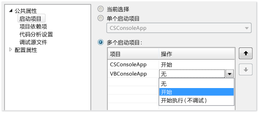
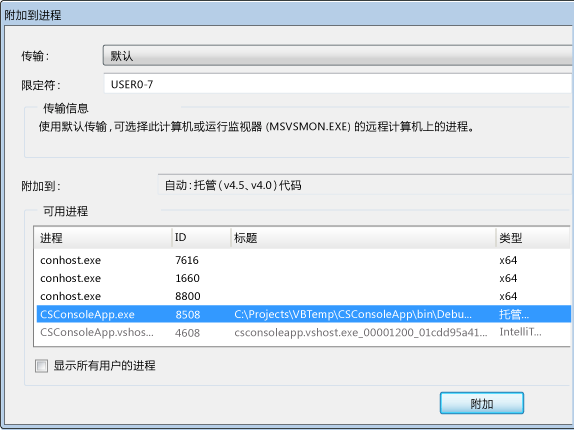
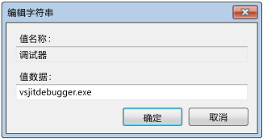
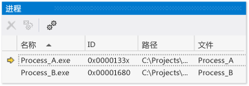

# 调试多个进程
下面介绍了如何启动调试进程、 在进程之间切换、 中断和继续执行、 逐步执行源、 停止调试，并终止或与进程分离。  
  
##  配置多个进程的执行行为  
 默认情况下，当多个进程在调试器中运行时，中断、分步和停止调试器命令通常会影响所有进程。 例如，在断点处暂停一个进程时，所有其他进程的执行也会被暂停。 您可以更改此默认行为以获取对执行命令的目标的更多控制。  
  
1.  单击**调试 > 选项和设置**。  
  
2.  上**调试**，**常规**页上，清除**一个进程中断时则中断所有进程**复选框。  
  
  [目录](#BKMK_Contents)  
  
##  查找源文件和符号 (.pdb) 文件  
 若要浏览进程的源代码，调试器需要访问进程的源文件和符号文件。 请参阅[指定符号 (.pdb) 和源文件](../debugger/specify-symbol-dot-pdb-and-source-files-in-the-visual-studio-debugger.md)。  
  
 如果无法访问进程的文件，可以通过使用反汇编窗口中进行导航。 请参阅[如何： 使用反汇编窗口](../debugger/how-to-use-the-disassembly-window.md)  
  
  [目录](#BKMK_Contents)  
  
##  启动 VS 解决方案中的多个进程，附加到进程，自动在调试器中启动的进程  
  
-   [开始调试 Visual Studio 解决方案中的多个进程](#BKMK_Start_debugging_multiple_processes_in_a_Visual_Studio_solution)  
  
-   [更改启动项目](#BKMK_Change_the_startup_project)  
  
-   [启动解决方案中的特定项目](#BKMK_Start_a_specific_project_in_a_solution)  
  
-   [启动解决方案中的多个项目](#BKMK_Start_multiple_projects_in_a_solution)  
  
-   [附加到进程](#BKMK_Attach_to_a_process)  
  
-   [自动在调试器中启动的进程](#BKMK_Automatically_start_an_process_in_the_debugger)  
  
> [!NOTE]
>  调试器不会自动附加到调试进程所启动的子进程中，即使子项目位于同一个解决方案中。 调试子进程：  
>   
>  -   在子进程启动后附加到该子进程。  
>   
>      - 或 -  
> -   配置 Windows 以自动启动调试器的新实例中的子进程。  
  
###  开始调试 Visual Studio 解决方案中的多个进程  
 如果您在 Visual Studio 解决方案中有多个可独立运行的项目（在独立进程中运行的项目），则可以选择调试器将启动的项目。  
  
   
  
####  更改启动项目  
 若要更改解决方案的启动项目，在解决方案资源管理器中选择项目，然后选择**设为启动项目**从上下文菜单。  
  
####  启动解决方案中的特定项目  
 若要启动而无需更改默认启动项目的解决方案的项目，在解决方案资源管理器中选择项目，然后选择**调试**从上下文菜单。 然后，您可以选择**启动新实例**或**单步执行新实例**。  
  
  [启动 VS 解决方案中的多个进程，附加到进程，自动在调试器中启动的进程](../debugger/debug-multiple-processes.md#BKMK_Start_multiple_processes_in_a_VS_solution__attach_to_a_process__automatically_start_a_process_in_the_debugger)  
  
  [目录](#BKMK_Contents)  
  
####  启动解决方案中的多个项目  
  
1.  在解决方案资源管理器中选择解决方案，然后选择**属性**上下文菜单上。  
  
2.  选择**通用属性**，**启动项目**上**属性**对话框。  
  
3.  对于每个你想要更改的项目，选择**启动**，**启动而不调试**，或**无**。  
  
  [启动 VS 解决方案中的多个进程，附加到进程，自动在调试器中启动的进程](../debugger/debug-multiple-processes.md#BKMK_Start_multiple_processes_in_a_VS_solution__attach_to_a_process__automatically_start_a_process_in_the_debugger)  
  
  [目录](#BKMK_Contents)  
  
###  附加到进程  
 调试器还可以*附加*到在 Visual Studio 外部的进程中运行的程序，包括在远程设备运行的程序。 一旦附加到某个程序，就可以使用调试器执行命令、检查程序状态，等等。 检查程序的能力可能会受到某些限制，这取决于程序是否用调试信息生成，是否可以访问程序源代码，以及公共语言运行时 JIT 编译器是否在跟踪调试信息。  
  
 请参阅[附加到运行进程](../debugger/attach-to-running-processes-with-the-visual-studio-debugger.md)有关详细信息。  
  
 **附加到本地计算机运行的进程**  
  
 单击**调试 > 附加到进程**。 上**附加到进程**对话框框中，选择从进程**可用进程**列表，，然后选择**附加**。  
  
   
  
  [目录](#BKMK_Contents)  
  
###  自动在调试器中启动的进程  
 有时，你可能需要调试由另一个进程启动的程序的启动代码。 这样的示例包括服务和自定义设置操作。 在这些情况下，可以让调试器在应用程序启动时启动并自动附加。  
  
1.  启动注册表编辑器 (**regedit.exe**)。  
  
2.  导航到**HKEY_LOCAL_MACHINE\Software\Microsoft\Windows NT\CurrentVersion\Image File Execution Options**文件夹。  
  
3.  选择要在调试器中启动的应用程序的文件夹。  
  
     如果应用程序的名称未列出作为子文件夹中，选择**Image File Execution Options** ，然后选择**新建**，**密钥**上下文菜单上。 选择新的密钥，选择**重命名**上的快捷菜单，然后输入应用的名称。  
  
4.  在应用程序文件夹的上下文菜单上，选择**新建**，**字符串值**。  
  
5.  更改中的新值的名称**新值**到`debugger`。  
  
6.  在调试器项的上下文菜单上，选择**修改**。  
  
7.  在编辑字符串对话框中，键入`vsjitdebugger.exe`中**值数据**框。  
  
       
  
   
  
  [目录](#BKMK_Contents)  
  
##  切换进程，中断并继续执行，逐步执行源  
  
-   [在进程之间切换](#BKMK_Switch_between_processes)  
  
-   [中断、 单步执行，并继续命令](#BKMK_Break__step__and_continue_commands)  
  
###  在进程之间切换  
 调试时可以附加到多个进程，但在任何给定时间，调试器中只有一个进程处于活动状态。 你可以设置活动或*当前*进程在调试位置工具栏或**进程**窗口。 若要在两个进程间切换，这两个进程必须处于中断模式。  
  
 **若要设置当前进程**  
  
-   在调试位置工具栏上，选择**过程**查看**过程**列表框。 选择要指定为当前进程的进程。  
  
       
  
     如果**调试位置**工具栏不可见，请选择**工具**，**自定义**。 上**工具栏**选项卡上，选择**调试位置**。  
  
-   打开**进程**窗口 (快捷**Ctrl + Alt + Z**)，查找你想要将设置为当前进程的进程，并双击它。  
  
       
  
     当前进程用黄色箭头标记。  
  
 切换到一个项目会将该项目设置为用于调试目的的当前进程。 您查看的所有调试器窗口将显示当前进程的状态，并且所有单步执行命令将仅影响当前进程。  
  
  [切换进程，中断并继续执行，逐步执行源](../debugger/debug-multiple-processes.md#BKMK_Switch_processes__break_and_continue_execution__step_through_source)  
  
  [目录](#BKMK_Contents)  
  
###  中断、 单步执行，并继续命令  
  
> [!NOTE]
>  默认情况下，中断、继续和分步调试器命令会影响所有正在调试的进程。 若要更改此行为，请参阅[配置多个进程的执行行为](#BKMK_Configure_the_execution_behavior_of_multiple_processes)  
  
||||  
|-|-|-|  
|**命令**|**一个进程中断时则中断所有进程**   已选中（默认值）|**一个进程中断时则中断所有进程**   清除|  
|**调试**菜单：   -   **全部中断**|所有进程中断。|所有进程中断。|  
|**调试**菜单：   -   **继续**|所有进程继续。|所有挂起的进程继续。|  
|**调试**菜单：   -   **单步执行** -   **逐过程执行** -   **跳出**|在当前进程单步执行时，所有进程将运行。   然后，所有进程中断。|当前进程单步执行。   已挂起的进程继续。   正在运行的进程继续。|  
|**调试**菜单：   -   **单步执行当前进程** -   **逐过程当前进程** -   **跳出当前进程**|不可用|当前进程单步执行。   其他进程保持其现有状态（挂起或运行）。|  
|源窗口   -   **断点**|所有进程中断。|仅源窗口进程中断。|  
|源窗口上下文菜单：   -   **运行到光标处**   源窗口必须在当前进程中。|当源窗口进程运行到光标处所有进程运行，然后中断。   然后，所有其他进程中断。|源窗口进程运行到光标处。   其他进程保持其现有状态（挂起或运行）。|  
|**进程**窗口上下文菜单：   -   **中断进程**|不可用|已选进程中断。   其他进程保持其现有状态（挂起或运行）。|  
|**进程**窗口上下文菜单：   -   **继续进程**|不可用|已选进程继续。   其他进程保持其现有状态（挂起或运行）。|  
  
  [切换进程，中断并继续执行，逐步执行源](../debugger/debug-multiple-processes.md#BKMK_Switch_processes__break_and_continue_execution__step_through_source)  
  
  [目录](#BKMK_Contents)  
  
##  停止调试、 终止进程或与进程分离  
  
-   [停止、 终止和分离命令](#BKMK_Stop__terminate__and_detach_commands)  
  
 默认情况下，当你选择**调试**，**停止调试**在调试器中打开多个进程时，调试器终止或与具体取决于如何在中打开该过程的所有进程分离调试器：  
  
-   如果在调试器中启动了当前进程，则该进程将终止。  
  
-   如果您已将调试器附加到当前进程，则调试器会与进程分离并使进程保持运行。  
  
 例如，如果开始调试从 Visual Studio 解决方案的进程，附加到已在运行，另一个进程，然后选择**停止调试**，则调试会话结束，Visual Studio 中启动该进程已终止，而您附加的进程将保持运行。 您可以使用以下过程控制停止调试的方法。  
  
> [!NOTE]
>  **一个进程中断时则中断所有进程**选项不影响停止调试或终止进程以及与进程分离。  
  
 **若要更改如何停止调试影响单个进程**  
  
-   打开**进程**窗口 (快捷**Ctrl + Alt + Z**)。 选择的进程，然后选中或清除**调试停止时分离**复选框。  
  
###  停止、 终止和分离命令  
  
|||  
|-|-|  
|**命令**|**描述**|  
|**调试**菜单：   -   **停止调试**|除非行为被更改**进程**窗口**调试停止时分离**选项：   1.调试器启动的进程将被终止。 2.附加的进程将从调试器分离。|  
|**调试**菜单：   -   **全部终止**|所有进程将终止。|  
|**调试**菜单：   -   **全部分离**|调试器与所有进程分离。|  
|**进程**窗口上下文菜单：   -   **分离进程**|调试器与选定进程分离。   其他进程保持其现有状态（挂起或运行）。|  
|**进程**窗口上下文菜单：   -   **终止进程**|选定的进程将终止。   其他进程保持其现有状态（挂起或运行）。|  
|**进程**窗口上下文菜单：   -   **调试停止时分离**|切换的行为**调试**，**停止调试**所选进程：   -选中： 调试器与进程分离。 -清除： 进程将被终止。|  
  
  [停止调试、 终止进程或与进程分离](../debugger/debug-multiple-processes.md#BKMK_Stop_debugging__terminate_or_detach_from_processes)  
  
  [目录](#BKMK_Contents)  
  
## 另请参阅  
 [指定符号 (.pdb) 和源文件](../debugger/specify-symbol-dot-pdb-and-source-files-in-the-visual-studio-debugger.md)   
 [将附加到正在运行的进程](../debugger/attach-to-running-processes-with-the-visual-studio-debugger.md)   
 [Navigating through Code with the Debugger](../debugger/navigating-through-code-with-the-debugger.md) （使用调试器浏览代码）  
 [在实时调试](../debugger/just-in-time-debugging-in-visual-studio.md)   
 [调试多线程应用程序](../debugger/debug-multithreaded-applications-in-visual-studio.md)