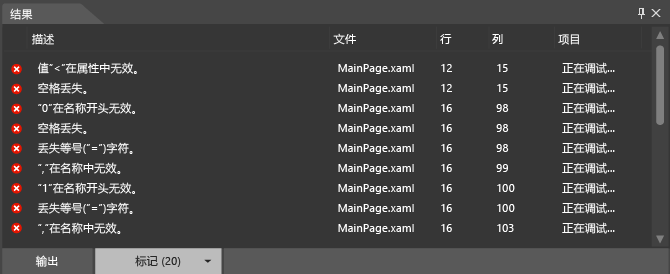

# <a name="debug-xaml-in-blend"></a>在 Blend 中调试 XAML
你可以使用 [!INCLUDE[blend_first](../debugger/includes/blend_first_md.md)] 中的工具在应用中调试 XAML。 生成项目时，任何错误都显示在**结果**面板。 双击一个错误可找到与该错误相关的标记。 如果你需要更多的工作空间，可以隐藏**结果**通过按 F12 的面板。  
  
## <a name="syntax-errors"></a>语法错误  
 如果 XAML 或代码隐藏文件不符合语言的格式设置规则，则将出现语法错误。 错误的说明有助于理解如何更正该错误。 该列表还指定了出现错误的文件名称和行号。 上列出 XAML 错误**标记**选项卡中**结果**面板。  
  
> [!TIP]
>  XAML 是一个基于 XML 的标记语言并遵循 XML 语法规则。  
  
 XAML 语法错误的某些常见原因如下：  
  
-   关键字的拼写错误或大小写错误。  
  
-   特性或文本字符串前后丢失问号。  
  
-   XAML 元素丢失结束标记。  
  
-   XAML 元素出现在不允许使用的位置。  
  
 有关常见 XAML 语法的详细信息，请参阅[基本 XAML 语法指南](http://go.microsoft.com/fwlink/?LinkId=329942)。  
  
 你还可以标识和解决 [!INCLUDE[blend_subs](../debugger/includes/blend_subs_md.md)] 中的简单的代码隐藏语法错误、编译错误和运行时错误。 但是，在 Visual Studio 中标识和解决代码隐藏错误会更加轻松。  
  
### <a name="debugging-sample-xaml-code"></a>调试示例 XAML 代码  
 下面的示例将指导你在 [!INCLUDE[blend_subs](../debugger/includes/blend_subs_md.md)] 中完成简单的 XAML 调试会话。  
  
##### <a name="to-create-a-project"></a>创建项目  
  
1.  在[!INCLUDE[blend_subs](../debugger/includes/blend_subs_md.md)]，打开**文件**菜单，，然后单击**新项目**。  
  
     在**新项目**对话框中，在左侧显示的项目类型列表。 单击一种项目类型后，右侧将显示与该类型关联的项目模板。  
  
2.  在项目类型列表中，单击**Windows 通用**。  
  
3.  在项目模板列表中，单击**空白应用 (通用 Windows)**。  
  
4.  在**名称**文本框中，键入`DebuggingSample`。  
  
5.  在**位置**文本框中，验证项目的位置。  
  
6.  在**语言**列表中，单击**Visual C#**，然后单击**确定**以创建该项目。  
  
7.  在设计图面上右键单击，然后单击**查看源**切换到**拆分**视图。  
  
8.  通过单击来复制以下代码**复制**代码右上角中的链接。  
  
    ```  
    <Grid HorizontalAlignment="Left" Height="222" VerticalAlignment="Top>  
         <Button content="Button" x:Mame="Home" HorizontalAlignment="Left" VerticalAlignment="Top"/>  
         <Button Content="Button" HorizontalAlignment="Left" VerticalAlignment="Top" Margin="0,38,0,0">  
         <Button Content="Button" HorizontalAlignment="Left" VerticalAlignment="Top" Margin="0,75,0,0"/>  
         <Button Content="Button" HorizontalAlignment="Left" VerticalAlignment="Top" Margin="0,112,0,0"/>  
         <Button Content="Button" HorizontalAlignment="Left" VerticalAlignment="Top Margin="0,149,0,0"/>  
    </Grid>  
  
    ```  
  
9. 找到默认**网格**，并粘贴到开始和结束之间的代码**网格**标记。 完成后，代码看起来应类似下面这样：  
  
    ```  
    <Grid Background="{ThemeResource ApplicationPageBackgroundThemeBrush}">  
         <Grid HorizontalAlignment="Left" Height="222" VerticalAlignment="Top>  
              <Button content="Button" x:Mame="Home" HorizontalAlignment="Left" VerticalAlignment="Top"/>  
              <Button Content="Button" HorizontalAlignment="Left" VerticalAlignment="Top" Margin="0,38,0,0">  
              <Button Content="Button" HorizontalAlignment="Left" VerticalAlignment="Top" Margin="0,75,0,0"/>  
              <Button Content="Button" HorizontalAlignment="Left" VerticalAlignment="Top" Margin="0,112,0,0"/>  
              <Button Content="Button" HorizontalAlignment="Left" VerticalAlignment="Top Margin="0,149,0,0"/>  
         </Grid>  
    </Grid>  
  
    ```  
  
10. 按 Ctrl+Shift+B 生成项目。  
  
 显示错误消息，告知你无法生成该项目，与**结果**列出了错误的面板显示在应用的底部。  
  
   
  
### <a name="resolving-xaml-errors"></a>纠正 XAML 错误  
 检测到 XAML 错误后，设计图面会显示一条指示项目包含无效标记的警报。 纠正错误时中的错误列表**结果**更新面板。 在纠正所有错误后，设计图面将启用，并且设计图面上将显示你的应用。  
  
##### <a name="to-resolve-the-xaml-errors"></a>纠正 XAML 错误  
  
1.  双击列表中的第一个错误。 此描述为“值‘<’在特性中无效”。 双击该错误时，指针会在代码中找到相应的位置。 `<` 前面的 `Button` 是有效的，但不是错误消息中建议的特性。 如果你查看上一个代码行，则会注意到特性 `Top` 的右引号缺失。 键入右引号。 请注意，中的错误列表**结果**面板更新以反映所做的更改。  
  
2.  双击描述"'0' 无效名称的开头。" `Margin="0,149,0,0"`看上去正确。 但请注意，`Margin` 的颜色编码与代码中的其他 `Margin` 实例不匹配。 由于前面的名称/值对 (`VerticalAlignment="Top`) 中缺少右引号，因此 `Margin="` 将作为前面的特性值的一部分读取，而 0 将作为名称/值对的开头读取。 为 `Top` 键入右引号。 中的错误列表**结果**面板更新以反映所做的更改。  
  
3.  双击剩余错误“结束 XML 标记‘Button’不匹配”。 指针位于结束**网格**标记 (`</Grid>`)，指示错误在`Grid`对象。 请注意，第二个 `Button` 对象缺少结束标记。 添加结束后`/`、**结果**面板列表会进行更新。 现在已纠正这些初始错误，并且已标识另外两个错误。  
  
4.  双击“无法识别或访问成员‘content’”。 `c` 中的 `content` 应为大写。 将小写“c”替换为大写“c”。  
  
5.  双击“‘http://schemas.microsoft.com/winfx/2006/xaml’命名空间中没有属性‘Mame’”。 “Mame”中的“M”应为“N”。 将“M”替换为“N”。 现在可以分析 XAML，应用程序将显示在设计图面上。  
  
       
  
     按 Ctrl+Shift+B 生成项目，并确认没有剩余错误。  
  
## <a name="debugging-in-visual-studio"></a>使用 Visual Studio 进行调试  
 你可以在 Visual Studio 中打开 [!INCLUDE[blend_subs](../debugger/includes/blend_subs_md.md)] 项目，以便可以在应用中更轻松地调试代码。 若要打开[!INCLUDE[blend_subs](../debugger/includes/blend_subs_md.md)]项目在 Visual Studio 中，右键单击中的项目**项目**面板，并依次**在 Visual Studio 中编辑**。 在 Visual Studio 中完成调试会话后，按 Ctrl+Shift+S 保存所有更改，然后切换回 [!INCLUDE[blend_subs](../debugger/includes/blend_subs_md.md)]。 系统将提示你重新加载该项目。 单击**全是**为了能够继续使用[!INCLUDE[blend_subs](../debugger/includes/blend_subs_md.md)]。  
  
 有关调试你的应用程序的详细信息，请参阅[Visual Studio 中的调试 UWP 应用](http://go.microsoft.com/fwlink/?LinkId=329944)。  
  
## <a name="getting-help"></a>获取帮助  
 如果你需要更多帮助调试你[!INCLUDE[blend_subs](../debugger/includes/blend_subs_md.md)]应用，你可以搜索[UWP 应用社区论坛](http://go.microsoft.com/fwlink/?LinkId=280308)的帖子与自己问题相关或发布问题。