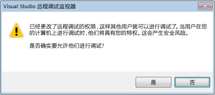

# 调试器安全
[!INCLUDE[vs2017banner](../code-quality/includes/vs2017banner.md)]

调试其他进程的能力赋予你极广泛的权力，这是无法通过其他途经获得的，在进行远程调试时更是如此。 恶意的调试器可能对正在调试的计算机造成大范围的损害。  
  
 但是，许多开发人员没有意识到安全威胁也可以从相反的方向产生。 调试对象进程中的恶意代码可能危害调试计算机的安全：有许多必须防范的不道德的安全利用。  
  
## 安全性最佳做法  
 正在调试的代码与调试器之间有一种隐式信任关系。 如果想调试代码，你还应该乐于运行它。 你起码必须能够信任要调试的代码。 如你无法信任它，就不应对它进行调试，或者应在可以承担风险且处于独立环境的计算机上对其进行调试。  
  
 为了缩小潜在的攻击面，应在生产计算机上禁用调试。 出于同样的原因，永远不应无限制地启用调试。  
  
### 托管调试安全  
 下面是一些适用于所有托管调试的常规建议。  
  
-   附加到非信任用户的进程时要小心：当这样做时，你假定它是可以信赖的。 尝试附加到非信任用户的进程时，将出现一个安全警告对话框确认，询问是否希望附加到该进程。 “信任用户”包括你以及在安装了 .NET Framework 的计算机上通常定义的一组标准用户，如“aspnet”、“localsystem”、“networkservice”和“localservice”。 有关更多信息，请参见[安全警告: 附加到不受信任的用户拥有的进程可能很危险。如果下面的信息看上去可疑或无法确定，请不要附加到此进程](../debugger/security-warning-attaching-to-a-process-owned-by-an-untrusted-user-can-be-dangerous-if-the-following-information-looks-suspicious-or-you-are-unsure-do-not-attach-to-this-process.md)。  
  
-   从 Internet 下载项目并将其加载到 [!INCLUDE[vsprvs](../code-quality/includes/vsprvs_md.md)] 时要小心。 即使没有进行调试这样做也很冒险。 这样做时，你假定该项目和它包含的代码是可以信赖的。  
  
 有关更多信息，请参见[调试托管代码](../debugger/debugging-managed-code.md)。  
  
### 远程调试安全  
 本地调试通常比远程调试更安全。 远程调试增加了可查看的总表面积。  
  
 Visual Studio 远程调试监视器 \(msvsmon.exe\) 用于远程调试，有若干对其进行配置的安全建议。 由于无身份验证模式不安全，因此配置身份验证模式的首选方式是 Windows 身份验证。  
  
   
  
 在使用 Windows 身份验证模式时，请注意，授予非信任用户连接到 msvsmon 的权限是危险的，因为这将向用户授予你在计算机上拥有的所有权限。  
  
 不要在远程计算机上调试未知进程：有潜在的利用，可能会影响正在运行调试器的计算机，或危害 msvsmon.exe（Visual Studio 远程调试监视器）。 如果一定要调试未知进程，请尝试本地调试，并使用防火墙将任何潜在的威胁限制在本地。  
  
 有关详细信息，请参阅[远程调试](../debugger/remote-debugging.md)。  
  
### Web 服务调试安全  
 本地调试要安全一些，但是如果在 Web 服务器上没有安装 [!INCLUDE[vsprvs](../code-quality/includes/vsprvs_md.md)]，则本地调试也许不是实际可行的。 通常，调试 Web 服务都是远程完成的，除非在开发期间，因此远程调试安全的建议也适用于 Web 服务调试。 下面是一些其他最佳做法。 有关详细信息，请参阅[Debugging XML Web Services](http://msdn.microsoft.com/zh-cn/c900b137-9fbd-4f59-91b5-9c2c6ce06f00)。  
  
-   不要在已受威胁的 Web 服务器上启用调试。  
  
-   在调试前，请确保你知道该 Web 服务器是安全的。 如果你不能确定它是安全的，请不要调试它。  
  
-   如果你正在调试对 Internet 公开的 Web 服务，请特别小心。  
  
### 外部组件  
 请注意与你程序交互的外部组件的信任状态，尤其是如果你没有编写此代码。 还要注意 [!INCLUDE[vsprvs](../code-quality/includes/vsprvs_md.md)] 或调试器可能使用的组件。  
  
### 符号和源代码  
 两个需要考虑安全的 [!INCLUDE[vsprvs](../code-quality/includes/vsprvs_md.md)] 工具如下：  
  
-   源服务器，用于从源代码存储库中提供源代码的版本。 当没有程序源代码的当前版本时它很有用。[安全警告：调试器必须执行不受信任的命令](../debugger/security-warning-debugger-must-execute-untrusted-command.md)。  
  
-   符号服务器，用于在系统调用期间提供调试崩溃所需的符号。  
  
 请参见[指定符号 \(.pdb\) 和源文件](../debugger/specify-symbol-dot-pdb-and-source-files-in-the-visual-studio-debugger.md)  
  
## 请参阅  
 [调试设置和准备](../debugger/debugger-settings-and-preparation.md)   
 [调试器基础知识](../debugger/debugger-basics.md)   
 [安全警告: 附加到不受信任的用户拥有的进程可能很危险。如果下面的信息看上去可疑或无法确定，请不要附加到此进程](../debugger/security-warning-attaching-to-a-process-owned-by-an-untrusted-user-can-be-dangerous-if-the-following-information-looks-suspicious-or-you-are-unsure-do-not-attach-to-this-process.md)   
 [安全警告：调试器必须执行不受信任的命令](../debugger/security-warning-debugger-must-execute-untrusted-command.md)