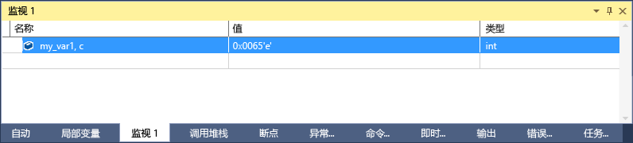

# C++ 中的格式说明符
[!INCLUDE[vs2017banner](../code-quality/includes/vs2017banner.md)]

你可以使用格式说明符更改在“监视”窗口中显示值所用的格式。  
  
 还可在“即时”窗口、“命令”窗口甚至是源窗口中使用格式说明符。 如果将鼠标悬停在这些窗口中的表达式上，结果将在数据提示中显示。 “数据提示”显示格式说明符。  
  
> [!NOTE]
>  更改到新调试引擎的 Visual Studio 本机调试器。 作为此更改的一部分，添加了一些新的格式说明符，删除了一些旧的格式说明符。 当你使用 C\+\+\/CLI 进行互操作（混合本机和托管）调试时，仍使用较早的调试器。 本主题的以下各部分介绍每种调试引擎的格式说明符。  
>   
>  -   [格式说明符](#BKMK_Visual_Studio_2012_format_specifiers) 描述新的调试引擎中的格式说明符。  
> -   [使用 C++/CLI 的互操作调试的格式说明符](#BKMK_Format_specifiers_for_interop_debugging_and_C___edit_and_continue) 描述较早的调试引擎中的格式说明符。  
  
## 使用格式说明符  
 如果你有以下代码：  
  
```cpp  
int main() { int my_var1 = 0x0065; int my_var2 = 0x0066; int my_var3 = 0x0067; }  
```  
  
 将 `my_var1` 变量添加到“监视”窗口（调试时，添加到“调试\/窗口\/监视\/监视 1”），并将显示设置为十六进制（在“监视”窗口中，右键单击该变量，然后选择“十六进制显示”）。 现在，“监视”窗口显示其包含值 0x0065。 若要查看表示为字符而不是整数的该值，在“名称”列中，变量名之后添加字符格式说明符“, c”。 “值”列现在显示为 101 'e'。  
  
   
  
##  <a name="BKMK_Visual_Studio_2012_format_specifiers"></a> 格式说明符  
 下表显示了可以在 Visual Studio 中使用的格式说明符。 加粗的说明符不支持使用 C\+\+\/CLI 的互操作调试。  
  
|说明符|格式|原始监视值|显示的值|  
|---------|--------|-----------|----------|  
|d|十进制整数|0x00000066|102|  
|o|无符号的八进制整数|0x00000066|000000000146|  
|x<br /><br /> **h**|十六进制整数|102|0xcccccccc|  
|X<br /><br /> **H**|十六进制整数|102|0xCCCCCCCC|  
|c|单个字符|0x0065, c|101 'e'|  
|秒|const char \* 字符串|\<location\> “hello world”|"hello world"|  
|**sb**|const char \* 字符串|\<location\> “hello world”|hello world|  
|s8|const char \* 字符串|\<location\> “hello world”|"hello world"|  
|**s8b**|const char \* 字符串|\<location\> “hello world”|"hello world"|  
|su|const wchar\_t\* const<br /><br /> char16\_t \* 字符串|\<location\> L”hello world”|L"hello world"<br /><br /> u"hello world"|  
|sub|const wchar\_t\* const<br /><br /> char16\_t \* 字符串|\<location\> L”hello world”|hello world|  
|bstr|BSTR string|\<location\> L”hello world”|L”hello world”|  
|**s32**|UTF\-32 string|\<location\> U”hello world”|U”hello world”|  
|**s32b**|UTF\-32 string \(no quotation marks\)|\<location\> U”hello world”|hello world|  
|**en**|enum|Saturday\(6\)|星期六|  
|**hv**|指针类型 \- 指示被检查的指针值是数组的堆分配的结果，如 `new int[3]`。|\<location\>{\<first member\>}|\<location\>{\<first member\>, \<second member\>, …}|  
|**na**|取消指向对象的指针的内存地址。|\<location\>, {member\=value…}|{member\=value…}|  
|**nd**|仅显示基类信息，忽略派生的类|`(Shape*) square` 包括基类和派生类信息|仅显示基类信息|  
|hr|HRESULT 或 Win32 错误代码。 （调试器自动将 HRESULT 解码，因此这些情况下不需要该说明符。）|S\_OK|S\_OK|  
|wc|窗口类标志|0x0010|WC\_DEFAULTCHAR|  
|wm|Windows 消息数字|16|WM\_CLOSE|  
|\!|原始格式，忽略任何数据类型视图自定义项|\<customized representation\>|4|  
  
> [!NOTE]
>  如果存在“hv”格式说明符，调试器会尝试确定缓冲区的长度并显示相应的元素数。 由于调试器并非总是可以查找确切的数组缓冲区大小，只要可能时，就应该使用大小说明符 `(pBuffer,[bufferSize])`。 “Hv”格式说明符用于缓冲区大小尚不可使用的情况。  
  
###  <a name="BKMK_Size_specifiers_for_pointers_as_arrays_in_Visual_Studio_2012"></a> 指针的大小说明符作为数组  
 如果有一个指针指向要以数组形式查看的对象，则可以使用一个整数或表达式来指定数组中元素的数量：  
  
|说明符|格式|原始监视 Valuen|显示的值|  
|---------|--------|-----------------|----------|  
|n|十进制或**十六进制**整数|pBuffer,\[32\]<br /><br /> pBuffer，“\[0x20\]”|将 `pBuffer` 显示为一个 32 元素的数组。|  
|**\[exp\]**|计算结果为一个整数的有效的 C\+\+ 表达式。|pBuffer,\[bufferSize\]|将 pBuffer 显示为 `bufferSize` 元素的一个数组。|  
|**expand\(n\)**|计算结果为一个整数的有效的 C\+\+ 表达式。|pBuffer, expand\(2\)|显示 `pBuffer` 的第三个元素|  
  
##  <a name="BKMK_Format_specifiers_for_interop_debugging_and_C___edit_and_continue"></a> 使用 C\+\+\/CLI 的互操作调试的格式说明符  
 **粗体**的说明符仅支持本地调试和 C\+\+\/CLI 代码。  
  
|说明符|格式|原始监视值|显示的值|  
|---------|--------|-----------|----------|  
|**d,i**|有符号的十进制整数|0xF000F065|\-268373915|  
|**u**|无符号的十进制整数|0x0065|101|  
|o|无符号的八进制整数|0xF065|0170145|  
|x,X|十六进制整数|61541|0x0000f065|  
|**l,h**|用于 d、i、u、o、x、X 的 long 或 short 前缀|00406042|0x0c22|  
|**f**|带符号的浮点|\(3.\/2.\), f|1.500000|  
|**e**|有符号的科学计数法|\(3.0\/2.0\)|1.500000e\+000|  
|**g**g|有符号的浮点数字或有符号的科学计数法，显示其中较短的数|\(3.0\/2.0\)|1.5|  
|c|单个字符|\<location\>|101 'e'|  
|秒|const char\*|\<location\>|"hello world"|  
|su|const wchar\_t\*<br /><br /> const char16\_t\*|\<location\>|L"hello world"|  
|sub|const wchar\_t\*<br /><br /> const char16\_t\*|\<location\>|hello world|  
|s8|const char\*|\<location\>|"hello world"|  
|hr|HRESULT 或 Win32 错误代码。 （调试器自动将 HRESULT 解码，因此这些情况下不需要该说明符。）|S\_OK|S\_OK|  
|wc|窗口类标志。|0x00000040,|WC\_DEFAULTCHAR|  
|wm|Windows 消息数字|0x0010|WM\_CLOSE|  
|\!|原始格式，忽略任何数据类型视图自定义项|\<customized representation\>|4|  
  
###  <a name="BKMK_Format_specifiers_memory_locations_in_interop_debugging_and_C___edit_and_continue"></a> 与 C\+\+\/CLI 进行交互操作调试的格式说明符内存位置  
 下表包含用于内存位置的格式化符号。 可以使用带有计算为位置的任何值或表达式的内存位置说明符。  
  
|符号|格式|原始监视值|显示的值|  
|--------|--------|-----------|----------|  
|**ma**|64 个 ASCII 字符|0x0012ffac|0x0012ffac .4...0...".0W&.......1W&.0.:W..1...."..1.JO&.1.2.."..1...0y....1|  
|**m**|以十六进制表示的 16 个字节，后跟 16 个 ASCII 字符|0x0012ffac|0x0012ffac B3 34 CB 00 84 30 94 80 FF 22 8A 30 57 26 00 00 .4...0...".0W&..|  
|**mb**|以十六进制表示的 16 个字节，后跟 16 个 ASCII 字符|0x0012ffac|0x0012ffac B3 34 CB 00 84 30 94 80 FF 22 8A 30 57 26 00 00 .4...0...".0W&..|  
|**mw**|8 个字|0x0012ffac|0x0012ffac 34B3 00CB 3084 8094 22FF 308A 2657 0000|  
|**md**|4 个双字|0x0012ffac|0x0012ffac 00CB34B3 80943084 308A22FF 00002657|  
|**mq**|2 个双字|0x0012ffac|0x0012ffac 7ffdf00000000000 5f441a790012fdd4|  
|**mu**|双字节字符 \(Unicode\)|0x0012ffac|0x0012ffac 8478 77f4 ffff ffff 0000 0000 0000 0000|  
  
###  <a name="BKMK_Size_specifier_for_pointers_as_arrays_in_interop_debugging_and_C___edit_and_continue"></a> 指针的大小说明符作为使用 C\+\+\/CLI 的互操作调试中的数组  
 如果有一个指针指向要以数组形式查看的对象，则可以使用一个整数来指定数组中元素的数量：  
  
|说明符|格式|Expression|显示的值|  
|---------|--------|----------------|----------|  
|n|十进制整数|pBuffer\[32\]|将 `pBuffer` 显示为一个 32 元素的数组。|