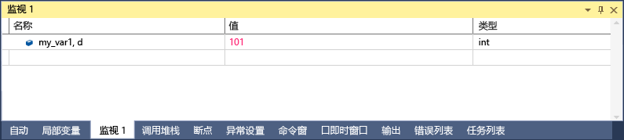

# <a name="format-specifiers-in-c-in-the-visual-studio-debugger"></a>在 C# 中的 Visual Studio 调试器中的格式说明符
你可以使用格式说明符更改在“监视”  窗口中显示值所用的格式。 还可在“即时”  窗口、“命令”  窗口甚至是源窗口中使用格式说明符。 如果将鼠标悬停在这些窗口中的表达式上，结果将在数据提示中显示。 数据提示将在数据提示的显示内容中反映格式说明符。  
  
 若要使用格式说明符，请键入后跟逗号的表达式。 在逗号后面，添加适当的说明符。  
  
## <a name="using-format-specifiers"></a>使用格式说明符  
 如果你有以下代码：  
  
```CSharp  
{  
        int my_var1 = 0x0065;  
        int my_var2 = 0x0066;  
        int my_var3 = 0x0067;  
}  
```  
  
 添加`my_var1`到监视窗口变量 (调试时，**调试 > Windows > 监视 > 监视 1**) 和将显示设置为十六进制 (在**监视**窗口中，右键单击该变量和选择**十六进制显示**)。 现在“监视”  窗口将显示它包含值 0x0065。 若要看到表示为十进制整数而不是十六进制整数的该值，请在“名称”列的变量名之后添加十进制格式说明符：“, d” 。 “值”列现在显示十进制值 101  
  
   
  
## <a name="format-specifiers"></a>格式说明符  
 下表显示调试器所识别的 C# 格式说明符。  
  
|说明符|格式|原始监视值|显示|  
|---------------|------------|--------------------------|--------------|  
|ac|表达式的强制计算。 当关闭属性的隐式计算和隐式函数调用时，这是很有用的。|消息"隐式函数计算已关闭由用户"|\<值 >|  
|d|十进制整数|0x0065|101|  
|dynamic|使用“动态”视图显示指定对象|显示对象的所有成员，包括动态视图|仅显示动态视图|  
|h|十六进制整数|61541|0x0000F065|  
|nq|不带引号的字符串|"My String"|My String|  
|隐藏|显示所有公共成员和非公共成员|显示公共成员|显示所有成员|  
|raw|以项在原始项节点中的显示格式来显示项。 只对代理对象有效。|字典\<T >|字典中的原始视图\<T >|  
|results|用于实现 IEnumerable 或 IEnumerable 的类型的变量\<T >，通常在查询表达式的结果。 仅显示包含查询结果的成员。|显示所有成员。|显示满足查询条件的成员。|  
  
## <a name="see-also"></a>另请参阅  
 [监视和快速监视窗口](../debugger/watch-and-quickwatch-windows.md)   
 [“自动”和“局部变量”窗口](../debugger/autos-and-locals-windows.md)
