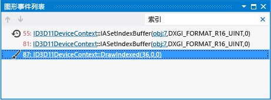

# 图形事件列表
[!INCLUDE[vs2017banner](../code-quality/includes/vs2017banner.md)]

使用 Visual Studio 图形分析器中的图形事件列表来浏览在呈现游戏或应用的帧时所记录的 Direct3D 事件。  
  
 事件列表如下：  
  
   
  
## 使用事件列表  
 选择事件列表中的某个事件时，它会反映在由其他图形分析工具所显示的信息中；通过结合使用事件列表和其他此类工具，你可以仔细检查呈现问题以确定其原因。 若要了解有关如何通过结合使用事件列表和其他图形分析工具来解决呈现问题的详细信息，请参阅[示例](../debugger/graphics-diagnostics-examples.md)。  
  
 有效地使用事件列表的功能，对于解决可能包含数以千计的事件的复杂帧很重要。 若要有效地使用事件列表，请选择最适合你的视图、使用搜索以筛选事件列表、通过链接以了解有关与某个事件相关联的 Direct3D 对象的详细信息，并使用箭头按钮在绘图调用之间快速移动。  
  
### Direct3D 12 中的着色事件  
 Direct3D 12 公开多个对应于不同硬件功能的队列。 为帮助标识与 Direct3D 12 中特定图形事件关联的队列，当你使用 Direct3D 12 应用的捕获时，将根据事件的队列对事件列表中的事件进行着色。  
  
|Direct3D 12 队列|颜色|  
|-----------------------|-----------|  
|呈现队列|绿色|  
|计算队列|黄色|  
|复制队列|橙色|  
  
 Direct3D 11 不公开多个队列，这样，因此在你使用 Direct3D 11 应用的捕获时不会再事件列表中对事件进行着色。  
  
### 事件列表视图  
 事件列表支持两种不同的视图，这两种视图以不同的方式组织图形事件，以便支持你的工作流和首选项。 第一个视图是按层次结构组织事件及其关联状态的 *绘图调用视图* 。 第二个视图是在简单列表中按时间顺序组织事件的 *时间线视图* 。  
  
 **“绘图调用”** 视图  
 在层次结构中显示捕获的事件及其状态。 层次结构顶层由事件（例如，绘图调用、清除、显示和处理视图的事件）组成。 在事件列表中，你可以展开绘图调用以显示绘图调用时当前所处的设备状态；你可以进一步展开每种状态以显示设置其值的事件。 在此级别上，你还可以看到是否在之前的帧中设置了某个特定状态，或者自从最后一次绘图调用以后，是否对它进行了多次设置。  
  
 **“时间线”** 视图  
 按时间顺序显示每个捕获的事件。 这种组织事件列表的方式与早期版本的 Visual Studio 中使用的方式相同。  
  
##### 更改事件列表视图模式  
  
-   在 **“图形事件列表”** 窗口的事件列表上方，查找 **“视图”** 下拉列表，然后选择 **“时间线”** 视图或 **“绘图调用”** 视图。  
  
### 筛选事件  
 你可以使用“搜索”框（位于 **“图形事件列表”** 窗口的右上角）来筛选事件列表，以便仅包括其名称包含特定关键字的事件。 你可以指定单个关键字，例如 `Vertex`（如之前的说明所示），或使用以分号分隔的列表指定多个关键字，例如 `Draw;Primitive`（与名称中具有 `Draw` 或 `Primitive` 的事件相匹配）。 搜索区分空格（例如， `VSSet` 和 `VS Set` 就是不同的搜索），因此请仔细设置搜索形式。  
  
### 在绘图调用之间移动  
 因为检查 `Draw` 调用特别重要，所以你可以使用 **“转到下一个绘图调用”** 和 **“转到上一个绘图调用”** 按钮（位于 **“图形事件列表”** 窗口的左上角），以在绘图调用之间快速查找和移动。  
  
### 指向图形对象的链接  
 若要了解某些图形事件，你可能需要有关 Direct3D 的当前状态或事件引用的 Direct3D 对象的其他信息。 很多事件都提供了指向此信息的链接，你可以通过这些链接获取更多详细信息。  
  
## 事件种类和事件标记  
 将显示在事件列表中的事件组织为四个类别：常规事件、绘图事件、用户定义的事件组和用户定义的事件标记。 除了常规事件以外，每个事件都会随指示它所属类别的图标一起显示。  
  
|图标|事件说明|  
|----------|-----------------------|  
|（无图标）|常规事件  用户定义的事件、用户定义的事件组或绘图事件之外的任何事件。|  
||绘图事件  标记在捕获的帧期间发生的绘图事件。|  
||用户定义的事件组  与组相关的事件，由应用定义。|  
||用户定义的事件标记  标记特定位置，由应用定义。|  
  
## 标记应用中用户定义的事件  
 用户定义的事件特定于你的应用。 你可以使用它们，将发生在应用中的重要事件和图形事件列表中的事件关联起来。 例如，你可以创建用户定义的事件组来将相关事件（例如，呈现用户界面的事件）组织到组或层次结构中，以便你可以更加轻松地浏览事件列表，或者，你可以在绘制某种对象时创建标记，以便你可以在事件列表中轻松查找其图形事件。  
  
 若要在应用中创建组和标记，请使用 Direct3D 提供的 API，它与供其他 Direct3D 调试工具使用的 API 相同。 这些 API 有时因 Direct3D 版本不同而所有变化，但基本功能是相同的。  
  
### Direct3D 12 中用户定义的事件  
 若要在 Direct3D 12 中创建组和标记，请使用此节中所述的 API。 下表总结了可以使用的 API，具体取决于是标记命令队列中的事件还是命令列表中的事件。  
  
|API 说明|[ID3D12CommandQueue](https://msdn.microsoft.com/library/dn788627.aspx)|[ID3D12GraphicsCommandList](https://msdn.microsoft.com/library/dn903537.aspx)|  
|---------------------|----------------------------------------------------------------------------|-----------------------------------------------------------------------------------|  
|检查用户定义的事件的可用性|[PIXGetStatus](http://msdn.microsoft.com/zh-cn/f7ebd985-fb5d-46d7-abec-099df4b9be0e)|[PIXGetStatus](http://msdn.microsoft.com/zh-cn/1046ac43-a0a3-42bf-bae8-14aa72fa7567)|  
|开始事件组|[PIXBeginEvent](http://msdn.microsoft.com/zh-cn/5f51fff7-f313-4558-965b-2a443653cd7b)|[PIXBeginEvent](http://msdn.microsoft.com/zh-cn/4ddb3311-b9b5-449a-bbfb-7634e0d56e87)|  
|结束事件组|[PIXEndEvent](http://msdn.microsoft.com/zh-cn/fb526bf2-c17d-4a2a-8665-3b577a0f7fba)|[PIXEndEvent](http://msdn.microsoft.com/zh-cn/a3cd34a9-9dd9-40e1-ae86-0214b25ff185)|  
|创建事件标记|[PIXSetMarker](http://msdn.microsoft.com/zh-cn/0caf49ed-c99d-405e-89f4-0c887b8474ad)|[PIXSetMarker](http://msdn.microsoft.com/zh-cn/6610e5b9-a0c5-4236-b551-b6eb9fac64c1)|  
  
### Direct3D 11 及更早版本中的用户定义的事件  
 若要在 Direct3D 11 或更早版本中创建组和标记，请使用此节中所述的 API。 下表总结了可用于 Direct3D 11 的不同版本和 Direct3D 的早期版本的 API。  
  
|API 说明|[ID3D11DeviceContext2](http://msdn.microsoft.com/library/windows/desktop/dn280498.aspx) (Direct3D 11.2)|[ID3DUserDefinedAnnotation](http://go.microsoft.com/fwlink/p/?LinkID=250967) (Direct3D 11.1)|D3DPerf_ API 系列（Direct3D 11.0 和更早版本）|  
|---------------------|---------------------------------------------------------------------------------------------------------------|----------------------------------------------------------------------------------------------------|--------------------------------------------------------|  
|开始事件组|`BeginEventInt`|`BeginEvent`|`D3DPerf_BeginEvent`|  
|结束事件组|`EndEventInt`|`EndEvent`|`D3DPerf_EndEvent`|  
|创建事件标记|`SetMarkerInt`|`SetMarker`|`D3DPerf_SetMarker`|  
  
 你可以使用你的 Direct3D 版本支持的任何 API（例如，如果你面向 Direct3D 11.1 API，你可以使用 `SetMarker` 或 `D3DPerf_SetMarker` 创建事件标记，但是不可以使用 `SetMarkerInt` ，因为它仅在 Direct3D 11.2 中可用），并且在同一应用中，你甚至可以将支持不同版本 Direct3D 的 API 混合在一起。  
  
## 另请参阅  
 [演练：因设备状态而缺少对象](../debugger/walkthrough-missing-objects-due-to-device-state.md)