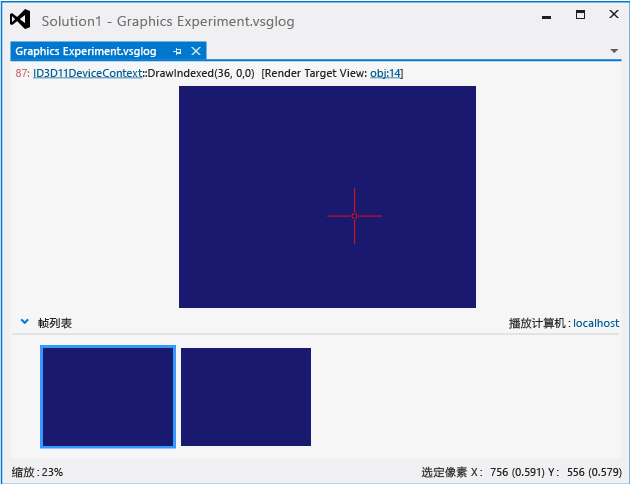

# 图形日志文档
[!INCLUDE[vs2017banner](../code-quality/includes/vs2017banner.md)]

图形日志文档是对你的应用在图形诊断会话下运行时发生的图形事件的记录。  在记录后，你可以在 Visual Studio 图形分析器中检查日志，以诊断呈现和性能问题。  
  
 这是图形日志文档在图形分析器中的外观：  
  
   
  
## 了解图形日志文档  
 通过使用图形分析器检查图形日志文档，便能可视化捕获期间在呈现器目标上发生的 Direct3D 事件的效果。  你可以查明包含意外输出的呈现器目标的区域。  选择受影响区域中的某个像素后，你可以使用图形诊断检查它、它的着色器、影响它的 Direct3D 事件、导致这些事件的应用程序调用堆栈，以及支持这些事件的 DirectX 对象。  你可以使用此信息诊断游戏或应用中的呈现问题。  
  
 窗口顶部（**“Graphics Experiment.vsglog”**）显示所选帧的当前呈现器目标输出，底部显示包含所捕获帧的缩略图的**“帧列表”**。  
  
#### 检查帧  
  
-   在**“帧列表”**中，选择要检查的帧。  更新图形日志文档顶部的呈现器目标输出以显示所选帧。  
  
#### 检查像素  
  
-   在图形日志文档顶部，从呈现器目标输出中选择所需像素。  选中某个像素后，你可以使用**“图形像素历史记录”**窗口查看有关所选像素的详细信息。  有关详细信息，请参阅[像素历史记录](../debugger/graphics-pixel-history.md)。  
  
## 播放计算机  
 在**“帧列表”**的右上角还会显示**“播放计算机”**。  播放计算机是指用于在之后的图形诊断会话期间，播放图形日志文件中的图形事件的计算机或设备。  通过使用另一台设备而非你的开发计算机来播放捕获的事件，你可以更加准确地重现发生问题所在的执行环境，例如，你可以使用具有不同于开发计算机使用的图形硬件或驱动程序的计算机或其他种类的设备（例如基于 ARM 的 Windows RT 平板电脑或 Windows Phone 设备）。  
  
 有关如何指定播放计算机的信息，请参阅[如何：更改图形诊断播放机](../debugger/how-to-change-the-graphics-diagnostics-playback-machine.md)。  
  
## 图形日志摘要信息  
 当图形日志文件是活动文档时，**“属性”**窗口将显示有关托管图形诊断捕获会话的环境的信息。  将显示以下几种类别的信息。  
  
 **Direct3D 信息**  
 列出有关在捕获会话期间使用的显示适配器的硬件和驱动程序功能的信息。  
  
|属性|描述|  
|--------|--------|  
|**10 位 XR 增强色格式**|如果支持 10 位 XR 高颜色格式，则为**“True”**；否则为**“False”**。|  
|**DirectCompute CS 4.x**|如果支持计算着色器 4.0，则为**“True”**；否则为**“False”**。|  
|**双精度着色器**|如果显示适配器支持双精度（64 位）浮点值，则为**“True”**；否则为**“False”**。|  
|**驱动程序命令列表**|如果驱动程序支持命令列表，则为**“True”**；否则为**“False”**。|  
|**驱动程序并发创建**|如果驱动程序支持并发（异步）创建，则为**“True”**；否则为**“False”**。|  
|**扩展格式\(BGRA 等\)**|如果支持扩展格式（如，BGRA），则为**“True”**；否则为**“False”**。|  
|**最大硬件功能级别**|显示显示适配器所支持的最高功能级别。|  
  
 **显示信息**  
 列出有关在捕获会话期间使用的显示适配器的信息。  
  
|属性|描述|  
|--------|--------|  
|**描述**|显示适配器描述字符串。|  
|**显示内存**|安装在图形适配器上的内存量。|  
|**驱动程序名称**|图形适配器驱动程序的名称。|  
|**驱动程序版本**|图形适配器驱动程序的版本。|  
|**名称**|图形适配器的名称。|  
  
 **试验文件**  
 列出有关与捕获会话相关联的试验文件的信息。  
  
|属性|描述|  
|--------|--------|  
|**路径**|.vsglog 文件的路径。 **Note:**  在旧的捕获下，不使用此属性。|  
  
 **模块信息**  
 列出有关在捕获会话期间由应用加载的动态链接库 \(DLL\) 的名称和版本。  
  
 **系统信息**  
 列出有关在捕获会话期间托管应用的硬件和操作系的信息。  
  
|属性|描述|  
|--------|--------|  
|**内存**|安装在计算机中的内存量。|  
|**操作系统体系结构**|操作系统的目标 CPU 体系结构。|  
|**操作系统版本**|操作系统版本。|  
|**处理器**|安装在计算机中的处理器。|  
|**目标应用程序体系结构**|应用的目标 CPU 体系结构。  这可能不同于**“操作系统体系结构”**。|  
  
 **目标应用程序**  
 列出有关作为捕获期间的使用者的应用的信息。  
  
|属性|描述|  
|--------|--------|  
|**上次修改日期\/时间**|应用的生成日期和时间。|  
|**路径**|应用的路径。|  
|**进程 ID**|已提供给应用的进程 ID。|  
|**版本**|应用版本。|  
  
 **VSG 日志文件**  
 列出有关图形日志文档的信息。  
  
|属性|描述|  
|--------|--------|  
|**创建者**|创建了图形日志文档的应用的名称。  例如，如果已从 [!INCLUDE[vsprvs](../code-quality/includes/vsprvs_md.md)] 中初始化捕获会话（手动捕获），则此属性的值为 [!INCLUDE[vsprvs](../code-quality/includes/vsprvs_md.md)]。|  
|**会话开始时间**|捕获会话开始的日期和时间。|  
|**大小**|图形日志文档的大小。|  
  
## 请参阅  
 [演练：因顶点着色而缺少对象](../debugger/walkthrough-missing-objects-due-to-vertex-shading.md)   
 [演练：调试因着色引起的呈现错误](../debugger/walkthrough-debugging-rendering-errors-due-to-shading.md)