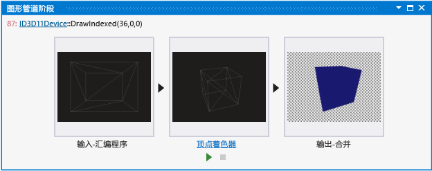
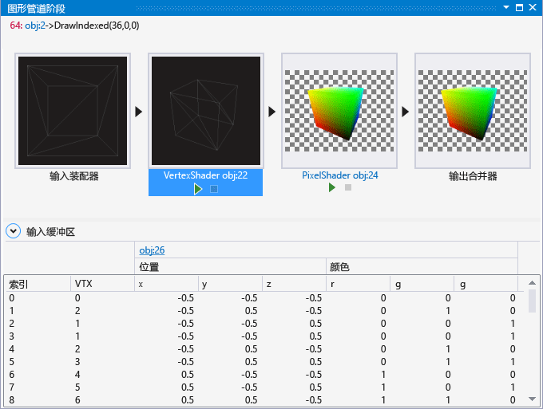

# 图形管道阶段
[!INCLUDE[vs2017banner](../code-quality/includes/vs2017banner.md)]

“图形管道阶段”窗口可帮助了解 Direct3D 图形管道的每个阶段如何转换各个绘图调用。  
  
 这是“管道阶段”窗口：  
  
   
  
## 了解图形管道阶段窗口  
 “管道阶段”窗口会针对每个绘图调用，单独可视化图形管道的每个阶段的结果。  通常，管线中间阶段的结果会隐藏，从而难以判断呈现问题的起始位置。  通过单独可视化每个阶段，“管道阶段”窗口便于查看问题的起始位置 — 例如，可以轻松地查看顶点着色器阶段意外导致在屏幕外绘制对象的时间。  
  
 标识出了出现问题的阶段之后，可以使用其他图形分析器工具来检查是如何解释或转换数据的。  管道阶段中出现的呈现问题通常与顶点格式说明符错误、着色器程序错误或状态未正确配置相关。  
  
### 指向相关图形对象的链接  
 有时需要附加上下文才能确定绘图调用为何以特定方式与图形管道进行交互。  为了使这一附加上下文更易于查找，“图形管道阶段”窗口链接到一个或多个对象，这些对象可提供与图形管道中发生的情况相关的附加上下文。  
  
-   在 Direct3D 12 中，此对象通常是命令列表。  
  
-   在 Direct3D 11 中，此对象通常是图形设备上下文。  
  
 这些链接是位于“图形管道阶段”窗口左上角的当前图形事件签名的一部分。  访问其中任何链接都可检查有关对象的其他详细信息。  
  
### 查看和调试着色器代码  
 可以在“管道阶段”窗口中使用相应阶段底部的控件，来针对顶点、外壳、域、几何和像素着色器检查和调试代码。  
  
##### 查看着色器源代码  
  
-   在**“图形管道阶段”**窗口中，找到与要检查的着色器对应的着色器阶段。  然后在预览图像下，访问着色器阶段标题链接 — 例如，访问链接**“顶点着色器 obj:30”**可查看顶点着色器源代码。  
  
    > [!TIP]
    >  对象编号**“obj:30”**用于在整个图形分析器界面中（如对象表和像素历史记录窗口中）标识此着色器。  
  
##### 调试着色器  
  
-   在**“图形管道阶段”**窗口中，找到与要调试的着色器对应的着色器阶段。  然后在预览图像下，选择**“启动调试”**。  进入 HLSL 调试器的此入口点默认为着色器对相应阶段的首个调用 — 即着色器在此绘图调用过程中处理的第一个像素、顶点或基元。  可以通过**“图形像素历史记录”**访问此着色器对特定像素或顶点的调用。  
  
### 管道阶段  
 “管道阶段”窗口仅可视化在绘图调用过程中处于活动状态的管道阶段。  图形管道的每个阶段都转换来自上一个阶段的输入，然后将结果传递到下一个阶段。  第一个阶段（输入装配器）采用来自应用的索引和顶点数据作为其输入；最后一个阶段（输出合并器）将新呈现的像素与帧缓冲区或呈现目标的当前内容合并在一起作为其输出，以生成屏幕上显示的最终图像。  
  
> [!NOTE]
>  “图形管道阶段”窗口中不支持计算着色器。  
  
 **输入装配器**  
 “输入装配器”读取应用指定的索引和顶点数据，并组合它们以用于图形硬件。  
  
 在“管道阶段”窗口中，“输入装配器”输出会可视化为框架模型。  若要进一步查看结果，请在**“图形管道阶段”**窗口中选择**“输入装配器”**，以使用模型编辑器以完整三维查看组合的顶点。  
  
> [!NOTE]
>  如果输入装配器输出中不存在 `POSITION` 语义，“输入装配器”阶段不会显示任何信息。  
  
 **顶点着色器**  
 顶点着色器阶段会处理顶点，通常执行转换、外观设置和照明等操作。  顶点着色器生成的顶点数与它们作为输入的数量相同。  
  
 在“管道阶段”窗口中，顶点着色器输出会可视化为框架光栅图像。  若要进一步查看结果，请在**“图形管道阶段”**窗口中选择**“顶点着色器”**，以在图像编辑器中查看处理后的顶点。  
  
> [!NOTE]
>  如果顶点着色器输出中不存在 `POSITION` 或 `SV_POSITION` 语义，“顶点着色器”阶段不会显示任何信息。  
  
 **外壳着色器**（仅限 Direct3D 11 和 Direct3D 12）  
 外壳着色器阶段处理定义低序位图面（如线、三角形或四边形）的控制点。  作为输出，它会生成传递到固定功能分割阶段的更高序位几何修补程序和修补程序常量。  
  
 外壳着色器阶段不在“管道阶段”窗口中进行可视化。  
  
 **细化器阶段**（仅限 Direct3D 11 和 Direct3D 12）  
 细化器阶段是固定功能（不可编程）硬件单元，可对由外壳着色器输出表示的域进行预处理。  作为输出，它会创建域的采样模式和一组连接这些样本的较小基元（点、线、三角形）。  
  
 细化器阶段不在“管道阶段”窗口中进行可视化。  
  
 **域着色器**（仅限 Direct3D 11 和 Direct3D 12）  
 域着色器阶段处理来自外壳着色器的更高序位几何修补程序以及来自分割阶段的分割系数。  分割系数可以包括细化器输入系数以及输出系数。  作为输出，它根据细化器系数计算输出修补程序上的点的顶点位置。  
  
 域着色器阶段不在“管道阶段”窗口中进行可视化。  
  
 **几何着色器**  
 几何着色器处理全部基元（点、线或三角形）以及边缘相邻基元的可选顶点数据。  与顶点着色器不同，几何着色器可以生成比输入更多或更少的基元。  
  
 在“管道阶段”窗口中，几何着色器输出会可视化为框架光栅图像。  若要进一步查看结果，请在**“图形管道阶段”**窗口中选择**“几何着色器”**，以在图像编辑器中查看处理后的基元。  
  
 **流输出阶段**  
 流输出阶段可以在光栅化之前截获转换的基元并将它们写入内存；数据在其中可以再循环作为更早的图形管道阶段的输入，或是由 CPU 读回。  
  
 流输出阶段不在“管道阶段”窗口中进行可视化。  
  
 **光栅器阶段**  
 光栅器阶段是固定功能（不可编程）硬件单元，通过执行扫描线转换将矢量基元（点、线、三角形）转换为光栅图像。  在光栅化期间，顶点会转换为同构剪辑空间并进行剪辑。  作为输出，像素着色器会进行映射，每顶点属性会在基元间进行内插，为用于像素着色器做好准备。  
  
 光栅器着色器阶段不在“管道阶段”窗口中进行可视化。  
  
 **像素着色器**  
 像素着色器阶段将光栅化基元与内插的顶点数据一起进行处理，以生成每像素值（如颜色和深度）。  
  
 在“管道阶段”窗口中，像素着色器输出会可视化为全彩色光栅图像。  若要进一步查看结果，请在**“图形管道阶段”**窗口中选择**“像素着色器”**，以在图像编辑器中查看处理后的基元。  
  
 **输出合并器**  
 输出合并器将新呈现的像素的效果与对应缓冲区（颜色、深度和模具）的现有内容合并在一起，以在这些缓冲区中生成新值。  
  
 在“管道阶段”窗口中，输出合并器输出会可视化为全彩色光栅图像。  若要进一步查看结果，请在**“图形管道阶段”**窗口中选择**“输出合并器”**，以查看合并的帧缓冲区。  
  
### 顶点着色器预览  
 在**“图形管道阶段”**窗口中选择顶点着色器阶段时，**“输入缓冲区”**面板会显示。  在其中可以找到有关提供给顶点着色器的顶点列表的详细信息（在它们经过输入装配器组合之后）。  
  
   
  
 若要查看顶点着色器阶段的结果，请选择顶点着色器阶段缩略图，以查看网格的完整大小光栅化框架（经过顶点着色器转换之后）。  
  
   
  
## 请参阅  
 [演练：因顶点着色而缺少对象](../debugger/walkthrough-missing-objects-due-to-vertex-shading.md)   
 [演练：调试因着色引起的呈现错误](../debugger/walkthrough-debugging-rendering-errors-due-to-shading.md)