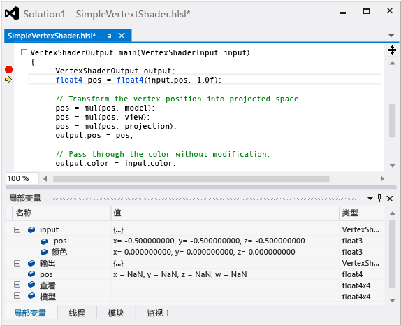

# HLSL 着色器调试器
[!INCLUDE[vs2017banner](../code-quality/includes/vs2017banner.md)]

Visual Studio 图形分析器中的 HLSL 调试器可帮助了解 HLSL 着色器代码在应用的实际条件下如何运行。  
  
 这是 HLSL 调试器：  
  
   
  
## 了解 HLSL 调试器  
 HLSL 调试器可以帮助你了解着色器代码中产生的问题。  在 [!INCLUDE[vsprvs](../code-quality/includes/vsprvs_md.md)] 中调试 HLSL 代码类似于调试以其他语言（例如 C\+\+、C\# 或 Visual Basic）编写的代码。  你可以检查变量内容、设置断点、逐句通过代码和遍历调用堆栈，就像你调试其他语言时一样。  
  
 不过，由于 GPU 通过同时在数百个线程上运行着色器代码来实现高性能，HLSL 调试器设计为与其他图形分析器工具共同工作以提供所有诊断信息，以便帮助你了解这些信息。  图形分析器通过使用在图形日志中记录的信息来重新创建捕获的帧；HLSL 调试器在运行着色器代码时，不实时监控 GPU 执行。  由于图形日志包含足够的信息来重新创建输出的任何部分，并且图形分析器提供的工具可帮助你查明发生错误的确切像素和事件，因此 HLSL 调试器只需模拟你感兴趣的确切着色器线程。  这意味着可以在 CPU 上模拟着色器的工作，从中可完全查看着色器的内部工作情况。  HLSL 调试器因此提供类似于 CPU 的调试体验。  
  
 不过，HLSL 调试器当前存在以下方面的限制：  
  
-   HLSL 调试器不支持编辑并继续，但是你可以对着色器进行更改，然后重新生成帧以查看结果。  
  
-   无法同时调试应用程序和着色器代码。  但是，可以在这两者之间交替。  
  
-   可以将变量和寄存器添加到监视窗口，但不支持表达式。  
  
 不过，与其他方法相比，HLSL 调试器所提供的调试体验更好且更类似于 CPU。  
  
## HLSL 着色器编辑和应用  
 HLSL 着色器调试器不支持以和 CPU 调试器相同的方式执行“编辑”和“继续”，因为 GPU 执行模型不允许撤消着色器状态。  HLSL 调试器支持的是“编辑”和“应用”，这使你可以对 HLSL 源文件进行编辑，然后选择“应用”来重新生成帧以查看所做更改的效果。  修改后的着色器代码存储在一个单独的文件中，由此保留项目原始 HLSL 源文件的完整性，但如果你对所做的更改感到满意，你可以选择“复制到...”，从而将所做的更改复制到项目中。  使用此功能，你可以快速循环访问包含错误的着色器代码并消除成本较高的重建，还可以从 HLSL 调试工作流中捕获步骤。  
  
## HLSL 反汇编  
 HLSL 着色器调试器提供一个 HLSL 着色器程序集的列表，位于 HLSL 源代码列表的右侧。  
  
## 调试 HLSL 代码  
 可以从“管道阶段”或“像素历史记录”窗口访问 HLSL 调试器。  
  
#### 从“图形管道阶段”窗口启动 HLSL 调试器  
  
1.  在**“图形管道阶段”**窗口中，找到与要调试的着色器关联的管道阶段。  
  
2.  在管道阶段标题下，选择**“开始调试”**（显示为小绿色箭头）。  
  
    > [!NOTE]
    >  HLSL 调试器中的此入口点仅调试对应阶段的第一个着色器线程，即处理的第一个顶点或像素。  可以使用“像素历史记录”来访问这些着色器阶段的其他线程。  
  
#### 从“图形像素历史记录”窗口启动 HLSL 调试器  
  
1.  在**“图形像素历史记录”**窗口中，展开与要调试的着色器关联的绘图调用。  每个绘图调用可与多个基元对应。  
  
2.  在绘图调用详细信息中，展开所生成的颜色量表明着色器代码中存在 Bug 的基元。  如有多个基元表明存在 Bug，请选择表明 Bug 的第一个基元，从而避免错误累积，导致问题诊断更加困难。  
  
3.  在基元详细信息中，选择是调试**“顶点着色器”**还是**“像素着色器”**。  如果你怀疑像素着色器是正确的，但由于顶点着色器向其传递错误常量而生成错误的颜色量，请调试顶点着色器。  否则，请调试像素着色器。  
  
     在所选着色器的右侧，选择**“开始调试”**（显示为小绿色箭头）。  
  
    > [!NOTE]
    >  HLSL 调试器中的此入口点调试与你选择的绘图调用、基元和像素对应的像素着色器线程，或调试与通过你选择的绘图调用、基元和像素来插入结果的顶点着色器线程对应的像素着色器线程。  对于顶点着色器，可通过展开顶点着色器详细信息，将入口点进一步细化到特定顶点。  
  
 有关如何使用 HLSL 调试器来调试着色器错误的示例，请参阅[图形诊断示例](../debugger/graphics-diagnostics-examples.md)或“另请参阅”部分中的演练链接。  
  
## 请参阅  
 [演练：因顶点着色而缺少对象](../debugger/walkthrough-missing-objects-due-to-vertex-shading.md)   
 [演练：调试因着色引起的呈现错误](../debugger/walkthrough-debugging-rendering-errors-due-to-shading.md)   
 [演练：使用图形诊断来调试计算着色器](../debugger/walkthrough-using-graphics-diagnostics-to-debug-a-compute-shader.md)