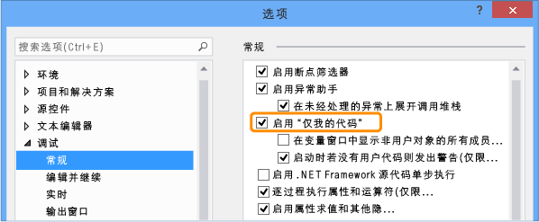

# <a name="specify-whether-to-debug-only-user-code-using-just-my-code-in-visual-studio"></a>指定是否仅使用 Visual Studio 中的仅我的代码的用户代码进行调试
你可以配置 Visual Studio 可自动逐过程执行系统、 框架和其他非用户调用和折叠调用堆栈窗口中的这些调用。 启用或禁用此行为的功能称为*仅我的代码*。 本主题介绍如何在 C#、 Visual Basic、 c + + 和 JavaScript 项目中使用仅我的代码。

对于大多数编程语言，默认情况下启用仅我的代码。
  
##  <a name="BKMK_Enable_or_disable_Just_My_Code"></a>启用或禁用仅我的代码  
 若要启用或禁用仅我的代码，选择**工具 > 选项**Visual Studio 中的菜单。 在**调试** > **常规**节点，选择或清除**启用 ' 仅我的代码**。
  
   
  
> [!NOTE]
>  **启用 ' 仅我的代码**设置是全局设置应用于所有语言中的所有 Visual Studio 项目。  
  
###  <a name="BKMK_Override_call_stack_filtering"></a>在调用堆栈视图中显示非用户代码  
 在视图来显示调用堆栈，如**调用堆栈**和**任务**windows，仅我的代码会将非用户代码折叠为标记为的带批注帧`[External Code]`。 若要查看折叠的帧，请选择**显示外部代码**显示调用堆栈的上下文菜单上。

 
  
> [!NOTE]
>  **显示外部代码**设置保存到当前用户的探查器。 它会应用于所有语言中由用户打开的所有项目。
  
##  <a name="BKMK__NET_Framework_Just_My_Code"></a>.NET framework 仅我的代码  
  
###  <a name="BKMK_NET_User_and_non_user_code"></a>用户和非用户代码  
 为了区分用户代码与非用户代码，仅我的代码，查找符号 (.pdb) 文件和程序优化。 当二进制文件进行了优化时或当 .pdb 文件不可用时，调试器会将代码视为非用户代码。
  
 还有三个特性会影响调试器视为“我的代码”的内容：  
  
-   <xref:System.Diagnostics.DebuggerNonUserCodeAttribute> 告知调试器应用它的代码不是“我的代码”。  
  
-   <xref:System.Diagnostics.DebuggerHiddenAttribute> 对调试器隐藏代码，即使“仅我的代码”关闭；  
  
-   <xref:System.Diagnostics.DebuggerStepThroughAttribute> 告知调试器逐句通过其所应用的代码，而不是单步执行代码。  
  
 将所有其他代码都视为用户代码。  
  
###  <a name="BKMK_NET_Stepping_behavior"></a>单步执行行为  
 当你**单步执行**(键盘快捷键： F11) 非用户代码时，调试器会逐过程执行代码到下一个用户语句。 当你**单步跳出**(键盘： Shift + F11)，调试器会运行到下一行用户代码。 如果遇到，没有用户代码，则执行会继续，直到应用退出、 命中断点，或发生异常。  
  
###  <a name="BKMK_NET_Breakpoint_behavior"></a>断点行为  
 启用仅我的代码后，你可以选择**全部中断**(键盘： Ctrl + Alt + Break) 和位置处停止执行不显示用户代码的情况。 发生这种情况时，会显示“无源”窗口。 如果随后选择“单步执行”命令，则调试器会到达下一行用户代码。  
  
###  <a name="BKMK_NET_Exception_behavior"></a>异常行为  
 如果在非用户代码中出现未经处理的异常，则调试器会在用户代码中生成异常的行上中断。  
  
 如果针对异常启用了第一机会异常，则以绿色突出显示用户代码行。 调用堆栈会显示标记的带批注的帧**[外部代码]**。  
  
##  <a name="BKMK_C___Just_My_Code"></a>C + + 仅我的代码  
  
###  <a name="BKMK_CPP_User_and_non_user_code"></a>用户和非用户代码  
 C++“仅我的代码”与 .NET Framework 和 JavaScript“仅我的代码”不同，因为单步执行行为独立于调用堆栈行为。  
  
 **调用堆栈**  
  
 默认情况下，调试器会将以下这些函数视为调用堆栈窗口中的非用户代码：  
  
-   在其符号文件中去除了源信息的函数。  
  
-   符号文件指示没有对应于堆栈帧的源文件的函数。  
  
-   `%VsInstallDirectory%\Common7\Packages\Debugger\Visualizers` 文件夹的 `*.natjmc` 文件中指定的函数。  
  
 **单步执行**  
  
 默认情况下，仅将 `%VsInstallDirectory%\Common7\Packages\Debugger\Visualizers` 文件夹的 `*.natstepfilter` 文件中指定的函数视为非用户代码。  
  
 可以在 `%USERPROFILE%\My Documents\Visual Studio 2015\Visualizers` 中创建自己的 `.natstepfilter` 和 `.natjmc` 以自定义单步执行和调用堆栈窗口行为。  
  
###  <a name="BKMK_CPP_Stepping_behavior"></a>单步执行行为  
 当你**单步执行**(键盘快捷键： F11) 非用户代码，从用户代码时，调试器会逐过程执行代码到下一行用户代码。 当你**单步跳出**(键盘： Shift + F11)，调试器会运行到下一行用户代码。 如果遇到，没有用户代码，则执行会继续，直到应用退出、 命中断点，或发生异常。  
  
 如果调试器在非用户代码中中断（例如，如果“全部中断”命令在非用户代码中停止），则单步执行会继续在非用户代码中进行。  
  
###  <a name="BKMK_CPP_Exception_behavior"></a>异常行为  
 当调试器遇到异常时，它会停止，无论它是否处于用户还是非用户代码异常。 **用户未处理**中的选项**异常**对话框中将被忽略。  
  
###  <a name="BKMK_CPP_Customize_stepping_behavior"></a>自定义单步执行行为  
 可以通过在 `*.natstepfilter` 文件中将函数列为非用户代码来指定要逐过程执行的函数。  
  
-   若要指定 Visual Studio 计算机的所有用户的非用户代码，请添加到.natstepfilter 文件`%VsInstallDirectory%\Common7\Packages\Debugger\Visualizers`文件夹。  
  
-   若要指定单个用户的非用户代码，请添加到.natstepfilter 文件`%USERPROFILE%\My Documents\Visual Studio 2015\Visualizers`文件夹。  
  
 .natstepfilter 文件是 xml 文件使用以下语法：  
  
```xml  
<?xml version="1.0" encoding="utf-8"?>  
<StepFilter xmlns="http://schemas.microsoft.com/vstudio/debugger/natstepfilter/2010">  
    <Function>  
        <Name>FunctionSpec</Name>  
        <Action>StepAction</Action>  
    </Function>  
    <Function>  
        <Name>FunctionSpec</Name>  
        <Module>ModuleSpec</Module>  
        <Action>StepAction</Action>  
    </Function>  
</StepFilter>  
  
```  
  
|元素|描述|  
|-------------|-----------------|  
|函数|必需。 将一个或多个函数指定为非用户函数。|  
|`Name`|必需。 ECMA-262 格式的正则表达式，指定要匹配的完整函数名。 例如: <br /><br /> `<Name>MyNS::MyClass.*</Name>`<br /><br /> 告知调试器将 `MyNS::MyClass` 中的所有方法都视为非用户代码。 匹配区分大小写。|  
|`Module`|可选。 ECMA-262 格式的正则表达式，指定包含函数的模块的完整路径。 匹配不区分大小写。|  
|`Action`|必需。 以下区分大小写的值之一：<br /><br /> -   `NoStepInto`-告知调试器单步执行匹配的函数。<br />-   `StepInto`-告知调试器单步执行匹配的函数中，重写任何其他`NoStepInto`匹配的函数。|  
  
###  <a name="BKMK_CPP_Customize_call_stack_behavior"></a>自定义调用堆栈行为  
 可以通过在 `*.natjmc` 文件中指定模块、源文件和函数，将它们指定视为调用堆栈中的非用户代码。  
  
-   若要指定 Visual Studio 计算机的所有用户的非用户代码，请添加到.natjmc 文件`%VsInstallDirectory%\Common7\Packages\Debugger\Visualizers`文件夹。  
  
-   若要指定单个用户的非用户代码，请添加到.natjmc 文件`%USERPROFILE%\My Documents\Visual Studio 2015\Visualizers`文件夹。  
  
 .natjmc 文件是 xml 文件使用以下语法：  
  
```xml  
<?xml version="1.0" encoding="utf-8"?>  
<NonUserCode xmlns="http://schemas.microsoft.com/vstudio/debugger/jmc/2015">  
  
  <!-- Modules -->  
  <Module Name="ModuleSpec" />  
  <Module Name="ModuleSpec" Company="CompanyName" />  
  
  <!-- Files -->  
  <File Name="FileSpec"/>  
  
  <!-- Functions -->  
  <Function Name="FunctionSpec" />  
  <Function Name="FunctionSpec" Module ="ModuleSpec" />  
  <Function Name="FunctionSpec" Module ="ModuleSpec" ExceptionImplementation="true" />  
  
</NonUserCode>  
  
```  
  
 **模块元素特性**  
  
|特性|说明|  
|---------------|-----------------|  
|`Name`|必需。 模块的完整路径。 你可以使用 Windows 通配符`?`（零个或一个字符） 和`*`（零个或多个字符）。 例如，<br /><br /> `<Module Name="?:\3rdParty\UtilLibs\*" />`<br /><br /> 告知调试器将任何驱动器上的 `\3rdParty\UtilLibs` 中的所有模块都视为外部代码。|  
|`Company`|可选。 发布在可执行文件中嵌入的模块的公司的名称。 可以使用此特性消除模块歧义。|  
  
 **文件元素特性**  
  
|特性|说明|  
|---------------|-----------------|  
|`Name`|必需。 要视为外部代码的源文件的完整路径。 可以在指定路径时使用 Windows 通配符 `?` 和 `*`。|  
  
 **函数元素特性**  
  
|特性|说明|  
|---------------|-----------------|  
|`Name`|必需。 要视为外部代码的函数的完全限定的名称。|  
|`Module`|可选。 包含函数的模块的名称或完整路径。 可以使用此特性区分具有相同名称的函数。|  
|`ExceptionImplementation`|设置为 `true` 时，调用堆栈显示的是引发异常的函数，而不是此函数。|  
  
##  <a name="BKMK_JavaScript_Just_My_Code"></a>JavaScript 仅我的代码  
  
###  <a name="BKMK_JS_User_and_non_user_code"></a>用户和非用户代码  
 **代码分类**  
  
 JavaScript“仅我的代码”控件通过采用以下分类之一对代码进行分类，来控制单步执行和调用堆栈显示：  
  
|||  
|-|-|  
|**MyCode**|你拥有或控制的用户代码。|  
|**LibraryCode**|库中由你定期使用以及应用程序为正常运行而依赖的非用户代码（例如 WinJS 或 jQuery）。|  
|**UnrelatedCode**|无法在你的应用程序，但你运行的非用户代码不拥有它和您的应用程序并不直接依赖它才能正常工作。 （例如，这可能包括广告显示广告的 SDK。）在 UWP 项目中，加载到从 HTTP 或 HTTPS URI 应用的任何代码也被视为 UnrelatedCode。|  
  
 JavaScript 调试器会自动对这些类型的代码进行分类：  
  
-   通过将字符串传递给主机提供执行的脚本`eval`函数归类为**MyCode**。  
  
-   通过传递一个字符串到执行的脚本`Function`构造函数被归类为**LibraryCode**。  
  
-   在框架引用，例如 WinJS 或 Azure SDK 包含的脚本分类为**LibraryCode**。  
  
-   通过传递一个字符串到执行的脚本`setTimeout`， `setImmediate`，或`setInterval`函数归类为**UnrelatedCode**。  
  
-   `%VSInstallDirectory%\JavaScript\JustMyCode\mycode.default.wwa.json` 为所有 Visual Studio JavaScript 项目指定其他用户和非用户代码。  
  
 可以通过将一个名为 `mycode.json` 的 .json 文件添加到项目的根文件夹，来修改默认分类以及对特定文件和 url 进行分类。  
  
 所有其他代码都分类为**MyCode**。  
  
###  <a name="BKMK_JS_Stepping_behavior"></a>单步执行行为  
  
-   如果函数不是用户 (**MyCode**) 代码，**单步执行**(键盘快捷键： F11) 表现为**逐过程**(键盘： F10)。  
  
-   如果步骤开始在非用户 (**LibraryCode**或**UnrelatedCode**) 代码，随后单步执行暂时如同未启用仅我的代码。 当你单步执行返回到用户代码，仅我的代码单步执行会重新启用。  
  
-   用户代码中的单步执行导致保留当前执行上下文（如对事件处理程序的最后一行进行单步执行）时，调试器会在执行的下一行用户代码处停止。 例如，如果回调执行中**LibraryCode**调试器会继续，直到执行下的一行用户代码的代码。
  
-   **单步跳出**(键盘： Shift + F11) 会在下一行用户代码上停止。 如果遇到，没有用户代码，则执行会继续，直到应用退出、 命中断点，或发生异常。  
  
###  <a name="BKMK_JS_Breakpoint_behavior"></a>断点行为  
  
-   在代码中设置的断点都始终会命中无论该代码的分类  
  
-   如果在以下内容中遇到 `debugger` 关键字：  
  
    -   **LibraryCode**代码，调试器始终中断。  
  
    -   **UnrelatedCode**代码，调试器不会停止。  
  
###  <a name="BKMK_JS_Exception_behavior"></a>异常行为  
 如果在以下内容中出现未经处理的异常：  
  
-   **MyCode**或**LibraryCode**代码，调试器始终中断。  
  
-   **UnrelatedCode**代码中，和**MyCode**或**LibraryCode**代码位于调用堆栈，调试器中断。  
  
 如果第一机会异常启用针对异常的异常对话框中，且默认情况下，异常**LibraryCode**或**UnrelatedCode**代码：  
  
-   如果异常已处理，不会中断调试器。  
  
-   如果异常未经过处理，则调试器中断。  
  
###  <a name="BKMK_JS_Customize_Just_My_Code"></a>自定义仅我的代码  
 若要针对单个 Visual Studio 项目对用户和非用户代码进行分类，请将一个名为 `mycode.json` 的 .json 文件添加到该项目的根文件夹。  
  
 按以下顺序执行分类：  
  
1.  默认分类  
  
2.  `%VSInstallDirectory%\JavaScript\JustMyCode\mycode.default.wwa.json` 文件中的分类  
  
3.  当前项目的 `mycode. json` 文件中的分类。  
  
 每个分类步骤都会重写前面的步骤。 .Json 文件不需要以列出所有键/值对，和**MyCode**，**库**，和**Unrelated**值可以是空数组。  
  
 “我的代码”.json 文件使用以下语法：  
  
```json  
{  
    "Eval" : "Classification",  
    "Function" : "Classification",  
    "ScriptBlock" : "Classification",  
    "MyCode" : [  
        "UrlOrFileSpec",  
        . . .  
        "UrlOrFileSpec"  
    ],  
    "Libraries" : [  
        "UrlOrFileSpec",  
        . .  
        "UrlOrFileSpec"  
    ],  
    "Unrelated" : [  
        "UrlOrFileSpec",  
        . . .  
        "UrlOrFileSpec"  
    ]  
}  
  
```  
  
 **Eval、 Function 和 ScriptBlock**  
  
 **Eval**，**函数**，和**ScriptBlock**键/值对确定如何对动态生成的代码进行分类。  
  
|||  
|-|-|  
|**评估版**|通过将字符串传递给主机提供的 `eval` 函数来执行的脚本。 默认情况下，Eval 脚本分类为**MyCode**。|  
|**Function**|通过将字符串传递给 `Function` 构造函数来执行的脚本。 默认情况下，Function 脚本分类为**LibraryCode**。|  
|**ScriptBlock**|通过将字符串传递给 `setTimeout`、`setImmediate` 或 `setInterval` 函数来执行的脚本。 默认情况下，ScriptBlock 脚本分类为**UnrelatedCode**。|  
  
 可以将值更改为以下关键字之一：  
  
-   `MyCode`将该脚本作为分类**MyCode**。  
  
-   `Library`将该脚本作为分类**LibraryCode**。  
  
-   `Unrelated`将该脚本作为分类**UnrelatedCode**。  
  
 **MyCode、 Libraries 和 Unrelated**  
  
 **MyCode**，**库**，和**Unrelated**键/值对指定的 url 或你想要包含在分类的文件：  
  
|||  
|-|-|  
|**MyCode**|数组的 url 或文件归类为**MyCode**。|  
|**库**|数组的 url 或文件归类为**LibraryCode**。|  
|**不相关**|数组的 url 或文件归类为**UnrelatedCode**。|  
  
 url 或文件字符串可以包含一个或多个 `*` 字符，这些字符匹配零个或多个字符。 `*` 是正则表达式 `.*` 的等效项。