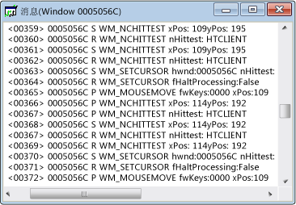

# 消息视图
每个窗口具有关联的消息流。 消息视图窗口显示此消息流。 显示的窗口句柄、 消息代码和消息。 你可以创建线程或进程以及消息视图。 这允许你查看发送到所有 windows 拥有的特定进程或线程，很适合用于捕获窗口初始化消息的消息。  
  
 典型的消息视图窗口如下所示。 请注意，第一列包含的窗口句柄，并且第二列包含消息代码 (中所述[消息代码](../debugger/message-codes.md))。 已解码的消息参数和返回值将位于右侧。  
  
   
Spy++ 消息视图  
  
## 过程  
  
#### 若要打开窗口、 进程或线程的消息视图  
  
1.  焦点移到[Windows 视图](../debugger/windows-view.md)，[进程视图](../debugger/processes-view.md)，或[线程视图](../debugger/threads-view.md)窗口。  
  
2.  查找你想要检查，其消息的项的节点，然后选择它。  
  
3.  从**Spy**菜单上，选择**日志消息**。  
  
     [消息选项对话框](../debugger/message-options-dialog-box.md)打开。  
  
4.  选择你想要显示的消息的选项。  
  
5.  按**确定**开始日志记录消息。  
  
     消息视图窗口将打开，和**消息**菜单添加到 Spy + + 工具栏。 根据所选的选项，消息开始流入活动的消息视图窗口。  
  
6.  在必须足够多的消息，请选择**停止日志记录**从**消息**菜单。  
  
## 本节内容  
 [控制消息视图](../debugger/how-to-control-messages-view.md)  
 说明如何管理消息视图。  
  
 [从查找窗口打开消息视图](../debugger/how-to-open-messages-view-from-find-window.md)  
 说明如何从查找窗口对话框中打开消息视图。  
  
 [搜索消息视图中的某个消息](../debugger/how-to-search-for-a-message-in-messages-view.md)  
 说明如何在消息视图中查找特定的消息。  
  
 [启动和停止显示消息日志](../debugger/how-to-start-and-stop-the-message-log-display.md)  
 说明如何启动和停止消息日志记录。  
  
 [消息代码](../debugger/message-codes.md)  
 定义消息的消息视图中列出的代码。  
  
 [显示消息属性](../debugger/how-to-display-message-properties.md)  
 如何显示一条消息有关的详细信息。  
  
## 相关章节  
 [Spy++ 视图](../debugger/spy-increment-views.md)  
 说明 windows、 消息、 进程和线程 Spy + + 树视图。  
  
 [使用 Spy++](../debugger/using-spy-increment.md)  
 引入了 Spy + + 工具，并说明如何使用它。  
  
 [“消息选项”对话框](../debugger/message-options-dialog-box.md)  
 用于选择要在活动的消息视图中列出的消息。  
  
 [“消息搜索”对话框](../debugger/message-search-dialog-box.md)  
 用于查找的节点中的某个特定消息的消息视图。  
  
 [“消息属性”对话框](../debugger/message-properties-dialog-box.md)  
 用于显示在消息视图中选择一条消息的属性。  
  
 [Spy++ 参考](../debugger/spy-increment-reference.md)  
 包含描述每个 Spy + + 菜单和对话框框中的部分。