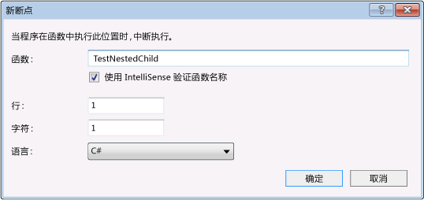

# 使用调试器浏览代码
[!INCLUDE[vs2017banner](../code-quality/includes/vs2017banner.md)]

有多种方法可以在调试程序中浏览代码：单步执行或通过方法、运行到断点或指定位置，并指定是否想要将调试对象限制为自己的代码或包括调试外部代码的符号。  
  
##  <a name="BKMK_Step_into__over__or_out_of_the_code"></a> 单步执行、逐过程执行或跳出代码  
 “单步执行”是最常见的调试过程之一。 “单步执行”即一次执行一行代码。 当你暂停执行时（例如运行调试器到断点），可以使用三个**“调试”**菜单命令来单步执行代码：  
  
|菜单命令|键盘快捷键|描述|  
|----------|-----------|--------|  
|**逐语句**|**F11**|如果某一行包含函数调用，**“逐语句”**仅执行调用本身，然后在函数内的第一个代码行处停止。 否则，请**“逐语句”**执行下一语句。|  
|**逐过程**|**F10**|如果某一行包含函数调用，则**“逐过程”**执行调用函数，然后在调用函数的第一个代码行处停止。 否则，请**“逐语句”**执行下一语句。|  
|**跳出**|**Shift\+F11**|**“跳出”**将一直执行代码，直到函数返回，然后在调用函数中的返回点处中断。|  
  
-   在嵌套函数调用上，**“逐语句”**将进入并单步执行嵌套最深的函数。 如果对类似 `Func1(Func2())` 的调用使用**“逐语句”**，调试器将进入并单步执行函数 `Func2`。  
  
-   实际上，调试器逐句通过代码语句，而不是物理行。 例如，`if` 子句可以写在一行内：  
  
    ```c#  
    int x = 42;  
    string s = "Not answered";  
    if( int x == 42) s = "Answered!";  
    ```  
  
    ```vb  
    Dim x As Integet = 42  
    Dim s As String = "Not answered"  
    If x = 42 Then s = "Answered!"  
    ```  
  
     当你单步执行此行时，调试器将该条件视为一步，将结果视为另一步（在此示例中，条件为 true）。  
  
 若要在逐步执行函数的过程中对调用堆栈进行可视化跟踪，请参阅[调试时映射调用堆栈上的方法](../debugger/map-methods-on-the-call-stack-while-debugging-in-visual-studio.md)。  
  
##  <a name="BKMK_Break_into_code_by_using_breakpoints_or_Break_All"></a> 使用断点或“全部中断”中断代码  
 用 VS 调试器调试应用程序时，应用程序或者正在运行（执行）或处于中断模式。  
  
 当执行到达断点或发生异常时，调试器将中断应用程序的执行。 你还可以随时手动中断执行。  
  
 断点是一个信号，它通知调试器在某个特定点上暂时将应用程序执行挂起。 当执行在某个断点处挂起时，我们称程序处于中断模式。 进入中断模式并不会停止或结束程序的执行；执行可以在任何时候继续。  
  
 大多数调试器功能（例如，在本地窗口中查看变量值，或在“监视”窗口中计算表达式）仅在中断模式下可用。 应用程序的所有元素都将保留（例如，函数、变量和对象都保留在内存中），但其移动和活动将被挂起。 在中断模式下，你可以检查元素的位置和状态，以查看是否存在冲突或 Bug。 在中断模式下，你还可以对应用程序进行调整。  
  
 你可以配置断点，挂起基于多种情况的执行。 请参阅 [使用断点](../debugger/using-breakpoints.md)。 本节描述两种中断代码的基本方式。  
  
1.  **在代码中设置断点**  
  
     若要在代码中设置简单断点，请打开 Visual Studio 编辑器中的源文件。 设置光标要中断的代码行，然后在上下文菜单上选择**“断点”**、**“插入断点”**（键盘：**F9**）。 调试器将在执行该代码行之前中断执行。  
  
       
  
     Visual Studio 中的断点提供了一组丰富的附加功能，例如条件断点和跟踪点。 请参阅 [使用断点](../debugger/using-breakpoints.md)。  
  
2.  **手动中断代码**  
  
     若要在正在执行的应用程序上，中断下一个可用的代码行，请选择**“调试”**、**“全部中断”**（键盘：**Ctrl\+Alt\+Break**）。  
  
-   如果使用“仅我的代码”选项进行调试，则可以在项目的下一个代码行中断执行。 请参阅 [限制单步执行“仅我的代码”](#BKMK_Restrict_stepping_to_Just_My_Code)。  
  
-   如果正在调试多个程序，则默认情况下，断点或“全部中断”命令将影响所有被调试的程序。 请参阅 [配置多个进程的执行行为](../debugger/debug-multiple-processes.md#BKMK_Configure_the_execution_behavior_of_multiple_processes)。  
  
-   如果中断正在执行的代码，而没有响应的源或符号 \(.pdb\) 文件，调试器将显示“未找到源文件”或“未找到符号”页面，帮助你找到相应的文件。 请参阅 [指定符号 \(.pdb\) 和源文件](../debugger/specify-symbol-dot-pdb-and-source-files-in-the-visual-studio-debugger.md)。  
  
     如果你无法访问支持文件，仍可以在“反汇编”窗口中调试汇编指令。  
  
##  <a name="BKMK_Run_to_a_specified_location_or_function"></a> 运行至指定位置或函数  
 有时，你想执行到代码中的某一点，然后停止执行。 如果在想要中断的位置设置了断点，请选择**“调试”**、**“启动调试”**，如果还未启动调试，可以选择**“调试”**、**“继续”**。 （这两种情况下的快捷键都是 **F5**。） 执行代码时，调试器将在下一个断点停止。 选择**“调试”**、**“继续”**，直至到达所需的断点。  
  
 你还可以运行到代码编辑器中光标停放的位置，或者运行到指定的函数。  
  
 **运行到光标处**  
  
 若要运行到光标位置，请将光标放在源窗口中可执行的代码行上。 在编辑器的上下文菜单上，选择**“运行到光标”**。  
  
 **在调用堆栈上运行到函数**  
  
 在**“调用堆栈”**窗口中，选择函数，然后从上下文菜单选择**“运行到光标”**。 若要对调用堆栈进行可视化跟踪，请参阅[调试时映射调用堆栈上的方法](../debugger/map-methods-on-the-call-stack-while-debugging-in-visual-studio.md)。  
  
 **运行到通过名称指定的函数**  
  
 可以命令调试器运行应用程序，直至到达指定的函数。 你可以通过名称指定函数，也可以从调用堆栈中选择函数。  
  
 若要通过名称指定函数，请选择**“调试”**、**“新建断点”**、**“在函数处中断”**，然后输入函数名称和其他标识信息。  
  
   
  
 如果是重载函数，或者函数在多个命名空间，你可以在**“选择断点”**对话框中选择想要的函数。  
  
   
  
##  <a name="BKMK_Set_the_next_statement_to_execute"></a> 设置要执行的下一语句  
 将调试器中断后，你可以移动执行点，设置下一个要执行的代码语句。 源窗口或“反汇编”窗口的空白区域中的黄色箭头标记要执行的下一条语句的位置。 通过移动此箭头，可以跳过部分代码或返回到以前执行过的行。 在某些情况下可以使用此方法，例如，跳过包含已知 bug 的代码段。  
  
   
  
 要设置下一条要执行的语句，请使用以下过程之一：  
  
-   在源窗口中，将黄色箭头拖动希望执行下一语句的位置，该位置应在同一源文件。  
  
-   在源窗口中，将光标放置在希望执行的下一行上，然后在上下文菜单上选择**“设置下一语句”**。  
  
-   在“反汇编”窗口中，将光标放置在希望执行的下一汇编指令上，然后在上下文菜单上选择**“设置下一语句”**。  
  
> [!CAUTION]
>  设置下一条语句将导致程序计数器直接跳到新位置。 使用此命令时要小心：  
>   
>  -   不执行旧执行点和新执行点之间的指令。  
> -   如果向后移动执行点，则不撤消插入的指令。  
> -   将下一条语句移动到另一个函数或范围通常会导致调用堆栈损坏，导致一个运行时错误或异常。 如果尝试将下一条语句移动到另一个范围，则调试器将打开一个含有警告的对话框，并提供一个取消该操作的机会。 在 Visual Basic 中，不能将下一条语句移动到另一个范围或函数。  
> -   在本机 C\+\+ 中，如果已启用运行时检查，设置下一条语句会导致执行到达方法的结尾时引发异常。  
> -   当启用“编辑并继续”时，如果你进行了“编辑并继续”无法立即重新映射的编辑，那么**“设置下一语句”**将失败。 例如，如果你编辑了 catch 块中的代码，将发生这种情况。 发生这种情况时，你将看到一条错误消息，告诉你该操作不受支持。  
  
> [!NOTE]
>  在托管代码中，在以下情况下不能移动下一条语句：  
>   
>  -   下一条语句与当前语句不在同一个方法中。  
> -   使用实时调试启动调试。  
> -   正在展开一个调用堆栈。  
> -   已引发一个 System.StackOverflowException 或 System.Threading.ThreadAbortException 异常。  
  
 应用程序处于活动运行状态时不能设置下一条语句。 要设置下一语句，调试器必须处于中断模式。  
  
##  <a name="BKMK_Restrict_stepping_to_Just_My_Code"></a> 限制单步执行“仅我的代码”  
 有时，你在调试过程中可能只希望查看自己编写的代码，而忽略其他代码（如系统调用）。 为此，可以使用“仅我的代码”调试。 “仅我的代码”将隐藏非用户代码，从而使这些代码不出现在调试器窗口中。 单步执行时，调试器逐句通过所有非用户代码，但不在其中停止。 请参见[仅我的代码](../debugger/just-my-code.md)  
  
> [!NOTE]
>  设备项目不支持“仅我的代码”。  
  
##  <a name="BKMK_Step_into_system_calls"></a> 单步执行系统调用  
 如果你已加载系统代码的调试符号，且未启用“仅我的代码”，则可以单步执行系统调用，就像可以单步执行其他任何调用一样。  
  
 若要访问 Microsoft 符号文件，请参阅[使用符号服务器查找不在你的本地计算机上的符号文件](../debugger/specify-symbol-dot-pdb-and-source-files-in-the-visual-studio-debugger.md#BKMK_Use_symbol_servers_to_find_symbol_files_not_on_your_local_machine)主题中的[指定符号 \(.pdb\) 和源文件](../debugger/specify-symbol-dot-pdb-and-source-files-in-the-visual-studio-debugger.md)。  
  
 在调试时加载特定系统组件的符号：  
  
1.  打开“模块”窗口（键盘：**Ctrl\+Alt\+U**）。  
  
2.  选择要加载符号的模块。  
  
     查看**“符号状态”**列可以了解哪些模块加载了符号。  
  
3.  在上下文菜单中选择**“加载符号”**。  
  
##  <a name="BKMK_Step_into_properties_and_operators_in_managed_code"></a> 单步执行托管代码中的属性和运算符  
 默认情况下，调试器将逐过程执行托管代码中的属性和运算符。 在多数情况下，这会提供较好的调试体验。 若要启用单步执行属性或运算符，请选择**“调试”**、**“选项和设置”**。 在**“调试”**、**“常规”**页面上，清除**“逐过程执行属性和运算符\(仅限托管\)”**复选框