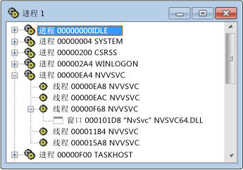

# Processes View
[!INCLUDE[vs2017banner](../code-quality/includes/vs2017banner.md)]

进程视图显示系统中所有活动进程的树。  其中显示了进程 ID 和模块名称。  如果要检查特定系统进程（通常对应于正在执行的程序），请使用进程视图。  进程由模块名称标识，或者可以将其指定为“系统进程”。  
  
 Microsoft Windows 支持多个进程。  每个进程都可以具有一个或多个线程，每个线程可以具有一个或多个关联的顶级窗口。  每个顶级窗口可以拥有一系列窗口。  \+ 符号表示已折叠级别。  折叠的视图对每个进程包含一行。  单击 \+ 符号可展开级别。  
  
 如果要检查特定系统进程（通常对应于正在执行的程序），请使用进程视图。  进程由模块名称标识，或者可以将其指定为“系统进程”。若要查找进程，请折叠树并搜索列表。  
  
## 过程  
  
#### 打开进程视图  
  
1.  从“监视”菜单中选择“进程”。  
  
   
Spy\+\+ 进程视图  
  
 上图显示进程和线程节点已展开的进程视图。  
  
### 本节内容  
 [在进程视图中搜索进程](../debugger/how-to-search-for-a-process-in-processes-view.md)  
 说明如何在进程视图中查找特定进程。  
  
 [显示进程属性](../debugger/how-to-display-process-properties.md)  
 说明如何显示有关消息的更多信息。  
  
### 相关章节  
 [Spy\+\+ 视图](../debugger/spy-increment-views.md)  
 说明窗口、消息、进程和线程的 Spy\+\+ 树视图。  
  
 [使用 Spy\+\+](../debugger/using-spy-increment.md)  
 介绍 Spy\+\+ 工具并说明如何使用。  
  
 [“进程搜索”对话框](../debugger/process-search-dialog-box.md)  
 用于在进程视图中查找特定进程的节点。  
  
 [“进程属性”对话框](../debugger/process-properties-dialog-box.md)  
 显示在进程视图中选择的进程的属性。  
  
 [Spy\+\+ 参考](../debugger/spy-increment-reference.md)  
 包含描述各个 Spy\+\+ 菜单和对话框的章节。