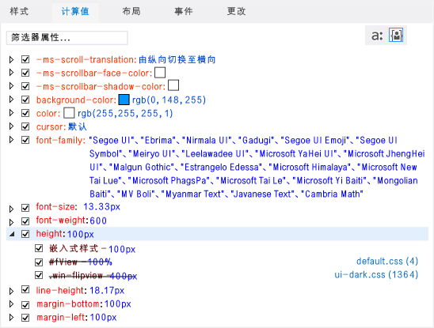
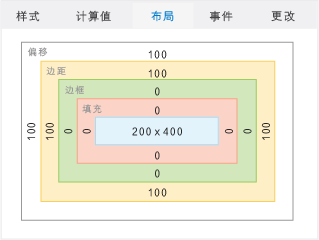
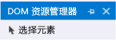

# 快速入门：调试 HTML 和 CSS
[!INCLUDE[vs2017banner](../code-quality/includes/vs2017banner.md)]

  
  
 Visual Studio 针对 JavaScript 应用提供全面的调试体验，其中包括 Internet Explorer 和 Visual Studio 开发人员熟悉的多项功能。 这些功能支持 [!INCLUDE[win8_appname_long](../debugger/includes/win8_appname_long_md.md)]、Windows Phone 应用商店应用，以及使用用于 Apache Cordova 的 Visual Studio 工具创建的应用。  
  
 通过使用 DOM 检查工具所提供的交互式调试模型，你可以查看并修改所呈现的 HTML 和 CSS 代码。 你可以在不停止并重新启动调试器的情况下执行这一切操作。  
  
 在本主题中：  
  
-   [检查实时 DOM](#InspectingDOM)  
  
-   [选择元素](#SelectingElements)  
  
 有关使用 DOM 资源管理器的附加信息，请参见下列主题：  
  
-   [使用 DOM 资源管理器调试 CSS 样式](../debugger/debug-css-styles-using-dom-explorer.md)  
  
-   [使用 DOM 资源管理器调试布局](../debugger/debug-layout-using-dom-explorer.md)  
  
-   [查看 DOM 事件侦听器](../debugger/view-dom-event-listeners.md)  
  
-   [刷新应用程序 \(JavaScript\)](../debugger/refresh-an-app-javascript.md)  
  
-   [调试 WebView 控件](../debugger/debug-a-webview-control.md)  
  
 有关其他 JavaScript 调试功能（例如，使用 JavaScript 控制台窗口和设置断点）的信息，请参见 [快速入门：调试 JavaScript](../debugger/quickstart-debug-javascript-using-the-console.md) 和 [在 Visual Studio 中调试应用程序](../debugger/debug-store-apps-in-visual-studio.md)。  
  
##  <a name="InspectingDOM"></a> 检查实时 DOM  
 DOM 资源管理器展示所呈现的页面的视图，还可使用 DOM 资源管理器更改值并立即看到结果。 这使你可以在无需停止和重新启动调试器的情况下测试更改。 使用此方法与页面进行交互时不更改项目中的源代码，因此当发现代码中要更正的内容时，请对源代码作出更改。  
  
> [!TIP]
>  若要在更改源代码时避免停止和重新启动调试器，你可以使用“调试”工具栏上的**“刷新 Windows 应用”**按钮（或按 F4）刷新应用。 有关详细信息，请参阅 [刷新应用程序 \(JavaScript\)](../debugger/refresh-an-app-javascript.md)。  
  
 可使用 DOM 资源管理器：  
  
-   在 DOM 元素子树中导航并检查所呈现的 HTML、CSS 和 JavaScript 代码。  
  
-   动态编辑所呈现元素的特性和 CSS 样式，并立即看到结果。  
  
-   检查如何将 CSS 样式应用到页元素，并跟踪已应用的规则。  
  
 调试应用程序时，通常需要在 DOM 资源管理器中选择元素。 选择某个元素后，DOM 资源管理器右侧选项卡上显示的值将自动更新，以反映 DOM 资源管理器中的选定元素。 这些选项卡是：“样式”、“计算”、“布局”。 Windows 应用商店应用还支持“事件”和“更改”选项卡。 有关选择元素的详细信息，请参见[选择元素](#SelectingElements)。  
  
> [!TIP]
>  如果“DOM 资源管理器”窗口已关闭，请依次选择“调试”\>“窗口”\>“DOM 资源管理器”以重新打开它。 仅在脚本调试会话期间显示该窗口。  
  
 在后续过程中，我们将通过使用 DOM 资源管理器完成以交互方式调试应用程序的过程。 我们将创建一个使用 `FlipView` 控件的应用程序，然后调试它。 此应用程序包含若干错误。  
  
> [!WARNING]
>  以下示例应用是一个 Windows 应用商店应用。 Cordova 支持以上相同的功能，但应用会有所不同。  
  
#### 通过检查实时 DOM 进行调试  
  
1.  通过选择**“文件”**\>**“新建项目”**，在 Visual Studio 中创建一个新解决方案。  
  
2.  选择**“JavaScript”**\>**“应用商店”**，再选择**“Windows 应用”**或**“Windows Phone 应用”**，然后选择**“空白应用”**。  
  
3.  为项目输入名称（如 `FlipViewApp`），然后选择“确定”以创建应用。  
  
4.  在 default.html 的 BODY 元素中，添加以下这段代码：  
  
    ```html  
    <div id="flipTemplate" data-win-control="WinJS.Binding.Template" style="display:none"> <div class="fixedItem" >  </div> </div> <div id="fView" style="width:100px;height:100px" data-win-control="WinJS.UI.FlipView" data-win-options="{ itemDataSource: Data.items.dataSource, itemTemplate: flipTemplate }"> </div>  
    ```  
  
5.  打开 default.css，然后添加以下 CSS：  
  
    ```css  
    #fView { background-color:#0094ff; height: 100%; width: 100%; margin: 25%; }  
    ```  
  
6.  将 default.js 中的代码替换为以下这段代码：  
  
    ```javascript  
    (function () { "use strict"; var app = WinJS.Application; var activation = Windows.ApplicationModel.Activation; var myData = []; for (var x = 0; x < 4; x++) { myData[x] = { flipImg: "/images/logo.png" } }; var pages = new WinJS.Binding.List(myData, { proxy: true }); app.onactivated = function (args) { if (args.detail.kind === activation.ActivationKind.launch) { if (args.detail.previousExecutionState !== activation.ApplicationExecutionState.terminated) { // TODO: . . . } else { // TODO: . . . } args.setPromise(WinJS.UI.processAll()); updateImages(); } }; function updateImages() { pages.setAt(0, { flipImg: "http://go.microsoft.com/fwlink/?LinkID=223195" }); pages.setAt(1, { flipImg: "http://go.microsoft.com/fwlink/?LinkID=223196" }); pages.setAt(2, { flipImg: "http://go.microsoft.com/fwlink/?LinkID=223197" }); }; app.oncheckpoint = function (args) { }; app.start(); var publicMembers = { items: pages }; WinJS.Namespace.define("Data", publicMembers); })();  
    ```  
  
     下图显示了在 Phone 仿真程序中运行该应用程序（与模拟器中的情况类似）时希望看到的状态。 但是，若要让应用程序进入此状态，我们必须先修复大量 Bug。  
  
       
  
7.  从**“调试”**工具栏上的**“启动调试”**按钮旁的下拉列表中，选择**“模拟器”**或**“仿真程序 8.1 WVGA 4 英寸 512MB”**：  
  
       
  
8.  选择**“调试”**\>**“启动调试”**或按 F5，以调试模式运行应用。  
  
     这样将在模拟器或 Phone 仿真程序中运行应用程序，但是，你将看到几乎空白的屏幕，因为样式中有几个 Bug。 第一个 `FlipView` 图像显示在屏幕中间附近的小正方形中。  
  
9. 如果你正在模拟器中运行应用，请选择模拟器右侧的**“更改分辨率”**工具栏命令以配置 1280 x 800 的屏幕分辨率。 这将确保下列步骤中显示的值与你在模拟器中看到的值匹配。  
  
10. 切换到 Visual Studio 并选择**“DOM 资源管理器”**选项卡。  
  
    > [!TIP]
    >  可按 Alt\+Tab 或 F12，在 Visual Studio 和正在运行的应用程序之间切换。  
  
11. 在“DOM 资源管理器”窗口中，选择 ID 为 `"fView"` 的部分的 DIV 元素。 使用箭头键可以查看并选择正确的 DIV 元素。 （使用右键头键可以查看元素的子元素。）  
  
       
  
    > [!TIP]
    >  也可通过在 \>\> 输入提示符下键入 `select(fView)`，然后按 Enter，在“JavaScript 控制台”窗口的左下角选择此 DIV 元素。  
  
     “DOM 资源管理器”窗口的右侧选项卡上显示的值将自动更新，以反映 DOM 资源管理器中的当前元素。  
  
12. 选择右侧的**“计算”**选项卡。  
  
     此选项卡显示选定 DOM 元素的每个属性的计算值或最终值。  
  
13. 打开高度 CSS 规则。 请注意，有一个级联样式设置为 100px，似乎与为 `#fView` CSS 选择器设置的 100% 的高度值不一致。`#fView` 选择器的带有删除线的文本指示内联样式优先于该样式。  
  
     下图显示了**“已计算”**选项卡。  
  
       
  
14. 在“DOM 资源管理器”主窗口中，双击 `fView` DIV 元素的高度和宽度的级联样式。 现在可以在此处编辑这些值。 在此方案中，我们需要完全移除它们。  
  
15. 选择 `width: 100px;height: 100px;`，并按 Delete 键，然后按 Enter。 按 Enter 后，模拟器或 Phone 仿真程序中将立即反映新值，即使尚未停止调试会话也是如此。  
  
    > [!IMPORTANT]
    >  你不但可以在“DOM 资源管理器”窗口中更新特性，还可更新**“样式”**、**“已计算”**和**“布局”**选项卡上显示的值。 有关更多信息，请参见[使用 DOM 资源管理器调试 CSS 样式](../debugger/debug-css-styles-using-dom-explorer.md)和[使用 DOM 资源管理器调试布局](../debugger/debug-layout-using-dom-explorer.md)。  
  
16. 通过选择模拟器或 Phone 仿真程序，或通过使用 Alt\+Tab 切换到此应用程序。  
  
     现在，`FlipView` 控件的外观大于模拟器或 Phone 仿真程序的屏幕大小。 这并不是预期的结果。 若要进行调查，请切回到 Visual Studio。  
  
17. 在 DOM 资源管理器中，再次选择**“计算”**选项卡并打开高度规则。 fView 元素仍显示 CSS 中的预期值 100%，但计算值等于模拟器的屏幕高度（例如，800px 或 667.67px），这不是我们希望此应用程序具有的值。 若要进行调查，可移除 `fView` DIV 元素的高度和宽度。  
  
18. 在**“样式”**选项卡中，取消选中 `#fView` CSS 选择器的高度和宽度属性。  
  
     **“计算”**选项卡现在显示高度 400px。 信息指示此值来自平台 CSS 文件 ui\-dark.css 中指定的 .win\-flipview 选择器。  
  
19. 切回到此应用程序。  
  
     情况有所好转。 然而，还有一个问题有待解决，那就是边距看上去太大。  
  
20. 若要进行调查，请切换到 Visual Studio 并选择**“布局”**选项卡查看元素的框模型。  
  
     在**“布局”**选项卡中，你会看到以下值：  
  
    -   对于模拟器：320px（偏移量）和 320px（边距）。  
  
    -   对于 Phone 仿真程序：100px（偏移量）和 100px（边距）。  
  
     下图显示了使用 Phone 仿真程序（100px 的偏移量和边距）时**“布局”**选项卡的外观。  
  
       
  
     这似乎并不合适。**“计算”**选项卡也显示相同的边距值。  
  
21. 选择**“样式”**选项卡，并找到 `#fView` CSS 选择器。 在这里，你将看到**“边距”**属性的值为 25%。  
  
22. 选择 25% 并将其更改为 25px，然后按 Enter。  
  
23. 同样，在**“样式”**选项卡中，选择 .win\-flipview 选择器的高度规则并将 400px 更改为 500px，然后按 Enter。  
  
24. 切回到应用程序，你会发现元素的位置显示正确。 若要修复源并刷新应用程序，而不停止并重新启动调试器，请参见以下过程。  
  
#### 若要在调试期间刷新应用程序，请执行以下操作  
  
1.  在应用程序仍在运行时，切换至 Visual Studio。  
  
2.  打开 default.html，然后通过将 `"fView"` DIV 元素的 height 和 width 均设置为 100%，对源代码进行修改。  
  
3.  选择“调试”工具栏上的**“刷新 Windows 应用程序”**按钮（或按 F4）。 该按钮如下所示：。  
  
     随后将重新加载应用程序页面，并且模拟器或 Phone 仿真程序将返回前台。  
  
     有关“刷新”功能的详细信息，请参见[刷新应用程序 \(JavaScript\)](../debugger/refresh-an-app-javascript.md)。  
  
##  <a name="SelectingElements"></a> 选择元素  
 在调试应用程序时，可以通过三种方式选择 DOM 元素：  
  
-   通过在“DOM 资源管理器”窗口中直接单击元素（或通过使用箭头键）。  
  
-   通过使用**“选择元素”**按钮 \(Ctrl\+B\)。  
  
-   通过使用 `select` 命令（该命令是 [JavaScript 控制台命令](../debugger/javascript-console-commands.md)之一）。  
  
 在使用“DOM 资源管理器”窗口选择元素并将鼠标指针置于一个元素上时，正在运行的应用程序中会突出显示相应的元素。 必须在 DOM 资源管理器中单击该元素以将其选定，也可以使用箭头键突出显示并选择元素。此外，还可以使用**“选择元素”**按钮在 DOM 资源管理器中选择元素。 下图显示**“选择元素”**按钮。  
  
   
  
 单击**“选择元素”**（或按 Ctrl\+B）将更改选择模式，以使你在正在运行的应用程序中单击某项，即可在 DOM 资源管理器中选择该项。 单击之后，模式将变回正常选择模式。 单击**“选择元素”**后，应用程序转入前台，而光标发生变化以反映新的选择模式。 单击有轮廓包围的元素后，DOM 资源管理器将返回前台，并选中了指定的元素。  
  
 在选择**“选择元素”**之前，可通过切换**“显示网页突出显示”**按钮来指定是否在正在运行的应用中突出显示元素。 下图显示了该按钮。 默认情况下，将显示突出显示的元素。  
  
   
  
 在选择突出显示元素时，将突出显示模拟器中指针悬停在其上方的元素。 突出显示的元素的颜色与 DOM 资源管理器的**“布局”**选项卡中显示的方框模型匹配。  
  
> [!NOTE]
>  指针悬停在元素上方时突出显示的元素在 Windows Phone 模拟器中仅部分受支持。  
  
 有关演示如何使用**“选择元素”**按钮选择元素的示例，请参见[使用 DOM 资源管理器调试 CSS 样式](../debugger/debug-css-styles-using-dom-explorer.md)。  
  
##  <a name="BrowserSupport"></a> 浏览器和平台支持  
 JavaScript 的 Visual Studio 工具、DOM 资源管理器和 JavaScript 控制台窗口在以下平台上受支持：  
  
-   使用 JavaScript 和 HTML 的 [!INCLUDE[win8_appname_long](../debugger/includes/win8_appname_long_md.md)] 和 Windows Phone 应用商店应用  
  
-   在 [!INCLUDE[win81](../debugger/includes/win81_md.md)] 上运行的 Internet Explorer 11  
  
-   在 [!INCLUDE[win8](../debugger/includes/win8_md.md)] 上运行的 Internet Explorer 10  
  
 请前往[此处](http://go.microsoft.com/fwlink/?LinkID=232448)下载 [!INCLUDE[win8](../debugger/includes/win8_md.md)] 和 Visual Studio。  
  
## 请参阅  
 [在 Visual Studio 中调试应用程序](../debugger/debug-store-apps-in-visual-studio.md)   
 [使用 DOM 资源管理器调试 CSS 样式](../debugger/debug-css-styles-using-dom-explorer.md)   
 [使用 DOM 资源管理器调试布局](../debugger/debug-layout-using-dom-explorer.md)   
 [查看 DOM 事件侦听器](../debugger/view-dom-event-listeners.md)   
 [刷新应用程序 \(JavaScript\)](../debugger/refresh-an-app-javascript.md)   
 [调试 WebView 控件](../debugger/debug-a-webview-control.md)   
 [键盘快捷键](../debugger/keyboard-shortcuts-html-and-javascript.md)   
 [JavaScript 控制台命令](../debugger/javascript-console-commands.md)   
 [调试 HTML、CSS 和 JavaScript 示例代码](../debugger/debug-html-css-and-javascript-sample-code.md)   
 [产品支持和辅助功能](http://msdn.microsoft.com/library/tzbxw1af\(VS.120\).aspx)