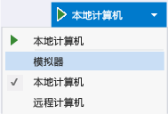
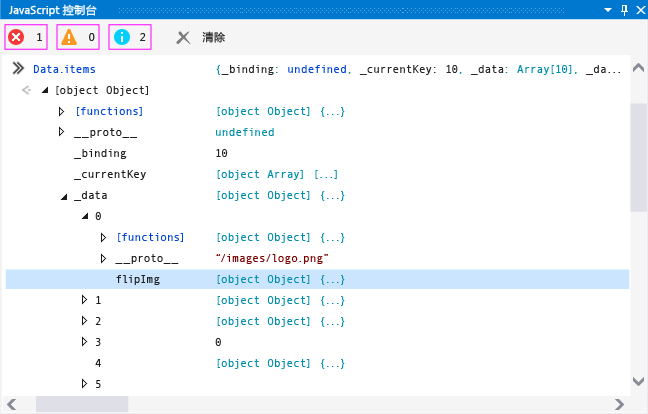
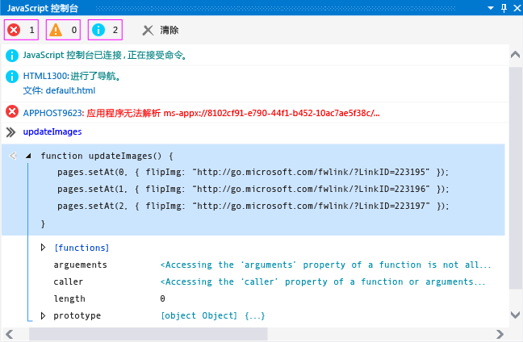

# 快速入门：使用控制台调试 JavaScript
[!INCLUDE[vs2017banner](../code-quality/includes/vs2017banner.md)]

  
  
 可以使用 JavaScript 控制台窗口中与使用 JavaScrip 生成的应用商店应用进行交互并对它进行调试。 这些功能支持 [!INCLUDE[win8_appname_long](../debugger/includes/win8_appname_long_md.md)] 应用、Windows Phone 应用商店应用，以及使用用于 Apache Cordova 的 Visual Studio 工具创建的应用。 有关控制台命令参考的信息，请参见 [JavaScript 控制台命令](../debugger/javascript-console-commands.md)。  
  
 “JavaScript 控制台”窗口允许你执行以下操作：  
  
-   将对象、值和消息从应用发送到控制台窗口。  
  
-   查看和修改正在运行的应用中局部和全局变量的值。  
  
-   查看对象可视化工具。  
  
-   运行在当前脚本上下文中执行的 JavaScript 代码。  
  
-   查看 JavaScript 错误和异常，以及文档对象模型 \(DOM\) 和 Windows 运行时异常。  
  
-   执行其他任务，如清除屏幕。 有关完整的命令列表，请参见 [JavaScript 控制台命令](../debugger/javascript-console-commands.md)。  
  
 在本主题中：  
  
-   [使用“JavaScript 控制台”窗口进行调试](#InteractiveConsole)  
  
-   [交互式调试和中断模式](#InteractiveDebuggingBreakMode)  
  
-   [JavaScript 控制台窗口中的单行模式和多行模式](#SinglelineMultilineMode)  
  
-   [切换脚本执行上下文](#Switching)  
  
> [!TIP]
>  如果 JavaScript 控制台窗口处于关闭状态，请依次选择“调试”\>“窗口”\>“JavaScript 控制台”以重新打开它。 该窗口仅在脚本调试会话期间出现。  
  
 使用“JavaScript 控制台”窗口，你可以在无需停止和重新启动调试器的情况下与应用交互。 有关详细信息，请参阅 [刷新应用程序 \(JavaScript\)](../debugger/refresh-an-app-javascript.md)。 有关其他 JavaScript 调试功能（例如 DOM 资源管理器和设置断点）的信息，请参见[快速入门：调试 HTML 和 CSS](../debugger/quickstart-debug-html-and-css.md)和[在 Visual Studio 中调试应用程序](../debugger/debug-store-apps-in-visual-studio.md)。  
  
##  <a name="InteractiveConsole"></a> 使用“JavaScript 控制台”窗口进行调试  
 以下步骤会创建一个 `FlipView` 应用并演示如何以交互方式调试 JavaScript 编码错误。  
  
> [!CAUTION]
>  此处的示例应用是一个 Windows 应用商店应用。 但是，此处所述的控制台功能也适用于使用 Visual Studio Tools for Apache Cordova 创建的应用。  
  
#### 调试 FlipView 应用中的 JavaScript 代码  
  
1.  通过选择**“文件”**\>**“新建项目”**，在 Visual Studio 中创建一个新解决方案。  
  
2.  选择**“JavaScript”**\> **“应用商店应用”**，选择**“Windows 应用程序”**或“**Windows Phone 应用程序”**，然后选择**“空白应用程序”**。  
  
3.  为项目输入名称（如 `FlipViewApp`），然后选择“确定”以创建应用。  
  
4.  在 default.html 的 BODY 元素中，将现有 HTML 代码替换为以下代码：  
  
    ```html  
    <div id="flipTemplate" data-win-control="WinJS.Binding.Template" style="display:none"> <div class="fixedItem" >  </div> </div> <div id="fView" data-win-control="WinJS.UI.FlipView" data-win-options="{ itemDataSource: Data.items.dataSource, itemTemplate: flipTemplate }"> </div>  
    ```  
  
5.  打开 default.css，然后为 `#fView` 选择器添加 CSS：  
  
    ```css  
    #fView { background-color:#0094ff; height: 500px; margin: 25px; }  
    ```  
  
6.  打开 default.js，将代码替换为以下 JavaScript 代码：  
  
    ```javascript  
    (function () { "use strict"; var app = WinJS.Application; var activation = Windows.ApplicationModel.Activation; var myData = []; for (var x = 0; x < 4; x++) { myData[x] = { flipImg: "/images/logo.png" } }; var pages = new WinJS.Binding.List(myData, { proxy: true }); app.onactivated = function (args) { if (args.detail.kind === activation.ActivationKind.launch) { if (args.detail.previousExecutionState !== activation.ApplicationExecutionState.terminated) { // TODO: . . . } else { // TODO: . . . } args.setPromise(WinJS.UI.processAll()); updateImages(); } }; function updateImages() { pages.push(0, { flipImg: "http://go.microsoft.com/fwlink/?LinkID=223195" }); pages.push(1, { flipImg: "http://go.microsoft.com/fwlink/?LinkID=223196" }); pages.push(2, { flipImg: "http://go.microsoft.com/fwlink/?LinkID=223197" }); }; app.oncheckpoint = function (args) { }; app.start(); var publicMembers = { items: pages }; WinJS.Namespace.define("Data", publicMembers); })();  
    ```  
  
7.  如果尚未选择调试目标，请从**“调试”**工具栏上**“设备”**按钮旁边的下拉列表中，为 Windows Phone 选择**“模拟器”**或**“仿真程序 8.1 WVGA 4 英寸 512MB”**：  
  
       
  
8.  按 F5 启动调试器。  
  
     应用会运行，但缺少图像。 JavaScript 控制台窗口中的 APPHOST 错误指示缺少图像。  
  
9. 在 `FlipView` 应用在模拟器或 Phone 仿真程序中运行期间，在控制台窗口输入提示中（“\>\>”符号旁）键入 `Data.items`，并按 Enter。  
  
     `items` 对象的可视化工具会出现在控制台窗口中。 这指示 `items` 对象进行了实例化，并且在当前脚本上下文中可用。 在控制台窗口中，可以在对象的各个节点中单击以查看属性值（或使用箭头键）。 如果向下单击到 `items._data` 对象（如图所示），则会发现其图像源引用不正确（与预期一样）。 该对象中存在的仍是默认图像 \(logo.png\)，并且有缺少的图像与预期的图像交织在一起。  
  
       
  
     另请注意，`items._data` 对象中的项目远比你预期的要多。  
  
10. 在提示符下，键入 `Data.items.push` 并按 Enter。 控制台窗口会显示 `push` 函数（在 [!INCLUDE[winjs_long](../debugger/includes/winjs_long_md.md)] 项目文件中实现）的可视化工具。 在此应用中，我们使用 `push` 添加正确的项。 通过使用 IntelliSense 进行少量调查，我们发现应使用 `setAt` 替换默认图像。  
  
11. 若要以交互方式修复此问题而不停止调试会话，请打开 default.js，然后从 `updateImages` 函数中选择以下代码：  
  
    ```javascript  
    pages.push(0, { flipImg: "http://go.microsoft.com/fwlink/?LinkID=223195" }); pages.push(1, { flipImg: "http://go.microsoft.com/fwlink/?LinkID=223196" }); pages.push(2, { flipImg: "http://go.microsoft.com/fwlink/?LinkID=223197" });  
    ```  
  
     将此代码复制并粘贴到 JavaScript 控制台输入提示中。  
  
    > [!TIP]
    >  将多行代码粘贴到 JavaScript 控制台输入提示中时，控制台输入提示会自动切换到多行模式。 可以按 Ctrl\+Alt\+M 来打开和关闭多行模式。 若要在多行模式下运行脚本，请按 Ctrl\+Enter 或选择窗口右下角的箭头符号。 有关详细信息，请参阅 [JavaScript 控制台窗口中的单行模式和多行模式](#SinglelineMultilineMode)。  
  
12. 在提示中更正 `push` 函数调用（将 `pages.push` 替换为 `Data.items.setAt`）。 更正后的代码应类似于：  
  
    ```javascript  
    Data.items.setAt(0, { flipImg: "http://go.microsoft.com/fwlink/?LinkID=223195" }); Data.items.setAt(1, { flipImg: "http://go.microsoft.com/fwlink/?LinkID=223196" }); Data.items.setAt(2, { flipImg: "http://go.microsoft.com/fwlink/?LinkID=223197" });  
    ```  
  
    > [!TIP]
    >  如果要使用 `pages` 对象而不是 `Data.items`，则需要在代码中设置断点以使 `pages` 对象处于范围中。  
  
13. 选择绿色箭头符号以运行脚本。  
  
14. 按 Ctrl\+Alt\+M 以将控制台输入提示切换为单行模式，然后选择**“清除输入”**（红色“X”）以从输入提示符中删除代码。  
  
15. 在提示符下，键入 `Data.items.length = 3`，并按 Enter。 这会从数据中移除额外的元素。  
  
16. 再次检查模拟器或 Phone 仿真程序，你会看到正确的图像位于正确的 `FlipView` 页面上。  
  
17. 在 DOM 资源管理器中，可以查看更新后的 DIV 元素，并且可以导航到子树中以查找预期的 IMG 元素。  
  
18. 选择**“调试”**\>**“停止调试”**或按 Shift\+F5 停止调试，然后修复源代码。  
  
     有关包含更正后的示例代码的完整 default.html 页，请参见[调试 HTML、CSS 和 JavaScript 示例代码](../debugger/debug-html-css-and-javascript-sample-code.md)。  
  
##  <a name="InteractiveDebuggingBreakMode"></a> 交互式调试和中断模式  
 可以在使用 JavaScript 调试工具（如 JavaScript 控制台窗口）时使用断点和单步执行代码。 当在调试器中运行的程序遇到断点时，调试器会临时挂起程序的执行。 当执行挂起时，程序会从运行模式切换为中断模式。 可以随时恢复执行。  
  
 当程序处于中断模式时，可以使用 JavaScript 控制台窗口运行在当前脚本执行上下文中有效的脚本和命令。 在此过程中，你会使用之前创建的已修复版本的 `FlipView` 应用，来演示中断模式的使用。  
  
#### 设置断点和调试应用  
  
1.  在之前创建的 `FlipView` 应用的 default.html 文件中，打开 `updateImages()` 函数的快捷菜单，然后选择**“断点”**\>**“插入断点”**。  
  
2.  在**“调试”**工具栏上的**“启动调试”**按钮旁的下拉列表中，选择**“本地计算机”**或**“仿真程序 8.1 WVGA 4 英寸 512MB”**。  
  
3.  选择**“调试”**\>**“启动调试”**，或按 F5。  
  
     当执行过程抵达 `updateImages()` 函数时，应用程序进入中断模式，并以黄色突出显示程序执行的当前行。  
  
       
  
     更改变量的值即可立即影响程序状态，而不会结束当前的调试会话。  
  
4.  在提示符下，键入 `updateImages`，并按 Enter。 该函数的可视化工具会出现在控制台窗口中。  
  
5.  在控制台窗口中选择该函数以显示函数实现。  
  
     下图显示了此时的控件台窗口。  
  
       
  
6.  将下面这行函数从输出窗口复制到输入提示符下，并将索引值更改为 3：  
  
    ```javascript  
    pages.setAt(3, { flipImg: "http://go.microsoft.com/fwlink/?LinkID=223197" });  
    ```  
  
7.  按 Enter 以运行该代码行。  
  
     如果要逐行单步执行代码，请按 F11，或按 F5 以继续执行程序。  
  
8.  按 F5 继续执行程序。`FlipView` 应用会出现，现在所有四个页面都会显示一个非默认图像。  
  
     若要切换回 Visual Studio，请按 F12 或 Alt\+Tab。  
  
##  <a name="SinglelineMultilineMode"></a> JavaScript 控制台窗口中的单行模式和多行模式  
 JavaScript 控制台窗口的输入提示支持单行模式和多行模式。 本主题中的交互式调试过程提供了使用这两种模式的示例。 可以按  Ctrl\+Alt\+M 在模式之间切换。  
  
 单行模式提供输入历史记录。 可以使用向上键和向下键在输入历史记录中进行导航。 运行脚本时，单行模式会清除输入提示。 若要在单行模式下运行脚本，请按 Enter。  
  
 运行脚本时，多行模式不清除输入提示。 从多行模式切换到单行模式时，可以通过按**“清除输入”**（红色“X”）来清除输入行。 若要在多行模式下运行脚本，请按 Ctrl\+Enter 或选择窗口右下角的箭头符号。  
  
##  <a name="Switching"></a> 切换脚本执行上下文  
 JavaScript 控制台窗口允许一次与单个执行上下文（表示 Web 平台主机 \(WWAHost.exe\) 的单个实例）进行交互。 在某些情况下，应用可能会启动主机的另一个实例，例如在使用 `iframe`、共享协定、Web 辅助进程或 `WebView` 控件时。 如果主机的另一个实例正在运行，则可以通过在**“目标”**列表中选择执行上下文，在运行应用时选择不同的执行上下文。  
  
 下图显示了“JavaScript 控件台”窗口中的“目标”列表。  
  
   
  
 你也可以使用 `cd` 命令切换执行上下文，但是你必须知道其他执行上下文的名称并且你使用的引用必须在范围内。**“目标”**列表提供更好的方式来访问其他执行上下文。  
  
##  <a name="BrowserSupport"></a> 浏览器和平台支持  
 在以下平台上支持 JavaScript 控制台窗口：  
  
-   使用 JavaScript 和 HTML 的 [!INCLUDE[win8_appname_long](../debugger/includes/win8_appname_long_md.md)] 和 Windows Phone 应用商店应用  
  
-   在 [!INCLUDE[win81](../debugger/includes/win81_md.md)] 上运行的 Internet Explorer 11  
  
-   在 [!INCLUDE[win8](../debugger/includes/win8_md.md)] 上运行的 Internet Explorer 10  
  
## 请参阅  
 [在 Visual Studio 中调试应用程序](../debugger/debug-store-apps-in-visual-studio.md)   
 [JavaScript 控制台命令](../debugger/javascript-console-commands.md)   
 [刷新应用程序 \(JavaScript\)](../debugger/refresh-an-app-javascript.md)   
 [键盘快捷键](../debugger/keyboard-shortcuts-html-and-javascript.md)   
 [调试 HTML、CSS 和 JavaScript 示例代码](../debugger/debug-html-css-and-javascript-sample-code.md)   
 [快速入门：调试 HTML 和 CSS](../debugger/quickstart-debug-html-and-css.md)   
 [调试 WebView 控件](../debugger/debug-a-webview-control.md)   
 [产品支持和辅助功能](http://msdn.microsoft.com/library/tzbxw1af\(VS.120\).aspx)