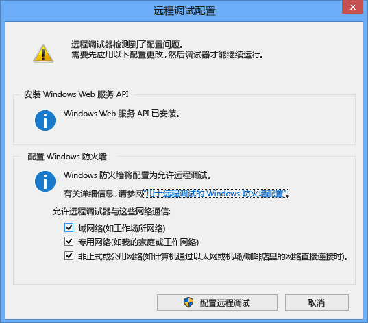
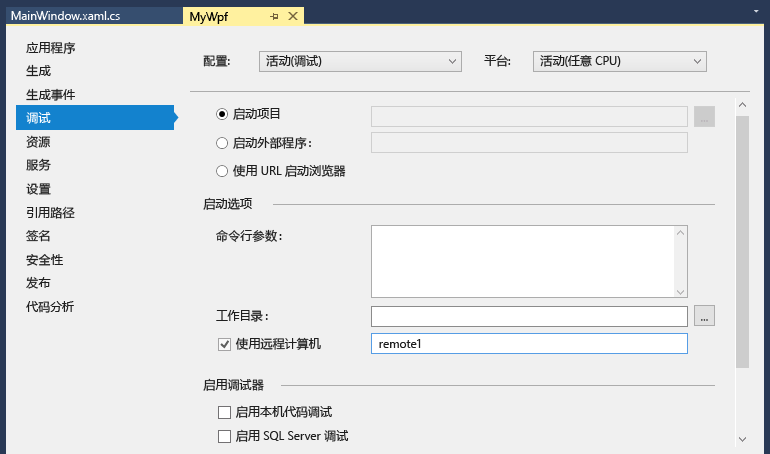

# 远程调试
[!INCLUDE[vs2017banner](../code-quality/includes/vs2017banner.md)]

你可以调试已部署在另一台计算机的 Visual Studio 应用程序。  要进行此操作，可使用 Visual Studio 远程调试器。  
  
 此处的信息适用于 Windows 桌面应用程序和 ASP.NET 应用程序。  有关远程调试 Windows 应用商店应用程序和 Azure 应用程序的信息，请参阅 [Windows 应用商店和 Azure 应用上的远程调试](#bkmk_winstoreAzure)。  
  
## 下载和安装远程工具  
 你可以在[用于 Visual Studio 2015 的远程工具](https://www.microsoft.com/en-us/download/details.aspx?id=48155)上下载用于调试的远程工具。 你可以选择 x86、x64 和 ARM 版本的工具。 完成下载可执行文件后，请按照说明在远程计算机上安装该应用程序。  
  
 你可以在[用于 isual Studio 2015 Update 1 的远程工具](https://www.microsoft.com/en-us/download/details.aspx?id=49986&44F86079-8679-400C-BFF2-9CA5F2BCBDFC=1)上下载远程工具的 Update 1 版本。  
  
> [!IMPORTANT]
>  你必须安装与你的 Visual Studio 安装相匹配的远程工具版本。 不匹配的版本不受支持。 此外，必须安装与你想要调试的应用程序具有相同的体系结构的远程工具。 换而言之，如果想要调试 64 位应用程序，则必须安装远程工具的 64 位版本。  
  
 如果远程计算机已经安装了 Visual Studio 2015 社区版、专业版或企业版，且已安装远程调试器 \(**msvsmon.exe**\)，则可以从其目录启动：  
  
 **\<Visual Studio installation directory\>\\Common7\\IDE\\Remote Debugger\\\(x64, x86, Appx\)\\msvsmon.exe**  
  
 但是，**远程调试器配置向导** \(**rdbgwiz.exe**\) 仅会在下载和安装此工具时才安装，并且你稍后配置时（特别是如果你想要将远程调试器作为一项服务运行时）可能会用到该向导。 有关详细信息，请参阅下面的 [将远程调试器配置为服务](#bkmk_configureService)。  
  
## 支持的操作系统  
 远程计算机运行的是下列操作系统之一：  
  
-   Windows 10  
  
-   Windows 8 或 8.1  
  
-   Windows 7 Service Pack 1  
  
-   Windows Server 2012 或 Windows Server 2012 R2  
  
-   Windows Server 2008 Service Pack 2、Windows Server 2008 R2 Service Pack 1  
  
## 支持的硬件配置  
  
-   1.6 GHz 或更快的处理器  
  
-   1 GB 的 RAM（如果在虚拟机上运行则需 1.5 GB）  
  
-   1 GB 的可用硬盘空间  
  
-   5400 RPM 硬盘驱动器  
  
-   DirectX 9 支持的视频卡，可在 1024 x 768 或更高版本的显示分辨率下运行  
  
## 网络配置  
 远程计算机与 Visual Studio 计算机必须通过网络、工作组、家庭组或其他通过以太网电缆直接连接的方式连接在一起。 不支持通过 Internet 进行调试。  
  
## 设置远程调试器  
 必须在远程计算机上具有管理权限  
  
1.  定位远程调试器应用程序。 你可以在“开始”菜单中搜索“远程调试器”。  
  
2.  当第一次（或在配置它之前）启动远程工具时，将出现“远程调试配置”对话框。  
  
       
  
3.  如果 Windows 服务 API 未安装（仅在 Windows Server 2008 R2 上发生这种情况），选择“安装”按钮。  
  
4.  选择你想要在上面使用远程工具的网络类型。 必须至少选择一种网络类型。 如果这些计算机通过域连接，则必须选择第一项。 如果这些计算机通过工作组或家庭组连接，你需要视情况选择第二或第三项。  
  
5.  选择“配置远程调试”，配置防火墙并启动远程工具。  
  
6.  配置完成后，将显示远程调试器窗口。  
  
       
  
 你可以通过单击窗口上的“文件”\/“退出”来停止远程调试器。 你可以从“开始”菜单或从以下命令行重新启动它：  
  
 **\<Visual Studio installation directory\>\\Common7\\IDE\\Remote Debugger\\\<x86, x64, or Appx\\msvsmon.exe**。  
  
## 配置远程调试器  
 首次启动后，你可以更改远程调试器的部分配置。  
  
-   若要使其他用户能够连接到远程调试器，请选择“工具”\/“权限”。 你必须拥有管理员特权才能授予或拒绝权限。  
  
-   若要为远程工具更改身份验证模式或端口号，或指定超时值：选择“工具”\/“选项”。  
  
     关于默认情况下使用的端口号的列表，请参阅[远程调试器端口分配](../debugger/remote-debugger-port-assignments.md)。  
  
> [!WARNING]
>  可以选择在“无身份验证”模式下运行远程工具，但强烈建议不要使用此模式。 在此模式下运行时，无法保证网络安全。 只有在确认网络不会遇到恶意通信的情况下，才可选择“无身份验证”模式。  
  
##   将远程调试器配置为服务  
 对于在 ASP.NET 和其他服务器环境中进行调试，你需要将远程调试器作为服务运行。  
  
1.  找到“远程调试器配置向导”\(rdbgwiz.exe\)。 （这是独立于远程调试器的应用程序。） 仅当安装远程工具时它才可用。 它不与 Visual Studio 一起安装。  
  
2.  开始运行配置向导。 当第一页出现时，单击“下一步”。  
  
3.  勾选“将 Visual Studio 2015 远程调试器作为服务运行”复选框。  
  
4.  添加用户帐户的名称和密码。  
  
     你可能需要将“作为服务登录”的用户权限添加到此帐户。 （找到“启动”页或窗口（或命令提示符下的类型 **secpol**）中的“本地安全策略”\(secpol.msc\)。 当显示窗口时，双击“用户权限分配”，然后在右窗格中找到“作为服务登录”。 双击该选项。 将用户帐户添加到“属性”窗口，然后点击“确定”。） 单击“下一步”。  
  
5.  选择你希望远程工具与之通信的网络类型。 必须至少选择一种网络类型。 如果这些计算机通过域连接，则应选择第一项。 如果这些计算机通过工作组或家庭组连接，则应选择第二或第三项。 单击“下一步”。  
  
6.  如果可以启动服务，则会显示“你已成功完成 Visual Studio 远程调试器配置向导”。 如果无法启动服务，则会显示“未能完成 Visual Studio 远程调试器配置向导”。 此页还提供了为使服务正常启动要遵循的一些提示。  
  
7.  单击“完成”。  
  
 此时，远程调试器正作为服务运行。 你可以通过转到“控制面板”\/“服务”并找到“Visual Studio 2015 远程调试器”来对此进行验证。  
  
 你可以从“控制面板”\/“服务”停止和启动远程调试器服务。  
  
## 使用不同的用户帐户运行远程调试器  
 可以在其他用户帐户（不同于你在 Visual Studio 计算机上所使用的用户帐户）下运行远程调试器，但你必须将该用户帐户添加到远程调试器权限中。  
  
-   你可以从具有 **\/allow \<username\>** 参数：**msvsmon \/allow \<username@computer\>** 的命令行启动远程调试器。  
  
-   你可以将此用户添加到远程调试器权限（位于远程调试器窗口（“工具”\/“权限”）。  
  
## 远程调试 Visual C\+\+ 项目  
 在下面的过程中，项目的名称和路径是 C:\\remotetemp\\MyMfc，且远程计算机的名称是 **remote1**。  
  
1.  创建名为 **mymfc** 的 MFC 应用程序。  
  
2.  在应用程序中容易到达的地方设置断点，例如，在 **MainFrm.cpp** 中（位于 `CMainFrame::OnCreate` 的开头）。  
  
3.  在 Visual Studio 中，在“项目”菜单上选择“属性”。 打开“调试”选项卡。  
  
4.  将“要启动的调试器”更改为“远程 Windows 调试器”。  
  
       
  
5.  对属性进行以下更改：  
  
    |||  
    |-|-|  
    |**设置**|**值**|  
    |远程命令|C:\\remotetemp\\mymfc.exe|  
    |工作目录|C:\\remotetemp|  
    |远程服务器名称|remote1|  
    |连接|带 Windows 身份验证的远程访问|  
    |调试器类型|仅限本机|  
    |部署目录|C:\\remotetemp。|  
    |其他要部署的文件|C:\\data\\mymfcdata.txt。|  
  
6.  在工具栏上，打开“解决方案配置”下拉菜单，并选择“配置管理器”。  
  
7.  对于“调试”配置，请选中“部署”复选框。  
  
       
  
8.  开始调试（单击“调试”\/“启动调试”，或按 **F5**）。  
  
9. 可执行文件会自动部署到远程计算机。  
  
10. 在 Visual Studio 计算机上，你应看到在断点处已停止执行。  
  
    > [!TIP]
    >  或者，你可以采用单独的步骤部署文件。 在“解决方案资源管理器”中，右键单击“mymfc”节点，然后选择“部署”。  
  
 如果具有需要由应用程序使用的非代码文件，则需要将其包含在 Visual Studio 项目中。 为其他文件创建项目文件夹（在“解决方案资源管理器”中，单击“添加”\/“新建文件夹”。） 然后将文件添加到文件夹（在“解决方案资源管理器”，单击“添加”\/“现有项目”，然后选择文件。）。 在每个文件的“属性”页中，将“复制到输出目录”设置为“始终复制”。  
  
## 远程调试 Visual C\# 或 Visual Basic 项目  
 调试器不能将 Visual C\# 或 Visual Basic 桌面应用程序部署到远程计算机，但你仍然可以按如下所示方法远程调试它们。 以下过程假定你希望在名为 **remote1** 的计算机上调试它。  
  
1.  创建一个名为 **MyWpf** 的 WPF 项目。  
  
2.  在代码中的某个容易到达的地方设置断点。 例如，可在按钮处理程序中设置断点。  
  
3.  在“项目”菜单上，选择“属性”。  
  
4.  在“属性”页上，选择"调试"选项卡。  
  
       
  
5.  请确保“工作目录”文本框为空。  
  
6.  选择“使用远程计算机”，然后在文本框中键入 **remote1**。  
  
7.  请确保未选中“启用本机代码调试”。  
  
8.  生成项目。  
  
9. 在远程计算机上创建一个文件夹，其路径与 Visual Studio 计算机上的**调试**文件夹相同：**\<source path\>\\MyWPF\\MyWPF\\bin\\Debug**。  
  
10. 将你刚才从 Visual Studio 计算机生成的可执行文件复制到远程计算机上新创建的文件夹。  
  
    > [!CAUTION]
    >  在此步骤之前不要对代码进行更改或重新生成。 复制到远程计算机的可执行文件必须与你的本地源和符号完全匹配。  
  
11. 在 Visual Studio 中，开始调试（单击“调试”\/“启动调试”，或按 **F5**）。  
  
12. 检查断点。 你应看到该断点处于活动状态。 如果不是，则尚未加载应用程序的符号。 有关加载信息符号和如何解决这些问题，请参阅[了解符号文件和 Visual Studio 的符号设置](http://blogs.msdn.com/b/visualstudioalm/archive/2015/01/05/understanding-symbol-files-and-visual-studio-s-symbol-settings.aspx)。  
  
13. 你应看到远程计算机上打开了 WPF 应用程序的主窗口。 执行将导致命中该断点的操作。  
  
14. 在 Visual Studio 机器上，你应看到执行在断点处停止。  
  
 如果具有需要由应用程序使用的非代码文件，则需要将其包含在 Visual Studio 项目中。 为其他文件创建项目文件夹（在“解决方案资源管理器”中，单击“添加”\/“新建文件夹”。） 然后将文件添加到文件夹（在“解决方案资源管理器”，单击“添加”\/“现有项目”，然后选择文件。）。 在每个文件的“属性”页中，将“复制到输出目录”设置为“始终复制”。  
  
## 远程调试 ASP.NET 应用程序  
 将 ASP.NET 应用程序部署到运行 IIS 的远程计算机的步骤各不相同，具体取决于操作系统和 IIS 的版本。 对于运行 Windows 8 或更高版本或 Windows Server 2012 操作系统且安装了 IIS 8 （或更高版本）的远程计算机，请参阅[发布到 IIS](https://docs.asp.net/en/latest/publishing/iis.html)。  
  
 对于运行 Windows 7 或 Windows Server 2008 且安装了 IIS 7.5 的远程计算机，请参阅[远程调试远程 IIS 7.5 计算机上的 ASP.NET](../debugger/remote-debugging-aspnet-on-a-remote-iis-7-5-computer.md)。  
  
## 使用远程符号设置调试  
 你应能够使用你在 Visual Studio 计算机生成的符号调试你的代码。 使用本地符号时远程调试器的性能更佳。 如果必须使用远程符号，则需要告诉远程调试监视器以查找远程计算机上的符号。  
  
 从 Visual Studio 2013 Update 2 开始，你可以使用以下 msvsmon 命令行开关来使用用于托管代码的远程符号：`Msvsmon / /FallbackLoadRemoteManagedPdbs`  
  
 有关详细信息，请参阅远程调试的帮助（在远程调试器窗口中按 **F1** 或单击“帮助”\/“用法”）。 有关详细信息，请参阅 [Visual Studio 2012 和 2013 中的 .NET 远程符号加载更改](http://blogs.msdn.com/b/visualstudioalm/archive/2013/10/16/net-remote-symbol-loading-changes-in-visual-studio-2012-and-2013.aspx)  
  
##   Windows 应用商店和 Azure 应用上的远程调试  
 有关远程调试 Windows 应用商店应用的信息，请参阅[从 Visual Studio 中调试和测试远程设备上的 Windows 应用商店应用](http://msdn.microsoft.com/library/windows/apps/hh441469.aspx)。  
  
 有关在 Azure 上进行调试的信息，请参阅以下主题之一：  
  
-   [调试 Visual Studio 中的云服务或虚拟机](http://msdn.microsoft.com/library/azure/ff683670.aspx)  
  
-   [调试 Visual Studio 中的 .NET 后端](http://blogs.msdn.com/b/azuremobile/archive/2014/03/14/debugging-net-backend-in-visual-studio.aspx)  
  
-   在 Azure 网站上的远程调试简介（[第 1 部分](http://azure.microsoft.com/blog/2014/05/06/introduction-to-remote-debugging-on-azure-web-sites/)、[第 2 部分](http://azure.microsoft.com/blog/2014/05/07/introduction-to-remote-debugging-azure-web-sites-part-2-inside-remote-debugging/)、[第 3 部分](http://azure.microsoft.com/blog/2014/05/08/introduction-to-remote-debugging-on-azure-web-sites-part-3-multi-instance-environment-and-git/)）。  
  
## 请参阅  
 [使用 Visual Studio 进行调试](../debugger/debugging-in-visual-studio.md)   
 [配置 Windows 防火墙以便进行远程调试](../debugger/configure-the-windows-firewall-for-remote-debugging.md)   
 [远程调试器端口分配](../debugger/remote-debugger-port-assignments.md)   
 [远程调试远程 IIS 7.5 计算机上的 ASP.NET](../debugger/remote-debugging-aspnet-on-a-remote-iis-7-5-computer.md)   
 [远程调试错误和疑难解答](../debugger/remote-debugging-errors-and-troubleshooting.md)