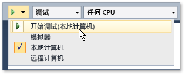

# 从 Visual Studio 运行 UWP 应用
在广泛的设备上运行的 UWP 应用和 Visual Studio 提供了多种方式可运行并与那些应用程序交互。 通过增强“F5”体验，可在开发期间轻松调试、分析和测试应用。  
  
   
  
## 本节内容  
  
|||  
|-|-|  
|[本地计算机上运行的 UWP 应用](../debugger/run-windows-store-apps-on-the-local-machine.md)|在 Visual Studio 设备上运行你的 UWP 应用。|  
|[在模拟器中运行的 UWP 应用](../debugger/run-windows-store-apps-in-the-simulator.md)|模拟的桌面窗口中运行你的 UWP 应用[!INCLUDE[win8_appname_long](../debugger/includes/win8_appname_long_md.md)]功能，如触摸和定向。|  
|[在远程计算机上运行的 UWP 应用](../debugger/run-windows-store-apps-on-a-remote-machine.md)|部署并运行通过网络或直接通过以太网电缆连接到 Visual Studio 计算机的设备上的 UWP 应用。|  
|[在仿真程序中运行 Windows Phone 应用](../debugger/run-windows-phone-apps-in-the-emulator.md)|在模拟 Windows Phone 的桌面窗口中运行 UWP 应用。|  
|[Visual Studio 中的 UWP 应用部署](../debugger/deploy-windows-store-apps-from-visual-studio.md)|部署并注册你用于临时测试的设备上的 UWP 应用。|