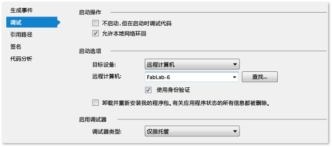

# 在远程计算机上运行 Windows 应用商店应用
[!INCLUDE[vs2017banner](../code-quality/includes/vs2017banner.md)]

  
  
 通过 Visual Studio 远程工具，可从一台运行 Visual Studio 的计算机上运行、调试、分析和测试在另一台设备上运行的 Windows 应用商店应用。 当 Visual Studio 计算机不支持 Windows 应用商店应用特有的功能（如触摸、地理位置和物理方向）时，在远程设备上运行尤为有效。 本主题介绍配置和启动远程会话的过程。  
  
##   主题内容  
 可了解：  
  
 [先决条件](#BKMK_Prerequisites)  
  
 [安全性](#BKMK_Security)  
  
 [如何直接连接到远程设备](#BKMK_DirectConnect)  
  
 [安装远程工具](#BKMK_Installing_the_Remote_Tools)  
  
 [启动远程调试器监视器](#BKMK_Starting_the_Remote_Debugger_Monitor)  
  
 [配置远程调试器](#BKMK_ConfigureRemoteDebugger)  
  
 [配置 Visual Studio 项目以便进行远程调试](#BKMK_ConnectVS)  
  
-   [为 C# 和 Visual Basic 项目选择远程设备](#BKMK_Choosing_the_remote_device_for_C__and_Visual_Basic_projects)  
  
-   [为 JavaScript 和 C++ 项目选择远程设备](#BKMK_Choosing_the_remote_device_for_JavaScript_and_C___projects)  
  
 [运行远程调试会话](#BKMK_RunRemoteDebug)  
  
##   先决条件  
 在远程设备上进行调试：  
  
-   远程设备与 Visual Studio 计算机必须通过网络相连或直接通过以太网电缆相连。 不支持通过 Internet 进行调试。  
  
-   必须在远程设备上安装开发人员许可证。  
  
-   远程设备必须正在运行远程调试组件。  
  
-   您必须是远程设备上的管理员，以便在安装时配置防火墙。 您必须能够以用户身份访问远程设备以运行或连接到远程调试器。  
  
##   安全性  
 默认情况下，远程调试器使用 Windows 身份验证。  
  
> [!WARNING]
>  也可以选择在“无身份验证”模式下运行远程调试器，但强烈建议不要使用此模式。 在此模式下运行时，无法保证网络安全。 只有在确认网络不会遇到恶意通信的情况下，才可选择“无身份验证”模式。  
  
##   如何直接连接到远程设备  
 若要直接连接到远程计算机，请用标准以太网电缆将 Visual Studio 计算机连接到该设备。 如果设备没有以太网端口，可使用 USB 转以太网适配器连接到该电缆。  
  
##   安装远程工具  
  
> [!NOTE]
>  **版本与更新**  
>   
>  Visual Studio 的早期版本不支持 **Visual Studio 2015 远程工具**。  
>   
>  建议根据所安装的 Visual Studio 更新版本，安装与之对应的 Visual Studio 2015 远程工具更新版本。  
>   
>  VS 调试程序兼容任何 VS 2015 版本和 VS 2015 远程工具的组合。 但是，Visual Studio 中的最新功能要求使用最新版本的 Visual Studio 和远程工具。  
>   
>  其他诊断工具需要使用相同版本的远程工具和 Visual Studio。  
  
 **在远程设备上安装远程调试组件**  
  
 若要运行或保存远程工具的安装程序，请从下表中选择一个与远程设备操作系统匹配的链接：  
  
### Visual Studio 2013  
  
|||||  
|-|-|-|-|  
|**更新版本**|**X86**|**X64**|**ARM**|  
|**RTM**|[下载](http://go.microsoft.com/fwlink/?LinkId=320706)|[下载](http://go.microsoft.com/fwlink/?LinkId=320707)|[下载](http://go.microsoft.com/fwlink/?LinkId=320708)|  
|**Update 1**|[下载](http://go.microsoft.com/fwlink/?LinkID=386599)|[下载](http://go.microsoft.com/fwlink/?LinkID=386600)|[下载](http://go.microsoft.com/fwlink/?LinkID=386601)|  
|**Update 2**|[下载](http://go.microsoft.com/fwlink/?LinkId=393218)|[下载](http://go.microsoft.com/fwlink/?LinkId=393217)|[下载](http://go.microsoft.com/fwlink/?LinkId=393216)|  
|**更新 3**|[下载](http://go.microsoft.com/fwlink/?LinkId=403046)|[下载](http://go.microsoft.com/fwlink/?LinkId=403047)|[下载](http://go.microsoft.com/fwlink/?LinkId=403048)|  
|**更新 4**|[下载](http://go.microsoft.com/fwlink/?LinkId=512599)|[下载](http://go.microsoft.com/fwlink/?LinkId=512600)|[下载](http://go.microsoft.com/fwlink/?LinkId=512601)|  
  
### Visual Studio 2015  
  
|||||  
|-|-|-|-|  
|**版本**|**X86**|**X64**|**ARM**|  
|**预览**|[下载](http://download.microsoft.com/download/4/8/A/48A0EA60-6097-4BA5-B7D3-EAE49499E1FB/rtools_setup_x86.exe)|[下载](http://download.microsoft.com/download/4/8/A/48A0EA60-6097-4BA5-B7D3-EAE49499E1FB/rtools_setup_x64.exe)|[下载](http://download.microsoft.com/download/4/8/A/48A0EA60-6097-4BA5-B7D3-EAE49499E1FB/rtools_setup_arm.exe)|  
  
 可以选择下载安装程序或立即运行它。 运行安装程序，接受用户协议，然后选择**“安装”**。  
  
 默认情况下，远程调试组件安装在 **C:\\Program Files\\Microsoft Visual Studio 14.0\\Common7\\IDE\\Remote Debugger** 文件夹中。  
  
##   启动远程调试器监视器  
  
> [!NOTE]
>  由于远程调试器将防火墙配置为允许与 Visual Studio 主机通信，所以在首次启动远程调试器时，您必须是远程设备上的管理员。  
  
 安装远程工具后，在**“开始”**屏幕上选择**“远程调试器”**。**“远程调试配置”**将在您启动远程调试器时首次显示。  
  
 在**“远程调试配置”**对话框中：  
  
1.  如果未安装 Windows Web 服务 API，则选择**“安装”**  
  
2.  在**“配置 Windows 防火墙”**组中，选择要允许连接到的网络。 只会启用该设备当前已连接到的网络。 必须选择至少一个网络。  
  
3.  选择**“配置远程调试”**，设置防火墙选项并启动远程调试器。  打开**“Visual Studio 远程调试监视器”**对话框，为用户授予远程工具权限并设置其他高级选项。  
  
4.  随即将出现**“Visual Studio 远程调试监视器”**对话框。 可以通过此对话框为用户授予远程工具权限和设置其他高级选项。  
  
##   配置远程调试器  
 可以使用两个工具来修改远程调试器的配置。  
  
1.  在**“Visual Studio 远程调试监视器”**的**“工具”**菜单上：  
  
    1.  选择**“选项”**，更改远程调试器的端口号、身份验证模式或超时间隔。  
  
    2.  选择**“权限”**，添加或移除具有远程调试权限的用户。  
  
        > [!NOTE]
        >  必须为远程调试的每个用户帐户授予权限。  
  
 使用**“远程调试器配置向导”**，设置远程调试器的高级选项。 若要打开向导，请选择“开始”屏幕上的**“远程调试器配置向导”**。  
  
1.  在**“配置 Visual Studio 远程调试器”**页上，可以选择将远程调试器作为服务运行。 在大多数情况下，不需要作为服务运行。  
  
2.  在**“配置 Windows 防火墙以便进行调试”**页上，您可以添加或移除要将远程调试器连接到的网络类型。 只会启用该设备当前已连接到的网络。 必须选择至少一个网络。  
  
##   配置 Visual Studio 项目以便进行远程调试  
 可在项目的属性中指定所连接到的远程计算机。 该过程因编程语言而有所不同。 可键入远程设备的网络名称，也可从“选择远程调试器连接”对话框中选择该设备。  
  
   
  
 该对话框仅列出在 Visual Studio 计算机的本地子网上并且正在运行远程调试器的那些设备。  
  
> [!TIP]
>  如果连接到远程设备时遇到问题，则尝试访问设备的 IP 地址。 若要确定设备的 IP 地址，请打开命令窗口，然后键入 **ipconfig**。 随后将以 **IPv4 Address** 为标题列出 IP 地址。  
  
###   为 C\# 和 Visual Basic 项目选择远程设备  
   
  
1.  在解决方案资源管理器中选择项目名称，然后从快捷菜单中选择**“属性”**。  
  
2.  选择**“调试”**。  
  
3.  从**“目标设备”**列表中选择**“远程计算机”**。  
  
4.  在**“远程计算机”**框中输入远程设备的网络名称，或选择**“查找”**，从**“选择远程调试器连接”**对话框中选择该设备。  
  
###   为 JavaScript 和 C\+\+ 项目选择远程设备  
   
  
1.  在解决方案资源管理器中选择项目名称，然后从快捷菜单中选择**“属性”**。  
  
2.  展开**“配置属性”**节点，然后选择**“调试”**。  
  
3.  从**“要启动的调试器”**列表中选择**“远程调试器”**。  
  
4.  在**“计算机名称”**框中输入远程设备的网络名称，或选择该框中的下箭头，从**“选择远程调试器连接”**对话框中选择该设备。  
  
##   运行远程调试会话  
 开始、停止和导航远程调试会话的方法与进行本地会话相同。 在开始调试之前，请确保远程调试监视器在远程设备上运行。  
  
 然后在**“调试”**菜单上，选择**“启动调试”**（键盘：F5）。 项目会重新编译，然后部署到远程设备上并启动。 调试器在断点暂停执行，以使您可进入逐语句执行、逐过程执行和跳出代码。 选择**“停止调试”**以结束调试会话并关闭远程应用程序。 有关详细信息，请参阅[在 Visual Studio 中调试应用程序](../debugger/debug-store-apps-in-visual-studio.md).  
  
## 请参阅  
 [使用 Visual Studio 测试应用商店应用](../test/testing-store-apps-with-visual-studio.md)   
 [在 Visual Studio 中调试应用程序](../debugger/debug-store-apps-in-visual-studio.md)