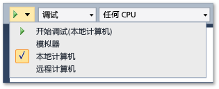
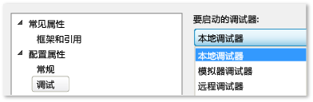

# 在本地计算机上运行 Windows 应用商店应用程序
[!INCLUDE[vs2017banner](../code-quality/includes/vs2017banner.md)]

  
  
 要在 Windows 应用商店应用上调试、测试或运行性能分析，你可以在托管 Visual Studio 的相同计算机上运行该应用。  如果设备上的显示屏支持触控，你可以执行应用的完整功能；否则，你只能使用有限的鼠标和键盘手势。  
  
##   在本主题中  
 可了解：  
  
 [如何在本地计算机上运行](#BKMK_How_to_run_on_a_local_machine)  
  
 [如何在单个监视器上在 Windows 应用商店应用和 Visual Studio 之间切换](#BKMK_How_to_switch_between_a_Windows_Store_app_and_Visual_Studio_on_a_single_monitor)  
  
##   如何在本地计算机上运行  
 若要在本地计算机上运行应用，请从调试器**“标准”**工具栏上“启动调试”按钮旁的下拉列表中选择**“本地计算机”**。  
  
   
  
 如果你看不到**“标准”**工具栏，则单击**“视图”**菜单，指向**“工具栏”**，然后单击**“标准”**。  
  
 你在下拉列表中所做的选择将保留在项目属性文件中，并成为默认的运行目标。  
  
 你也可以直接在项目属性文件中设置运行目标。  在**“解决方案资源管理器”**中右击项目名称，然后选择**“属性”**。  然后，执行下列操作之一：  
  
-   在 C\# 和 Visual Basic 项目中，单击**“调试”**，然后从**“目标设备”**下拉列表中选择**“本地计算机”**。  
  
       
  
-   在 C\+\+ 和 JavaScript 项目中，展开**“配置属性”**节点，单击**“调试”**，然后从**“要启动的调试器”**列表中选择**“本地调试器”**。  
  
       
  
##   如何在单个监视器上在 Windows 应用商店应用和 Visual Studio 之间切换  
 **从 Windows 应用商店应用中正在运行的实例切换到 Visual Studio**  
  
 当你在本地计算机上运行 Windows 应用商店应用并且仅使用单个监视器时，你可能希望在保持应用运行的同时切换回 Visual Studio。  例如，应用可能处于断点无法达到的某个状态，例如等待事件或困在一个长期或无休止的循环中。  要返回到 Visual Studio，请按 ALT \+ TAB。