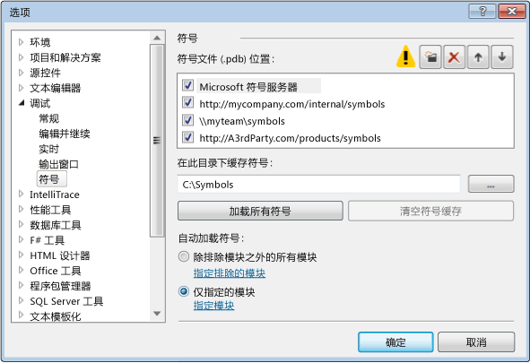
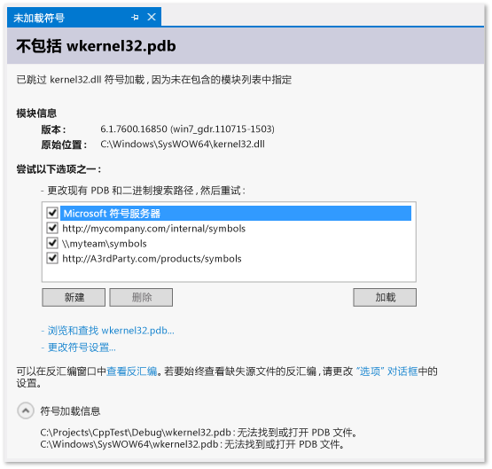

# 在 Visual Studio 调试器中指定符号 (.pdb) 和源文件
[!INCLUDE[vs2017banner](../code-quality/includes/vs2017banner.md)]

程序数据库 \(.pdb\) 文件（也称为符号文件）将你在类、方法和其他代码的源文件中创建的标识符映射到在项目的已编译可执行文件中使用的标识符。 .pdb 文件还可以将源代码中的语句映射到可执行文件中的执行指令。 调试器使用此信息确定两个关键信息：显示在 Visual Studio IDE 中的源文件和行号，以及可执行文件中在设置断点时要停止的位置。 符号文件还包含源文件的原始位置以及（可选）源服务器的位置（可从中检索源文件）。  
  
 在 Visual Studio IDE 中调试项目时，调试器知道查找代码的 .pdb 和源文件的默认位置。 如果要在项目源代码之外调试代码（如项目调用的 Windows 或第三方代码），则你必须指定 .pdb（也可以是外部代码的源文件）的位置，这些文件需要与可执行文件完全匹配。  
  
 在 Visual Studio 2012 之前，在远程设备上调试托管的代码时，需要将符号文件放置在远程计算机上。 现在，这已经不成问题了。 所有符号文件必须位于本地计算机上或“工具”\/“选项”\/“调试”\/“符号”页中指定的位置。  
  
##   调试器搜索 .pdb 文件的位置  
  
1.  在 DLL 或可执行文件中指定的位置。  
  
     （默认情况下，如果你在计算机上已生成 DLL 或可执行文件，则链接器会将关联的 .pdb 文件的完整路径和文件名放入 DLL 或可执行文件中。 调试器首先会检查在 DLL 或可执行文件内指定的位置中是否存在符号文件。 这很有帮助，因为你的计算机上始终有可供已编译代码使用的符号。）  
  
2.  可存在于与 DLL 或可执行文件相同文件夹中的 .pdb 文件。  
  
3.  所有本地符号缓存文件夹。  
  
4.  在 Microsoft 符号服务器（如果启用）等上指定的任何网络、Internet 或本地符号服务器和位置。  
  
###   为什么符号文件需要与可执行文件完全匹配？  
 调试器只会为可执行文件加载与该可执行文件生成之时所创建的 .pdb 文件完全匹配的 .pdb 文件（即该 .pdb 文件必须是原始 .pdb 文件或其副本）。 由于除了创建正确且高效的代码的主要任务之外，编译器的编译速度也得到了优化，因此可执行文件的实际布局可更改，即使代码本身未更改也是如此。 有关详细信息，请参阅[为什么 Visual Studio 要求调试器符号文件必须与同时生成的二进制文件完全匹配？](https://blogs.msdn.microsoft.com/jimgries/2007/07/06/why-does-visual-studio-require-debugger-symbol-files-to-exactly-match-the-binary-files-that-they-were-built-with/)。  
  
###   指定符号位置和加载行为  
 在 VS IDE 中调试项目时，调试器将自动加载位于项目目录中的符号文件。 可以在“工具”\/“选项”\/“调试”\/“符号”中为 Microsoft、Windows 或第三方组件指定备选搜索路径和符号服务器。还可以指定希望调试器自动为其加载符号的模板。 之后，你可以在主动进行调试时手动更改这些设置。  
  
1.  在 Visual Studio 中，打开“工具”\/“选项”\/“调试”\/“符号”页。  
  
       
  
2.  选择文件夹  图标。**“符号文件\(.pdb\)位置”**框中将显示可编辑的文本。  
  
3.  键入符号服务器或符号位置的 URL 或目录路径。 语句结束有助于找到正确的格式。  
  
4.  若要改进符号加载性能，请在路径中键入符号可由**“在此目录下缓存符号”**框中的符号服务器复制的本地目录，或可将符号复制到其中的本地目录。  
  
    > [!NOTE]
    >  不要将符号缓存放入受保护文件夹（例如，C:\\Windows 文件夹或其子文件夹之一）。 而应使用可读写的文件夹。  
  
 **指定符号加载行为**  
  
 你可指定开始调试时要从**“符号文件\(.pdb\)位置”**框位置自动加载的文件。 始终加载项目目录中的符号文件。  
  
1.  选择**“除排除模块之外的所有模块”**来为所有模块（除了你在选择**“指定排除的模块”**链接时指定的模块之外）加载所有符号。  
  
2.  选择**“仅指定的模块”**选项，然后选择**“指定模块”**来列出要自动加载其符号文件的模块。 其他模块的符号文件被忽略。  
  
 **指定其他符号选项**  
  
 还可以在“工具”\/“选项”\/“调试”\/“符号”页设置以下选项：  
  
 **启动时若无符号则发出警告\(仅限本机\)**  
  
 选定后，如果尝试调试在调试器中没有对应符号信息的程序，系统将显示警告对话框。  
  
 **加载 DLL 导出**  
  
 选定后，加载 DLL 导出表。 处理 Windows 消息、Windows 过程 \(WindowProc\)、COM 对象、封送或不具有其符号的任何 DLL 时，DLL 导出表中的符号信息将很有用。 读取 DLL 导出信息会占用一些系统开销。 因此，默认情况下此功能被禁用。  
  
 若要查看 DLL 导出表中的可用符号，请使用 `dumpbin /exports`。 符号可用于任何 32 位系统 DLL。 从 `dumpbin /exports` 输出中，可以查看到精确的函数名，包括非字母数字字符。 这对于在函数上设置断点很有用。 DLL 导出表中的函数名在调试器的其他位置似乎被截断了。 调用将按调用顺序列出，当前函数（嵌套最深的函数）位于顶端。 有关详细信息，请参阅 [dumpbin \/exports](/visual-cpp/build/reference/dash-exports)。  
  
###   使用符号服务器查找不在你的本地计算机上的符号文件  
 [!INCLUDE[vsprvs](../code-quality/includes/vsprvs_md.md)] 可从实现 symsrv 协议的符号服务器下载调试符号文件。[Visual Studio Team Foundation Server](../Topic/Index%20and%20publish%20symbol%20data.md) 和 [Windows 调试工具](http://msdn.microsoft.com/library/windows/hardware/ff551063\(v=VS.85\).aspx)是可实现符号服务器的两个工具。 在 VS**“选项”**对话框中指定要使用的符号服务器。  
  
 可供使用的符号服务器包括：  
  
 **Microsoft 公共符号服务器**  
  
 若要调试在调用系统 DLL 或第三方库时出现的故障，通常需要使用系统 .pdb 文件，这些文件包含表示 Windows DLL、EXE 以及设备驱动程序的符号。 你可从 Microsoft 公共符号服务器获取这些符号。 除了 MDAC、IIS、ISA 和 [!INCLUDE[dnprdnshort](../code-quality/includes/dnprdnshort_md.md)] 之外，Microsoft 公共符号服务器为 Windows 操作系统提供符号。  
  
 若要使用 Microsoft 符号服务器，请选择**“调试”**菜单上的**“选项和设置”**，然后选择**“符号”**。 选择**“Microsoft 符号服务器”**。  
  
 **内部网络或本地计算机上的符号服务器**  
  
 你的团队或公司可为你自己的产品创建符号服务器，并作为外部源符号的缓存。 你自己的计算机上可能具有符号服务器。 你可在 VS**“选项”**对话框的**“调试”**\/**“符号”**页上输入符号服务器的位置作为 URL 或路径。  
  
 **第三方符号服务器**  
  
 Windows 应用程序和库的第三方提供程序可提供对 Internet 上的符号服务器的访问。 你还可在**“调试”**\/**“符号”**页上输入这些符号服务器的 URL。  
  
> [!NOTE]
>  如果使用 Microsoft 公共符号服务器以外的符号服务器，请确保该符号服务器及其路径是可信任的。 由于符号文件可以包含任意可执行代码，因此你可能面临安全威胁。  
  
###   调试时查找并加载符号  
 只要调试器处于中断模式，你就可以为之前被调试器选项排除的或编译器无法找到的模块加载符号。 可以从调用堆栈窗口、模块窗口、局部变量窗口、自动窗口和所有监视窗口的快捷菜单中加载符号。 如果调试器在没有可用符号或源文件的代码中中断，则将显示一个文档窗口。 在此可以找到所缺文件的相关信息，并采取相应措施来查找并加载它们。  
  
 **使用未加载任何符号的文档页查找符号**  
  
 调试器可通过多种方式中断没有可用符号的代码：  
  
1.  单步执行代码。  
  
2.  通过断点或异常中断代码。  
  
3.  切换到其他线程。  
  
4.  通过在“调用堆栈”窗口中双击帧来更改堆栈帧。  
  
 出现上述事件之一时，调试器将显示**“未加载任何符号”**页来帮助你查找和加载必需的符号。  
  
   
  
-   若要更改搜索路径，请选择未选定的路径或选择**“新建”**，然后输入新路径。 选择**“加载”**以再次搜索路径，并在找到符号文件时加载符号文件。  
  
-   选择“浏览并查找 *executable\-name***...**”重写任何符号选项并重试搜索路径。 如果找到符号文件，或显示了文件资源管理器供你手动选择符号文件，则加载符号文件。  
  
-   选择**“更改符号设置...”**可显示 VS“选项”对话框的**“调试”**\/**“符号”**页。  
  
-   选择**“查看反汇编”**可在新窗口中显示一次反汇编。  
  
-   若要在未找到源文件或符号文件的情况下始终显示反汇编，请选择**“选项”**对话框链接，然后选择**“启用地址级调试”**和**“源代码不可用时显示反汇编”**。  
  
       
  
 **从快捷菜单更改符号选项**  
  
 当你处于中断模式时，可查找并加载调用堆栈窗口、模块窗口、局部变量窗口、自动窗口和所有监视窗口中显示的项的符号。 在窗口中选择一个项，打开快捷菜单，然后选择下列选项之一：  
  
|选项|描述|  
|--------|--------|  
|**加载符号**|尝试从**“选项”**对话框的**“调试”**\/**“符号”**页上指定的位置加载符号。 如果无法找到符号文件，则将启动文件资源管理器，以便你能够指定要搜索的新位置。|  
|**符号加载信息**|显示已加载符号文件的位置或调试器无法查找文件时已搜索位置的信息。|  
|**符号设置...**|打开 VS**“选项”**对话框的**“调试”**\/**“符号”**页。|  
|**始终自动加载**|将符号文件添加到由调试器自动加载的文件列表中。|  
  
###   为符号文件设置编译器选项  
 当你从 VS IDE 生成项目并使用标准**“调试”**生成配置时，C\+\+ 和托管编译器将为你的代码创建相应的符号文件。 也可在命令行上设置编译器选项以创建符号文件。  
  
 **C\+\+ 选项**  
  
 程序数据库 \(.pdb\) 文件保存调试和项目状态信息，使用这些信息可以对程序的调试配置进行增量链接。 使用 [\/ZI 或 \/Zi](/visual-cpp/build/reference/z7-zi-zi-debug-information-format)（适用于 C\/C\+\+）生成时，将创建 .pdb 文件。  
  
 在 [!INCLUDE[vcprvc](../debugger/includes/vcprvc_md.md)] 中，[\/Fd](/visual-cpp/build/reference/fd-program-database-file-name) 选项命名由编译器创建的 .pdb 文件。 使用向导在 [!INCLUDE[vsprvs](../code-quality/includes/vsprvs_md.md)] 中创建项目时，**\/Fd** 选项将设置为创建一个名为 *project*.pdb 的 文件 .pdb 文件。  
  
 如果使用生成文件生成 C\/C\+\+ 应用程序，并指定 **\/ZI** 或 **\/Zi** 而不指定 **\/Fd**，则最终将生成两个 .pdb 文件：  
  
-   VC*x*.pdb，其中 *x* 表示 Visual C\+\+ 的版本，例如 VC11.pdb。 该文件存储各个 OBJ 文件的所有调试信息并与项目生成文件驻留在同一个目录中。  
  
-   project.pdb   该文件存储 .exe 文件的所有调试信息。 对于 C\/C\+\+，它驻留在 \\debug 子目录中。  
  
 每当创建 OBJ 文件时，C\/C\+\+ 编译器都会将调试信息合并到 VC*x*.pdb 中。 插入的信息包括类型信息，但不包括函数定义等符号信息。 因此，即使每个源文件都包含公共头文件（如 \<windows.h\>），这些头中的 typedef 也仅存储一次，而不是存储在每个 OBJ 文件中。  
  
 链接器将创建 project.pdb，它包含项目的 EXE 文件的调试信息。 project.pdb 文件包含完整的调试信息（包括函数原型），而不仅仅是在 VC*x*.pdb 中找到的类型信息。 这两个 .pdb 文件都允许增量更新。 链接器还在其创建的 .exe 或 .dll 文件中嵌入 .pdb 文件的路径。  
  
 [!INCLUDE[vsprvs](../code-quality/includes/vsprvs_md.md)] 调试器使用 EXE 或 DLL 文件中的 .pdb 文件的路径查找 project.pdb 文件。 如果调试器在该位置无法找到 .pdb 文件或者路径无效（例如，如果项目已移至另一台计算机），则调试器将搜索包含 EXE 的路径以及在**“选项”**对话框（**“调试”**文件夹，**“符号”**节点）中指定的符号路径。 调试器将不会加载与所调试的可执行文件不匹配的 .pdb 文件。 如果调试器无法找到 .pdb 文件，则将显示**“查找符号”**对话框，这将允许你搜索符号或向搜索路径添加其他位置。  
  
 **.NET Framework 选项**  
  
 程序数据库 \(.pdb\) 文件保存调试和项目状态信息，使用这些信息可以对程序的调试配置进行增量链接。 使用 **\/debug** 进行生成时，将创建一个 .pdb 文件。 可以使用 **\/debug:full** 或 **\/debug:pdbonly** 生成应用程序。 使用 **\/debug:full** 进行生成可以生成可调试的代码。 使用 **\/debug:pdbonly** 进行生成可以生成 .pdb 文件，但是不会生成通知 JIT 编译器调试信息可用的 `DebuggableAttribute`。 如果想为不希望其成为可调试的发布版本生成 .pdb 文件，请使用 **\/debug:pdbonly**。 有关详细信息，请参阅[\/debug \(Emit Debugging Information\)](/dotnet/csharp/language-reference/compiler-options/debug-compiler-option)或[\/debug](/dotnet/visual-basic/reference/command-line-compiler/debug)。  
  
 [!INCLUDE[vsprvs](../code-quality/includes/vsprvs_md.md)] 调试器使用 EXE 或 DLL 文件中的 .pdb 文件的路径查找 project.pdb 文件。 如果调试器无法在该位置找到.pdb 文件，或者该路径无效，调试器将先搜索包含 EXE 的路径，然后搜索**“选项”**对话框中指定的符号路径。 该路径通常是**“符号”**节点中的**“调试”**文件夹。 调试器将不会加载与所调试的可执行文件不匹配的 .pdb 文件。 如果调试器无法找到 .pdb 文件，则将显示**“查找符号”**对话框，这将允许你搜索符号或向搜索路径添加其他位置。  
  
 **Web 应用程序**  
  
 一定要把你的应用程序配置文件 \(Web.config\) 设为调试模式。 调试模式将导致 ASP.NET 为动态生成的文件生成符号，并允许调试器附加到 ASP.NET 应用程序。 如果项目是通过 Web 项目模板创建的，则 VS 会在你开始调试时自动完成此设置。  
  
##   查找源文件  
  
###   调试器搜索源文件的位置  
 调试器在下列位置查找源文件：  
  
1.  在启动调试器的 Visual Studio 实例的 IDE 中打开的文件。  
  
2.  在 Visual Studio 实例中打开的解决方案中的文件。  
  
3.  在解决方案的属性中的**“公共属性”**\/**“调试源文件”**页中指定的目录。 （在“解决方案资源管理器”中，选择该解决方案节点，右键单击，然后选择“属性”。 \)  
  
4.  模块的 .pdb 的源信息。 这可能是生成模块时源文件的位置，也可能是源服务器的命令。  
  
###   使用“无源”\/“未加载任何符号”页查找并加载源文件  
 当调试器在源文件不可用的位置中断执行时，它将显示**“未加载任何源”**或**“未加载任何符号”**页，这些页可帮助你查找源文件。 当调试器无法找到可执行文件的符号 \(.pdb\) 文件来完成搜索时，将显示**“未加载任何符号”**。 “无符号”页将提供用于搜索文件的选项。 如果在执行选项之一后找到 .pdb，并且调试器可以使用符号文件中的信息检索源文件，则将显示源。 否则，将显示描述问题的**“未加载任何源”**页。 此页将显示选项链接，这些链接可执行可以解决问题的操作。  
  
###   将源文件搜索路径添加到解决方案  
 你可指定网络或本地目录来搜索源文件。  
  
1.  在解决方案资源管理器中选择解决方案，然后从快捷菜单中选择**“属性”**。  
  
2.  在**“公共属性”**节点下，选择**“调试源文件”**。  
  
3.  单击文件夹  图标。 可编辑文本将显示在**“包含源代码的目录”**列表中。  
  
4.  添加要搜索的路径。  
  
 请注意，只搜索指定的目录。 你必须为要搜索的任何子目录添加项。  
  
###   使用源服务器  
 如果本地计算机上没有源代码，或者 .pdb 文件与源代码不匹配，则可使用源服务器来帮助调试应用程序。 源服务器接受文件请求并返回实际的文件。 源服务器通过名为 srcsrv.dll 的 DLL 文件运行。 源服务器读取应用程序的 .pdb 文件，该文件包含指向源代码存储库的指针，以及用于从该存储库检索源代码的命令。 你可以限制允许从应用程序的 .pdb 文件执行的命令，方法是在名为 srcsrv.ini 的文件内列出允许的命令，该文件必须与 srcsrv.dll 和 devenv.exe 位于同一个目录中。  
  
> [!IMPORTANT]
>  任意命令都可嵌入应用程序的 .pdb 文件中，因此请确保在 srcsrv.ini 文件中仅放入要执行的命令。 任何尝试执行不在 srcsvr.ini 文件中的命令都将导致出现一个确认对话框。 有关更多信息，请参见[安全警告：调试器必须执行不受信任的命令](../debugger/security-warning-debugger-must-execute-untrusted-command.md)。 未对命令参数执行任何验证，因此请慎用受信任的命令。 例如，如果你信任 cmd.exe，恶意用户则可能会指定使该命令变得危险的参数。  
  
 **启用源服务器的使用**  
  
1.  确保你在编译时采用了上一节中介绍的安全措施。  
  
2.  在**“工具”**菜单上，选择**“选项”**。  
  
     这将显示**“选项”**对话框。  
  
3.  在**“调试”**节点下，选择**“常规”**。  
  
4.  选择**“启用源服务器支持”**复选框。  
  
       
  
5.  （可选）选择所需的子选项。  
  
     请注意，**“允许源服务器中的部分信任程序集\(仅限托管\)”**和**“始终运行不受信任的源服务器命令并且不再提示”**都会增大上述安全风险。  
  
## 请参阅  
 [Visual Studio 2012 和 2013 中的 .NET 远程符号加载更改](http://blogs.msdn.com/b/visualstudioalm/archive/2013/10/16/net-remote-symbol-loading-changes-in-visual-studio-2012-and-2013.aspx)