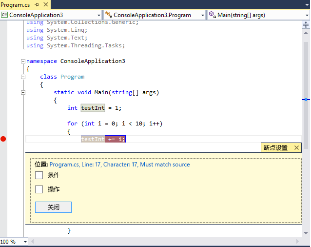
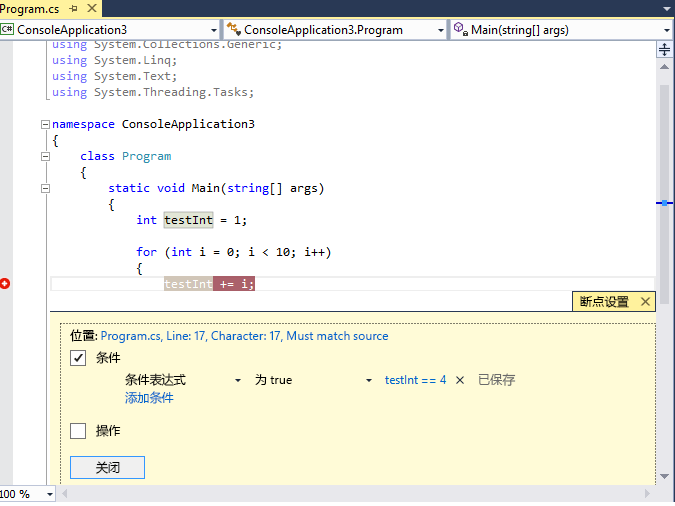
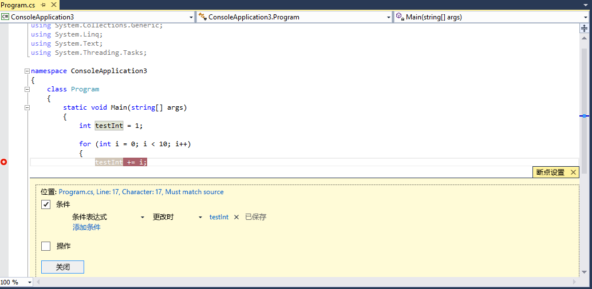
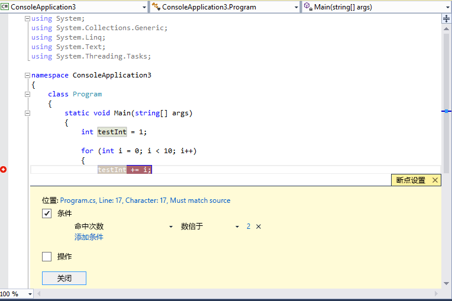

# <a name="use-breakpoints-in-the-visual-studio-debugger"></a>在 Visual Studio 调试器中使用断点
也许你会为了查看代码变量的状态或查看调用堆栈而想要停止调试程序执行，此时，你可以设置断点。 在开发人员的工具箱中，它们是最重要的调试技术之一。  
  
##  <a name="BKMK_Overview"></a>在源代码中设置行断点  
 源代码文件中，左边距中单击或通过将光标放在一行代码上，然后按 f9 键，可以在源代码中设置行断点的行。 断点显示为左边距中的一个红点，且该代码行也会变色：  
  
   
  
 在调试程序中运行此代码时，只要命中断点，就会在执行该行上的代码之前停止执行。 源代码行会变为黄色：  
  
   
  
 此时， `testInt` 的值仍为 1。  
  
 可以查看应用程序的当前状态，包括变量值和调用堆栈。 有关调用堆栈的详细信息，请参阅 [How to: Use the Call Stack Window](../debugger/how-to-use-the-call-stack-window.md)。  
  
 可以在任意可执行代码行上设置断点。 例如，在上面的 C# 代码中，可以在变量声明、 `for` 循环或 `for` 循环内的任何代码上设置断点，但无法在命名空间、类声明或方法签名上设置断点。  
  
##  <a name="BKMK_Set_a_breakpoint_in_a_source_file"></a> 设置其他种类的断点  
 还可以在调用堆栈中、在“反汇编”窗口中以及在本机 C++ 代码中、在数据条件或内存地址上设置断点。  
  
## <a name="BKMK_Set_a_breakpoint_in_the_call_stack_window"></a> 在调用堆栈窗口中设置断点  
 可通过在 **“调用堆栈”** 窗口中设置断点来中断调用函数返回到的指令或行处的执行。 有关调用堆栈的详细信息，请参阅 [How to: Use the Call Stack Window](../debugger/how-to-use-the-call-stack-window.md)。 调试程序必须已停止执行。  
  
1.  开始调试应用程序，并等待执行停止（例如，在断点处）。 打开**调用堆栈**窗口 (**调试 > Windows > 调用堆栈**，或**CTRL + ALT + C**)。  
  
2.  右键单击调用函数，然后选择**断点 > 插入断点**，或只需使用的快捷键**F9**。  
  
3.  断点符号在调用堆栈的左边距中显示，位于函数调用名称旁边。  
  
 在 **“断点”** 窗口中，调用堆栈断点显示为具有与函数中下一个可执行指令对应的内存位置的地址。 调试器在指令处中断执行。  
  
 在执行代码期间直观地跟踪断点，请参阅[调试时映射调用堆栈上的方法](../debugger/map-methods-on-the-call-stack-while-debugging-in-visual-studio.md)。  
  
## <a name="setting-a-breakpoint-in-the-disassembly-window"></a>在反汇编窗口中设置断点  
 若要在程序集指令处设置断点，必须使调试器处于中断模式下。  
  
1.  开始调试应用程序，并等待执行停止（例如，在断点处）。 打开**反汇编**窗口 (**调试 > Windows > 反汇编**，或**Ctrl + Alt + D**)。  
  
2.  在左边距中你想要执行中断操作的指令处单击，或将光标放在指令上并按 **“F9”**键。  
  
## <a name="BKMK_set_a_data_breakpoint_native_cplusplus_only"></a>设置数据断点（仅限本机 C++）  
 数据断点在存储在指定内存地址中的值更改时中断执行。 如果只读取但不更改该值，则执行不会中断。 若要设置数据断点，必须使调试器处于中断模式下。  
  
1.  开始调试应用程序，并等待到达断点。 上**调试**菜单上，选择**新断点 > 数据断点**(或打开**断点**窗口，然后选择**新建 > 数据断点**.  
  
2.  在 **“地址”** 框中，键入内存地址或计算结果为内存地址的表达式。 例如，键入 `&avar` 以在变量 `avar` 的内容更改时执行中断操作。  
  
3.  在 **“字节计数”** 下拉菜单中，选择你想要调试程序监视的字节数。 例如，如果选择 **4**，则调试程序将监视从 `&avar` 开始的四个字节，并在其中任何字节的值发生更改时执行中断操作。  
  
 请记住，数据断点依赖于特定内存地址的适用性。  
  
-   从一个调试会话转到下一个调试会话时，变量的地址会更改。 数据断点在每个调试会话结束时会被自动禁用。  
  
-   如果在局部变量上设置数据断点，则断点在函数结束时仍处于启用状态，但内存地址不再适用，且断点的行为是不可预测的。 如果在局部变量上设置了数据断点，则应在函数结束前删除或禁用该断点。  
  
 数据断点在下列情况下无效：  
  
-   将未经调试的进程写入内存位置  
  
-   在两个或两个以上进程间共享内存位置  
  
-   内存位置在内核内更新。 例如，如果内存传递给 32 位 Windows `ReadFile` 函数，则该内存将从内核模式进行更新，且调试程序不会中断内存写入。  
  
## <a name="setting-a-breakpoint-with-a-memory-address-native-c-only"></a>设置具有内存地址的断点（只能是本机 C++）  
 你还可以使用对象的地址在类的特定实例上调用的方法上设置断点。  以下是一个示例：  
  
 例如，给定一个具有地址的 `my_class` 类型对象，你可以在从该实例调用的名为 `my_method` 的方法上设置函数断点。  
  
1.  在实例化类的实例后，在某处设置断点。  
  
2.  查找该实例的地址（我们举例为 `0xcccccccc`。  
  
3.  单击**调试 > 新断点 > 函数断点**(或**ALT + F9，B**)。  
  
4.  将以下文本添加到“函数名称”  框：  
  
    ```C++  
    ((my_class *) 0xcccccccc)->my_method  
    ```  
  
##  <a name="BKMK_Specify_advanced_properties_of_a_breakpoint_"></a> 管理断点  
 你可以使用**断点**窗口 (**调试 > Windows > 断点**，或**CTRL + ALT + B**) 若要查看所有断点已设置你的解决方案中：  
  
   
  
 **“断点”** 窗口提供管理所有断点的中心位置，这在断点非常关键的大型解决方案或复杂调试应用场景中特别有用。 如果需要保存或共享一组断点的状态和位置，则可以仅从 **“断点”** 窗口导出和导入断点。  
  
##  <a name="BKMK_Specify_a_breakpoint_condition_using_a_code_expression"></a> 高级断点  
  
## <a name="breakpoint-conditions"></a>断点条件  
 可以通过设置条件来控制在何时何处执行断点。  
  
1.  右键单击断点，或在断点上悬停并选择设置图标。  
  
2.  在上下文菜单中，选择 **“条件”**。 这将打开 **“断点设置”** 窗口：  
  
   
  
 选中 **“条件”** 框时，窗口将扩展，以便显示不同种类的条件。  
  
 **条件表达式：** 选择条件表达式时，可以随之选择两个条件： **“为 true”** 和 **“更改时”**。 如果要在满足表达式时中断，请选择 **“为 true”** ；如果要在表达式的值更改时中断，请选择 **“更改时”** 。  
  
 在下面的示例中，我们将断点设置为仅在 `testInt` 的值为 **4**时才会命中：  
  
   
  
 在下面的示例中，我们将断点设置为仅在 `testInt` 的值更改时才会命中：  
  
   
  
 不同编程语言的“更改时”字段的行为不同。 对于本机代码，如果选择 **“更改时”** ，则调试器不会将条件的第一次计算当作一次更改，所以第一次计算时不会命中断点。 如果你选择**更改时**对于托管代码之后, 的第一个计算命中断点**更改时**选择。  
  
 如果使用无效语法设置断点条件，则会显示警告消息。 如果在指定断点条件时使用的语法有效但语义无效，则在第一次命中断点将出现警告消息。 在这两种情况下，当命中无效断点时，调试器都会中断执行。 仅在条件有效且计算结果为 `false`时才会跳过断点。  
  
 条件可以是调试器能够识别的任何有效表达式。 有关有效表达式的详细信息，请参见 [Expressions in the Debugger](../debugger/expressions-in-the-debugger.md)。  
  
## <a name="using-object-ids-in-breakpoint-conditions-c-and-f"></a>在断点条件（C# 和 F #）中使用对象 ID  
 有时，你想要观察特定对象的行为；例如，你可能想要知道一个对象为何多次被插入到一个集合中。 在 C# 和 F# 中，你可以创建 [引用类型](/dotnet/csharp/language-reference/keywords/reference-types) 的特定实例的对象 ID，并在断点条件下使用它们。 对象 ID 由公共语言运行时 (CLR) 调试服务生成并与该对象关联。  若要创建对象 ID，请执行以下操作：  
  
1.  在对象已被创建后的某个时间在代码中设置断点。  
  
2.  启动调试，当在断点处停止执行时，在“局部变量”  窗口中找到该断点，右键单击断点，然后选择“创建对象 ID” 。  
  
     应该会在“局部变量” **$** 窗口中看到 **$** 窗口中设置断点来中断调用函数返回到的指令或行处的执行。 这就是对象 ID。  
  
3.  在想要开展调查时添加一个新条件断点，例如将对象添加到集合中时。  
  
4.  在“条件表达式”字段中使用对象 ID。 例如，如果变量`item`引用要添加到集合的对象，可使**item = = $n**，其中 **n** 是对象的 ID 号。  
  
     会在将该对象添加到集合中时中断执行。  
  
 如果以后想要删除对象 ID，可以右键单击“局部变量”  窗口中的变量，然后选择“删除对象 ID” 。  
  
 请注意，对象 ID 创建弱引用，且不会阻止对象被垃圾回收。 它们仅对当前调试会话有效。  
  
## <a name="hit-count"></a>命中次数  
 如果你怀疑你的代码中的循环开始产生错误行为在一定数量的迭代后，你可以设置断点，以指定的命中数传关联的代码，而不强制重复按行后停止执行**F5**以达到迭代级别。  
  
 在 **“断点设置”** 窗口中，将条件设置为 **“命中计数”**。 可以随后指定迭代数。 在下面的示例中，我们将断点设置为每隔一次迭代命中一次：  
  
   
  
## <a name="filter"></a>筛选器  
 可以将断点限制为仅在指定设备上或在指定进程和线程中触发。  
  
 在 **“断点设置”**窗口中，将条件设置为 **“筛选器”**。 输入以下一个或多个表达式。  
  
-   MachineName = "name"  
  
-   ProcessId = value  
  
-   ProcessName = "name"  
  
-   ThreadId = value  
  
-   ThreadName = "name"  
  
 将字符串值放在双引号内。 可以使用 `&` (AND)、 `||` (OR)、 `!` (NOT) 和括号合并子句。  
  
##  <a name="BKMK_Print_to_the_Output_window_with_tracepoints"></a> 断点操作和跟踪点  
 跟踪点是将消息打印到输出窗口的断点。 跟踪点的作用像这种编程语言中的一个临时跟踪语句。  
  
 在 **“断点设置”** 窗口中，选中 **“操作”** 框。 在 **“操作”** 组中选择 **“将消息记录到输出窗口”** 。 可以打印通用字符串，例如 **this is a test**。 要包括变量或表达式的值，请将它放在大括号内。  
  
 若要在命中跟踪点时中断执行，请清除 **“继续执行”** 复选框。 选中 **“继续执行”** 时，不会暂停执行。 在这两种情况下，都将打印消息。  
  
 可以在 **“消息”**中使用以下特殊关键字。  
  
|||  
|-|-|  
|**$ADDRESS**|当前指令|  
|**$CALLER**|调用函数名|  
|**$CALLSTACK**|“调用堆栈”|  
|**$FUNCTION**|当前函数名|  
|**$PID**|进程 ID|  
|**$PNAME**|进程名|  
|**$TID**|线程 ID|  
|**$TNAME**|线程名|  
|**$TICK**||  
|**$TNAME**||  
  
##  <a name="BKMK_Set_a_breakpoint_at_a_function_return_in_the_Call_Stack_window"></a> 断点标签  
 断点标签仅用于在 **“断点”** 窗口中对断点列表进行排序和筛选。 若要将标签添加到断点中，请选择断点行，然后在上下文菜单中选择 **“标签”** 。  
  
## <a name="export-and-import-breakpoints"></a>导出和导入断点  
 右键单击断点并选择 **“导出”**可以将断点导出到 XML 文件。 该文件默认保存在解决方案目录中。 要导入断点，请打开“断点”  窗口 (“CTRL + ALT + B”)，并在工具栏上单击向右箭头（工具提示为“从文件中导入断点” ）。  
  
## <a name="troubleshoot-breakpoints"></a>断点疑难解答  
  
### <a name="i-deleted-a-breakpoint-but-i-continue-to-hit-it-when-i-start-debugging-again"></a>我删除了断点，但在再次启动调试时继续命中该断点  
 如果在调试时删除了断点，则某些情况下，可能会在下次启动调试时再次命中该断点。 要停止命中此断点，请确保从 **“断点”** 窗口删除该断点的所有实例。  
  
### <a name="the-debugger-cant-locate-the-correct-version-of-the-source-file-for-a-breakpoint"></a>调试器无法找到断点源文件的正确版本  
 如果源文件已更改，且源与正在调试的代码不再匹配，即使存在源文件，调试器也将查找对应于断点的源文件。  
  
1.  如果要让 Visual Studio 中显示的版本不匹配的源代码进行调试，请选择**调试 > 选项和设置**。 在 **“调试”/“常规”** 页上，清除 **“要求源文件与原始版本完全匹配”** 选项。  
  
2.  你也可将断点绑定到源文件。 选择断点并在上下文菜单上选择 **“条件”** 。 选中 **“断点设置”** 窗口中的 **“允许源代码与原始版本不同”** 。  
  
### <a name="breakpoints-dont-work-in-a-dll"></a>断点在 DLL 中不起作用  
 当调试器尚未为代码所在的模块加载调试信息时，不能在源文件中设置断点。 征兆可能包括 **“将不会设置断点”**等消息。 警告断点标志符号出现在断点位置。 但是，当加载代码时，这些警告断点将成为实际的断点。 有关加载符号的详细信息，请参阅[指定符号 (.pdb) 和源文件](../debugger/specify-symbol-dot-pdb-and-source-files-in-the-visual-studio-debugger.md)。  
  
## <a name="see-also"></a>另请参阅  
 [使用调试器浏览代码](../debugger/navigating-through-code-with-the-debugger.md)
