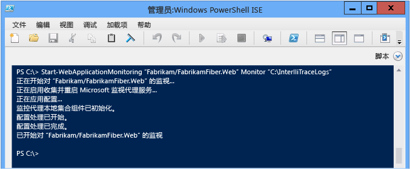
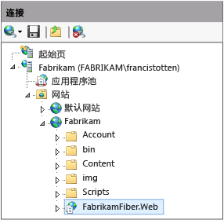
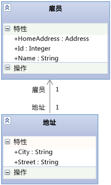

# 使用 Microsoft Monitoring Agent
[!INCLUDE[vs2017banner](../code-quality/includes/vs2017banner.md)]

你可使用 **Microsoft 监视代理**本地监视 IIS 托管的 ASP.NET Web 应用和 SharePoint 2010 或 2013 应用程序，以查找错误、性能问题或其他问题。 可将代理发出的诊断事件保存为 IntelliTrace 日志（也就是 .iTrace）文件。 随后可打开 Visual Studio Enterprise （但不是 Professional 或 Community 版本）中的日志，以使用 Visual Studio 的所有诊断工具调试问题。 你也可运行**跟踪**模式中的代理，进而收集 IntelliTrace 诊断数据及方法数据。 Microsoft Monitoring Agent 可以与 [Application Insights](http://www.visualstudio.com/get-started/find-performance-problems-vs.aspx) 和 [System Center Operation Manager](http://technet.microsoft.com/library/hh205987.aspx) 集成。 安装时，Microsoft 监视代理确实会改变目标系统的环境。  
  
> [!NOTE]
>  你也可在不改变目标环境的前提下，使用 **IntelliTrace 独立收集器**来收集远程计算机上的 Web、SharePoint、WPF 和 Windows 窗体应用的 IntelliTrace 诊断数据和方法数据。 与在**监视**模式下运行 Microsoft 监视代理相比，独立收集器对性能的影响更大。 请参阅 [使用 IntelliTrace 独立收集器](../debugger/using-the-intellitrace-stand-alone-collector.md)。  
  
 如果你使用 System Center 2012，请使用配有 Operations Manager 的 Microsoft 监视代理，以便获取问题警报并创建包含转向已保存 IntelliTrace 日志的链接的 Team Foundation Server 工作项。 随后，你可以将这些工作项分配给其他程序进一步调试。 请参阅[集成 Operations Manager 与开发过程](http://technet.microsoft.com/library/jj614609.aspx)和[使用 Microsoft Monitoring Agent 进行监视](http://technet.microsoft.com/en-us/library/dn465153.aspx)。  
  
 开始前，请检查版本及已部署代码的源和符号是否相匹配。 开始调试并浏览 IntelliTrace 日志中的诊断事件时，这可助你直接转向相应的应用程序代码。[设置版本](../debugger/diagnose-problems-after-deployment.md)以便 Visual Studio 可自动查找并打开匹配已部署代码的源。  
  
1.  [步骤 1：设置 Microsoft 监视代理](#SetUpMonitoring)  
  
2.  [步骤 2：开始监视你的应用程序](#MonitorEvents)  
  
3.  [步骤 3：保存已记录的事件](#SaveEvents)  
  
##  <a name="SetUpMonitoring"></a> 步骤 1：设置 Microsoft 监视代理  
 设置 Web 服务器上的独立代理，以便在不更改应用程序的前提下实施本地监视。 如果你使用 System Center 2012，请参阅[安装 Microsoft 监视代理](http://technet.microsoft.com/library/dn465156.aspx)。  
  
###  <a name="SetUpStandaloneMMA"></a> 设置独立代理  
  
1.  确保：  
  
    -   Web 服务器正在运行 [Internet Information Services \(IIS\) 的支持版本](http://technet.microsoft.com/en-us/library/dn465154.aspx)。  
  
    -   你的 Web 服务器包含 .NET Framework 3.5、4 或 4.5。  
  
    -   你的 Web 服务器正运行 Windows PowerShell 3.0 或更新版本。[问：Windows PowerShell 2.0 版本可用吗？](#PowerShell2)  
  
    -   你拥有 Web 服务器的管理员权限，可在开始监视时运行 PowerShell 命令并回收应用程序池。  
  
    -   你已卸载所有早期版本的 Microsoft 监视代理。  
  
2.  从 Microsoft 下载中心[下载免费的 Microsoft 监视代理](http://go.microsoft.com/fwlink/?LinkId=320384)（32 位版本“MMASetup\-i386.exe”或 64 位版本“MMASetup\-AMD64.exe”）至你的 Web 服务器。  
  
3.  运行已下载的可执行文件以启动安装向导。  
  
4.  在你的 Web 服务器上创建一个安全的目录，用于存储 IntelliTrace 日志，如 **C:\\IntelliTraceLogs**。  
  
     确保在开始监视前已创建此目录。 为避免应用速度变慢，请选择本地高速磁盘上不常用的位置。  
  
    > [!IMPORTANT]
    >  IntelliTrace 日志中包含个人数据及敏感数据。 此目录中只限存放那些与文件兼容的标识。 查看你所在公司的隐私政策。  
  
5.  要运行详细的函数级监视或要监视 SharePoint 应用程序，需授予托管 Web 应用或 SharePoint 应用程序的应用程序池对 IntelliTrace 日志目录的读写权限。[问：如何设置访问应用程序池的权限？](#FullPermissionsITLog)  
  
### 问题解答  
  
####  <a name="PowerShell2"></a> 问：Windows PowerShell 2.0 版本可用吗？  
 **答：**我们强烈建议你使用 PowerShell 3.0。 否则，每次运行 PowerShell 时都必须导入 Microsoft 监视代理 PowerShell cmdlet。 此外，你将无法访问已下载的帮助内容。  
  
1.  以管理员身份打开“Windows PowerShell”或“Windows PowerShell ISE”命令提示符窗口。  
  
2.  从默认安装位置导入 Microsoft 监视代理 PowerShell 模块：  
  
     **PS C:\>Import\-Module "C:\\Program Files\\Microsoft Monitoring Agent\\Agent\\PowerShell\\Microsoft.MonitoringAgent.PowerShell\\Microsoft.MonitoringAgent.PowerShell.dll"**  
  
3.  [请访问 TechNet](http://technet.microsoft.com/systemcenter/default) 以获取最新的帮助内容。  
  
####  <a name="FullPermissionsITLog"></a> 问：如何设置访问应用程序池的权限？  
 **答：**使用 Windows **icacls** 命令或使用 Windows 资源管理器（或文件资源管理器）。 例如：  
  
-   要使用 Windows **icacls** 命令设置权限，请：  
  
    -   对于“DefaultAppPool”应用程序池中的 Web 应用：  
  
         `icacls "C:\IntelliTraceLogs" /grant "IIS APPPOOL\DefaultAppPool":RX`  
  
    -   对于“SharePoint \- 80”应用程序池中的一个 SharePoint 应用程序：  
  
         `icacls "C:\IntelliTraceLogs" /grant "IIS APPPOOL\SharePoint - 80":RX`  
  
     \- 或 \-  
  
-   要设置 Windows 资源管理器（或文件资源管理器）的权限，请：  
  
    1.  打开 IntelliTrace 日志目录中的“属性”。  
  
    2.  在“安全”选项卡上，选择“编辑”，然后单击“添加”。  
  
    3.  确保“内置安全主体”出现在“选择此对象类型”框中。 如果“内置安全主体”未在那里出现，请选择“对象类型”进行添加。  
  
    4.  确保本地计算机出现在“从此处”框中。 如果本地计算机未在那里出现，请选择“位置”进行更改。  
  
    5.  在“输入要选择的对象名称”框中，添加 Web 应用或 SharePoint 应用程序的应用程序池。  
  
    6.  选择“检查名称”来解析名称。 选择**“确定”**。  
  
    7.  确保应用程序池拥有“读取和执行”权限。  
  
##  <a name="MonitorEvents"></a> 步骤 2：开始监视你的应用程序  
 使用 Windows PowerShell [Start\-WebApplicationMonitoring](http://go.microsoft.com/fwlink/?LinkID=313686) 命令开始监视应用。 如果你使用 System Center 2012，请参阅[使用 Microsoft 监视代理监视 Web 应用程序](http://technet.microsoft.com/library/dn465157.aspx)。  
  
1.  在 Web 服务器上，以管理员身份打开“Windows PowerShell”或“Windows PowerShell ISE”命令提示符窗口。  
  
       
  
2.  运行 [Start\-WebApplicationMonitoring](http://go.microsoft.com/fwlink/?LinkID=313686) 命令开始监视应用。 这将重启你的 Web 服务器上的所有 Web 应用。  
  
     以下是短语法：  
  
     **Start\-WebApplicationMonitoring** *"\<appName\>"* *\<monitoringMode\>* *"\<outputPath\>"* *\<UInt32\>* *"\<collectionPlanPathAndFileName\>"*  
  
     以下是只使用了 Web 应用名和轻型 **Monitor** 模式的示例：  
  
     **PS C:\\\>Start\-WebApplicationMonitoring "Fabrikam\\FabrikamFiber.Web" Monitor "C:\\IntelliTraceLogs"**  
  
     以下是只使用了 IIS 路径和轻型 **Monitor** 模式的示例：  
  
     **PS C:\\\>Start\-WebApplicationMonitoring "IIS:\\sites\\Fabrikam\\FabrikamFiber.Web" Monitor "C:\\IntelliTraceLogs"**  
  
     开始监视后，你可能会看到 Microsoft 监视代理在应用重启时会暂停。  
  
       
  
    |||  
    |-|-|  
    |*“\<appName\>”*|指定 IIS 中的网站路径及 Web 应用名。 如果愿意，你也可以加入 IIS 路径。<br /><br /> *“\<IISWebsiteName\>\\\<IISWebAppName\>”*<br /><br /> \- 或 \-<br /><br /> **"IIS:\\sites** *\\\<IISWebsiteName\>\\\<IISWebAppName\>"*<br /><br /> 你可在 IIS 管理器中找到此路径。 例如：<br /><br /> <br /><br /> 你还可以使用 [Get\-WebSite](http://technet.microsoft.com/library/ee807832.aspx) 和 [Get WebApplication](http://technet.microsoft.com/library/ee790554.aspx) 命令。|  
    |*\<monitoringMode\>*|指定监视模式：<br /><br /> <ul><li>**Monitor**：记录异常事件及性能事件相关的全部细节（包含最小的细节）。 该模式使用默认的收集计划。</li><li>**Trace**：通过使用指定的收集计划来记录函数级细节或监视 SharePoint 2010 和 SharePoint 2013 应用程序。 该模式可能导致应用的运行速度更慢。<br /><br /> <ul><li>[问：如何设置访问应用程序池的权限？](#FullPermissionsITLog)</li><li>[问：如何在应用速度不减的前提下获取最多的数据？](#Minimizing)</li></ul><br />     该示例记录一个托管在 SharePoint 站点上的 SharePoint 应用的事件：<br /><br />     **Start\-WebApplicationMonitoring "FabrikamSharePointSite\\FabrikamSharePointApp" Trace "C:\\Program Files\\Microsoft Monitoring Agent\\Agent\\IntelliTraceCollector\\collection\_plan.ASP.NET.default.xml" "C:\\IntelliTraceLogs"**</li><li>**Custom**：通过使用指定的自定义收集计划来记录自定义细节。 如果在开始监视后修改收集计划，则必须重启监视。</li></ul>|  
    |*“\<outputPath\>”*|指定存储 IntelliTrace 日志的目录完整路径。 确保在开始监视前已创建此目录。|  
    |*\<UInt32\>*|指定 IntelliTrace 日志的上限大小。 IntelliTrace 日志的默认上限大小为 250 MB。<br /><br /> 日志达到此上限时，代理会覆盖最早的项以便为更多的项让出空间。 要更改此上限，可在收集计划中使用 **\-MaximumFileSizeInMegabytes** 选项或修改 `MaximumLogFileSize` 属性。|  
    |*“\<collectionPlanPathAndFileName\>”*|指定收集计划的完整路径或相对路径及文件名。 该计划是一个配置代理设置的 .xml 文件。<br /><br /> 这些计划包含在代理中并与 Web 应用和 SharePoint 应用程序兼容：<br /><br /> -   **collection\_plan.ASP.NET.default.xml**<br />     仅收集事件，包括异常、性能事件、数据库调用及 Web 服务器请求。<br />-   **collection\_plan.ASP.NET.trace.xml**<br />     收集默认收集计划中的函数集调用及所有数据。 该计划非常适合进行详细分析，但可能使你的应用速度变慢。<br /><br /> 可在代理的子文件夹中找到这些计划的本地版本。 为避免应用速度变慢，你也可以[自定义这些计划或创建自己的计划](http://go.microsoft.com/fwlink/?LinkId=227871)。 将所有自定义计划放在代理所处的同一安全位置。<br /><br /> [问：如何在应用速度不减的前提下获取最多的数据？](#Minimizing)|  
  
     要了解完整语法及其他示例的更多信息，请运行 **get\-help Start\-WebApplicationMonitoring –detailed** 命令或 **get\-help Start\-WebApplicationMonitoring –examples** 命令。  
  
3.  要查看所有已监视 Web 应用的状态，请运行 [Get\-WebApplicationMonitoringStatus](http://go.microsoft.com/fwlink/?LinkID=313685) 命令。  
  
### 问题解答  
  
####  <a name="Minimizing"></a> 问：如何在应用速度不减的前提下获取最多的数据？  
 **答：**Microsoft 监视代理可收集大量数据并且会影响应用的性能，具体取决于你选择收集的数据及收集方式。 以下是在应用速度不减的前提下获取最多的数据的一些方法：  
  
-   针对 Web 应用和 SharePoint 应用程序，代理会记录共享指定应用程序池的各应用的数据。 虽然你能限制一个单应用的模块的收集，但这可能使任何共享同一应用程序池的应用速度变慢。 要避免使其他应用速度变慢，请将各应用托管在各自的应用程序池中。  
  
-   检查代理收集收集计划中的数据的事件。 编辑收集计划以禁用无关或不感兴趣的事件。 这可以提高启动性能和运行时性能。  
  
     要禁用事件，请将 `enabled` 元素的 `<DiagnosticEventSpecification>` 属性设为 `false`：  
  
     `<DiagnosticEventSpecification enabled="false">`  
  
     如果 `enabled` 属性不存在，则该事件已启用。  
  
     例如：  
  
    -   禁用未使用 Windows 工作流的应用的 Windows 工作流事件。  
  
    -   禁用访问注册表但不显示注册表设置问题的应用的注册表事件。  
  
-   检查代理收集收集计划中的数据的模块。 编辑收集计划，只加入你感兴趣的模块。  
  
     这可减少应用启动、运行时代理收集的方法调用信息及其他检测数据的数量。 调试并检查函数调用接收及返回的值时，该数据有助于你单步调试代码。  
  
    1.  打开收集计划。 查找 `<ModuleList>` 元素。  
  
    2.  在 `<ModuleList>` 中，将 `isExclusionList` 属性设为 `false`。  
  
    3.  使用 `<Name>` 元素为各模块指定以下一项：文件名、字符串值（以便加入任何名称中包含该字符串的模块）或公钥。  
  
     该示例创建了一个列表，该列表只收集 Fabrikam Fiber Web 应用主模块中的数据：  
  
    ```xml  
    <ModuleList isExclusionList="false"> <Name>FabrikamFiber.Web.dll</Name> </ModuleList>  
  
    ```  
  
     要从任何名称中包含“Fabrikam”的模块中收集数据，请创建一个与此类似的列表：  
  
    ```xml  
    <ModuleList isExclusionList="false"> <Name>Fabrikam</Name> </ModuleList>  
  
    ```  
  
     要通过指定模块公钥标记从中收集数据，请创建一个与此类似的列表：  
  
    ```xml  
    <ModuleList isExclusionList="false"> <Name>PublicKeyToken:B77A5C561934E089</Name> <Name>PublicKeyToken:B03F5F7F11D50A3A</Name> <Name>PublicKeyToken:31BF3856AD364E35</Name> <Name>PublicKeyToken:89845DCD8080CC91</Name> <Name>PublicKeyToken:71E9BCE111E9429C</Name> </ModuleList>  
  
    ```  
  
     **问：为何不排除模块呢？**  
  
     **答：**默认情况下，收集计划通过将 `isExclusionList` 属性设为 `true` 来排除模块。 然而，这可能仍然会收集不符合列表标准以及你可能不感兴趣的模块中的数据，如第三方或开源模块。  
  
#### 问：代理收集哪些值？  
 **答：**为降低对性能的影响，代理只收集以下这些值：  
  
-   方法接收及返回的基元数据类型  
  
-   传入方法以及从方法返回的顶级对象的字段中的基元数据类型  
  
 如，假定你有一个 `AlterEmployee` 方法签名，其包含一个整数 `id` 和一个 `Employee` 对象 `oldemployee`：  
  
 `public Employee AlterEmployee(int id, Employee oldemployee)`  
  
 `Employee` 类型具有以下属性：`Id`、`Name` 和 `HomeAddress`。`Employee` 和 `Address` 类型之间存在关联。  
  
   
  
 代理只记录 `id` 方法返回的 `Employee.Id`、`Employee.Name`、`Employee` 和 `AlterEmployee` 对象的值。 然而，除记录 `Address` 对象是否为空以外，代理不会收集有关该对象的其他信息。 代理也不会记录 `AlterEmployee` 方法中局部变量相关的数据，除非其他方法将这些局部变量用作参数，记录为方法参数。  
  
##  <a name="SaveEvents"></a> 步骤 3：保存已记录的事件  
 发现错误或性能问题时，将已记录的事件保存为 IntelliTrace 日志。 代理只在记录事件的情况下会创建日志。 如果你使用 System Center 2012，请参阅[使用 Microsoft 监视代理监视 Web 应用程序](http://technet.microsoft.com/library/dn465157.aspx)。  
  
### 保存已记录的事件，但继续监视  
 当你希望创建 IntelliTrace 日志但又不希望重启应用或停止监视时，可执行这些步骤。 即使服务器或应用程序重启，代理也会继续监视。  
  
1.  以管理员身份打开 Web 服务器上的 Windows PowerShell 命令提示符窗口。  
  
2.  运行 [Checkpoint\-WebApplicationMonitoring](http://go.microsoft.com/fwlink/?LinkID=313684) 命令以保存 IntelliTrace 日志快照：  
  
     **Checkpoint\-WebApplicationMonitoring** *"\<IISWebsiteName\>\\\<IISWebAppName\>"*  
  
     \- 或 \-  
  
     **Checkpoint\-WebApplicationMonitoring "IIS:\\sites** *\\\<IISWebsiteName\>\\\<IISWebAppName\>"*  
  
     例如：  
  
     **PS C:\\\>Checkpoint\-WebApplicationMonitoring "Fabrikam\\FabrikamFiber.Web"**  
  
     \- 或 \-  
  
     **PS C:\\\>Checkpoint\-WebApplicationMonitoring "IIS:\\sites\\Fabrikam\\FabrikamFiber.Web"**  
  
     要了解更多信息，请运行 **get\-help Checkpoint\-WebApplicationMonitoring –detailed** 命令或 **get\-help Checkpoint\-WebApplicationMonitoring –examples** 命令。  
  
3.  将日志复制到一个安全的共享文件夹中，随后从装有 Visual Studio Enterprise （但不是 Professional 或 Community 版本）的计算机打开该日志。  
  
    > [!IMPORTANT]
    >  共享 IntelliTrace 日志时务必小心，因为这些日志中可能包含个人数据及敏感数据。 确保可访问这些日志的所有人拥有查看相应数据的权限。 查看你所在公司的隐私政策。  
  
 **下一步：** [在 Visual Studio Enterprise 中诊断记录的事件](../debugger/diagnose-problems-after-deployment.md#InvestigateEvents)  
  
### 保存已记录的事件并停止监视  
 如果复制特定问题时你只想获取诊断信息，请执行这些步骤。 这将重启你的 Web 服务器上的所有 Web 应用。  
  
1.  以管理员身份打开 Web 服务器上的 Windows PowerShell 命令提示符窗口。  
  
2.  运行 [Stop\-WebApplicationMonitoring](http://go.microsoft.com/fwlink/?LinkID=313687) 命令以创建 IntelliTrace 日志并停止监视特定的 Web 应用：  
  
     **Stop\-WebApplicationMonitoring** *"\<IISWebsiteName\>\\\<IISWebAppName\>"*  
  
     \- 或 \-  
  
     **Stop\-WebApplicationMonitoring "IIS:\\sites** *\\\<IISWebsiteName\>\\\<IISWebAppName\>"*  
  
     或停止监视所有 Web 应用：  
  
     **Stop\-WebApplicationMonitoring \-All**  
  
     例如：  
  
     **PS C:\\\>Stop\-WebApplicationMonitoring "Fabrikam\\iFabrikamFiber.Web"**  
  
     \- 或 \-  
  
     **PS C:\\\>Stop\-WebApplicationMonitoring "IIS:\\sites\\Fabrikam\\FabrikamFiber.Web"**  
  
     要了解更多信息，请运行 **get\-help Stop\-WebApplicationMonitoring –detailed** 命令或 **get\-help Stop\-WebApplicationMonitoring –examples** 命令。  
  
3.  将日志复制到一个安全的共享文件夹中，随后从装有 Visual Studio Enterprise 的计算机打开该日志。  
  
 **下一步：** [在 Visual Studio Enterprise 中诊断记录的事件](../debugger/diagnose-problems-after-deployment.md#InvestigateEvents)  
  
## 问题解答  
  
### 问：在何处可以获取详细信息？  
  
#### 博客  
 [Microsoft 监视代理简介](http://blogs.msdn.com/b/visualstudioalm/archive/2013/09/20/introducing-microsoft-monitoring-agent.aspx)  
  
 [优化生产服务器上的 IntelliTrace 收集](http://go.microsoft.com/fwlink/?LinkId=255233)  
  
#### 论坛  
 [Visual Studio 诊断](http://go.microsoft.com/fwlink/?LinkId=262263)