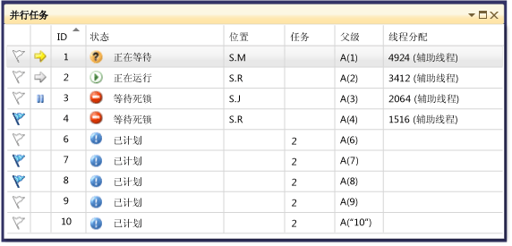
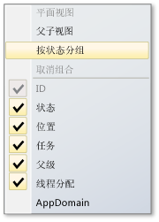
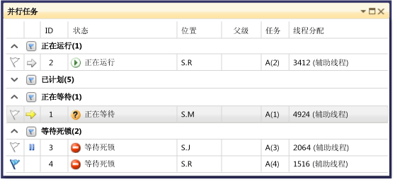
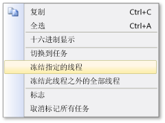

# 使用“任务”窗口
[!INCLUDE[vs2017banner](../code-quality/includes/vs2017banner.md)]

**“任务”**窗口与**“线程”**窗口类似，但它显示的是有关 <xref:System.Threading.Tasks.Task?displayProperty=fullName>、[task\_handle](../Topic/task_group%20Class.md) 或 [WinJS.Promise](http://msdn.microsoft.com/library/windows/apps/br211867.aspx) 对象（而不是各个线程）的信息。  与线程一样，任务表示可并行运行的异步操作；但是，多个任务可以在同一个线程上运行。  有关详细信息，请参阅[使用 JavaScript 异步编程（Windows 应用商店应用）](http://msdn.microsoft.com/library/windows/apps/hh700330.aspx)。  
  
 在托管代码中，当使用 <xref:System.Threading.Tasks.Task?displayProperty=fullName> 对象或 **await** 和 **async** 关键字（在 Visual Basic 中为 **Await** 和 **Async**）时，可使用**“任务”**窗口。  有关托管代码中的任务的详细信息，请参阅 [Parallel Programming](../Topic/Parallel%20Programming%20in%20the%20.NET%20Framework.md)。  
  
 在本机代码中，当使用**任务组**、[并行算法](/visual-cpp/parallel/concrt/task-parallelism-concurrency-runtime)、[异步代理](/visual-cpp/parallel/concrt/parallel-algorithms)和[轻量级任务](/visual-cpp/parallel/concrt/asynchronous-agents)时，可使用[“任务”](/visual-cpp/parallel/concrt/task-scheduler-concurrency-runtime)窗口。  有关本机代码中的任务的详细信息，请参阅[并发运行时](/visual-cpp/parallel/concrt/concurrency-runtime)。  
  
 在 JavaScript 中，当使用 promise .then 代码时，可使用“任务”窗口。  
  
 每次中断调试器时都可以使用**“任务”**窗口。  通过单击**“窗口”**，然后单击**“任务”**，可以在**“调试”**菜单上访问该窗口。  下图显示了处于默认模式的**“任务”**窗口。  
  
   
  
> [!NOTE]
>  在托管代码中，当托管线程处于休眠或联接状态时，状态为 <xref:System.Threading.Tasks.Task>、<xref:System.Threading.Tasks.TaskStatus> 或 <xref:System.Threading.Tasks.TaskStatus> 的 <xref:System.Threading.Tasks.TaskStatus> 不能显示在“任务”窗口中。  
  
## 任务列信息  
 **“任务”**窗口中的列显示了以下信息。  
  
|列名|说明|  
|--------|--------|  
|**标志**|显示哪些任务已被标记，并且您可以标记或取消标记任务。|  
|**图标**|黄色箭头指示当前任务。  当前任务是当前线程上处于最顶层的任务。   白色箭头指示中断的任务，即调用调试器时的任务。   暂停图标指示已被用户冻结的任务。  在列表中右击某一任务可以冻结或取消冻结该任务。|  
|**ID**|系统为任务提供的编号。  在本机代码中，该编号是任务的地址。|  
|**状态**|任务的当前状态（已计划、活动、已死锁、正在等待或已完成）。  已计划的任务是指尚未运行的任务，因此它没有调用堆栈、已分配的线程或相关信息。   活动任务是指在中断调试器之前正在执行代码的任务。   正在等待的任务是指因以下原因而被阻止的任务：正在等待向事件发送信号、释放锁或完成其他任务。   死锁任务是指其线程与其他线程相互死锁的正在等待的任务。   将鼠标指针悬停在处于死锁或正在等待的任务的**“状态”**单元格上，可以查看有关阻塞的更多信息。 **Warning:**  **“任务”**窗口只针对使用 Wait Chain Traversal \(WCT\) 所支持的同步基元的受阻任务报告死锁。  例如，对于某个使用 WCT 的 <xref:System.Threading.Tasks.Task> 死锁对象，调试器会报告**“正在等待\-死锁”**。  对于由并发运行时管理、不使用 WCT 的死锁任务，调试器则会报告**“正在等待”**。  有关 WCT 的详细信息，请参阅 [Wait Chain Traversal](http://msdn.microsoft.com/library/ms681622\(VS.85\).aspx)。|  
|**开始时间**|任务变为活动状态的时间。|  
|**持续时间**|任务已处于活动状态的秒数。|  
|**完成时间**|任务完成的时间。|  
|**位置**|任务调用堆栈中的当前位置。  将鼠标指针悬停在此单元格上可以查看任务的整个调用堆栈。  已计划的任务在该列中没有相应的值。|  
|**任务**|创建任务时传递到该任务的初始方法以及任何参数。|  
|**父级**|创建此任务的任务的 ID。  如果为空白，则说明该任务没有父级。  这仅适用于托管程序。|  
|**线程分配**|运行任务的线程的 ID 和名称。|  
|**返回状态**|任务完成时的状态。  返回状态值为**“成功”**、**“已取消”**和**“错误”**。|  
|**应用程序域**|对于托管代码，该列表示要在其中执行任务的应用程序域。|  
|**task\_group**|对于本机代码，该列表示计划任务的 [task\_group](../Topic/task_group%20Class.md) 对象的地址。  对于异步代理和轻量级任务，该列设置为 0。|  
|进程|运行任务的进程的 ID。|  
|异步状态|对于托管代码，即任务状态。  默认情况下，此列被隐藏。  若要显示此列，请打开其中一个列标题的上下文菜单。  选择**“列”**，再选择**“AsyncState”**。|  
  
 通过右击列标题并选择所需的列可以向视图添加列。  （通过清除所选内容即可移除列。） 您还可以通过向左或向右拖动列来对列重新排序。  列的快捷菜单如下图所示。  
  
   
  
## 对任务进行排序  
 若要按列条件对任务进行排序，请单击相应的列标题。  例如，通过单击**“ID”**列标题，可以按任务 ID（1、2、3、4、5 等）对任务进行排序。  若要反转排序顺序，请再次单击相应的列标题。  当前排序列和排序顺序由该列上的箭头指示。  
  
## 对任务进行分组  
 您可以根据列表视图中的任何列对任务进行分组。  例如，通过右击**“状态”**列标题并单击**“按状态分组”**，可以将所有具有相同状态的任务划分为一个组。  例如，您可以快速查看正在等待的任务，以便关注其阻止原因。  您还可以在调试会话期间折叠不相关的组。  同样，还可以按其他列进行分组。  只需单击组标题旁的按钮即可标记或取消标记组。  下图显示了处于分组模式下的**“任务”**窗口。  
  
   
  
## 父子视图  
 （此视图仅可用于托管代码。） 通过右击列标题并单击**“父子视图”**，您可以将任务列表切换为分层视图，在分层视图中，每个子任务都是一个子节点，可以在其父级下显示或隐藏该子节点。  下图所示为父子视图中的任务。  
  
   
  
## 标记任务  
 可以标记运行任务的线程，方法是选择任务列表项然后从上下文菜单中选择**“标志”**，或者单击第一列中的标志图标。  如果标记了多个任务，则可以按标记列进行排序以在顶部显示标记的所有任务，从而仅关注这些任务。  此外，还可以使用**“并行堆栈”**窗口仅查看已标记任务。  这样，您便可以为调试操作滤出不相关的任务。  标记不会在调试会话之间保留。  
  
## 冻结和解冻任务  
 通过右击任务列表项并单击**“冻结指定的线程”**，可以冻结运行任务的线程。  （如果任务已冻结，该命令则为**“解冻指定的线程”**。） 如果已冻结线程，当单步执行当前断点后的代码时，将不会执行该线程。  **“冻结此线程之外的全部线程”**命令冻结除正在执行任务列表项的线程以外的所有线程。  
  
 下图所示为每项任务的其他菜单项。  
  
   
  
## 请参阅  
 [调试器基础知识](../debugger/debugger-basics.md)   
 [调试托管代码](../debugger/debugging-managed-code.md)   
 [Parallel Programming](../Topic/Parallel%20Programming%20in%20the%20.NET%20Framework.md)   
 [并发运行时](/visual-cpp/parallel/concrt/concurrency-runtime)   
 [使用“并行堆栈”窗口](../debugger/using-the-parallel-stacks-window.md)   
 [演练：调试并行应用程序](../debugger/walkthrough-debugging-a-parallel-application.md)