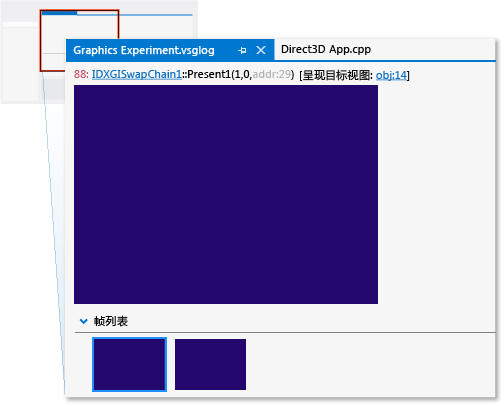
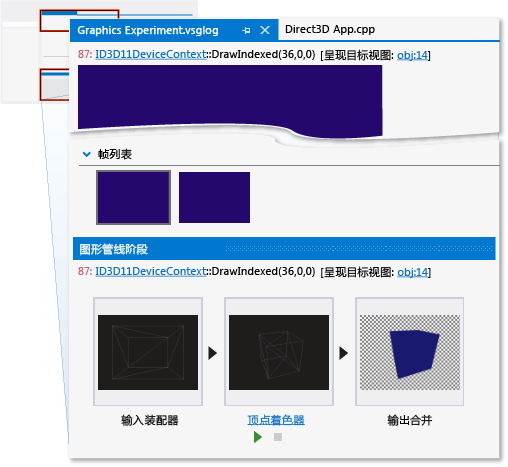
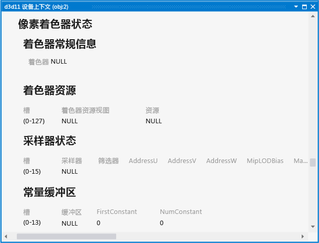
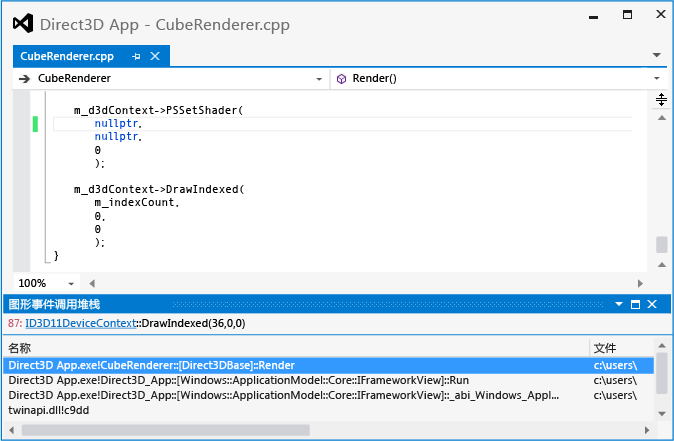

# 演练：因管线误配置而缺少对象
[!INCLUDE[vs2017banner](../code-quality/includes/vs2017banner.md)]

本演练演示如何使用 [!INCLUDE[vsprvs](../code-quality/includes/vsprvs_md.md)] 图形诊断工具来调查由于未设置的像素着色器而缺失的对象。  
  
 此演练阐释了以下任务：  
  
-   使用“图形事件列表”定位问题的潜在根源。  
  
-   使用“图形管道阶段”窗口来检查 `DrawIndexed` Direct3D API 调用的效果。  
  
-   检查设备上下文以确认未设置着色器阶段。  
  
-   搭配使用“图形管道阶段”窗口和“图形事件调用堆栈”来帮助查找未设置的像素着色器来源。  
  
## 方案  
 当 3\-D 应用中缺少对象时，有时是因为其中一个着色器阶段未在呈现对象前设置。 在具有简单呈现需要的应用中，此错误的来源通常位于对象绘图调用的调用堆栈中某个位置。 但是作为一种优化手段，某些应用批量处理具有共同的着色器程序、纹理或其他数据的对象，从而最大程度减少状态更改的开销。 在这些应用中，错误来源可能隐藏在批处理系统中，而不是位于绘图调用的调用堆栈中。 本演练中的方案演示具有简单呈现需求的应用，因此可在调用堆栈中找到错误源。  
  
 在此方案中，运行应用对其进行测试时，背景按预期方式呈现，但其中一个对象未显示。 通过使用“图形诊断”，捕获图形日志的问题，以便调试该应用。 应用中的问题如下所示：  
  
   
  
## 调查  
 通过使用图形诊断工具，您可以加载图形日志文档以检测测试期间已捕获的帧。  
  
#### 检查图形日志中的帧  
  
1.  在 [!INCLUDE[vsprvs](../code-quality/includes/vsprvs_md.md)] 中，加载包含展现丢失对象的帧的图形日志文档。 新的图形日志选项卡将出现在 [!INCLUDE[vsprvs](../code-quality/includes/vsprvs_md.md)] 中。 此选项卡的顶部是所选帧的呈现目标输出。 底部是“帧列表”，以缩略图的形式显示每个捕获的帧。  
  
2.  在“帧列表”中，选择演示未显示该对象的帧。 更新呈现目标以反映所选的帧。 在此方案中，图形日志选项卡如下所示：  
  
       
  
 选择演示问题的帧后，可以使用“图形事件列表”开始进行诊断。 “图形事件列表”包含每个用以呈现活动帧的 Direct3D API 调用，例如设置设备状态、创建和更新缓冲区、绘制显示在帧中的对象。 许多类型的调用（例如绘图、调度、复制或清除调用）都很有趣，因为当应用按照预期运行时通常（但不总是）在呈现目标中会有相应的变动。 绘图调用特别有趣，因为每个调用表示应用呈现的几何图形。  
  
 因为你知道该呈现目标不包含缺失对象，似乎也没有其他错误，你可以使用“图形事件列表”连同“图形管道阶段”工具来确定与缺失对象的几何图形对应的绘图调用。 “图形管道阶段”窗口显示已发送到每个绘图调用的几何图形，而不考虑其在呈现目标的效果。 当你移动通过绘图调用时，更新管道阶段以显示当其流过每个已启用阶段时与每个调用相关联的几何图形，并且更新呈现目标输出以显示调用完成后该呈现目标的状态。  
  
#### 查找缺失的几何图形的绘图调用  
  
1.  打开“图形事件列表”窗口。 在“图形诊断”工具栏上，选择“事件列表”。  
  
2.  打开“图形管道阶段”窗口。 在“图形诊断”工具栏上，选择“管道阶段”。  
  
3.  当通过“图形事件列表”窗口中的每个绘图调用时，监视“图形管道阶段”窗口以获知缺失对象。 若要简化此过程，请在“图形事件列表”窗口右上角的“搜索”框中输入“Draw”。 这将筛选列表，使其仅包含在其标题中具有的“Draw”的事件。  
  
     在“图形管道阶段”窗口中，“输入装配器”阶段将显示转换前的对象的几何图形，而“顶点着色器”阶段显示转换后的相同对象。 在此方案中，请注意“图形管道阶段”窗口显示“输入装配器”阶段和“顶点着色器”阶段，但不显示其中一个绘图调用的“像素着色器”阶段。  
  
    > [!NOTE]
    >  如果其他管道阶段（例如外壳着色器、域着色器或几何着色器阶段）处理该对象，则其中的任何一个都可能是导致问题的原因。 通常情况下，该问题与结果未显示或以意外方式显示的最早阶段相关联。  
  
4.  当到达对应于缺失对象的绘图调用时即停止。 在此方案中，“图形管道阶段”窗口指示几何图形发布到 GPU（由存在“输入装配器”阶段指示）并且进行了转换（由“顶点着色器”阶段指示），但因为似乎不存在活动像素着色器而未显示在呈现目标中（由缺少“像素着色器”阶段指示）。 在此方案中，甚至还可以在“输出合并器”阶段查看缺失对象的轮廓：  
  
       
  
 确认应用为缺失对象的几何图形发布绘图调用，并且发现像素着色器阶段处于非活动状态后，你可以检查设备状态以确认你的发现。 你可以使用“图形对象表”来检查设备上下文和其他 Direct3D 对象数据。  
  
#### 检查设备上下文  
  
1.  打开“d3d11 设备上下文”。 在“图形管道阶段”窗口中，选择属于显示在窗口顶部的 `DrawIndexed` 调用的“ID3D11DeviceContext”链接。  
  
2.  检查显示在“d3d11 设备上下文”选项卡的设备状态，以确认绘制调用期间没有像素着色器处于活动状态。 在此方案中，“着色器常规信息”（显示在“像素着色器状态”下）指示着色器为“NULL”：  
  
       
  
 在确认像素着色器已由应用设置为 null 后，下一步是在应用的源代码中查找设置着色器的位置。 可以使用“图形事件列表”连同“图形事件调用堆栈”来查找此位置。  
  
#### 在应用的源代码中查找设置像素着色器的位置  
  
1.  查找对应于缺失对象的 `PSSetShader` 调用。 在“图形事件列表”窗口中，请在“图形事件列表”窗口右上角的“搜索”框中输入“Draw;PSSetShader”。 这将筛选列表，使其仅包含“PSSetShader”事件，以及标题中具有“Draw”的事件。 选择出现在缺失对象绘图调用之前的第一个 `PSSetShader` 调用。  
  
    > [!NOTE]
    >  如果未在此帧内进行设置，则 `PSSetShader` 不会显示在“图形事件列表”窗口。 通常仅当只有一个像素着色器用于所有对象，或者此帧期间 `PSSetShader` 调用被无意跳过时发生这种情况。 在任一情况下，我们建议你搜索应用的源代码获取 `PSSetShader` 调用，并使用传统调试技术检查这些调用的行为。  
  
2.  打开“图形事件调用堆栈”窗口。 在“图形诊断”工具栏上，选择“图形事件调用堆栈”。  
  
3.  使用调用堆栈以在应用的源代码中查找 `PSSetShader` 调用。 在“图形事件调用堆栈”窗口中，选择最顶层的调用，并检查像素着色器设置的值。 像素着色器可能直接设置为 null，或者由于传入函数的参数或其他状态而出现 null 值。 如果未直接设置，你可在调用堆栈上的某处找到 null 值的源。 在此方案中，你将发现将像素着色器在最顶层的函数中直接设置为 `nullptr`，其名为 `CubeRenderer::Render`：  
  
       
  
    > [!NOTE]
    >  如果仅通过检查调用堆栈无法找到 null 值的源，我们建议在 `PSSetShader` 调用上设置条件断点，以便像素着色器将被设置为 null 时程序执行中断。 然后在调试模式下重新启动此应用，并使用传统调试技术来查找 null 值的源。  
  
 若要解决此问题，通过 `ID3D11DeviceContext::PSSetShader` API 调用的第一个参数来分配正确的像素着色器。  
  
   
  
 修复代码后，你可以重新生成并运行应用以验证呈现问题是否已解决：  
  
   
  
## 后续步骤