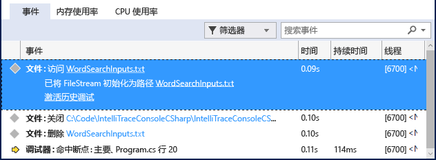

# 演练：使用 IntelliTrace
[!INCLUDE[vs2017banner](../code-quality/includes/vs2017banner.md)]

你可以使用 IntelliTrace 来收集关于特定事件或事件类别的信息，或收集关于除了事件外的单个函数调用的信息。 下列过程演示如何执行此操作。  
  
 可以在 Visual Studio Enterprise 版（但不可在 Professional 或 Community 版）中使用 IntelliTrace。  
  
##  <a name="GettingStarted"></a> 仅对事件使用 IntelliTrace  
 你可以尝试仅使用 IntelliTrace 事件进行调试。 IntelliTrace 事件是调试器事件、异常、.NET Framework 事件和其他系统事件。 你应在开始调试之前打开或关闭特定事件以控制 IntelliTrace 记录的事件。 有关详细信息，请参阅[IntelliTrace 功能](../debugger/intellitrace-features.md)。  
  
 以下步骤演示了如何仅使用 IntelliTrace 事件进行调试：  
  
1.  打开 IntelliTrace 事件以进行文件访问。 转到**“工具”\/“选项”\/“IntelliTrace”\/“IntelliTrace 事件”**页，然后展开**“文件”**类别。 检查**“文件”**事件类别。 这将导致检查所有文件事件（访问、关闭、删除）。  
  
2.  创建 C\# 控制台应用程序。 在 Program.cs 文件中，添加以下 `using` 语句：  
  
    ```c#  
    using System.IO;  
    ```  
  
3.  在 Main 方法中，创建 <xref:System.IO.FileStream>，从其中进行读取、将其关闭，然后删除该文件。 添加另一行，添加该行的唯一目的是留出设置断点的位置：  
  
    ```c#  
    static void Main(string[] args) { FileStream fs = File.Create("WordSearchInputs.txt"); fs.ReadByte(); fs.Close(); File.Delete("WordSearchInputs.txt"); Console.WriteLine("done"); }  
    ```  
  
4.  在 `Console.WriteLine("done");` 上设置断点  
  
5.  照常启动调试。 （按**“F5”**或单击**“调试”\/“启动调试”**）。  
  
    > [!TIP]
    >  在调试时使**“局部变量”**和**“自动”**窗口保持打开状态，以查看并记录这些窗口中的值。  
  
6.  执行在断点处停止。 如果未显示**“诊断工具”**窗口，则单击**“调试”\/“Windows”\/“IntelliTrace 事件”**。  
  
     在**“诊断工具”**窗口中，找到**“事件”**选项卡（应该看到**“事件”**、**“内存使用”**和 **“CPU ”**三个选项卡）。**“事件”**选项卡显示按时间排序的事件列表，以调试器中断执行之前的最后一个事件结尾。 你应会看到一个名为**“访问 WordSearchInputs.txt”**的事件。  
  
     以下屏幕截图取自 Visual Studio 2015 Update 1。  
  
       
  
7.  选择该事件以展开其详细信息。  
  
     以下屏幕截图取自 Visual Studio 2015 Update 1。  
  
       
  
     你可以选择路径名链接以打开文件。 如果完整的路径名不可用，则将显示**“打开文件”**对话框。  
  
     单击**“激活历史调试”**，这会将调试器的上下文设置为收集所选事件的时间，并且会在**“调用堆栈”**、**“局部变量”**和其他参与的调试器窗口中显示历史数据。 如果源代码可用，则 Visual Studio 会将指针移到源窗口中的相应代码，以便你可以检查它。  
  
     以下屏幕截图取自 Visual Studio 2015 Update 1。  
  
       
  
8.  如果找不到 bug，请尝试检查导致 bug 的其他事件。 还可以让 IntelliTrace 记录调用信息，以便你可以单步执行函数调用。  
  
## 对事件和函数调用使用 IntelliTrace  
 IntelliTrace 可记录函数调用和事件。 这使你可以查看调用堆栈历史记录以及在代码中的调用间后退和前进。 IntelliTrace 记录的数据包括函数名、函数入口和退出点以及部分参数值和返回值。 请参阅 [IntelliTrace 功能](../debugger/intellitrace-features.md)。  
  
1.  启用调用收集。 （在**“工具”\/“选项”\/“IntelliTrace”\/“常规”**中，选择**“IntelliTrace 事件和调用信息”**）。 IntelliTrace 将在下一个调试会话启动时开始收集此信息。  
  
    > [!TIP]
    >  这可能会降低应用程序速度并增加保存到磁盘的任何 IntelliTrace 日志文件（.iTrace 文件）的大小。 若要获取最多调用数据但最大程度减小影响，请仅记录来自你感兴趣的模块的数据。 若要更改 .iTrace 文件的最大大小，请转到**“工具”\/“选项”\/“IntelliTrace”\/“高级”**，然后指定最大磁盘空间。 默认值为 250 MB。  
  
2.  开始调试在上一节中创建的 C\# 控制台应用程序。 执行在断点处停止。 如果未显示**“诊断工具”**窗口，则单击**“调试”\/“Windows”\/“IntelliTrace 事件”**。  
  
3.  切换到“调用”选项卡。  
  
     现在你会看到应用程序的函数调用，以根调用（在当前解决方案中为 Main 入口点）开始，以中断执行的位置结尾。  
  
     选择一个函数调用并双击它。 应看到函数入口点和退出点，以及当前调用对其他函数进行的调用和由该调用引发的 IntelliTrace 事件。 如果未启用“历史调试”，则此操作会将其启用。 有关历史调试的详细信息，请参阅[历史调试](../debugger/historical-debugging.md)。  
  
    > [!NOTE]
    >  你可能会看到某些调用变暗。 这是因为 IntelliTrace 未记录来自相应模块的数据。 若要查看此数据，请让 IntelliTrace 从这些模块中收集数据。 有关指定模块的信息，请参阅[IntelliTrace 功能](../debugger/intellitrace-features.md)。  
  
## 后续步骤