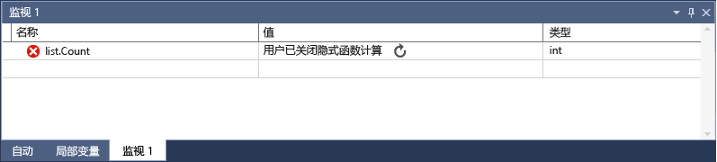

# <a name="set-a-watch-on-variables-using-the-watch-and-quickwatch-windows-in-visual-studio"></a>在使用监视和 Visual Studio 中的快速监视窗口的变量上设置监视
在调试时可以使用**监视**(**调试 > Windows > 监视 > 监视 （1、 2、 3、 4）**) 和**快速监视**(变量上右键单击 / **调试 > 快速监视**) 窗口来监视变量和表达式。  区别是“监视”  窗口可以显示多个变量，而“快速监视”  窗口一次仅显示单个变量。

在调试会话期间，windows 才可用。 
  
## <a name="observing-a-single-variable-with-quickwatch"></a>使用“快速监视”观察单个变量  
 你可以使用“快速监视”  窗口观察单个变量。 例如，如果你有以下代码：  
  
```CSharp
static void Main(string[] args)  
{  
    int a, b;  
    a = 1;  
    b = 2;  
    for (int i = 0; i < 10; i++)  
    {  
        a = a + b;  
    }   
}  
```  
  
 你可以按如下所述观察快速监视窗口中的变量：  
  
1.  在 `a = a + b;` 行上设置断点。  
  
2.  开始调试。 执行在断点处停止。  
  
3.  打开**快速监视**窗口 (右键单击，然后选择**快速监视**，或**SHIFT + F9**)。

    你应看到中的变量**值**窗口中的，值为 1。

      

    如果你想要评估使用变量的表达式，添加一个表达式，如`a + b`到**表达式**窗口并单击**重新计算**。 
  
4.  将变量添加到**监视**从窗口**快速监视**通过单击**添加监视**。 

    > [!NOTE]
    > **快速监视**窗口是一个模式对话框窗口中，因此你无法继续调试，只要处于打开状态。  
  
5.  关闭“快速监视”  窗口。 现在你可以继续进行调试，同时观察“监视” **窗口中向该** 窗口。  
  
## <a name="observing-variables-with-the-watch-window"></a>使用“监视”窗口观察变量  
 可以通过“监视”  窗口观察多个变量。 例如，如果你有以下代码：  
  
```C++  
int main()
{
    int a, b, c;
    a = 1;
    b = 2;
    c = 0;

    for (int i = 0; i < 10; i++)
    {
        a++;
        b *= 2;
        c = a + b;
    }

    return 0;
}
  
```  
  
 如下所示，向“监视”窗口添加三个变量的值：  
  
1.  在 `c = a + b;` 行上设置断点。  
  
2.  启动调试 (**F5**)。 执行在断点处停止。  
  
3.  打开监视窗口 (**调试 > Windows > 监视 > 监视 1**，或**CTRL + ALT + W，1**)。  
  
4.  向第一行添加 `a` 变量，向第二行添加 `b` 变量，向第三行添加 `c` 变量。

    你可以通过单击一个空的行并键入变量名称中添加变量。
  
5.  继续调试 (按**F11**向前移动调试器)。  
  
 在循环访问 `for` 循环时，应该会看到变量值在改变。  
  
 如果正在用本机代码编程，有时可能需要限定变量名或包含变量名的表达式的上下文。 上下文指变量所处的函数、源文件和模块。 如果需要限定上下文，你可以使用上下文运算符语法。 有关详细信息，请参阅 [Context Operator (C++)](../debugger/context-operator-cpp.md)。  
  
## <a name="observing-expressions-with-the-watch-window"></a>使用“监视”窗口观察表达式  
 现在让我们来试试使用表达式。 你可以添加调试器所能识别的任何有效表达式。  
  
 例如，如果你在前一部分中列出了代码，你可以获得三个值的平均值，如下所示：  
  
   
  
 一般而言，“监视”  窗口中的表达式计算规则与编码语言中表达式的计算规则相同。 如果你的表达式具有语法错误，则在代码编辑器中将会出现相同的编译器错误。 以下是一个示例：  
  
   
  
##  <a name="bkmk_refreshWatch"></a> 刷新过期的“监视”值  
 在某些情况下，你可能会看到一个刷新图标 （循环箭头） 时表达式计算中**监视**窗口。  例如，如果你有关闭属性计算 (**工具 > 选项 > 调试 > 启用属性求值和其他隐式函数调用**)，那么你具有以下代码：  
  
```CSharp  
static void Main(string[] args)  
{  
    List<string> list = new List<string>();  
    list.Add("hello");  
    list.Add("goodbye");  
}  
  
```  
  
 如果你在列表的 `Count` 属性上设置监视，应该会看到类似于以下的东西：  
  
   
  
 上图显示了错误或已过期值。 一般可以通过单击图标来刷新这一值，但在某些情况下你可能更倾向于不刷新这一值。 首先应该知道为什么不计算这个值。  
  
 如果你指向图标，将显示一个工具提示，提供有关未计算表达式的原因的信息。  如果显示旋转箭头，则是由于下列原因之一而未计算表达式：  
  
-   在计算表达式时发生错误。 例如，计算可能超时或者变量可能超出范围。  
  
-   该表达式包含函数调用，从而可能会触发应用程序中的副作用 (请参阅[副作用与表达式](#bkmk_sideEffects))。  
  
-   已关闭的属性和隐式函数调用由调试器自动计算 (**工具 > 选项 > 调试 > 启用属性求值和其他隐式函数调用**)，和的表达式不能然后自动计算。  
  
 要刷新值，单击刷新图标或按空格键。 调试器尝试重新计算该表达式。 如果因为属性和其他隐式函数调用的自动计算关闭而出现刷新图标，可以计算表达式。  
  
 如果看到的图标是一个带有像线程一样的波浪条纹的圆圈，则由于一个潜在的跨线程的依赖项而未计算表达式。 换言之，计算代码需要暂时运行应用程序中的其他线程。 处于中断模式时，应用程序中的所有线程通常停止。 允许其他线程暂时运行可能会对程序状态产生意外影响，并会导致调试器忽略断点和在这些线程上引发的异常等事件。  
  
##  <a name="bkmk_sideEffects"></a> Side Effects and Expressions  
 计算某些表达式可以更改变量的值，或会影响程序的状态。 例如，计算下列表达式会更改 `var1`的值：  
  
```  
var1 = var2  
```  
  
 此代码可能会导致[副作用](https://en.wikipedia.org/wiki/Side_effect_\(computer_science\))。 通过改变程序运行的方式，副作用可使调试变得更加困难。  
  
 只有一次，当你首次输入计算已知有副作用的表达式。 随后的计算将被禁用。 通过单击出现在值旁边的更新图标，可以手动重写此行为。  
  
 规避所有副作用的一种方法是关闭自动函数计算 (**工具 > 选项 > 调试 > 启用属性求值和其他隐式函数调用**)。  
  
 当关闭属性计算或隐式函数调用时，可以使用 **ac** 格式修饰符（仅适用于 C#）强制计算。 请参阅 [Format Specifiers in C#](../debugger/format-specifiers-in-csharp.md)。  
  
## <a name="bkmk_objectIds"></a> 使用“监视”窗口中的“对象 ID”（C# 和 Visual Basic）  

 有的时候你想要观察特定对象的行为。 例如，你可能想要跟踪引用本地变量后该变量超出范围的对象。 在 C# 和 Visual Basic 中，你可以创建引用类型的特定实例的对象 ID，并在“监视”窗口中和断点条件下使用它们。 对象 ID 由公共语言运行时 (CLR) 调试服务生成并与该对象关联。  
  
> [!NOTE]
>  对象 ID 创建弱引用，且不会阻止对象被垃圾回收。 它们仅对当前调试会话有效。  
  
 在下面的代码中，一种方法创建`Person`使用局部变量，但你想要找出什么`Person`的名称是不同的方法中：  
  
```CSharp  
class Person  
{  
    public Person(string name)  
    {  
        Name = name;  
    }  
    public string Name { get; set; }  
}  
  
public class Program  
{  
    List<Person> _people = new List<Person>();  
    public static void Main(string[] args)  
    {  
        MakePerson();  
        DoSomething();  
    }  
  
    private static void MakePerson()  
    {  
        var p = new Person("Bob");  
        _people.Add(p);  
    }  
  
    private static void DoSomething()  
    {  
        // more processing  
         Console.WriteLine("done");  
    }  
}  
  
```  
  
 你可以在“监视” `Person`**窗口中向该** 对象添加引用，如下所示：  
  
1.  在对象已被创建后的某个时间在代码中设置断点。  
  
2.  启动调试，当执行在断点处停止时，在“局部变量”  窗口中找到该变量，右键单击该变量，然后选择“创建对象 ID” 。  
  
3.  你应该会看到 **$** 外加一个数字中**局部变量**窗口中，它表示对象 id。  
  
4.  将对象 ID 添加到“监视”窗口中。  
  
5.  你想要观察的对象行为设置断点。  在前面的代码中，这个位置是在`DoSomething()`方法。  
  
6.  继续调试，当执行在 `DoSomething()` 方法处停止时，“监视”  窗口会显示 `Person` 对象。  
  
> [!NOTE]
>  如果你想要查看对象的属性，如`Person.Name`在上面的示例中，你必须启用属性求值。  
  
## <a name="using-registers-in-the-watch-window-c-only"></a>在“监视”窗口（仅 C++）中使用寄存器  
 如果你正在调试本机代码，则可以添加寄存器名以及变量名使用 **$\<注册名称 >**或 **@\<注册名称 >**.  有关详细信息，请参阅 [Pseudovariables](../debugger/pseudovariables.md)。  
  
## <a name="dynamic-view-and-the-watch-window"></a>动态视图和监视窗口  
 某些脚本语言 （例如，JavaScript 或 Python） 使用动态或[鸭子类型化](https://en.wikipedia.org/wiki/Duck_typing)，而.NET 语言 （在版本 4.0 以及更高版本） 支持对象难以观察使用一般调试窗口中，因为它们可能具有运行时属性和方法，无法显示。  
  
 当监视窗口显示从实现的类型创建的对象[IDynamicMetaObjectProvider 接口](https://docs.microsoft.com/en-us/dotnet/api/system.dynamic.idynamicmetaobjectprovider?view=netframework-4.7)，调试器将添加一个特殊**动态视图**节点**自动**显示。 此节点显示动态对象的动态成员，但不允许编辑成员值。  
  
 如果你右键单击任何一个“动态视图”  的子级，并选择“添加监视” ，调试器会插入一个将对象强制转换为一个动态对象的新监视变量。 换言之，“object Name”  变为“((dynamic)object).Name”。  
  
 计算“动态视图”  的成员可能会有副作用。 有关副作用的定义的解释，请参阅 [Side Effects and Expressions](#bkmk_sideEffects)。 对于 C#，当进入新的一行代码时，调试器不会自动重新计算显示在“动态视图”  中的值。 对于 Visual Basic，将自动刷新通过“动态视图”  添加的表达式。  
  
 有关如何刷新“动态视图”值的说明，请参阅 [刷新过期的“监视”值](#bkmk_refreshWatch)。  
  
 如果想要针对一个对象仅显示“动态视图”  ，可以使用“动态”  格式说明符：  
  
-   C#: **ObjectName, dynamic**  
  
-   Visual Basic:: **$dynamic, ObjectName**  
  
 “动态视图”  还可以提升 COM 对象的调试体验。 当调试器遇到包装在 **System.__ComObject**中的 COM 对象时，会为该对象添加一个“动态视图”  节点。  
  
## <a name="see-also"></a>另请参阅  
 [调试器窗口](../debugger/debugger-windows.md)
