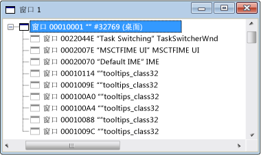

# 窗口视图
当你首次打开 Spy + + 时，Windows 视图将显示在系统中的所有 windows 和控件的树。 显示的窗口句柄和类名。 在当前的桌面窗口位于该树顶部。 所有其他 windows 桌面的子级，并根据标准的窗口层次结构列出。 同级窗口显示在其父下方缩进的可扩展列表。  
  
 下图显示的顶级节点，展开与典型的 Spy + + 窗口视图。  
  
   
Spy++ 窗口视图  
  
 在当前的桌面窗口位于该树顶部。 所有其他 windows 桌面的子级和同级窗口按 Z 顺序排序列出根据标准的窗口层次结构。 您可以展开或折叠的树的任何父节点，通过单击 + 或-节点旁边的符号。  
  
 在窗口视图具有焦点时，你可以使用在查找程序工具[窗口搜索对话框](../debugger/window-search-dialog-box.md)若要打开任何窗口信息显示在你的系统上。  
  
## 本节内容  
 [如何：使用查找程序工具](../debugger/how-to-use-the-finder-tool.md)  
 演示如何此工具会扫描 windows 属性或消息。  
  
 [如何：在窗口视图中搜索窗口](../debugger/how-to-search-for-a-window-in-windows-view.md)  
 说明如何在窗口视图中查找特定窗口。  
  
 [如何： 显示窗口属性](../debugger/how-to-display-window-properties.md)m  
 用于打开窗口属性对话框中的过程。  
  
## 相关章节  
 [Spy++ 视图](../debugger/spy-increment-views.md)  
 说明 windows、 消息、 进程和线程 Spy + + 树视图。  
  
 [使用 Spy++](../debugger/using-spy-increment.md)  
 引入了 Spy + + 工具，并说明如何使用它。  
  
 [“查找窗口”对话框](../debugger/find-window-dialog-box.md)  
 用于查看的属性或特定的窗口中的消息。  
  
 [“窗口搜索”对话框](../debugger/window-search-dialog-box.md)  
 用于查找特定窗口在窗口视图中的节点。  
  
 [“窗口属性”对话框](../debugger/window-properties-dialog-box.md)  
 用于显示在窗口视图中选择窗口的属性。  
  
 [Spy++ 参考](../debugger/spy-increment-reference.md)  
 包含描述每个 Spy + + 菜单和对话框框中的部分。