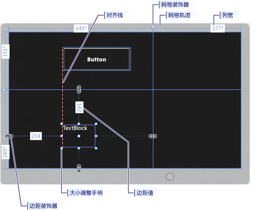
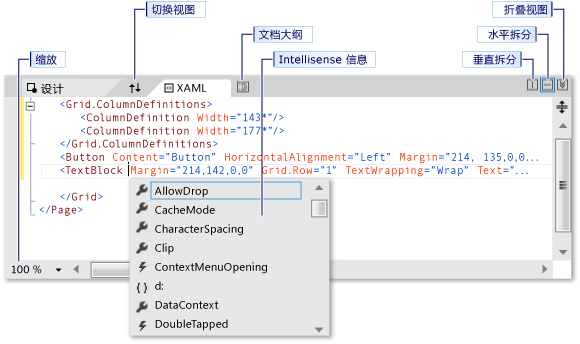
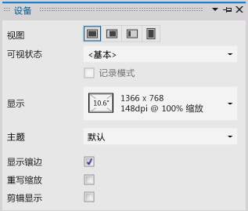
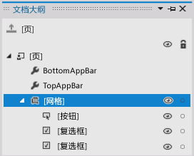

# 在 Visual Studio 中，使用 XAML 设计器创建 UI
Visual Studio 中的 XAML 设计器提供可视化界面，有助于设计基于 XAML 的 Windows 应用商店、Windows Phone、WPF 和 Silverlight 应用程序。 可以通过拖动“工具箱”  中的控件，并在“属性”  窗口设置属性，为应用程序创建用户界面。 还可以直接在 XAML 视图中编辑 XAML。  
  
 有关高级 XAML 设计任务（例如动画和行为）的详细信息，请参阅 [Creating a UI by using Blend for Visual Studio](../designers/creating-a-ui-by-using-blend-for-visual-studio.md)。  
  
## XML 设计器工作区  
 XAML 设计器中的工作区由若干可视界面元素组成。 这些元素包括美工板、XAML 编辑器、“设备”窗口、“文档大纲”窗口和“属性”窗口。 若要打开 XAML 设计器，请右键单击“解决方案资源管理器”  中的 XAML 文件，然后选择“视图设计器” 。  
  
## 创作视图  
 XAML 设计器提供 XAML 视图和应用程序呈现的 XAML 标记的同步设计视图。 打开 Visual Studio 中的某个 XAML 文件后，可以通过使用“设计”  和“XAML”  选项卡，在“设计”视图和“XAML”视图之间进行切换。 可以使用“交换窗格”  按钮，切换显示于顶部的窗口：美工板或 XAML 编辑器。  
  
 在“设计”视图，包括 *“美工板”* 的窗口是活动窗口，并且可以将其用作主要工作台面。 可通过添加或绘制元素，然后对其进行修改，在应用程序中用于直观地设计页面。 有关更多信息，请参见 [Working with elements in XAML Designer](../designers/working-with-elements-in-xaml-designer.md)。 此图显示了“设计”视图中的美工板。  
  
   
  
 这些功能在美工板中可用：  
  
 **对齐线**  
 对齐线是显示为红色虚线的 *“对齐边界”* ，在控件的边缘对齐时或文本基线对齐时进行显示。 仅当启用了“对齐线对齐”  时，才会显示对齐边界。  
  
 **网格轨道**  
使用 `Grid` 轨道可以管理 [网格](http://msdn.microsoft.com/library/windows/apps/windows.ui.xaml.controls.grid.aspx) 面板中的行和列。 可以创建和删除行和列，并可以调整其相对宽度和高度。 显示在美工板左侧的垂直网格轨道用于行，而显示在顶部的水平线则用于列。  
  
 **网格装饰器**  
 `Grid` 装饰器显示为 `Grid` 轨道上具有垂直或水平线条附加到其上的一个三角形。 当拖动 `Grid` 装饰器时，相邻的列或行的宽度或高度随鼠标的移动而改变。  
  
 `Grid` 装饰器用于控制 `Grid`的行和列的宽度和高度。 可以通过单击 `Grid` 轨道，添加新列或行。 当为具有两个或多个列或行的 `Grid` 面板添加新行或列时，轨道外将显示一个小型工具栏，可显式设置宽度和高度。 小型工具栏使你能够为 `Grid` 行和列设置调整大小选项。  
  
 **重设句柄大小**  
 重设句柄大小显示在所选控件上，使你能够调整控件的大小。 当调整控件大小时，通常会出现宽度和高度值，帮助设置控件的大小。 有关在“设计”视图中操纵控件的详细信息，请参见 [Working with elements in XAML Designer](../designers/working-with-elements-in-xaml-designer.md)。  
  
 **边距**  
 边距表示控件边缘与其容器边缘之间的固定空间量。 可使用“属性”窗口中“布局”  下的 **Margin** 属性来设置控件的边距。  
  
 **边距装饰器**  
 可使用边距装饰器更改元素相对于其布局容器的边距。 打开边距装饰器，未设置边距时，边距装饰器将显示断开的锁链。 未设置边距时，元素将在运行时调整布局容器的大小时保留在原处。 边距装饰器关闭时，边距装饰器将显示完好的锁链，且在运行时调整布局容器的大小时，元素将随边距一起移动（边距保持固定）。  
  
 **元素句柄**  
 当将指针移动到环绕某元素的蓝色方框的角落时，可以通过使用显示于美工板上的元素句柄修改元素。 利用这些句柄可以旋转、调整大小、翻转、移动或向元素添加圆角半径。 元素句柄的符号因函数而异，且更具指针的确切位置进行更改。 如果看不到元素句柄，请确保已选定该元素。  
  
 在“设计”视图中，其他美工板命令在屏幕的左下角区域可用，如下所示：  
  
   
  
 此工具栏上的这些命令可用：  
  
 **缩放**  
 缩放能够确定设计图面的大小。 可以从 12.5% 缩放到 800%，或选择如“适应所选内容”  和“适合所有” 之类的选项。  
  
 **显示/隐藏对齐网格**  
 显示或隐藏显示网格线的对齐网格。 当启用“网格线对齐”  或“对齐线对齐”  时，将使用网格线。  
  
 **开启/关闭网格线对齐**  
 如果将某个元素拖到美工板上时已启用了“网格线对齐”  ，则元素将与最近的水平和垂直网格线对齐。  
  
 **开启/关闭对齐线对齐**  
 对齐线有助于控件彼此对齐。 如果已启用了“对齐线对齐”  ，则当相对于其他控件拖动某个控件时，在某些控件的边缘和文本水平或垂直对齐时，将显示对齐边界。 对齐边界显示为红色虚线。  
  
 在 XAML 视图中，包含 XAML 编辑器窗口是活动窗口，且 XAML 编辑器是主要创作工具。 可扩展应用程序标记语言 (XAML) 提供基于 XML 的声明性词汇，用于指定应用程序的用户界面。 XAML 视图包括 IntelliSense、自动格式设置、语法突出显示和标记导航。 此图显示了 XAML 视图：  
  
   
  
 **拆分视图栏**  
 当 XAML 编辑器在下方窗口时，拆分视图栏将显示在 XAML 视图中的顶部。 拆分视图栏可控制“设计”视图和 XAML 视图的相对大小。 也可交换视图的位置（使用“交换窗格”  按钮），指定视图是水平排列或是垂直排列以及折叠任一视图。  
  
 **标记缩放**  
 标记缩放使你能够调整 XAML 视图大小。 可以从 20% 缩放到 400%。  
  
## 设备窗口  
 XAML 设计器中的“设备”窗口可以在设计时模拟各种视图、显示屏并显示 Windows 应用商店或 Windows Phone 项目的选项。 在 XAML 设计器中工作时，“设备”窗口在“设计”  菜单中可用。 如下所示：  
  
   
  
 以下是“设备”窗口中可用的选项：  
  
 **显示**  
 为应用程序指定不同的显示大小和分辨率。  
  
 **方向**  
 为应用程序指定不同的方向：“横向”  或“纵向” 。  
  
 **边缘**  
 为应用程序指定不同的边缘对齐方式：“两者” 、“左对齐” 、“右对齐” 或“无” 。  
  
 **高对比度**  
 以选定的对比度设置预览应用程序。 如果将此设置的值不是“默认值” ，将重写 App.xaml 中的 `RequestedTheme` 属性设置。  
  
 **重写缩放**  
 在设计图面中开启和关闭文档缩放仿真。 这使你可以按系数提高缩放百分比。 选中该复选框，以开启仿真。 例如，如果缩放百分比为 100%，则设计图面中的文档将放大到 140%。 如果当前缩放百分比为 180，则将禁用此选项。  
  
 **最小宽度**  
 指定最小宽度设置。 最小宽度可在 App.xaml 中更改。  
  
 **主题**  
 指定应用程序主题。 例如，可以在深色和浅色主题之间进行切换。  
  
 **显示镶边**  
 在“设计”视图中，开启和关闭应用程序周围的模拟平板电脑框架。 选择该复选框，以显示帧。  
  
 **剪裁以显示**  
 指定显示模式。 选择此复选框，以将文档大小剪裁到显示屏大小。  
  
## “文档大纲”窗口  
 XAML 设计器中的“文档大纲”窗口有助于执行这些任务：  
  
-   查看美工板上所有元素的层次结构。  
  
-   选择元素，以便可以对其进行修改（在层次结构中移动它们、在美工板上对其进行修改以及在“属性”窗口中设置其属性等）。 有关详细信息，请参见 [Working with elements in XAML Designer](../designers/working-with-elements-in-xaml-designer.md)  
  
-   创建和修改控件元素的模板。  
  
-   对所选元素使用上下文菜单。 同一个菜单对美工板中的所选元素也可用。  
  
 若要查看“文档大纲”窗口，请依次在菜单栏上选择“查看” 、“其他窗口” 、“文档大纲” 。  
  
   
  
 以下是“文档大纲”窗口中可用的选项：  
  
 **文档大纲**  
 “文档大纲”窗口中的主视图将显示树状结构中的文档层次结构。 可以使用文档大纲的层次结构性质检查不同级别的文档的详细信息，单个或成组地锁定和隐藏元素。  
  
 **显示/隐藏**  
 显示或隐藏与“文档大纲”中各项相对应的美工板元素。 使用“显示/隐藏”  按钮，该按钮显示时是一个眼睛状的标志，或者按 CTRL + H 隐藏元素，按 SHIFT + CTRL + H 显示元素。  
  
 **锁定/解锁**  
 锁定或解锁与“文档大纲”中各项相对应的美工板元素。 不能修改已锁定的元素。 使用“锁定/解锁”  按钮，该按钮锁定时是一个挂锁状的标志，或按 CTRL + L 锁定元素，按 SHIFT + CTRL + L 解锁元素。  
  
 **返回到 pageRoot 范围**  
 “文档大纲”窗口顶部的选项显示向上箭头符号，将使文档大纲返回到之前的范围。 仅当在样式或模板的范围中时，范围向上可用。  
  
## “属性”窗口  
 通过“属性”窗口可以设置控件的属性值。 如下所示：  
  
   
  
 “属性”窗口顶部有多种选项。 可以通过使用“名称”  框，更改当前所选元素的名称。 在左上角，有一个表示当前所选元素的图标。 若要按类别或按字母顺序排列属性，请单击“类别” 、“名称” 或“排列方式”  列表中的“源”  。 若要查看控件的事件列表，请单击“事件”  按钮，该按钮显示为一个闪电形符号。 若要搜索属性，请开始在“搜索属性”  框中键入属性的名称。 “属性”窗口将显示与键入搜索的内容相匹配的属性。 某些属性允许通过选择向下箭头按钮设置高级属性。 有关使用属性和处理事件的详细信息，请参见 [快速入门：添加控件和处理事件](http://go.microsoft.com/fwlink/?LinkID=247983)  
  
 每个属性值的右侧是一个“属性标记”  ，显示为一个方框符号。 属性标记的外观指示是否有数据绑定到或有资源应用于该属性。 例如，白色方框符号指示默认值，黑色方框符号通常指示已应用某个本地资源，而橙色方框通常指示已应用某个数据绑定。 单击属性标记时，可以导航到一种样式的定义、打开数据绑定生成器或打开资源选取器。  
  
## 另请参阅  
 [Working with elements in XAML Designer](../designers/working-with-elements-in-xaml-designer.md)   
 [如何创建和应用资源](../designers/how-to-create-and-apply-a-resource.md)   
 [演练：将数据绑定到 XAML 设计器](../designers/walkthrough-binding-to-data-in-xaml-designer.md)
