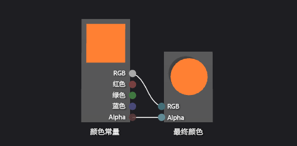

# 如何：创建基本颜色着色器
[!INCLUDE[vs2017banner](../code-quality/includes/vs2017banner.md)]

本文档演示如何使用着色器设计器和定向关系图着色器语言 \(DGSL\) 来创建简单的颜色着色器。  此着色器将最终颜色设置为常数 RGB 颜色值。  
  
 本文档演示这些活动：  
  
-   移除关系图中的节点  
  
-   将节点的到关系图  
  
-   设置节点属性  
  
-   连接节点  
  
## 创建一个简单的颜色着色器  
 您可以通过写入 RGB 颜色常数的颜色值到最终输出颜色实现简单的颜色着色器。  
  
 在开始之前，请确保 **属性** 窗口和 **工具箱** 显示。  
  
#### 创建一个简单的颜色着色器  
  
1.  创建一 DGSL 着色器使用。  有关如何添加 DGSL 着色器的更多信息，请参见" [着色器设计器](../designers/shader-designer.md)入门部分。  
  
2.  删除**“点颜色”**节点。  使用**“选择”**工具选择**“点颜色”**节点，然后在菜单栏上，选择**“编辑”**，**“删除”**。  
  
3.  添加一个**“颜色常数”**节点到关系图中。  在**“常量”**下的**“工具箱”**中，选择**“颜色常数”**并将其移动到设计图面。  
  
4.  为**“颜色常数”**节点指定颜色值。  使用**“选择”**工具选择**“颜色常量”**节点，然后，在**“属性”**窗口的**“输出”**属性中，指定颜色值。  对于橙色，请指定值 \(1.0，0.5，0.2，1.0\)。  
  
5.  连接颜色常数到最终颜色。  若要创建连接，将**“颜色常数”**节点的**“RGB”**终端移到**“最终颜色”**节点的**“RGB”**终端，然后将**“颜色常数”**节点的**“Alpha”**终端移到**“最终颜色”**节点的 **“Alpha”**终端。  这些连接将最终颜色设置为在上一步中定义的颜色常数。  
  
 下图显示了完整的着色器关系图和应用于多维数据集的着色器的预览。  
  
> [!NOTE]
>  在图示中，指定给更好的演示着色器的效果的橙色颜色。  
  
   
  
 某些形状可能为某些着色器提供更好的预览。  有关如何在着色器设计器中预览着色器的更多信息，请参见 [着色器设计器](../designers/shader-designer.md)。  
  
## 请参阅  
 [如何：向三维模型应用着色器](../designers/how-to-apply-a-shader-to-a-3-d-model.md)   
 [如何：导出着色器](../designers/how-to-export-a-shader.md)   
 [着色器设计器](../designers/shader-designer.md)   
 [着色器设计器节点](../designers/shader-designer-nodes.md)