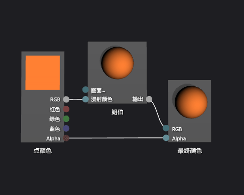

# 如何：创建基本朗伯着色器
[!INCLUDE[vs2017banner](../code-quality/includes/vs2017banner.md)]

本文档演示如何使用着色器设计器和定向关系图着色器语言 \(DGSL\) 来创建实现典型朗伯照明模型的照明着色器。  
  
 本文档演示这些活动：  
  
-   将节点的添加到着色器关系图  
  
-   断开节点  
  
-   连接节点  
  
## 朗伯照明模型  
 朗伯照明模型将环境和方向照明合并为三维场景中阴影对象。  环境元素提供照明的基本级别对三维场景的。  该方向组件提供来自一个方向（远）光源的其他照明。  无论其方向，环境照明平均地影响场景中的所有图面。  对于给定的图面，它是图面环境颜色和场景中环境照明的颜色和强度的结合产物。  基于相对于光源方向的图面的方向，定向照明影响场景中每个不同的图面。  它是漫射色的产品和图面的方向，和颜色，光强度和光源的方向。  图面文本将该光源指向接受最大基值和图面文本不直接接收基值。  在朗伯照明模型下，组合环境元素和一个或多个方向组件以确定对象上的每个点的总漫射颜色分布。  
  
 在开始之前，请确保显示**“属性”**窗口和**“工具箱”**。  
  
#### 创建朗伯着色器  
  
1.  创建要使用的 DGSL 着色器。  有关如何向项目中添加 DGSL 着色器的信息，请参见[着色器设计器](../designers/shader-designer.md)中的“入门”部分。  
  
2.  从 **最终颜色** 节点断开 **点颜色** 节点。  选择 **点颜色** 节点的终端 **RGB**，然后选择 **断开链接**。  离开 **Alpha** 服务器连接。  
  
3.  添加一个**“朗伯”**节点到关系图中。  在**“实用工具”**下的**“工具箱”**中，选择**“朗伯”**并将其移动到设计图面。  节点朗伯根据环境和漫射照明参数计算像素的全面漫射颜色分布。  
  
4.  连接 **点颜色** 节点与**朗伯** 节点。  在 **选择** 模式，应将**点颜色**节点的**RGB** 终端移动到  **朗伯** 节点 的**漫射颜色**终端。  此连接提供像素的插值漫射的颜色的的朗伯节点。  
  
5.  连接计算的颜色值到最终颜色。  将**“朗伯”**节点的**“输出”**终端移到**“最终颜色”**节点的**“RGB”**终端。  
  
 下图显示了完整的着色器关系图和应用于茶壶模型的着色器的预览。  
  
> [!NOTE]
>  为更好地演示着色器效果，通过使用着色器的 **MaterialDiffuse** 参数，此图颜色指定为橙色。  游戏或应用程序可以使用该参数支持每个对象的单个颜色值。  材料有关参数的信息，请参阅章节Previewing Shaders [着色器设计器](../designers/shader-designer.md)。  
  
   
  
 某些形状可能为某些着色器提供更好的预览。  有关如何预览将着色器的设计器着色器的更多信息，请参见Previewing Shaders [着色器设计器](../designers/shader-designer.md)。  
  
 下图显示了文档中描述的着色器，该着色器应用于三维模型。  
  
   
  
 有关如何将着色器应用于三维模型的信息的更多信息，请参见 [如何：向三维模型应用着色器](../designers/how-to-apply-a-shader-to-a-3-d-model.md)。  
  
## 请参阅  
 [如何：向三维模型应用着色器](../designers/how-to-apply-a-shader-to-a-3-d-model.md)   
 [如何：导出着色器](../designers/how-to-export-a-shader.md)   
 [如何：创建基本 Phong 着色器](../designers/how-to-create-a-basic-phong-shader.md)   
 [着色器设计器](../designers/shader-designer.md)   
 [着色器设计器节点](../designers/shader-designer-nodes.md)